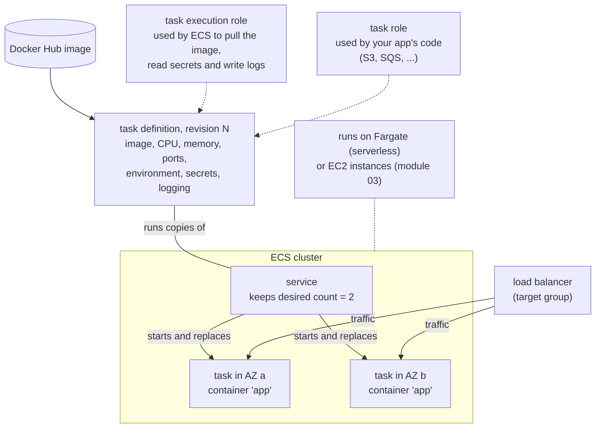
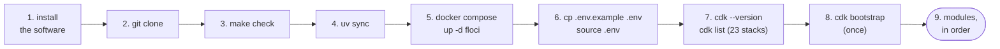
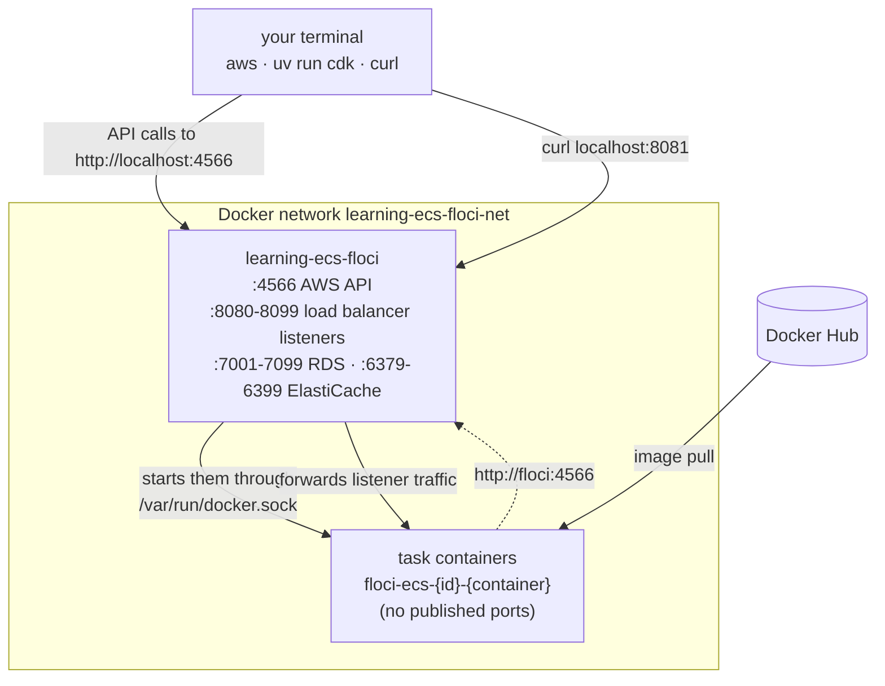
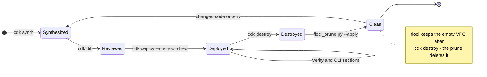

<!-- TOC -->

- [Requirements](#requirements)
  - [0. Zero to your first deploy, in order](#0-zero-to-your-first-deploy-in-order)
  - [1. Supported operating systems](#1-supported-operating-systems)
  - [2. Recommended hardware](#2-recommended-hardware)
  - [3. Required software](#3-required-software)
    - [3.1 - Install on Ubuntu (amd64)](#31---install-on-ubuntu-amd64)
    - [3.2 - Install on macOS (arm64 and amd64)](#32---install-on-macos-arm64-and-amd64)
    - [3.3 - Managing tool versions with mise](#33---managing-tool-versions-with-mise)
    - [3.4 - Running and reading `make check`](#34---running-and-reading-make-check)
  - [4. Project setup (uv)](#4-project-setup-uv)
  - [5. Running floci (the local AWS emulator)](#5-running-floci-the-local-aws-emulator)
    - [5.1 - Option A: docker compose (this repository's `docker-compose.yml`)](#51---option-a-docker-compose-this-repositorys-docker-composeyml)
    - [5.2 - Option B: floci-cli](#52---option-b-floci-cli)
    - [5.3 - The built-in floci web console](#53---the-built-in-floci-web-console)
    - [5.4 - Optional: `make` shortcuts for floci and the CDK](#54---optional-make-shortcuts-for-floci-and-the-cdk)
    - [5.5 - Bootstrapping the CDK (once per floci instance or AWS account/region)](#55---bootstrapping-the-cdk-once-per-floci-instance-or-aws-accountregion)
    - [5.6 - Re-running `cdk deploy` on floci, and changing a deployed stack](#56---re-running-cdk-deploy-on-floci-and-changing-a-deployed-stack)
    - [5.7 - `cdk destroy` on floci leaves VPCs behind](#57---cdk-destroy-on-floci-leaves-vpcs-behind)
    - [5.8 - Listing every resource a stack created](#58---listing-every-resource-a-stack-created)
    - [5.9 - Previewing changes with `cdk diff`](#59---previewing-changes-with-cdk-diff)
    - [5.10 - Where ECS task output goes on floci](#510---where-ecs-task-output-goes-on-floci)
  - [6. Network ports used](#6-network-ports-used)
  - [7. Tagging policy](#7-tagging-policy)
  - [8. Naming policy](#8-naming-policy)
  - [9. Flexible configuration](#9-flexible-configuration)
    - [9.1 - Variables every module reads](#91---variables-every-module-reads)
    - [9.2 - Switching from floci to a real AWS account](#92---switching-from-floci-to-a-real-aws-account)
    - [9.3 - Account and region](#93---account-and-region)
  - [10. floci vs real AWS](#10-floci-vs-real-aws)
  - [11. References](#11-references)

<!-- TOC -->

# Requirements

This document lists the software and hardware needed to work through the
learning path in [`docs/LEARNING-PATH.md`](docs/LEARNING-PATH.md), and the
conventions every module follows. Every module is designed to be deployed
first against [floci](https://floci.io) - a local AWS emulator - so you can
complete the path, and make mistakes, without an AWS account or any cost.
Deploying to a real AWS account afterwards is optional and covered in each
module's own README.

**Never touched AWS CDK, Docker, ECS or uv before? Start with section 0.**
The rest of this document is reference material.

## 0. Zero to your first deploy, in order

A few concepts first:

- **Amazon ECS** (Elastic Container Service) runs containers for you. You
  describe *what* to run in a **task definition** (image, CPU, memory,
  ports, environment); a **service** keeps N copies (**tasks**) of it
  running, replaces the ones that fail and registers them with a load
  balancer; a **cluster** groups services. Tasks run on **AWS Fargate**
  (no servers to manage) or on EC2 instances you provide (module 03).
- **AWS CDK** ("Cloud Development Kit") lets you describe those resources
  as Python code. `cdk synth` turns the code into a CloudFormation template
  on your machine; `cdk diff` shows what a deploy would change; `cdk deploy`
  creates or updates the resources; `cdk destroy` removes them.
- **floci** pretends to be AWS on your own computer (`http://localhost:4566`).
  ECS tasks deployed to floci run as **real Docker containers**, pulled from
  Docker Hub, so you can `curl` them.
- **uv** installs this project's Python packages (including `aws-cdk-lib`)
  into a private `.venv/`.

How the ECS pieces relate - every module builds some version of this:



Each module adds or swaps a piece: an NLB, API Gateway or CloudFront in
front (modules 04-08), a database or queue behind (09-15), scaling and
deployment settings on the service (16-17), metrics and logs around it
(19-21). How the repository's code turns into these resources is drawn in
[`docs/ARCHITECTURE.md`](docs/ARCHITECTURE.md).

Step by step:




1. **Install the software** in [section 3](#3-required-software)
   ([3.1](#31---install-on-ubuntu-amd64) Ubuntu, [3.2](#32---install-on-macos-arm64-and-amd64) macOS).
2. **Get the code**:
   ```bash
   git clone <this-repository-url>
   cd learning-ecs
   ```
3. **Check your machine** ([section 3.4](#34---running-and-reading-make-check)):
   ```bash
   make check
   ```
4. **Install the Python dependencies** ([section 4](#4-project-setup-uv)):
   ```bash
   uv sync
   ```
5. **Start floci** ([section 5](#5-running-floci-the-local-aws-emulator)):
   ```bash
   docker compose up -d floci
   ```
6. **Point your terminal at floci**, not real AWS (repeat the `source` line
   in every new terminal):
   ```bash
   cp .env.example .env
   set -a; source .env; set +a
   ```
7. **Confirm it's wired up** - a CDK Toolkit version, then 23 stack ids
   (one per module; module 18 has three), with no errors:
   ```bash
   uv run cdk --version
   uv run cdk list
   ```
8. **Bootstrap the CDK in floci** - once per floci instance
   ([section 5.5](#55---bootstrapping-the-cdk-once-per-floci-instance-or-aws-accountregion)):
   ```bash
   uv run cdk bootstrap
   ```
9. **Follow the modules in order**, starting with
   [`modules/01_network/README.md`](modules/01_network/README.md) - see
   [`docs/LEARNING-PATH.md`](docs/LEARNING-PATH.md). Every README has
   copy-pasteable "Deploy with floci" and "Clean up" commands.
10. **When you're done for the day**: `docker compose down` (state is kept).

If something fails, re-run `make check`, re-read the error, then check
[section 10](#10-floci-vs-real-aws) and
[`docs/TROUBLESHOOTING.md`](docs/TROUBLESHOOTING.md) before assuming
something is broken.

## 1. Supported operating systems

| OS | Architecture | Status |
|---|---|---|
| Ubuntu 22.04 / 24.04 / 26.04 LTS | `amd64` (`x86_64`) | Supported |
| macOS 13+ | `arm64` (Apple Silicon) and `amd64` (Intel) | Supported |
| Windows | - | Not directly supported - use WSL2 (Ubuntu) |

The code is pure-Python CDK; `uv`, Node.js and the AWS CDK Toolkit ship
`amd64` and `arm64` builds; `floci/floci` is a multi-arch image. The
application images used by the modules are multi-arch images on Docker Hub
as well - check a tag's supported platforms on Docker Hub before changing it.

## 2. Recommended hardware

| Resource | Minimum | Comfortable | Note |
|---|---|---|---|
| Free RAM | 8 GB | 16 GB | every ECS task, database and cache floci runs is a real container; modules 09-13 and 19-21 run several at once |
| Free disk | 10 GB | 20 GB | the `floci/floci` image plus the Docker Hub images the modules pull (databases, Grafana, the Datadog Agent are the largest) |
| CPU | 2 vCPU | 4+ vCPU | CDK synth/deploy and the containers |
| Network | - | - | Docker Hub must be reachable; anonymous pulls are rate-limited (100 pulls per 6 hours per IP - `docker login` raises it) |

## 3. Required software

Run `make check` ([section 3.4](#34---running-and-reading-make-check)) to
see what's missing.

| Software | Recommended version | Required? | What for |
|---|---|---|---|
| Python | 3.14 | yes | pinned in `.python-version`/`mise.toml`; `uv sync` downloads it if missing |
| [uv](https://docs.astral.sh/uv/) | latest | yes | Python dependencies - [section 4](#4-project-setup-uv) |
| [mise](https://mise.jdx.dev) | latest | recommended | installs the pinned Python, Node.js, npm and AWS CLI - [section 3.3](#33---managing-tool-versions-with-mise) |
| Node.js / npm | 26 / 11 | yes | the AWS CDK Toolkit is an npm package |
| AWS CDK Toolkit (`cdk`) | v2 | yes | `npm install -g aws-cdk` (tested with 2.1143.0) |
| Docker Engine / Docker Desktop, or [Colima](https://github.com/abiosoft/colima) | 24+ | yes | runs floci and the containers it starts |
| Docker Compose v2 | 2.20+ | yes | `docker-compose.yml` |
| AWS CLI | v2 | yes | every module's "Verify" and "Manage it with the AWS CLI" sections |
| `jq` | 1.6+ | yes | parses JSON in many README commands |
| git | 2.x | yes | - |
| `curl` | any | yes | calls the services you deploy |
| floci CLI | latest | optional | alternative to `docker compose` - [section 5.2](#52---option-b-floci-cli) |
| [Session Manager plugin for the AWS CLI](https://docs.aws.amazon.com/systems-manager/latest/userguide/session-manager-working-with-install-plugin.html) | latest | optional | `aws ecs execute-command` (ECS Exec) on real AWS |
| [awscurl](https://github.com/okigan/awscurl) | latest | optional | SigV4-signed queries to Amazon Managed Service for Prometheus (module 20) |

> **Guardrail:** `aws-cdk-lib==2.272.0` in [`pyproject.toml`](pyproject.toml),
> the `floci/floci:latest` image (tested with floci **2.1.0**) and every
> Docker Hub image tag in the modules were current when this material was
> written (October 2026). Re-check [PyPI](https://pypi.org/project/aws-cdk-lib/),
> [floci's releases](https://github.com/floci-io/floci/releases) and Docker
> Hub before relying on them - they release often, and floci's behavior
> ([section 10](#10-floci-vs-real-aws)) changes between releases.

### 3.1 - Install on Ubuntu (amd64)

```bash
# Docker Engine + Compose plugin
curl -fsSL https://get.docker.com | sh
sudo usermod -aG docker "$USER"   # log back in afterwards

# git, jq, curl
sudo apt-get update && sudo apt-get install -y git jq curl

# uv
curl -LsSf https://astral.sh/uv/install.sh | sh

# mise (recommended - section 3.3)
curl https://mise.run | sh
echo 'eval "$(~/.local/bin/mise activate bash)"' >> ~/.bashrc   # Bash; other shells: section 3.3
# open a new terminal, then, from this repository's root (Python, Node.js 26, npm 11, AWS CLI v2):
mise trust && mise install

# AWS CDK Toolkit
npm install -g aws-cdk

# floci CLI (optional - section 5.2)
curl -fsSL https://floci.io/install.sh | sh
```

### 3.2 - Install on macOS (arm64 and amd64)

```bash
brew install --cask docker      # Docker Desktop - open the app once
brew install uv git jq
curl https://mise.run | sh
echo 'eval "$(mise activate zsh)"' >> ~/.zshrc   # Zsh (macOS default)
brew install floci-io/floci/floci-cli   # optional - section 5.2
```

Open a new terminal, then, from this repository's root:

```bash
mise trust && mise install   # Python, Node.js 26, npm 11, AWS CLI v2 (mise.toml)
npm install -g aws-cdk
```

**Colima instead of Docker Desktop**: `brew install colima docker docker-compose`
and `colima start --cpu 4 --memory 8 --disk 60` (this repository needs more
than Colima's default memory). If `docker compose version` isn't found,
register the plugin:
`mkdir -p ~/.docker/cli-plugins && ln -sfn "$(brew --prefix)/opt/docker-compose/bin/docker-compose" ~/.docker/cli-plugins/docker-compose`.
See the [Colima README](https://github.com/abiosoft/colima#usage).

### 3.3 - Managing tool versions with mise

[mise](https://mise.jdx.dev) installs exact tool versions per project and
switches to them when you `cd` into the project. This repository pins four
in [`mise.toml`](mise.toml):

```toml
[tools]
python = "3.14"
node = "26"
npm = "11"
aws-cli = "2"
```

Activate mise in your shell once per machine (from the
[`mise activate` reference](https://mise.jdx.dev/cli/activate.html)):

| Shell | Startup file | Line to add |
|---|---|---|
| Bash | `~/.bashrc` | `eval "$(mise activate bash)"` |
| Zsh | `~/.zshrc` | `eval "$(mise activate zsh)"` |
| Fish | `~/.config/fish/config.fish` | `mise activate fish \| source` |

Then `mise trust && mise install` in this repository, and check with
`mise ls`, `python --version`, `node --version`, `aws --version`. Without
activation (scripts, CI), prefix commands with `mise exec --`.

mise is recommended, not required: `uv` downloads Python on its own. Without
mise, install Node.js 26 from [nodejs.org](https://nodejs.org/en/download)
and the AWS CLI v2 from the
[AWS CLI install guide](https://docs.aws.amazon.com/cli/latest/userguide/getting-started-install.html).
Global npm packages (`aws-cdk`) live inside the active Node.js version -
reinstall them after switching versions.

### 3.4 - Running and reading `make check`

```bash
make check
```

runs [`scripts/check-deps.sh`](scripts/check-deps.sh), which checks your OS
([section 1](#1-supported-operating-systems)) and every tool in
[section 3](#3-required-software), one line each:

| Marker | Meaning |
|---|---|
| `[ OK ]` | found, and new enough |
| `[WARN]` | an optional/recommended tool is missing, or a tool is older than recommended |
| `[FAIL]` | a required tool is missing or too old - fix it before continuing |

It exits `0` when nothing required failed. It never installs anything.
`make` (or `make help`) lists every target.

## 4. Project setup (uv)

```bash
uv sync                 # creates .venv/ with aws-cdk-lib, constructs, boto3 and the dev tools
uv run cdk --version    # the cdk CLI
uv run cdk list         # every stack this repository can synthesize/deploy
```

`cdk.json`'s `"app"` is `uv run python app.py`, so every `cdk` command runs
through uv. `app.py` discovers every `modules/*/stack.py` - see
[`CLAUDE.md`, section 3](CLAUDE.md). See
[Working with the AWS CDK in Python](https://docs.aws.amazon.com/cdk/v2/guide/work-with-cdk-python.html).

## 5. Running floci (the local AWS emulator)

[floci](https://floci.io) is a free, open-source AWS emulator on
`http://localhost:4566`. The AWS CLI, the SDKs and the CDK work against it
once the variables in [`.env.example`](.env.example) are loaded. For ECS it
goes further than a mock: tasks, RDS/Aurora databases, ElastiCache and
DocumentDB clusters run as real containers through the Docker socket.

What runs where, as observed with floci 2.1.0 and module 04 deployed:



- Only the `learning-ecs-floci` container publishes ports. Task
  containers (`floci-ecs-<id>-<container>`) publish none: you reach them
  through a load balancer listener on floci (`localhost:8081` for module
  04's public ALB) - which is why every listener needs its own port
  ([section 6](#6-network-ports-used)).
- Tasks are on the same Docker network as floci and reach its API at
  `http://floci:4566`.
- Their stdout/stderr goes to floci's own log, not CloudWatch Logs
  ([5.10](#510---where-ecs-task-output-goes-on-floci)).
- `docker ps` shows the task containers while a stack is deployed;
  `cdk destroy` removes them.

### 5.1 - Option A: docker compose (this repository's `docker-compose.yml`)

```bash
docker compose up -d floci
set -a; source .env; set +a        # AWS_ENDPOINT_URL=http://localhost:4566, test credentials, us-east-1
docker compose ps                   # learning-ecs-floci ... (healthy)
```

[`docker-compose.yml`](docker-compose.yml) publishes the API (`4566`), the
load balancer listener range (`8080-8099`), the RDS/Aurora (`7001-7099`) and
ElastiCache (`6379-6399`) proxy ports, mounts the Docker socket, keeps state
in `./.floci/data` (`FLOCI_STORAGE_MODE: persistent`), names the network
`learning-ecs-floci-net` (ECS tasks join it) and enables TLS next to HTTP -
the CDK's custom-resource handlers report to an `https://` URL.

### 5.2 - Option B: floci-cli

```bash
floci start          # launches the emulator and waits for readiness
eval $(floci env)    # exports AWS_ENDPOINT_URL, AWS_ACCESS_KEY_ID, AWS_SECRET_ACCESS_KEY, AWS_DEFAULT_REGION
floci status
floci stop
```

Use one option, not both (same port). This repository's modules assume
the container name `learning-ecs-floci` (`docker logs learning-ecs-floci`)
and the published ports of option A.

### 5.3 - The built-in floci web console

`http://localhost:4566/_floci/ui` (`FLOCI_SERVICES_UI_ENABLED: "true"`) lets
you browse what you deployed.

### 5.4 - Optional: `make` shortcuts for floci and the CDK

Learn the long forms first (every README uses them); then the
[`Makefile`](Makefile) targets save typing - each prints what it runs.

| Target | What it does | Long form |
|---|---|---|
| `make floci-status` / `floci-start` / `floci-stop` | state, start (waits until healthy), stop (keeps data) | `docker compose ps` / `up -d floci` / `stop` |
| `make floci-destroy` | removes floci, the containers it started and **all its data** (asks first; `CONFIRM=yes` skips) | `docker compose down` + `rm -rf .floci` |
| `make cdk-synth STACK=AlbStack` | synthesizes one stack (no `STACK` = all) | `uv run cdk synth AlbStack` |
| `make cdk-diff STACK=AlbStack` | what a deploy would change ([5.9](#59---previewing-changes-with-cdk-diff)) | `uv run cdk diff AlbStack` |
| `make cdk-deploy STACK=AlbStack` | bootstraps if needed and deploys to floci (`STACK=all` for every stack); refuses without `AWS_ENDPOINT_URL` | `uv run cdk deploy AlbStack --require-approval never --method=direct` |
| `make cdk-destroy STACK=AlbStack` | destroys, then deletes the VPCs floci leaves ([5.7](#57---cdk-destroy-on-floci-leaves-vpcs-behind)) | `uv run cdk destroy AlbStack` + `scripts/floci_prune.py --apply` |
| `make cdk-resources STACK=AlbStack` | runs the README's "List every resource" commands, read-only ([5.8](#58---listing-every-resource-a-stack-created)) | the commands one by one |
| `make floci-prune` | lists orphan VPCs; `APPLY=yes` deletes them | `uv run python scripts/floci_prune.py [--apply]` |
| `make test` / `lint` / `typecheck` / `coverage` | unit tests, ruff, mypy, coverage (>= 80%) | see [`docs/TESTING.md`](docs/TESTING.md) |

### 5.5 - Bootstrapping the CDK (once per floci instance or AWS account/region)

`cdk bootstrap` deploys the `CDKToolkit` stack (an S3 bucket, an ECR
repository, IAM roles and the SSM parameter `/cdk-bootstrap/hnb659fds/version`)
that every deploy relies on - see
[AWS CDK bootstrapping](https://docs.aws.amazon.com/cdk/v2/guide/bootstrapping.html).
Without it, a deploy stops with `SSM parameter /cdk-bootstrap/hnb659fds/version not found`.

| Situation | Bootstrap? |
|---|---|
| First time with this floci (state in `./.floci/data`, per computer) | yes |
| After `make floci-destroy` or deleting `./.floci/` | yes |
| After `docker compose down`/`up` or a reboot | no |
| A second region (module 18: `us-west-2`) | yes, once per region: `uv run cdk bootstrap aws://000000000000/us-west-2` |
| Each real AWS account + region | yes, once: `uv run cdk bootstrap --profile <your-aws-cli-profile>` |

Re-running it is harmless. Check:
`aws cloudformation describe-stacks --stack-name CDKToolkit --query "Stacks[0].StackStatus"`.

### 5.6 - Re-running `cdk deploy` on floci, and changing a deployed stack

The life of a module on floci - sections 5.6 to 5.9 explain each arrow:



**Always deploy to floci with `--method=direct`** (every README does):

```bash
uv run cdk deploy AlbStack --require-approval never --method=direct
```

With the default change-set method, floci reports an empty change set as
a normal update, which re-creates resources that have no fixed name.
`--method=direct` skips the deployment when the template didn't change
(`✅ AlbStack (no changes)`). On real AWS the default method behaves
correctly.

**Changing a deployed stack on floci: destroy, then deploy.** In-place
updates of ECS stacks can fail on floci ("Resource updates failed"), and
updates re-create unnamed resources. After you change a stack's code or
variables, `uv run cdk destroy <StackId>` and deploy again. On real AWS,
just deploy - the README of each module says which changes replace
resources. Note also: `cdk destroy` on floci leaves the stack's task
definition revisions `ACTIVE`, and `run-task --task-definition <family>`
picks the newest revision even if it is `INACTIVE` - the READMEs use the
task definition ARN from the stack outputs.

### 5.7 - `cdk destroy` on floci leaves VPCs behind

floci's CloudFormation doesn't delete `AWS::EC2::VPC` on stack deletion:
everything inside goes, the empty VPC stays, and every destroy + deploy
cycle adds one. [`scripts/floci_prune.py`](scripts/floci_prune.py) finds
VPCs no stack owns and, with `--apply`, deletes them:

```bash
uv run cdk destroy AlbStack
uv run python scripts/floci_prune.py            # list (dry run)
uv run python scripts/floci_prune.py --apply    # delete
uv run python scripts/floci_prune.py --apply --region us-east-1 --region us-west-2   # module 18
```

It refuses to run unless `AWS_ENDPOINT_URL` points at floci. Two more
floci clean-up quirks, each documented in its module: `cdk destroy` may
fail with "The cluster cannot be deleted because it contains running
tasks" right after tasks crashed (run it again), and an S3 bucket created
with `auto_delete_objects` must be emptied by hand first (module 15).

### 5.8 - Listing every resource a stack created

Every module README has a **"List every resource with the AWS CLI"**
section: one `aws` command per resource the stack creates, so you look at
what was built with the same tool you'd use on a real account.

- **Parametrized** by `PRODUCT`, `ENV`, `REGION` (and `ACCOUNT` where an
  ARN is built) - names from `shared/naming.py` become `${PRODUCT}-${ENV}-...`.
- **Unnamed resources** (VPC, subnets, security groups, roles...) are found
  through the stack: `pid <LogicalId>` asks CloudFormation for the
  physical id of that logical id. VPC sub-resources are listed in module 01
  only.
- **Generated** from the stack's template by
  [`scripts/resource_commands.py`](scripts/resource_commands.py), between
  `<!-- BEGIN resource-commands -->` / `<!-- END resource-commands -->`:

  ```bash
  set -a; source .env.example; set +a
  uv run cdk synth AlbStack -q
  uv run python scripts/resource_commands.py --markdown AlbStack \
    --template cdk.out/AlbStack.template.json --readme modules/04_alb/README.md
  ```

- **floci gaps** are stated under each block: types floci's CloudFormation
  records without creating them, and types it creates but can't list.

`make cdk-resources STACK=AlbStack` (or `STACK=all`) runs the same commands
against what's deployed and reports what each found (`ok`, `--` missing,
`~~` an expected floci gap).

### 5.9 - Previewing changes with `cdk diff`

```bash
uv run cdk diff AlbStack     # one stack
uv run cdk diff              # every stack
```

`[+]` added, `[-]` removed, `[~]` modified (an in-place update or a
replacement). `There were no differences` means a deploy would do nothing.
On floci the CDK can't create its read-only change set and prints "Could
not create a change set, will base the diff on template differences" -
harmless; `--method=template` skips the attempt. See the
[`cdk diff` reference](https://docs.aws.amazon.com/cdk/v2/guide/ref-cli-cmd-diff.html).

### 5.10 - Where ECS task output goes on floci

floci 2.1.0 doesn't ship the `awslogs` driver's output to CloudWatch Logs.
Each task container's stdout/stderr appears in floci's own log, prefixed
with `[ecs:<service-or-family>:<container>]`:

```bash
docker logs learning-ecs-floci 2>&1 | grep 'ecs:learning-ecs-dev-alb-web:app' | tail -20
```

On real AWS, read the log group instead (`aws logs tail /ecs/learning-ecs/dev/alb-web --follow`).

## 6. Network ports used

| Port(s) | What | Note |
|---|---|---|
| `4566` | floci API, `/_floci/ui` console | published by `docker-compose.yml` |
| `8080-8099` | load balancer listeners on floci | one port per listener, from the `CDK_PORT_*` variables below |
| `7001-7099` | RDS / Aurora endpoints on floci | modules 09-11 |
| `6379-6399` | ElastiCache endpoints on floci | module 12 |

floci binds every load balancer listener on its own container, so two
listeners can't share a port there. `.env.example` gives each its own:

| Variable | floci port | Module | Default without the variable |
|---|---|---|---|
| `CDK_PORT_PROMETHEUS_APP` | 8080 | 20 | 80 |
| `CDK_PORT_ALB_PUBLIC` / `CDK_PORT_ALB_INTERNAL` | 8081 / 8082 | 04 | 80 / 80 |
| `CDK_PORT_NLB_PUBLIC` / `CDK_PORT_NLB_INTERNAL` | 8083 / 8084 | 05 | 80 / 80 |
| `CDK_PORT_API_GATEWAY` | 8085 | 06 | 80 |
| `CDK_PORT_CLOUDFRONT_ALB` | 8086 | 07 | 80 |
| `CDK_PORT_SERVICE_CONNECT` | 8087 | 08 | 80 |
| `CDK_PORT_RDS_MYSQL` / `CDK_PORT_RDS_POSTGRESQL` / `CDK_PORT_AURORA` | 8088 / 8089 / 8090 | 09 / 10 / 11 | 80 |
| `CDK_PORT_AUTOSCALING` | 8091 | 16 | 80 |
| `CDK_PORT_DEPLOYMENTS` / `CDK_PORT_DEPLOYMENTS_TEST` | 8092 / 8093 | 17 | 80 / 8080 |
| `CDK_PORT_MULTI_REGION` / `CDK_PORT_MULTI_REGION_SECONDARY` | 8094 / 8099 | 18 | 80 / 80 |
| `CDK_PORT_CLOUDWATCH` | 8095 | 19 | 80 |
| `CDK_PORT_PROMETHEUS` / `CDK_PORT_GRAFANA` | 8096 / 8097 | 20 | 9090 / 3000 |
| `CDK_PORT_DATADOG` | 8098 | 21 | 80 |

## 7. Tagging policy

Every resource carries these tags, applied by [`shared/tagging.py`](shared/tagging.py):

| Tag key | Value | Notes |
|---|---|---|
| `Name` | e.g. `learning-ecs-dev-alb-web` | per resource; the only capitalized key |
| `environment` | `dev`, `stg` or `prd` | short names only - anything else is rejected by [`shared/config.py`](shared/config.py) |
| `product` | e.g. `learning-ecs` | `CDK_PRODUCT` |
| `team-owner` | e.g. `platform-engineering` | `CDK_TEAM_OWNER` |
| `pci` | `true` / `false` | `CDK_PCI` |
| `cell-based` | `true` / `false` | `CDK_CELL_BASED` ([cell-based architecture](https://docs.aws.amazon.com/wellarchitected/latest/reliability-pillar/cell-based-architecture.html)) |
| `cell-id` | e.g. `cell-01` | only when `cell-based` is `true` (`CDK_CELL_ID`) |

ECS services propagate their tags to their tasks
(`propagate_tags=SERVICE`), so tasks carry the same tags for cost
allocation. (floci doesn't keep EC2 tags - the READMEs never filter EC2
resources by tag.)

## 8. Naming policy

Physical names are built by [`shared/naming.py`](shared/naming.py):
`<product>-<environment>-<type/purpose>[-<detail>]`, lower case, `-` as the
separator - e.g. cluster `learning-ecs-dev-ecs-alb`, service and task family
`learning-ecs-dev-alb-web`, log group `/ecs/learning-ecs/dev/alb-web`,
queue `learning-ecs-dev-sqs-billing`, secret `learning-ecs-dev-secret-grafana`.
`bounded_name()` shortens names for types with tight limits (load balancers
and target groups: 32 characters) with a stable 6-character hash suffix,
e.g. `learning-ecs-dev-alb-mult-29ca91`. `_` is used only where a resource
type forbids hyphens.

## 9. Flexible configuration

Every knob is an environment variable with a default, read at synth time
(`cdk synth`/`diff`/`deploy`) - change behavior without editing code. A
wrong value (a typo, a number out of range, an unknown option) fails at
synth with a message naming the variable. Each module's README has a
"Configuration" table with its own `CDK_<MODULE>_*` variables;
[`.env.example`](.env.example) shows the shared ones.

### 9.1 - Variables every module reads

| Variable | Default | Effect |
|---|---|---|
| `CDK_PRODUCT` / `CDK_ENVIRONMENT` / `CDK_TEAM_OWNER` | `learning-ecs` / `dev` / `platform-engineering` | names and tags ([7](#7-tagging-policy), [8](#8-naming-policy)) |
| `CDK_PCI` / `CDK_CELL_BASED` / `CDK_CELL_ID` | `false` / `false` / - | tags |
| `CDK_VPC_CIDR` | `10.0.0.0/16` | each module's VPC |
| `CDK_MAX_AZS` | `2` | Availability Zones per VPC - 2+ is multi-AZ; services spread tasks across them |
| `CDK_NAT_GATEWAYS` | `1` | `0` = no NAT Gateway: tasks run in public subnets with public IPs (cheaper, less isolated) |
| `CDK_TASK_SUBNETS` | `private` | `private` or `public` |
| `CDK_CONTAINER_INSIGHTS` | `enhanced` | `disabled`, `enabled` or `enhanced` on every cluster (module 19) |
| `CDK_LOG_RETENTION_DAYS` | `7` | retention of every log group (a value CloudWatch Logs accepts) |
| `CDK_DESIRED_COUNT` | `2` | tasks per service, unless the module's own variable is set |
| `CDK_FARGATE_SPOT_WEIGHT` | `0` | FARGATE_SPOT tasks per FARGATE task beyond the first (`0` = no Spot) |
| `CDK_CPU_ARCHITECTURE` | `x86_64` | `x86_64` or `arm64` (Graviton) - the images must support it |
| `CDK_ENABLE_EXECUTE_COMMAND` | `true` | ECS Exec on every service |
| `CDK_PORT_*` | see [section 6](#6-network-ports-used) | listener ports |

### 9.2 - Switching from floci to a real AWS account

1. **Unset the floci variables** - otherwise the CLI, the SDKs and the CDK
   keep talking to floci:
   ```bash
   unset AWS_ENDPOINT_URL AWS_ACCESS_KEY_ID AWS_SECRET_ACCESS_KEY
   ```
   and use your profile (`--profile <your-aws-cli-profile>` or
   `export AWS_PROFILE=...`).
2. **Unset the floci-only overrides** at the end of `.env.example`
   (`CDK_APIGW_*`, `CDK_CLOUDFRONT_ORIGIN_DOMAIN`, `CDK_CACHE_*`,
   `CDK_DOCDB_TLS`, `CDK_MULTI_REGION_*_ORIGIN*`, `CDK_PROMETHEUS_*`) and,
   usually, the `CDK_PORT_*` lines - or keep a separate `.env.aws`.
3. **Bootstrap** each account/region once ([5.5](#55---bootstrapping-the-cdk-once-per-floci-instance-or-aws-accountregion)).
4. **Deploy without `--method=direct`**, read the cost note in the module's
   "Deploy to real AWS" section first, and **destroy when you're done** -
   NAT Gateways, load balancers, databases and running tasks bill by the hour.

Every module's README has a "Deploy to real AWS (optional)" section with
the exact commands.

### 9.3 - Account and region

No module hardcodes an account ID or region. [`shared/config.py`](shared/config.py)
builds `env=` from `CDK_DEFAULT_ACCOUNT`/`CDK_DEFAULT_REGION` (set by the CDK
CLI from your credentials) or `AWS_ACCOUNT_ID`/`AWS_REGION`, else the stacks
are environment-agnostic - see
[AWS CDK - Environments](https://docs.aws.amazon.com/cdk/v2/guide/environments.html).
Module 18 places its stacks in `CDK_MULTI_REGION_PRIMARY` /
`CDK_MULTI_REGION_SECONDARY`.

## 10. floci vs real AWS

floci emulates the AWS APIs; how far it emulates behavior varies by
service. Everything below was observed with **floci 2.1.0** while writing
this material; each module's "floci vs real AWS" table has the details,
and its README states which commands only work on real AWS. Re-check with
newer floci releases.

| Area | On floci 2.1.0 | Modules |
|---|---|---|
| ECS tasks | real Docker containers on `learning-ecs-floci-net`, pulled from Docker Hub; `AWS_ENDPOINT_URL=http://floci:4566` and test credentials injected; container secrets resolved | all |
| Containers of one task | separate containers, **no shared `localhost`**, no ECS task metadata endpoint, no task IPs in `describe-tasks` | 20, 21 |
| Task definitions from CloudFormation | `volumes`, `mountPoints`, `user`, `dependsOn`, `logConfiguration`, `firelensConfiguration` dropped | 13, 21 |
| Task logs | `awslogs` output not shipped - read `docker logs learning-ecs-floci` ([5.10](#510---where-ecs-task-output-goes-on-floci)) | all |
| Container health checks, ECS Exec | health checks not run; `ExecuteCommand` unsupported | 02, 21 |
| Services | rolling replacement works; `deploymentConfiguration` (circuit breaker, alarms, strategy) not stored; blue/green/canary/linear not emulated; unhealthy tasks not replaced | 02, 17 |
| EC2 capacity | Auto Scaling groups launch no instances; tasks still run; `DAEMON` runs as `REPLICA` | 03 |
| Load balancers | ALB/NLB listeners bound on the floci container (unique ports); routing, rules, health checks work; attributes from CloudFormation ignored; scheme/security groups not enforced; `*.elb.floci` names resolve inside tasks only | 04-07, 16-21 |
| API Gateway | REST and HTTP APIs work; VPC links not supported - `.env.example` uses an internet backend | 06 |
| CloudFront | distributions work with `localhost` origins (allow-listed); VPC origins and origin groups not supported | 07, 18 |
| Service Connect / Cloud Map | configuration accepted, not emulated | 08 |
| RDS / Aurora | real database containers on `7001+`; Multi-AZ, failover, MySQL snapshots and parameter groups not applied | 09-11 |
| ElastiCache / DocumentDB | not created by CloudFormation; created with the CLI they run (Valkey on `floci:6379`, MongoDB-compatible container), without TLS | 12, 13 |
| SQS / SNS / S3 | work (DLQs, redrive, filter policies); S3 bucket tags from CloudFormation not kept (auto-delete skipped) | 14, 15 |
| EventBridge Scheduler | `AWS::Scheduler::Schedule` not created by CloudFormation; CLI control plane works | 15 |
| Application Auto Scaling | not created by CloudFormation; from the CLI the ECS scaling loop runs on metrics you push; scheduled actions unsupported | 14, 16 |
| CloudWatch | no AWS metrics produced; alarms evaluated but actions not executed; dashboards work; metric filters, saved queries, composite alarms unsupported; Logs Insights subset | 16, 19 |
| EventBridge | ECS task state change events emitted; log-group targets unsupported (SQS works) | 19 |
| Amazon Managed Service for Prometheus | workspace and rule groups control plane only | 20 |
| IAM | not enforced | all |

## 11. References

- [Amazon ECS Developer Guide](https://docs.aws.amazon.com/AmazonECS/latest/developerguide/Welcome.html) · [Amazon ECS best practices](https://docs.aws.amazon.com/AmazonECS/latest/developerguide/ecs-best-practices.html)
- [AWS CDK v2 Developer Guide](https://docs.aws.amazon.com/cdk/v2/guide/home.html) · [AWS CDK Python API reference](https://docs.aws.amazon.com/cdk/api/v2/python/)
- [AWS CLI v2 Command Reference - ecs](https://docs.aws.amazon.com/cli/latest/reference/ecs/)
- [floci](https://floci.io) · [floci on GitHub](https://github.com/floci-io/floci)
- [uv](https://docs.astral.sh/uv/) · [mise](https://mise.jdx.dev)
- [Docker Hub - usage and limits](https://docs.docker.com/docker-hub/usage/)
