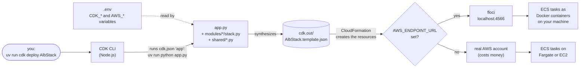
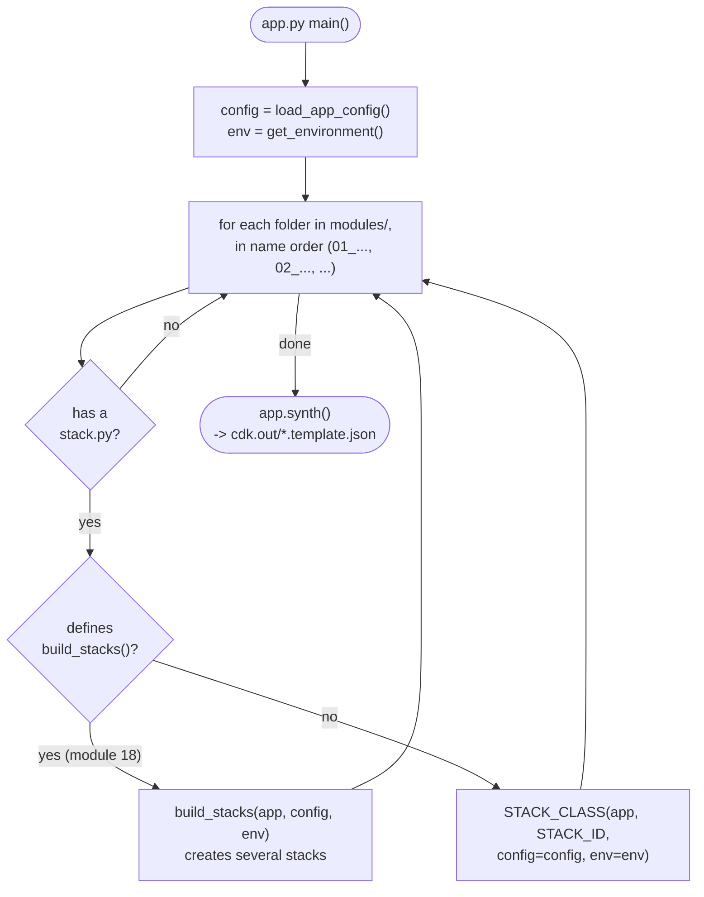
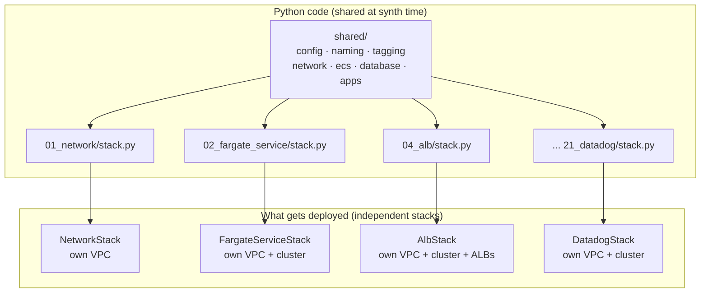
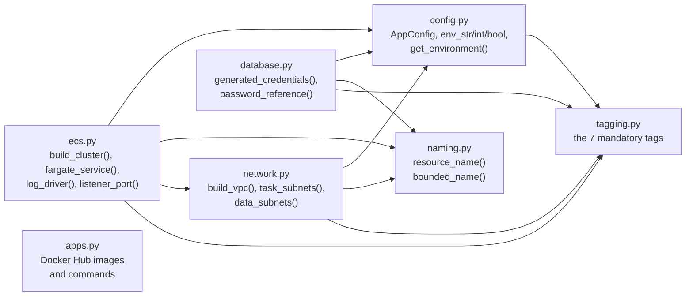
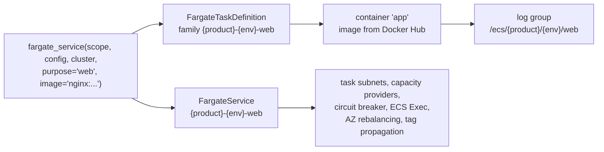
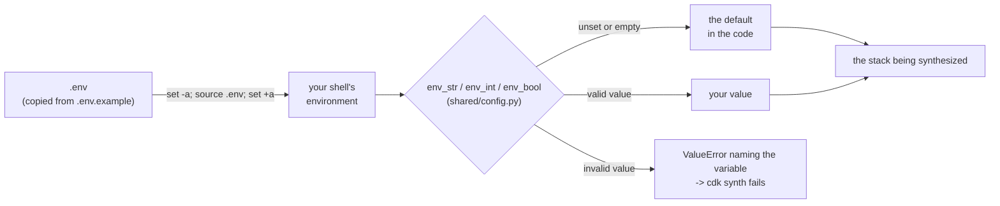
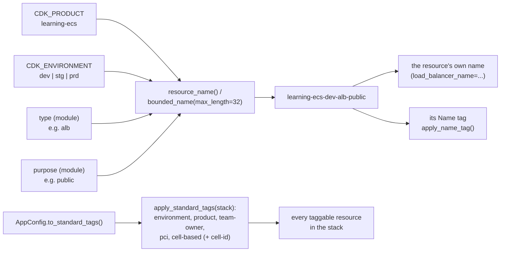
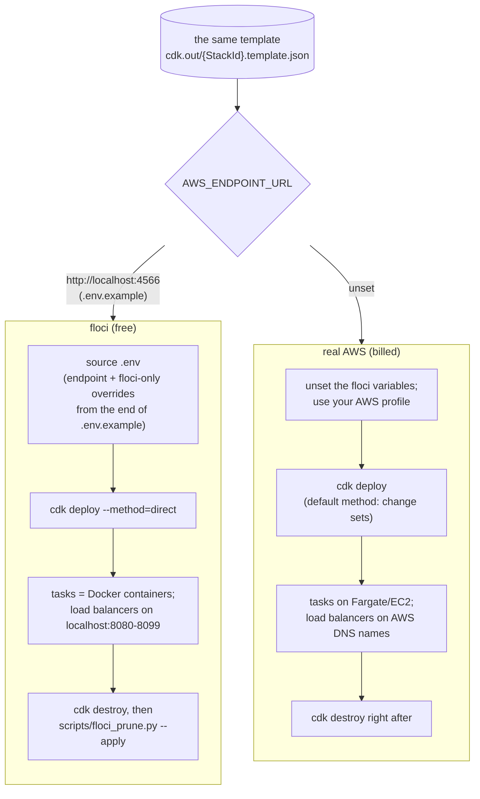

<!-- TOC -->

- [How this repository works](#how-this-repository-works)
  - [From a command to running containers](#from-a-command-to-running-containers)
  - [How app.py finds the modules](#how-apppy-finds-the-modules)
  - [Modules share code, not resources](#modules-share-code-not-resources)
  - [What each file in shared/ does](#what-each-file-in-shared-does)
  - [Where a setting comes from](#where-a-setting-comes-from)
  - [Names and tags](#names-and-tags)
  - [floci or real AWS: one variable decides](#floci-or-real-aws-one-variable-decides)
  - [Where a module's tests fit](#where-a-modules-tests-fit)
  - [References](#references)

<!-- TOC -->

# How this repository works

The picture behind the code: what happens when you type `uv run cdk
deploy`, how `app.py` finds the modules, what the modules share and what
they don't, and where every setting comes from. Read it once before
module 01; come back when something in a `stack.py` looks like magic.
The concepts (ECS, CDK, floci) are introduced in
[`REQUIREMENTS.md`, section 0](../REQUIREMENTS.md#0-zero-to-your-first-deploy-in-order).

## From a command to running containers

1. The CDK CLI reads [`cdk.json`](../cdk.json), whose `"app"` is
   `uv run python app.py`.
2. `app.py` builds one `AppConfig` from the environment, imports every
   module's `stack.py` and instantiates its stack. Nothing is created yet.
3. `app.synth()` writes one CloudFormation template per stack into
   `cdk.out/` - that is all `cdk synth` does.
4. `cdk deploy` sends that template to CloudFormation - floci's or your
   account's, depending on `AWS_ENDPOINT_URL`
   ([below](#floci-or-real-aws-one-variable-decides)) - which creates the
   VPC, the cluster, the services... and ECS starts the tasks.

## How app.py finds the modules

This is why adding a module never means editing `app.py`: a new
`modules/NN_topic/stack.py` with `STACK_ID` and `STACK_CLASS` is found on
the next `uv run cdk list` (23 stacks today: one per module, three for
module 18). The full contract is in
[`CLAUDE.md`, section 3](../CLAUDE.md#3-the-module-contract).

## Modules share code, not resources

Every module is a **separate stack with its own VPC, cluster and
services**. No stack reads another stack's outputs, so you can deploy,
break and destroy any module on its own, in any order. What the modules
share is *code*: the helpers in `shared/` that build those resources the
same way everywhere.

So "module 04 builds on module 02" means you learn 02's service pattern
first - not that 02 must be deployed. The order to *learn* them is in
[`LEARNING-PATH.md`](LEARNING-PATH.md).

## What each file in shared/ does

An arrow means "imports". `apps.py` holds only constants (images, ports,
SQL) used by modules 09-11, 19 and 21.

| File | You use it when | Main entry points |
|---|---|---|
| [`config.py`](../shared/config.py) | reading any setting | `AppConfig`, `env_str`, `env_int`, `env_bool`, `get_environment` |
| [`naming.py`](../shared/naming.py) | naming a resource | `resource_name`, `bounded_name` (32-character limits) |
| [`tagging.py`](../shared/tagging.py) | tagging the stack and each resource | `apply_standard_tags`, `apply_name_tag` |
| [`network.py`](../shared/network.py) | creating the VPC, choosing subnets | `build_vpc`, `task_subnets`, `data_subnets` |
| [`ecs.py`](../shared/ecs.py) | creating clusters, services, log groups, listener ports | `build_cluster`, `fargate_service`, `log_driver`, `listener_port` |
| [`database.py`](../shared/database.py) | database credentials in Secrets Manager | `generated_credentials`, `password_reference` |
| [`apps.py`](../shared/apps.py) | an image or command used by several modules | constants |

`fargate_service()` is module 02's pattern in one function: task
definition, container, log group and service.
[`modules/02_fargate_service/stack.py`](../modules/02_fargate_service/stack.py)
writes every one of those pieces out by hand, so you can read what the
helper hides.

## Where a setting comes from

Every knob is an environment variable with a default, read **at synth
time**. A bad value stops `cdk synth` with a message naming the variable,
before anything reaches CloudFormation.

- Shared knobs (`CDK_PRODUCT`, `CDK_VPC_CIDR`, `CDK_NAT_GATEWAYS`, ...):
  [`REQUIREMENTS.md`, section 9.1](../REQUIREMENTS.md#91---variables-every-module-reads).
- A module's own knobs (`CDK_<MODULE>_*`): the "Configuration" table of
  its README.
- Remember to `source .env` again in every new terminal, and after
  editing it.

## Names and tags

Names and tag values come from `config`, never from a literal in a
module. A module only chooses the *type* and *purpose* segments of a name.

`bounded_name()` shortens a name that would exceed a limit (load
balancers and target groups: 32 characters) - the details and the full
policy are in
[`REQUIREMENTS.md`, sections 7 and 8](../REQUIREMENTS.md#7-tagging-policy).

## floci or real AWS: one variable decides

The same code, the same template, two destinations. The AWS CLI, boto3
and the CDK CLI all send their API calls to `AWS_ENDPOINT_URL` when it is
set.

How floci runs what you deploy - its ports, its network and the task
containers - is drawn in
[`REQUIREMENTS.md`, section 5](../REQUIREMENTS.md#5-running-floci-the-local-aws-emulator);
what it emulates and what it doesn't is in
[section 10](../REQUIREMENTS.md#10-floci-vs-real-aws).

## Where a module's tests fit

Unit tests synthesize a stack in memory and check the template - no
floci, no AWS, no credentials. They run the same `stack.py` that `cdk
deploy` does, so a broken setting or a missing tag fails `uv run pytest`
before it reaches floci. How they work, with a diagram, and a
step-by-step for a new module: [`TESTING.md`](TESTING.md#how-cdk-unit-tests-work-in-one-paragraph).

## References

- [AWS CDK - Apps](https://docs.aws.amazon.com/cdk/v2/guide/apps.html)
- [AWS CDK - Environments](https://docs.aws.amazon.com/cdk/v2/guide/environments.html)
- [AWS CDK - Tagging](https://docs.aws.amazon.com/cdk/v2/guide/tagging.html)
- [AWS CDK - Testing constructs](https://docs.aws.amazon.com/cdk/v2/guide/testing.html)
- [AWS CLI - Configuring endpoints (`AWS_ENDPOINT_URL`)](https://docs.aws.amazon.com/sdkref/latest/guide/feature-ss-endpoints.html)
- [floci](https://floci.io)
