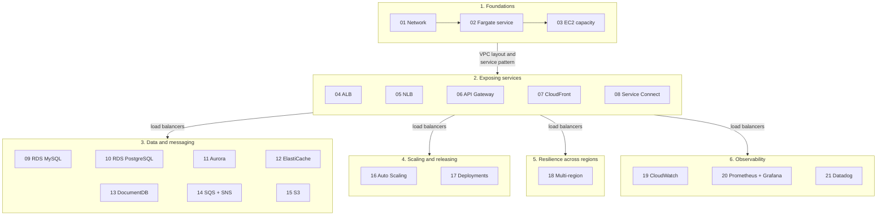
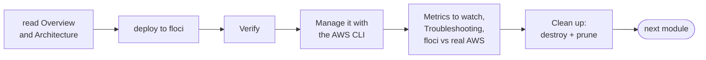

<!-- TOC -->

- [Learning path](#learning-path)
  - [How to use this path](#how-to-use-this-path)
  - [Phase 1 - Foundations](#phase-1---foundations)
  - [Phase 2 - Exposing services](#phase-2---exposing-services)
  - [Phase 3 - Data and messaging](#phase-3---data-and-messaging)
  - [Phase 4 - Scaling and releasing](#phase-4---scaling-and-releasing)
  - [Phase 5 - Resilience across regions](#phase-5---resilience-across-regions)
  - [Phase 6 - Observability and troubleshooting](#phase-6---observability-and-troubleshooting)
  - [What runs fully on floci](#what-runs-fully-on-floci)
  - [Cross-cutting guides](#cross-cutting-guides)

<!-- TOC -->

# Learning path

21 modules, from a first Fargate service to multi-region deployments and
three observability stacks. Each module is a deployable CDK stack and a
README; set up your machine first with
[`REQUIREMENTS.md`, section 0](../REQUIREMENTS.md#0-zero-to-your-first-deploy-in-order).

## How to use this path

- **Go in order the first time.** Phases build on each other: every module
  after 01 reuses its VPC layout, every service module reuses module 02's
  service pattern, and phases 3-6 use load balancers from phase 2.
- **For each module**: read Overview and Architecture, deploy to floci,
  run the Verify section, then work through "Manage it with the AWS CLI" -
  that's where you learn to operate ECS without the CDK. Read "Metrics to
  watch" and "Troubleshooting", check "floci vs real AWS", then clean up.
- **One module at a time on floci**: destroy before moving on - each stack
  runs real containers on your machine.
- **Real AWS is optional**, per module, and costs money (NAT Gateways, load
  balancers, databases, tasks). Destroy right after.

How the phases build on each other. An arrow means "uses what you learned
in" - not "must be deployed first": every module is a separate stack
with its own VPC ([`ARCHITECTURE.md`](ARCHITECTURE.md#modules-share-code-not-resources)).

The loop to repeat in every module:

## Phase 1 - Foundations

| # | Module | Stack | You learn |
|---|---|---|---|
| 01 | [Network](../modules/01_network/README.md) | `NetworkStack` | multi-AZ VPC for ECS: public/private/isolated subnets, NAT, S3 gateway endpoint, flow logs |
| 02 | [Fargate service](../modules/02_fargate_service/README.md) | `FargateServiceStack` | cluster, task definition, service; roles, secrets, health checks, circuit breaker, ECS Exec, every `aws ecs` day-2 command |
| 03 | [EC2 capacity](../modules/03_ec2_capacity/README.md) | `Ec2CapacityStack` | Auto Scaling group capacity provider, managed scaling and draining, placement strategies, daemon services |

## Phase 2 - Exposing services

| # | Module | Stack | You learn |
|---|---|---|---|
| 04 | [ALB](../modules/04_alb/README.md) | `AlbStack` | internet-facing and internal Application Load Balancers, listener rules, health checks, HTTPS, access logs |
| 05 | [NLB](../modules/05_nlb/README.md) | `NlbStack` | internet-facing and internal Network Load Balancers, TCP, client IP preservation, cross-zone |
| 06 | [API Gateway](../modules/06_api_gateway/README.md) | `ApiGatewayStack` | REST or HTTP API in front of ECS, VPC links, throttling, access logs |
| 07 | [CloudFront](../modules/07_cloudfront/README.md) | `CloudFrontStack` | CDN in front of an ALB, origin protection with a secret header or VPC origins, caching |
| 08 | [Service Connect](../modules/08_service_connect/README.md) | `ServiceConnectStack` | service-to-service calls by short name, Cloud Map namespaces, the Service Connect proxy |

## Phase 3 - Data and messaging

| # | Module | Stack | You learn |
|---|---|---|---|
| 09 | [RDS for MySQL](../modules/09_rds_mysql/README.md) | `RdsMysqlStack` | WordPress on Fargate with RDS, credentials in Secrets Manager, one-off client tasks |
| 10 | [RDS for PostgreSQL](../modules/10_rds_postgresql/README.md) | `RdsPostgresqlStack` | a REST API (PostgREST) on RDS, migrations as one-off tasks |
| 11 | [Aurora](../modules/11_aurora/README.md) | `AuroraStack` | Aurora PostgreSQL/MySQL, serverless or provisioned, readers, read/write split by listener rules |
| 12 | [ElastiCache](../modules/12_elasticache/README.md) | `ElastiCacheStack` | Valkey replication group, Multi-AZ, TLS, workers reading and writing |
| 13 | [DocumentDB](../modules/13_documentdb/README.md) | `DocumentDbStack` | DocumentDB with TLS, init containers, container dependencies |
| 14 | [SQS + SNS](../modules/14_sqs_sns/README.md) | `SqsSnsStack` | fan-out, filter policies, DLQs and redrive, scaling consumers on queue depth |
| 15 | [S3](../modules/15_s3/README.md) | `S3Stack` | scheduled tasks (EventBridge Scheduler), task roles for S3, bucket security, lifecycle |

## Phase 4 - Scaling and releasing

| # | Module | Stack | You learn |
|---|---|---|---|
| 16 | [Service Auto Scaling](../modules/16_autoscaling/README.md) | `AutoscalingStack` | target tracking (CPU, memory, requests), scheduled scaling, cooldowns, load testing |
| 17 | [Deployments](../modules/17_deployments/README.md) | `DeploymentsStack` | rolling updates, circuit breaker, alarm rollback, native blue/green, canary and linear, manual rollback |

## Phase 5 - Resilience across regions

| # | Module | Stack | You learn |
|---|---|---|---|
| 18 | [Multi-region](../modules/18_multi_region/README.md) | `MultiRegionPrimaryStack`, `MultiRegionSecondaryStack`, `MultiRegionGlobalStack` | one app in two regions, CloudFront origin failover, failover drills, data strategies |

## Phase 6 - Observability and troubleshooting

| # | Module | Stack | You learn |
|---|---|---|---|
| 19 | [CloudWatch](../modules/19_cloudwatch/README.md) | `CloudWatchStack` | Container Insights, structured logs, metric filters, alarms, dashboards, Logs Insights, stopped-task events |
| 20 | [Prometheus and Grafana](../modules/20_prometheus_grafana/README.md) | `PrometheusGrafanaStack` | ADOT sidecar, remote write, self-hosted Prometheus/Grafana or Amazon Managed Service for Prometheus, PromQL, alert rules |
| 21 | [Datadog](../modules/21_datadog/README.md) | `DatadogStack` | the Datadog Agent sidecar, FireLens logs, unified service tagging, Autodiscovery |

## What runs fully on floci

floci 2.1.0 runs ECS tasks as real containers, so most modules work end to
end locally. Where it doesn't, the module says so and shows the real-AWS
commands - summary (details in each README and in
[`REQUIREMENTS.md`, section 10](../REQUIREMENTS.md#10-floci-vs-real-aws)):

| Module | On floci |
|---|---|
| 01, 02, 04, 05, 09, 10, 11 | the app works end to end (some settings stored but not applied - e.g. health-check replacement, Multi-AZ) |
| 14 | producer and consumers work end to end; the queue-depth scaling isn't created |
| 03 | tasks run, but no EC2 instances are launched |
| 06, 07 | work with the `.env.example` overrides (internet backend, `localhost` origin) |
| 08 | services run; Service Connect itself isn't emulated |
| 12, 13 | the cache/database are created with the CLI (CloudFormation doesn't create them) |
| 15 | tasks work; the schedule isn't created - run the writer by hand |
| 16 | scaling works from the CLI, driven by metrics you push |
| 17 | deployments are plain replacements; blue/green, canary, circuit breaker are real-AWS only |
| 18 | both regions work; CloudFront origin failover is real-AWS only |
| 19 | alarms, dashboards, events and a subset of Logs Insights work; no AWS metrics, no task logs in CloudWatch |
| 20 | Prometheus, Grafana and alerts work (with the `.env.example` workarounds) |
| 21 | containers run; nothing reaches Datadog (no task metadata, no FireLens) |

## Cross-cutting guides

- [`METRICS.md`](METRICS.md) - every metric the path uses: `AWS/ECS`,
  Container Insights, load balancers, data services, CloudWatch,
  Prometheus and Datadog names.
- [`TROUBLESHOOTING.md`](TROUBLESHOOTING.md) - from a symptom to its cause
  and fix, with the CloudWatch, Prometheus/Grafana and Datadog views.
- [`TESTING.md`](TESTING.md) - how the unit tests work and how to write one.
