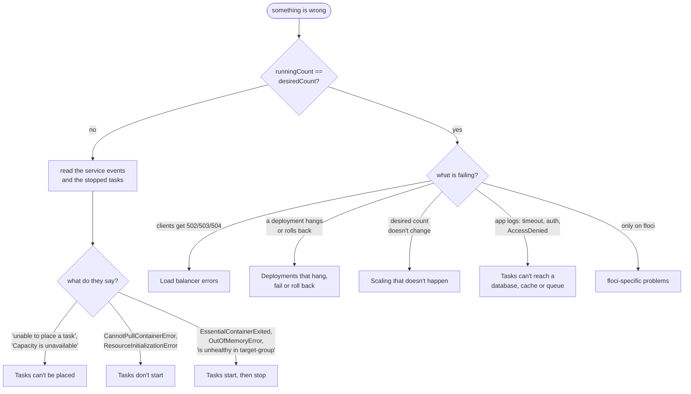
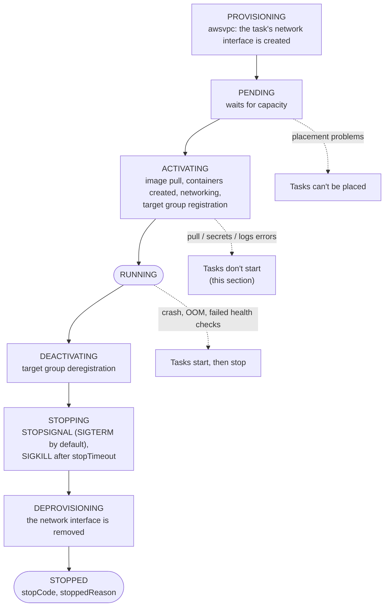
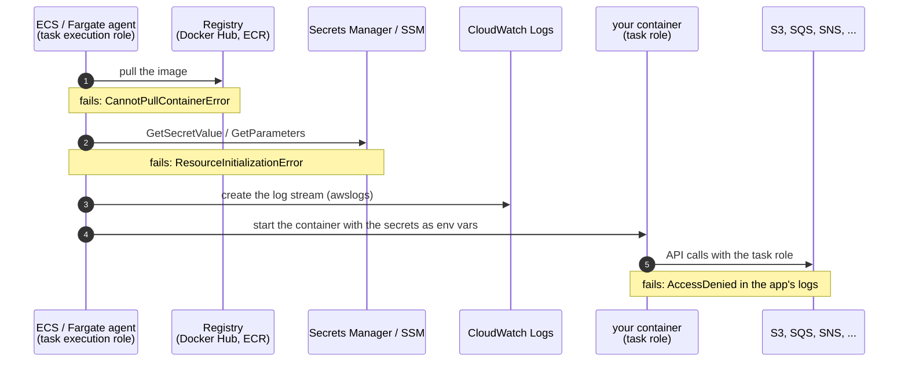
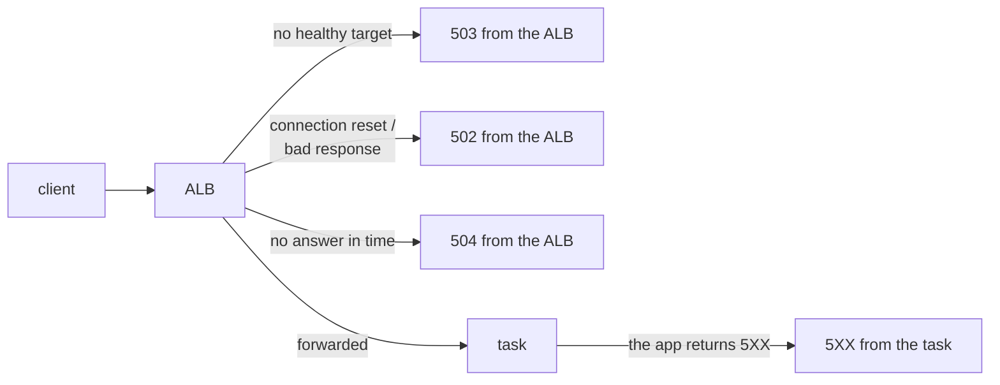

<!-- TOC -->

- [Troubleshooting](#troubleshooting)
  - [A method: from symptom to cause](#a-method-from-symptom-to-cause)
  - [The command toolbox](#the-command-toolbox)
  - [Tasks don't start](#tasks-dont-start)
    - [Stopped task error categories](#stopped-task-error-categories)
    - [CannotPullContainerError](#cannotpullcontainererror)
    - [Secrets, logs and network at start-up](#secrets-logs-and-network-at-start-up)
  - [Tasks start, then stop](#tasks-start-then-stop)
  - [Tasks can't be placed](#tasks-cant-be-placed)
  - [Load balancer errors](#load-balancer-errors)
  - [Deployments that hang, fail or roll back](#deployments-that-hang-fail-or-roll-back)
  - [Scaling that doesn't happen](#scaling-that-doesnt-happen)
  - [Tasks can't reach a database, cache or queue](#tasks-cant-reach-a-database-cache-or-queue)
  - [The same problem in CloudWatch, Prometheus/Grafana and Datadog](#the-same-problem-in-cloudwatch-prometheusgrafana-and-datadog)
  - [floci-specific problems](#floci-specific-problems)
  - [References](#references)

<!-- TOC -->

# Troubleshooting

How to go from a symptom ("the site returns 503", "the service never
reaches 2 tasks") to its cause, for every module in this path. Each
module's README has a "Troubleshooting" table for its own resources; this
guide covers what they have in common. Metrics are described in
[`METRICS.md`](METRICS.md).

## A method: from symptom to cause

1. **Is the service at its desired count?** `describe-services`:
   `desiredCount` vs `runningCount` vs `pendingCount`, and `deployments[]`.
   Running below desired -> tasks don't start, stop, or can't be placed.
2. **Read the service events** (newest first). They say "unable to place",
   "is unhealthy in target-group", "has reached a steady state", "deployment
   failed". ECS keeps the 100 most recent and suppresses duplicates.
3. **Read the stopped tasks**: `stopCode`, `stoppedReason`, each
   container's `exitCode` and `reason`. Stopped tasks stay visible for a
   short time (the console shows them for about an hour) - module 19
   keeps them in a log group with an EventBridge rule.
4. **Read the logs** of the container that failed (`aws logs tail`; on
   floci, `docker logs learning-ecs-floci`).
5. **Look at the outside view**: load balancer target health and 5XX,
   then the dashboards (CloudWatch, Grafana, Datadog).
6. **Ask what changed**: a deployment (`DeploymentCount`, the deployment
   history), a scaling activity, a dependency.

The same method as a decision tree - each leaf is a section below:



## The command toolbox

```bash
C=<cluster>; S=<service>

# 1. desired vs running, deployments, events
aws ecs describe-services --cluster "$C" --services "$S" \
  --query 'services[0].[desiredCount,runningCount,pendingCount]' --output text
aws ecs describe-services --cluster "$C" --services "$S" \
  --query 'services[0].deployments[].[status,taskDefinition,rolloutState,rolloutStateReason,runningCount,failedTasks]' --output table
aws ecs describe-services --cluster "$C" --services "$S" --query 'services[0].events[:10].[createdAt,message]' --output table

# 2. stopped tasks and why
aws ecs list-tasks --cluster "$C" --service-name "$S" --desired-status STOPPED --query 'taskArns[:5]'
aws ecs describe-tasks --cluster "$C" --tasks <task-arn> \
  --query 'tasks[0].[stopCode,stoppedReason,containers[].[name,exitCode,reason]]' --output json

# 3. logs
aws logs tail /ecs/learning-ecs/dev/<purpose> --since 30m --follow
docker logs learning-ecs-floci 2>&1 | grep 'ecs:<service-or-family>:<container>' | tail -50   # floci

# 4. inside a running container (real AWS; needs ECS Exec + the Session Manager plugin)
aws ecs execute-command --cluster "$C" --task <task-arn> --container app --interactive --command "/bin/sh"

# 5. load balancer target health
aws elbv2 describe-target-health --target-group-arn <tg-arn> \
  --query 'TargetHealthDescriptions[].[Target.Id,TargetHealth.State,TargetHealth.Reason,TargetHealth.Description]' --output table

# 6. wait for a deployment to settle (fails after its timeout)
aws ecs wait services-stable --cluster "$C" --services "$S"
```

## Tasks don't start

A task goes through these states (`lastStatus`), from
[Amazon ECS task lifecycle](https://docs.aws.amazon.com/AmazonECS/latest/developerguide/task-lifecycle-explanation.html).
Knowing the state a task died in narrows the cause:



### Stopped task error categories

From [Amazon ECS stopped task error messages](https://docs.aws.amazon.com/AmazonECS/latest/developerguide/stopped-task-error-codes.html)
- read `stoppedReason` for the details:

| Category (in `stoppedReason`) | Typical meaning |
|---|---|
| `CannotPullContainerError` | the image couldn't be pulled - [below](#cannotpullcontainererror) |
| `ResourceInitializationError` | something the task needs before its containers start failed - secrets, the log stream, registry authentication, the network - [below](#secrets-logs-and-network-at-start-up) |
| `ResourceNotFoundException` | a referenced resource (secret, parameter, ...) doesn't exist |
| `TaskFailedToStart` | the task couldn't be started; the rest of the message says why |
| `CannotStartContainerError`, `ContainerRuntimeError`, `ContainerRuntimeTimeoutError` | the container runtime couldn't create or start the container (wrong command/entry point, invalid options) |
| `OutOfMemoryError` | a container was killed for exceeding its memory |
| `SpotInterruptionError` | a Fargate Spot task was reclaimed (`CDK_FARGATE_SPOT_WEIGHT`) |
| `CannotStopContainerError`, `CannotInspectContainerError`, `CannotCreateVolumeError`, `InternalError` | runtime or platform problems - retry; if they persist, check the volumes and open a support case |

### CannotPullContainerError

From [CannotPullContainer task errors](https://docs.aws.amazon.com/AmazonECS/latest/developerguide/task_cannot_pull_image.html):

| Message contains | Cause | Fix |
|---|---|---|
| `request canceled while waiting for connection`, `context canceled`, i/o timeout | no route to the registry | public subnet: `assignPublicIp=ENABLED`; private subnet: a NAT Gateway (`CDK_NAT_GATEWAYS>=1`) or VPC endpoints (ECR) |
| `toomanyrequests` / "You have reached your pull rate limit" | Docker Hub rate limit (anonymous: 100 pulls per 6 hours per IP - all tasks behind one NAT share it) | authenticate pulls ([private registry authentication](https://docs.aws.amazon.com/AmazonECS/latest/developerguide/private-auth.html)), or copy the images to ECR |
| `failed to resolve ref`, `manifest unknown`, `not found` | the tag doesn't exist (typo, deleted tag) | check the tag on Docker Hub; pin versions, not `latest` |
| `pull access denied` | private repository without credentials | registry credentials (or ECR permissions on the execution role) |
| `no space left on device` | EC2 instance disk full (module 03) | free space / bigger volume; Fargate: `ephemeralStorage` |

On floci the same failure shows as `Failed to start: Status 404: {"message":"manifest for ... not found ..."}`
in `stoppedReason` (module 17), and floci keeps retrying.

### Secrets, logs and network at start-up

Before the containers start, ECS (with the **task execution role**) pulls
the image, reads the `secrets` from Secrets Manager/SSM and creates the log
stream. A `ResourceInitializationError` usually means one of:

- the execution role lacks `secretsmanager:GetSecretValue` /
  `ssm:GetParameters` (or `kms:Decrypt` for a customer key) - the CDK grants
  these when you use `ecs.Secret.from_*`;
- the secret/parameter name or JSON key is wrong;
- no network path to Secrets Manager, SSM, CloudWatch Logs or the registry
  (private subnets without NAT or VPC endpoints).

The **task role** (not the execution role) is what the application uses
afterwards (S3, SQS, ...) - `AccessDenied` in the application's logs points
there (modules 14, 15).



## Tasks start, then stop

| Evidence | Cause | Fix |
|---|---|---|
| `stopCode: EssentialContainerExited`, a non-zero `exitCode` | the application crashed | its logs; wrong environment variable, missing dependency, bad configuration |
| `stoppedReason` with `OutOfMemoryError` (`container killed due to memory usage`) | memory limit too low, or a leak | raise the task/container memory; `TaskMemoryUtilization`/`ContainerMemoryUtilization` (module 19) |
| `stoppedReason` about failed ELB health checks / service event `(task ...) is unhealthy in ...` | the load balancer's health check fails | the path/port/codes of the health check; the app's start time vs `health_check_grace_period`; the security group from the load balancer |
| `stoppedReason` about failed container health checks; `healthStatus: UNHEALTHY` | the container `healthCheck` command fails | run the command by hand (ECS Exec); `startPeriod` too short; the tool (`wget`, `curl`) missing in the image |
| a sidecar exited (log router, agent, collector) | an essential sidecar stops the whole task | its own log group (modules 20, 21); make non-critical sidecars `essential=false` |
| `stopCode: ServiceSchedulerInitiated` | the scheduler stopped it - usually normal (a deployment, a scale-in, or replacing an unhealthy task: read `stoppedReason`) | - |

## Tasks can't be placed

Service events from [Amazon ECS service event messages](https://docs.aws.amazon.com/AmazonECS/latest/developerguide/service-event-messages-list.html):

| Event | Cause | Fix |
|---|---|---|
| `was unable to place a task because no container instance met all of its requirements` | EC2 capacity (module 03): no instances, not enough CPU/memory/ENIs, port in use, missing attribute | capacity provider with managed scaling, smaller tasks, `awsvpcTrunking`, dynamic host ports |
| `Capacity is unavailable at this time` | no Fargate (or EC2) capacity in that AZ right now | wait, or add subnets in more AZs (`CDK_MAX_AZS`) |
| `You've reached the limit on the number of vCPUs you can run concurrently` | Fargate vCPU quota | request a quota increase |
| `is unable to consistently start tasks successfully` | tasks keep failing; ECS backs off between retries | fix the start failure (above) and deploy again |
| `was unable to stop or start tasks during a deployment because of the service deployment configuration` | `minimumHealthyPercent`/`maximumPercent` leave no room | e.g. 100/200 with Fargate, or 50/100 when capacity is fixed |
| `IAM permissions policies have been misconfigured or changed` / `IAM trust relationship ...` | a role used by the service or tasks was changed | restore the policy/trust (redeploy the stack) |

## Load balancer errors

From [Troubleshoot your Application Load Balancers](https://docs.aws.amazon.com/elasticloadbalancing/latest/application/load-balancer-troubleshooting.html):

| Error | Generated by | Usual causes in ECS |
|---|---|---|
| `503` | the ALB | no registered or no healthy targets: tasks not running, all failing health checks, wrong target group |
| `502` | the ALB | the target reset/closed the connection (app crashed, keep-alive timeout shorter than the ALB idle timeout), malformed response, tasks stopped before deregistration finished |
| `504` | the ALB | the target didn't answer in time: slow app, security group or NACL blocking the target port, idle timeout |
| `460` | the ALB | the client closed the connection before the idle timeout |
| `5XX` counted in `HTTPCode_Target_5XX_Count` | your tasks | the application - read its logs |

Who answered the error tells you where to look:



The ALB's own 502, 503 and 504 count in `HTTPCode_ELB_5XX_Count`; the
application's in `HTTPCode_Target_5XX_Count` ([`METRICS.md`](METRICS.md#load-balancers)).

Target health `Target.ResponseCodeMismatch` (wrong status from the health
check path), `Target.Timeout`, `Target.FailedHealthChecks`. Health checks
use the user agent `ELB-HealthChecker/2.0`. NLB: `TCP_Target_Reset_Count`,
and remember that traffic rejected by a security group doesn't appear in
NLB metrics (module 05).

## Deployments that hang, fail or roll back

Module 17 covers these in detail:

- **Stuck `IN_PROGRESS`**: new tasks never get healthy and there's no
  circuit breaker, or the deployment bounds leave no room.
- **`rolloutState: FAILED`**: the circuit breaker counted enough failed
  tasks (default threshold: half the desired count, at least 3, at most
  200) - the stopped tasks say why; with rollback, the last `COMPLETED`
  deployment returns.
- **Rolled back with healthy tasks**: a deployment alarm fired.
- **Errors during every deployment**: the deregistration delay is shorter
  than in-flight requests, or old and new versions aren't compatible.
- Roll back by hand: `aws ecs stop-service-deployment --stop-type ROLLBACK`
  or `update-service --task-definition <previous revision>`.

## Scaling that doesn't happen

Module 16 (and 14 for queue-based scaling):

- `aws application-autoscaling describe-scaling-activities --service-namespace ecs --resource-id service/<cluster>/<service>`
  shows every decision and failure.
- Alarm in `INSUFFICIENT_DATA`: wrong metric or dimensions, or no data
  (target tracking never scales in on missing data).
- At `MaxCapacity`, suspended (`SuspendedState`), in cooldown, or scale-in
  paused during a deployment.
- Desired rises but running doesn't: the tasks can't start or be placed
  (sections above).

## Tasks can't reach a database, cache or queue

| Symptom | Check |
|---|---|
| Connection timeout | the data service's security group allows the **service's** security group on its port; same VPC; the endpoint/port the task uses (`env`) |
| `password authentication failed` / auth errors | the secret the task received (`secrets`) vs the database's password - rotated after the task started? Force a new deployment |
| TLS errors (ElastiCache, DocumentDB) | TLS enabled on one side only; the CA bundle (modules 12, 13) |
| Too many connections | `DatabaseConnections`/`CurrConnections` grow with the task count - pool sizes x tasks |
| `AccessDenied` on SQS/SNS/S3 | the **task role**'s permissions (not the execution role) |
| Readers serve stale data | replica lag (`AuroraReplicaLag`, `ReplicationLag`) |

## The same problem in CloudWatch, Prometheus/Grafana and Datadog

| Question | CloudWatch (module 19) | Prometheus/Grafana (module 20) | Datadog (module 21) |
|---|---|---|---|
| Are we serving errors? | alarm `obs-app-5xx` (metric filter on the logs); `HTTPCode_Target_5XX_Count` | alert `HighErrorRate`; panel "Error ratio" | logs `service:<svc> status:>=500`; monitors |
| Which requests fail? | Logs Insights `errors-by-path` | `sum by (code) (rate(..._count[1m]))` | log facets `path`, `status` |
| Is a task missing or failing? | `RunningTaskCount` < desired (alarm `obs-tasks-below-desired`), `UnHealthyHostCount` | `up{job="caddy"} == 0` (alert `TargetDown`), "Tasks being scraped" | `fargate_check`, number of reporting containers |
| Why did tasks stop? | stopped-task events log group, query `stopped-tasks` | - (events aren't metrics: use the CLI or EventBridge) | ECS events via the AWS integration; `describe-tasks` |
| Resource pressure? | `TaskCpuUtilization`, `TaskMemoryUtilization`, `ContainerMemoryUtilization`, `RestartCount` | ADOT `ecs.task.*` metrics | `ecs.fargate.cpu.percent`, `ecs.fargate.mem.usage` |
| Is the monitoring itself broken? | alarm in `INSUFFICIENT_DATA`; log group without new streams | collector logs: `Failed to scrape`, `failed to send WriteRequest`; `up` | Agent logs, `agent status` (ECS Exec) |

## floci-specific problems

| Symptom | Cause | Fix |
|---|---|---|
| `SsmParameterNotFound ... /cdk-bootstrap/hnb659fds/version` | floci not bootstrapped (or a new region) | `uv run cdk bootstrap` ([`REQUIREMENTS.md` 5.5](../REQUIREMENTS.md#55---bootstrapping-the-cdk-once-per-floci-instance-or-aws-accountregion)) |
| Deploy of a changed stack fails ("Resource updates failed") | floci's in-place updates | `cdk destroy` then deploy ([5.6](../REQUIREMENTS.md#56---re-running-cdk-deploy-on-floci-and-changing-a-deployed-stack)) |
| Duplicate VPCs pile up | floci doesn't delete VPCs | `scripts/floci_prune.py --apply` ([5.7](../REQUIREMENTS.md#57---cdk-destroy-on-floci-leaves-vpcs-behind)) |
| `cdk destroy`: "The cluster cannot be deleted because it contains running tasks" | tasks still stopping | run `cdk destroy` again |
| `curl localhost:<port>` refused | the listener port isn't published (8080-8099) or two listeners share it | `CDK_PORT_*` ([REQUIREMENTS.md section 6](../REQUIREMENTS.md#6-network-ports-used)) |
| `*.elb.floci` doesn't resolve on your machine | those names resolve only inside floci's network | `localhost:<port>` |
| Nothing in CloudWatch Logs | floci doesn't ship `awslogs` | `docker logs learning-ecs-floci` ([5.10](../REQUIREMENTS.md#510---where-ecs-task-output-goes-on-floci)) |
| `run-task --task-definition <family>` runs old code | floci picks the newest revision, even `INACTIVE` | use the task definition ARN from the stack outputs |
| Tasks stop with `toomanyrequests` | Docker Hub rate limit on your IP | `docker login`, wait, or reduce destroy/deploy cycles |
| A feature "does nothing" | accepted but not emulated | the module's "floci vs real AWS" table and [`REQUIREMENTS.md` section 10](../REQUIREMENTS.md#10-floci-vs-real-aws) |

## References

- [Amazon ECS troubleshooting](https://docs.aws.amazon.com/AmazonECS/latest/developerguide/troubleshooting.html)
- [Stopped task error messages](https://docs.aws.amazon.com/AmazonECS/latest/developerguide/stopped-task-error-codes.html) · [CannotPullContainer errors](https://docs.aws.amazon.com/AmazonECS/latest/developerguide/task_cannot_pull_image.html) · [Service event messages](https://docs.aws.amazon.com/AmazonECS/latest/developerguide/service-event-messages-list.html)
- [Troubleshoot your Application Load Balancers](https://docs.aws.amazon.com/elasticloadbalancing/latest/application/load-balancer-troubleshooting.html)
- [How the deployment circuit breaker detects failures](https://docs.aws.amazon.com/AmazonECS/latest/developerguide/deployment-circuit-breaker.html)
- [Private registry authentication for tasks](https://docs.aws.amazon.com/AmazonECS/latest/developerguide/private-auth.html)
- [Amazon ECS Exec](https://docs.aws.amazon.com/AmazonECS/latest/developerguide/ecs-exec.html)
- [Docker Hub usage and limits](https://docs.docker.com/docker-hub/usage/)
