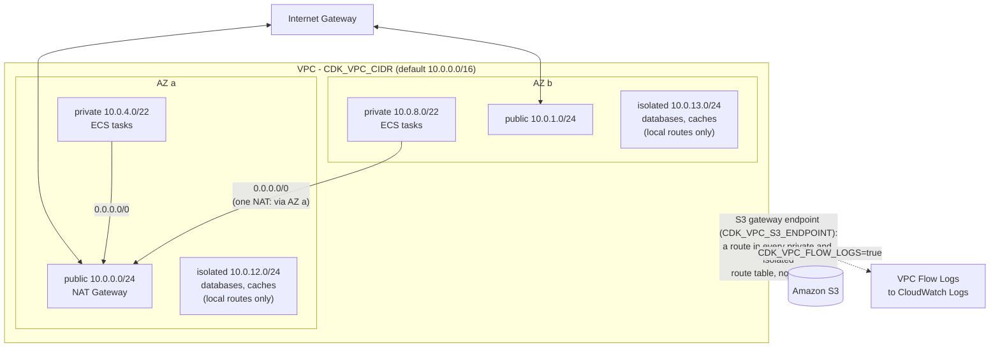

<!-- TOC -->

- [Module 01 - Network (the multi-AZ VPC for ECS)](#module-01---network-the-multi-az-vpc-for-ecs)
  - [Overview](#overview)
  - [What you will learn](#what-you-will-learn)
  - [Architecture](#architecture)
  - [AWS services and CDK constructs used](#aws-services-and-cdk-constructs-used)
  - [Configuration](#configuration)
  - [Prerequisites](#prerequisites)
  - [Tests](#tests)
  - [Deploy with floci (local, free)](#deploy-with-floci-local-free)
  - [Deploy to real AWS (optional)](#deploy-to-real-aws-optional)
  - [Verify](#verify)
    - [List every resource with the AWS CLI](#list-every-resource-with-the-aws-cli)
  - [Manage it with the AWS CLI (without the CDK)](#manage-it-with-the-aws-cli-without-the-cdk)
  - [Troubleshooting](#troubleshooting)
  - [floci vs real AWS](#floci-vs-real-aws)
  - [Clean up](#clean-up)
  - [Notes and cautions](#notes-and-cautions)
  - [References](#references)

<!-- TOC -->

# Module 01 - Network (the multi-AZ VPC for ECS)

## Overview

Every ECS task with the `awsvpc` network mode (the only mode Fargate
supports) gets its own elastic network interface (ENI) in a subnet of a
VPC you choose. So before a single container runs, you need a VPC laid out
for containers: subnets in **more than one Availability Zone** (so losing
one AZ doesn't take your service down), a way for tasks in private subnets
to reach the internet (to pull images from Docker Hub), and a tier with no
internet route at all for databases.

This module builds exactly that VPC and nothing else. Every other module in
this path builds the same VPC through the same function -
[`shared/network.py`](../../shared/network.py)'s `build_vpc()` - so what you
learn here applies everywhere.

## What you will learn

- The three subnet tiers used throughout this path and why each exists:
  `public` (load balancers, NAT Gateways), `private` (ECS tasks, outbound
  internet only through a NAT Gateway) and `isolated` (databases, caches -
  no internet route at all).
- How `max_azs` turns a single-AZ VPC into a multi-AZ one, and why ECS
  spreads a service's tasks across the AZs of the subnets you give it.
- What a NAT Gateway costs you and what you lose without one
  (`CDK_NAT_GATEWAYS=0` moves tasks to public subnets with public IPs).
- How an S3 **gateway** endpoint keeps S3 traffic off the NAT Gateway.
- How to turn on VPC Flow Logs - the first tool to reach for when a task
  "can't connect" to something.
- The same VPC built by hand, command by command, with the AWS CLI.

## Architecture



<details>
<summary>Plain-text version (names and details)</summary>

```
                         VPC  CDK_VPC_CIDR (10.0.0.0/16)
 +--------------------------- AZ a ---------------+--------------- AZ b ----------------+
 | public    10.0.0.0/24   IGW route, NAT Gateway  | public    10.0.1.0/24  IGW route     |
 | private   10.0.4.0/22   0.0.0.0/0 -> NAT        | private   10.0.8.0/22  0.0.0.0/0 -> NAT |
 | isolated  10.0.12.0/24  local routes only       | isolated  10.0.13.0/24 local only     |
 +-------------------------------------------------+-------------------------------------+
   S3 gateway endpoint: a route to S3 in every private/isolated route table (no NAT hop)
```

</details>

(These are the blocks the CDK computes for the defaults - `10.0.0.0/16`,
two AZs, `/24` public and isolated, `/22` private; other values of
`CDK_VPC_CIDR`/`CDK_MAX_AZS` give other blocks - check them with the
commands in [Verify](#verify).)

With `CDK_NAT_GATEWAYS=1` (the default) there is one NAT Gateway, so both
private subnets route through AZ a: cheaper, but if AZ a fails, tasks in
AZ b lose outbound internet. `CDK_NAT_GATEWAYS=2` (one per AZ) removes that
single point of failure - see the AWS guidance in
[References](#references).

## AWS services and CDK constructs used

| AWS service | CDK construct (Python) | Level |
|---|---|---|
| Amazon VPC | `aws_cdk.aws_ec2.Vpc` (via `shared/network.py`) | L2 |
| Amazon VPC (gateway endpoint) | `aws_cdk.aws_ec2.GatewayVpcEndpoint` (`Vpc.add_gateway_endpoint`) | L2 |
| VPC Flow Logs | `aws_cdk.aws_ec2.FlowLog` (`Vpc.add_flow_log`) | L2 |
| Amazon CloudWatch Logs | `aws_cdk.aws_logs.LogGroup` | L2 |

## Configuration

Read from the environment (see [`../../.env.example`](../../.env.example)
and [`../../REQUIREMENTS.md`, section 9](../../REQUIREMENTS.md#9-flexible-configuration)):

| Variable | Default | Effect |
|---|---|---|
| `CDK_VPC_CIDR` | `10.0.0.0/16` | the VPC's IPv4 range |
| `CDK_MAX_AZS` | `2` | Availability Zones used (1 = single-AZ) |
| `CDK_NAT_GATEWAYS` | `1` | NAT Gateways; `0` = no `private` tier, tasks go to `public` subnets |
| `CDK_VPC_S3_ENDPOINT` | `true` | create the S3 gateway endpoint |
| `CDK_VPC_FLOW_LOGS` | `false` | send VPC Flow Logs to `/vpc/<product>/<env>/flow-logs` |
| `CDK_LOG_RETENTION_DAYS` | `7` | retention of that log group |

## Prerequisites

- Repository-wide setup done once: see [`../../REQUIREMENTS.md`](../../REQUIREMENTS.md)
  (uv, Node.js + AWS CDK Toolkit, Docker, floci).
- From the repository root: `uv sync`, `docker compose up -d floci`, and
  `cp .env.example .env && set -a && source .env && set +a`.

## Tests

See [`../../docs/TESTING.md`](../../docs/TESTING.md) for how these work.
[`../../tests/unit/test_01_network.py`](../../tests/unit/test_01_network.py)
checks that: there is one VPC with the configured CIDR, three subnets per
AZ, the NAT Gateway count follows `nat_gateways` (and `0` drops the private
tier), the S3 gateway endpoint exists by default and can be disabled, flow
logs are off by default and go to CloudWatch Logs when enabled, and the VPC
carries every mandatory tag. No Docker, floci or AWS credentials needed:

```bash
uv run pytest tests/unit/test_01_network.py -v
```

## Deploy with floci (local, free)

```bash
# From the repository root, with .env loaded (REQUIREMENTS.md section 0)
uv run cdk bootstrap   # once per floci instance - safe to re-run (REQUIREMENTS.md section 5.5)
uv run cdk synth NetworkStack
uv run cdk diff NetworkStack   # what deploy would change - creates nothing (REQUIREMENTS.md section 5.9)
uv run cdk deploy NetworkStack --require-approval never --method=direct
```

Try the knobs - each is a new `cdk diff` / `cdk deploy`:

```bash
CDK_VPC_FLOW_LOGS=true uv run cdk diff NetworkStack     # [+] FlowLog, LogGroup, IAM role
CDK_MAX_AZS=3 uv run cdk diff NetworkStack              # three more subnets...
CDK_NAT_GATEWAYS=0 uv run cdk diff NetworkStack         # [-] NAT Gateway, EIP, private subnets
```

## Deploy to real AWS (optional)

**A NAT Gateway bills per hour and per GB processed for as long as it
exists** - see [Amazon VPC pricing](https://aws.amazon.com/vpc/pricing/).
Set `CDK_NAT_GATEWAYS=0` if you only want to look at the VPC, and destroy
the stack when you're done (see [Clean up](#clean-up)).

```bash
unset AWS_ENDPOINT_URL   # stop pointing the AWS CLI/SDK at floci (REQUIREMENTS.md section 9.2)
uv run cdk bootstrap --profile <your-aws-cli-profile>   # once per AWS account/region
uv run cdk diff NetworkStack --profile <your-aws-cli-profile>
uv run cdk deploy NetworkStack --profile <your-aws-cli-profile>
```

## Verify

```bash
VPC_ID=$(aws cloudformation describe-stacks --stack-name NetworkStack \
  --query "Stacks[0].Outputs[?OutputKey=='VpcId'].OutputValue" --output text)

# Subnets per tier and AZ - "aws-cdk:subnet-name" is a tag the CDK puts on each subnet
# (on floci EC2 tags aren't kept, so filter by VPC only - REQUIREMENTS.md section 10):
aws ec2 describe-subnets --filters Name=vpc-id,Values="$VPC_ID" \
  --query "Subnets[].[AvailabilityZone,CidrBlock,MapPublicIpOnLaunch,SubnetId]" --output table

# Route tables: the private ones point 0.0.0.0/0 at a NAT Gateway (nat-...),
# the public ones at the Internet Gateway (igw-...), the isolated ones nowhere:
aws ec2 describe-route-tables --filters Name=vpc-id,Values="$VPC_ID" \
  --query "RouteTables[].Routes[].[DestinationCidrBlock,GatewayId,NatGatewayId,DestinationPrefixListId]" --output table
```

<!-- BEGIN resource-commands (generated by scripts/resource_commands.py) -->
### List every resource with the AWS CLI

Every resource this stack creates, one `aws` command each, parametrized
by environment (`ENV`), region (`REGION`) and - where a command builds an
ARN - account (`ACCOUNT`): set them to match your deployment, with your
`.env` loaded (floci) or your AWS profile active (real AWS). A resource
without a name of its own is looked up through the stack by its *logical
id* (`pid <LogicalId>`), which is the same in every environment. This block
is generated from the stack's template by
[`scripts/resource_commands.py`](../../scripts/resource_commands.py) - see
[`../../REQUIREMENTS.md`, section 5.8](../../REQUIREMENTS.md#58---listing-every-resource-a-stack-created);
`make cdk-resources STACK=NetworkStack` runs the same commands for you.

```bash
# Match these to your deployment: CDK_PRODUCT and CDK_ENVIRONMENT in .env, and
# the region you deployed to (floci: the one in .env).
PRODUCT=learning-ecs ENV=dev REGION=us-east-1
STACK=NetworkStack
# Physical id of one of the stack's resources, by its logical id - the same in
# every environment. A second argument names another (e.g. nested) stack.
pid() { aws cloudformation describe-stack-resource --stack-name "${2:-$STACK}" \
  --logical-resource-id "$1" --region "$REGION" \
  --query StackResourceDetail.PhysicalResourceId --output text; }

# Every resource the stack created - type, logical id, physical id, status:
aws cloudformation describe-stack-resources --stack-name "$STACK" --region "$REGION" \
  --query "StackResources[].[ResourceType,LogicalResourceId,PhysicalResourceId,ResourceStatus]" \
  --output table

# AWS::EC2::VPC (Vpc8378EB38)
aws ec2 describe-vpcs --vpc-ids "$(pid Vpc8378EB38)" --query "Vpcs[].[VpcId,CidrBlock,State]" --output table --region "$REGION"
# AWS::EC2::Subnet (VpcpublicSubnet1Subnet2BB74ED7)
aws ec2 describe-subnets --subnet-ids "$(pid VpcpublicSubnet1Subnet2BB74ED7)" --query "Subnets[].[SubnetId,CidrBlock,AvailabilityZone]" --output table --region "$REGION"
# AWS::EC2::RouteTable (VpcpublicSubnet1RouteTable15C15F8E)
aws ec2 describe-route-tables --route-table-ids "$(pid VpcpublicSubnet1RouteTable15C15F8E)" --query "RouteTables[].[RouteTableId,length(Routes),length(Associations)]" --output table --region "$REGION"
# AWS::EC2::EIP (VpcpublicSubnet1EIP411541E6)
aws ec2 describe-addresses --public-ips "$(pid VpcpublicSubnet1EIP411541E6)" --query "Addresses[].[PublicIp,AllocationId]" --output table --region "$REGION"
# AWS::EC2::NatGateway (VpcpublicSubnet1NATGatewayA036E8A6)
aws ec2 describe-nat-gateways --nat-gateway-ids "$(pid VpcpublicSubnet1NATGatewayA036E8A6)" --query "NatGateways[].[NatGatewayId,State,SubnetId]" --output table --region "$REGION"
# AWS::EC2::Subnet (VpcpublicSubnet2SubnetE34B022A)
aws ec2 describe-subnets --subnet-ids "$(pid VpcpublicSubnet2SubnetE34B022A)" --query "Subnets[].[SubnetId,CidrBlock,AvailabilityZone]" --output table --region "$REGION"
# AWS::EC2::RouteTable (VpcpublicSubnet2RouteTableC5A6DF77)
aws ec2 describe-route-tables --route-table-ids "$(pid VpcpublicSubnet2RouteTableC5A6DF77)" --query "RouteTables[].[RouteTableId,length(Routes),length(Associations)]" --output table --region "$REGION"
# AWS::EC2::Subnet (VpcprivateSubnet1SubnetCEAD3716)
aws ec2 describe-subnets --subnet-ids "$(pid VpcprivateSubnet1SubnetCEAD3716)" --query "Subnets[].[SubnetId,CidrBlock,AvailabilityZone]" --output table --region "$REGION"
# AWS::EC2::RouteTable (VpcprivateSubnet1RouteTable1979EACB)
aws ec2 describe-route-tables --route-table-ids "$(pid VpcprivateSubnet1RouteTable1979EACB)" --query "RouteTables[].[RouteTableId,length(Routes),length(Associations)]" --output table --region "$REGION"
# AWS::EC2::Subnet (VpcprivateSubnet2Subnet2DE7549C)
aws ec2 describe-subnets --subnet-ids "$(pid VpcprivateSubnet2Subnet2DE7549C)" --query "Subnets[].[SubnetId,CidrBlock,AvailabilityZone]" --output table --region "$REGION"
# AWS::EC2::RouteTable (VpcprivateSubnet2RouteTable4D0FFC8C)
aws ec2 describe-route-tables --route-table-ids "$(pid VpcprivateSubnet2RouteTable4D0FFC8C)" --query "RouteTables[].[RouteTableId,length(Routes),length(Associations)]" --output table --region "$REGION"
# AWS::EC2::Subnet (VpcisolatedSubnet1SubnetE62B1B9B)
aws ec2 describe-subnets --subnet-ids "$(pid VpcisolatedSubnet1SubnetE62B1B9B)" --query "Subnets[].[SubnetId,CidrBlock,AvailabilityZone]" --output table --region "$REGION"
# AWS::EC2::RouteTable (VpcisolatedSubnet1RouteTableE442650B)
aws ec2 describe-route-tables --route-table-ids "$(pid VpcisolatedSubnet1RouteTableE442650B)" --query "RouteTables[].[RouteTableId,length(Routes),length(Associations)]" --output table --region "$REGION"
# AWS::EC2::Subnet (VpcisolatedSubnet2Subnet39217055)
aws ec2 describe-subnets --subnet-ids "$(pid VpcisolatedSubnet2Subnet39217055)" --query "Subnets[].[SubnetId,CidrBlock,AvailabilityZone]" --output table --region "$REGION"
# AWS::EC2::RouteTable (VpcisolatedSubnet2RouteTable334F9764)
aws ec2 describe-route-tables --route-table-ids "$(pid VpcisolatedSubnet2RouteTable334F9764)" --query "RouteTables[].[RouteTableId,length(Routes),length(Associations)]" --output table --region "$REGION"
# AWS::EC2::InternetGateway (VpcIGWD7BA715C)
aws ec2 describe-internet-gateways --internet-gateway-ids "$(pid VpcIGWD7BA715C)" --query "InternetGateways[].[InternetGatewayId,Attachments[0].VpcId]" --output table --region "$REGION"
# AWS::EC2::VPCEndpoint (VpcS3Endpoint4A3DE4B5)
aws ec2 describe-vpc-endpoints --vpc-endpoint-ids "$(pid VpcS3Endpoint4A3DE4B5)" --query "VpcEndpoints[].[VpcEndpointId,ServiceName,VpcEndpointType,State]" --output table --region "$REGION"
# Also created - listed in the table above:
#   AWS::EC2::SubnetRouteTableAssociation VpcpublicSubnet1RouteTableAssociation4E83B6E4 - shown by its route table
#   AWS::EC2::Route VpcpublicSubnet1DefaultRouteB88F9E93 - shown by its route table
#   AWS::EC2::SubnetRouteTableAssociation VpcpublicSubnet2RouteTableAssociationCCE257FF - shown by its route table
#   AWS::EC2::Route VpcpublicSubnet2DefaultRoute732F0BEB - shown by its route table
#   AWS::EC2::SubnetRouteTableAssociation VpcprivateSubnet1RouteTableAssociationEEBD93CE - shown by its route table
#   AWS::EC2::Route VpcprivateSubnet1DefaultRouteB506891A - shown by its route table
#   AWS::EC2::SubnetRouteTableAssociation VpcprivateSubnet2RouteTableAssociationB691E645 - shown by its route table
#   AWS::EC2::Route VpcprivateSubnet2DefaultRouteBAC3C1C3 - shown by its route table
#   AWS::EC2::SubnetRouteTableAssociation VpcisolatedSubnet1RouteTableAssociationD259E31A - shown by its route table
#   AWS::EC2::SubnetRouteTableAssociation VpcisolatedSubnet2RouteTableAssociation25A4716F - shown by its route table
#   AWS::EC2::VPCGatewayAttachment VpcVPCGWBF912B6E - shown by its internet gateway
```
<!-- END resource-commands -->

## Manage it with the AWS CLI (without the CDK)

The CDK is the source of truth in this repository - but knowing what it
does for you is half the point. This is the same kind of VPC (one AZ shown;
repeat the subnet/route steps per AZ), created, configured and deleted by
hand. Every command was run against floci while writing this; all of them
are standard [AWS CLI `ec2`](https://docs.aws.amazon.com/cli/latest/reference/ec2/)
commands, so they work unchanged on a real account.

```bash
# --- create --------------------------------------------------------------------
VPC_ID=$(aws ec2 create-vpc --cidr-block 10.1.0.0/16 \
  --tag-specifications 'ResourceType=vpc,Tags=[{Key=Name,Value=learning-ecs-dev-vpc-manual}]' \
  --query Vpc.VpcId --output text)
aws ec2 modify-vpc-attribute --vpc-id "$VPC_ID" --enable-dns-hostnames '{"Value":true}'
read -r AZ1 AZ2 <<<"$(aws ec2 describe-availability-zones --query 'AvailabilityZones[0:2].ZoneName' --output text)"

PUB1=$(aws ec2 create-subnet --vpc-id "$VPC_ID" --cidr-block 10.1.0.0/24 \
  --availability-zone "$AZ1" --query Subnet.SubnetId --output text)
PRIV1=$(aws ec2 create-subnet --vpc-id "$VPC_ID" --cidr-block 10.1.4.0/22 \
  --availability-zone "$AZ1" --query Subnet.SubnetId --output text)

# Internet Gateway + public route table
IGW=$(aws ec2 create-internet-gateway --query InternetGateway.InternetGatewayId --output text)
aws ec2 attach-internet-gateway --internet-gateway-id "$IGW" --vpc-id "$VPC_ID"
PUB_RT=$(aws ec2 create-route-table --vpc-id "$VPC_ID" --query RouteTable.RouteTableId --output text)
aws ec2 create-route --route-table-id "$PUB_RT" --destination-cidr-block 0.0.0.0/0 --gateway-id "$IGW"
aws ec2 associate-route-table --route-table-id "$PUB_RT" --subnet-id "$PUB1"
aws ec2 modify-subnet-attribute --subnet-id "$PUB1" --map-public-ip-on-launch

# NAT Gateway (in the public subnet) + private route table
EIP=$(aws ec2 allocate-address --domain vpc --query AllocationId --output text)
NAT=$(aws ec2 create-nat-gateway --subnet-id "$PUB1" --allocation-id "$EIP" \
  --query NatGateway.NatGatewayId --output text)
aws ec2 wait nat-gateway-available --nat-gateway-ids "$NAT"
PRIV_RT=$(aws ec2 create-route-table --vpc-id "$VPC_ID" --query RouteTable.RouteTableId --output text)
aws ec2 create-route --route-table-id "$PRIV_RT" --destination-cidr-block 0.0.0.0/0 --nat-gateway-id "$NAT"
aws ec2 associate-route-table --route-table-id "$PRIV_RT" --subnet-id "$PRIV1"

# --- configure -------------------------------------------------------------------
# S3 gateway endpoint on the private route table
VPCE=$(aws ec2 create-vpc-endpoint --vpc-id "$VPC_ID" --vpc-endpoint-type Gateway \
  --service-name "com.amazonaws.${AWS_DEFAULT_REGION}.s3" --route-table-ids "$PRIV_RT" \
  --query VpcEndpoint.VpcEndpointId --output text)

# VPC Flow Logs -> CloudWatch Logs (needs a role the vpc-flow-logs service can assume;
# on real AWS also attach a policy allowing logs:CreateLogStream/PutLogEvents to it)
aws logs create-log-group --log-group-name /vpc/learning-ecs/dev/manual-flow-logs
ROLE_ARN=$(aws iam create-role --role-name learning-ecs-dev-flow-logs-manual \
  --assume-role-policy-document '{"Version":"2012-10-17","Statement":[{"Effect":"Allow","Principal":{"Service":"vpc-flow-logs.amazonaws.com"},"Action":"sts:AssumeRole"}]}' \
  --query Role.Arn --output text)
FL=$(aws ec2 create-flow-logs --resource-type VPC --resource-ids "$VPC_ID" --traffic-type ALL \
  --log-destination-type cloud-watch-logs --log-group-name /vpc/learning-ecs/dev/manual-flow-logs \
  --deliver-logs-permission-arn "$ROLE_ARN" --query 'FlowLogIds[0]' --output text)

# --- delete (reverse order) -------------------------------------------------------
aws ec2 delete-flow-logs --flow-log-ids "$FL"
aws iam delete-role --role-name learning-ecs-dev-flow-logs-manual
aws logs delete-log-group --log-group-name /vpc/learning-ecs/dev/manual-flow-logs
aws ec2 delete-vpc-endpoints --vpc-endpoint-ids "$VPCE"
aws ec2 delete-nat-gateway --nat-gateway-id "$NAT"
aws ec2 wait nat-gateway-deleted --nat-gateway-ids "$NAT"
aws ec2 release-address --allocation-id "$EIP"
for RT in "$PUB_RT" "$PRIV_RT"; do
  for A in $(aws ec2 describe-route-tables --route-table-ids "$RT" \
      --query 'RouteTables[0].Associations[].RouteTableAssociationId' --output text); do
    aws ec2 disassociate-route-table --association-id "$A"
  done
  aws ec2 delete-route-table --route-table-id "$RT"
done
aws ec2 detach-internet-gateway --internet-gateway-id "$IGW" --vpc-id "$VPC_ID"
aws ec2 delete-internet-gateway --internet-gateway-id "$IGW"
aws ec2 delete-subnet --subnet-id "$PUB1"
aws ec2 delete-subnet --subnet-id "$PRIV1"
aws ec2 delete-vpc --vpc-id "$VPC_ID"
```

## Troubleshooting

| Symptom | Likely cause | How to confirm / fix |
|---|---|---|
| A task in a private subnet stops with `CannotPullContainerError` / `ResourceInitializationError` (timeout pulling from Docker Hub) | no route to the internet: no NAT Gateway, or the NAT Gateway is in a subnet without an Internet Gateway route | `aws ec2 describe-route-tables` above: the task's subnet needs `0.0.0.0/0 -> nat-...`; see [docs/TROUBLESHOOTING.md](../../docs/TROUBLESHOOTING.md#cannotpullcontainererror) |
| `cdk deploy` fails: "If you do not want NAT gateways (natGateways=0), make sure you don't configure any PRIVATE(_WITH_NAT) subnets" | a hand-edited subnet configuration with `CDK_NAT_GATEWAYS=0` | `shared/network.py` already drops the private tier when NAT is 0 - don't add one back |
| `cdk deploy` fails with an overlapping/invalid CIDR | `CDK_VPC_CIDR` too small for 3 tiers x `CDK_MAX_AZS` (the private tier uses `/22`) | use a `/16`, or fewer AZs |
| "Connection timed out" between two resources in the VPC | security group or route table | turn on `CDK_VPC_FLOW_LOGS=true` and look for `REJECT` records (see below) |

Reading flow logs (real AWS - floci stores the flow log definition but
doesn't produce records):

```bash
aws logs filter-log-events --log-group-name /vpc/learning-ecs/dev/flow-logs \
  --filter-pattern REJECT --max-items 20 --query "events[].message" --output text
```

## floci vs real AWS

| Behavior | floci 2.1.0 | Real AWS |
|---|---|---|
| VPC, subnets, route tables, IGW, NAT Gateway, EIP, gateway endpoint, flow log | created (CloudFormation and CLI) | created |
| Availability Zones | `us-east-1a`, `us-east-1b`, ... are returned by `describe-availability-zones` | the account's real AZs |
| EC2 tags (including the CDK's `aws-cdk:subnet-name`) | **not kept** - filter by VPC id instead | kept |
| VPC Flow Log records | definition only, no records are written | records every ~10 minutes (default aggregation) |
| `cdk destroy` | **leaves the VPC behind** - run `scripts/floci_prune.py --apply` | deletes the VPC |

See [`../../REQUIREMENTS.md`, section 10](../../REQUIREMENTS.md#10-floci-vs-real-aws).

## Clean up

```bash
uv run cdk destroy NetworkStack
uv run python scripts/floci_prune.py --apply   # floci only: deletes the empty VPC floci leaves behind (REQUIREMENTS.md section 5.7)
```

## Notes and cautions

- **Cost**: the NAT Gateway (and its Elastic IP) is the only billed
  resource here; interface endpoints (not created here) also bill hourly,
  gateway endpoints don't - see [AWS PrivateLink pricing](https://aws.amazon.com/privatelink/pricing/).
- **One NAT Gateway is a single point of failure for outbound traffic**:
  for production, `CDK_NAT_GATEWAYS` equal to `CDK_MAX_AZS` (one per AZ).
- **Subnet size limits how many tasks you can run.** Each `awsvpc` task
  uses one IP address of its subnet; AWS reserves 5 addresses per subnet.
  The `/22` private subnets here hold about a thousand tasks each - size
  them for your peak, plus deployments (which briefly run old and new
  tasks side by side).

## References

- [Amazon ECS - Best practices for connecting Amazon ECS services to the internet](https://docs.aws.amazon.com/AmazonECS/latest/developerguide/networking-outbound.html)
- [Amazon ECS - `awsvpc` network mode](https://docs.aws.amazon.com/AmazonECS/latest/developerguide/task-networking-awsvpc.html)
- [Amazon VPC - Subnets for your VPC](https://docs.aws.amazon.com/vpc/latest/userguide/configure-subnets.html) · [Subnet sizing](https://docs.aws.amazon.com/vpc/latest/userguide/subnet-sizing.html)
- [Amazon VPC - NAT gateways](https://docs.aws.amazon.com/vpc/latest/userguide/vpc-nat-gateway.html)
- [AWS PrivateLink - Gateway endpoints](https://docs.aws.amazon.com/vpc/latest/privatelink/gateway-endpoints.html)
- [Amazon VPC - VPC Flow Logs](https://docs.aws.amazon.com/vpc/latest/userguide/flow-logs.html)
- [Amazon VPC pricing](https://aws.amazon.com/vpc/pricing/)
- [AWS CDK API Reference (Python) - `aws_cdk.aws_ec2.Vpc`](https://docs.aws.amazon.com/cdk/api/v2/python/aws_cdk.aws_ec2/Vpc.html)
- [AWS CDK API Reference (Python) - `aws_cdk.aws_ec2.FlowLogDestination`](https://docs.aws.amazon.com/cdk/api/v2/python/aws_cdk.aws_ec2/FlowLogDestination.html)
- [AWS CLI Command Reference - `ec2`](https://docs.aws.amazon.com/cli/latest/reference/ec2/)
