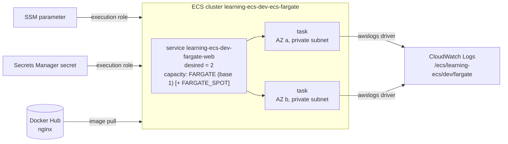

<!-- TOC -->

- [Module 02 - Fargate service (cluster, task definition, service)](#module-02---fargate-service-cluster-task-definition-service)
  - [Overview](#overview)
  - [What you will learn](#what-you-will-learn)
  - [Architecture](#architecture)
  - [AWS services and CDK constructs used](#aws-services-and-cdk-constructs-used)
  - [Configuration](#configuration)
  - [Prerequisites](#prerequisites)
  - [Tests](#tests)
  - [Deploy with floci (local, free)](#deploy-with-floci-local-free)
  - [Deploy to real AWS (optional)](#deploy-to-real-aws-optional)
  - [Verify](#verify)
    - [List every resource with the AWS CLI](#list-every-resource-with-the-aws-cli)
  - [Day-2 operations with the AWS CLI](#day-2-operations-with-the-aws-cli)
    - [Deploy a new image (new task definition revision)](#deploy-a-new-image-new-task-definition-revision)
    - [Scale, redeploy, roll back](#scale-redeploy-roll-back)
    - [One-off tasks and stopping tasks](#one-off-tasks-and-stopping-tasks)
    - [Open a shell in a container (ECS Exec)](#open-a-shell-in-a-container-ecs-exec)
  - [Manage it with the AWS CLI (without the CDK)](#manage-it-with-the-aws-cli-without-the-cdk)
  - [Metrics to watch](#metrics-to-watch)
  - [Troubleshooting](#troubleshooting)
  - [floci vs real AWS](#floci-vs-real-aws)
  - [Clean up](#clean-up)
  - [Notes and cautions](#notes-and-cautions)
  - [References](#references)

<!-- TOC -->

# Module 02 - Fargate service (cluster, task definition, service)

## Overview

Amazon ECS has three core objects, and this module creates one of each,
written out piece by piece so nothing is hidden:

- a **cluster** - a logical grouping of capacity. Here: Fargate, AWS's
  serverless compute, so there are no EC2 instances to manage (module 03
  shows the EC2 alternative);
- a **task definition** - the blueprint for one *task* (one or more
  containers that start and stop together): image, CPU/memory, ports,
  environment, secrets, health check, logging;
- a **service** - keeps `desired_count` copies of that task running,
  replaces the ones that fail, and rolls out new task definition revisions
  without downtime.

The container is the official [nginx image from Docker Hub](https://hub.docker.com/_/nginx).
There's no load balancer yet - that's [module 04](../04_alb/README.md) - so
this module is about what a service does on its own.

## What you will learn

- Cluster capacity providers: `FARGATE` and `FARGATE_SPOT`, and how a
  capacity provider strategy (`base`, `weight`) mixes them.
- The difference between the **task execution role** (used by ECS to pull
  the image, write logs, read secrets *before* your container starts) and
  the **task role** (used by *your code* to call AWS APIs).
- Injecting configuration two ways: a plain environment variable, and
  `secrets` resolved at start-up from SSM Parameter Store and Secrets
  Manager (never stored in the task definition).
- Container health checks, and why a service replaces unhealthy tasks.
- Rolling deployments: `minimumHealthyPercent`/`maximumPercent`, and the
  **deployment circuit breaker** that rolls back a deployment that can't
  reach a steady state.
- Multi-AZ placement and **Availability Zone rebalancing**.
- Day-2 operations from the CLI: new revision, scale, force a redeploy,
  roll back, one-off tasks, stop a task, ECS Exec.

## Architecture



<details>
<summary>Plain-text version (names and details)</summary>

```
 SSM parameter ----+                       ECS cluster  learning-ecs-dev-ecs-fargate
 Secrets Manager --+--(execution role)--> +------------------------------------------------+
 Docker Hub nginx -+                      | service learning-ecs-dev-fargate-web  desired=2 |
                                          |   capacity providers: FARGATE (base 1) [+SPOT] |
 CloudWatch Logs <--- awslogs driver ---- |   task (AZ a, private subnet)  task (AZ b)     |
 /ecs/learning-ecs/dev/fargate            +------------------------------------------------+
```

</details>

## AWS services and CDK constructs used

| AWS service | CDK construct (Python) | Level |
|---|---|---|
| Amazon ECS | `aws_cdk.aws_ecs.Cluster` (via `shared/ecs.py`) | L2 |
| Amazon ECS | `aws_cdk.aws_ecs.FargateTaskDefinition`, `ContainerDefinition` | L2 |
| Amazon ECS | `aws_cdk.aws_ecs.FargateService` | L2 |
| Amazon ECS | `aws_cdk.aws_ecs.ContainerImage.from_registry` (Docker Hub) | L2 (helper) |
| Amazon ECS | `aws_cdk.aws_ecs.Secret` (`from_ssm_parameter`, `from_secrets_manager`) | L2 (helper) |
| AWS Systems Manager | `aws_cdk.aws_ssm.StringParameter` | L2 |
| AWS Secrets Manager | `aws_cdk.aws_secretsmanager.Secret` | L2 |
| Amazon CloudWatch Logs | `aws_cdk.aws_logs.LogGroup` (via `shared/ecs.py`) | L2 |
| Amazon VPC | `aws_cdk.aws_ec2.Vpc` (via `shared/network.py`, see [module 01](../01_network/README.md)) | L2 |

## Configuration

Module knobs, plus the shared ones every service reads (see
[`../../REQUIREMENTS.md`, section 9](../../REQUIREMENTS.md#9-flexible-configuration)):

| Variable | Default | Effect |
|---|---|---|
| `CDK_FARGATE_IMAGE` | `nginx:1.30-alpine` | the Docker Hub image to run |
| `CDK_FARGATE_CPU` / `CDK_FARGATE_MEMORY` | `256` / `512` | task size - must be a [valid Fargate pair](https://docs.aws.amazon.com/AmazonECS/latest/developerguide/fargate-tasks-services.html#fargate-tasks-size) |
| `CDK_FARGATE_DESIRED_COUNT` | `CDK_DESIRED_COUNT` (`2`) | tasks the service keeps running |
| `CDK_FARGATE_GREETING` | `hello from SSM Parameter Store` | value of the SSM parameter |
| `CDK_FARGATE_SPOT_WEIGHT` (shared) | `0` | FARGATE_SPOT tasks per extra FARGATE task (`0` = no Spot) |
| `CDK_CPU_ARCHITECTURE` (shared) | `x86_64` | or `arm64` (AWS Graviton; the image must support it) |
| `CDK_ENABLE_EXECUTE_COMMAND` (shared) | `true` | allow `aws ecs execute-command` |
| `CDK_CONTAINER_INSIGHTS` (shared) | `enhanced` | `disabled`, `enabled` or `enhanced` |

## Prerequisites

- Repository-wide setup done once: see [`../../REQUIREMENTS.md`](../../REQUIREMENTS.md).
- From the repository root: `uv sync`, `docker compose up -d floci`, `.env` loaded.
- [`jq`](https://jqlang.org/) for the day-2 commands below (`sudo apt-get install -y jq` / `brew install jq`).
- Module [01](../01_network/README.md) read (the VPC this module builds is the same).

## Tests

[`../../tests/unit/test_02_fargate_service.py`](../../tests/unit/test_02_fargate_service.py)
checks the capacity providers and Container Insights setting, the task
definition (Fargate, `awsvpc`, size, architecture, image, health check,
`awslogs`), that the parameter and the secret reach the container as
`secrets`, that image/size/architecture follow their variables, the
service's circuit breaker, ECS Exec, AZ rebalancing and capacity provider
strategy (with and without Spot), public IPs when there's no NAT Gateway,
and the mandatory tags:

```bash
uv run pytest tests/unit/test_02_fargate_service.py -v
```

## Deploy with floci (local, free)

```bash
uv run cdk bootstrap   # once per floci instance (REQUIREMENTS.md section 5.5)
uv run cdk synth FargateServiceStack
uv run cdk diff FargateServiceStack
uv run cdk deploy FargateServiceStack --require-approval never --method=direct
```

floci runs each task as a real Docker container (pulled from Docker Hub by
your Docker daemon):

```bash
docker ps --filter label=io.floci.service=ecs --format 'table {{.Names}}\t{{.Image}}\t{{.Status}}'
```

## Deploy to real AWS (optional)

**Fargate bills per vCPU and GB of memory per second while tasks run, and
the NAT Gateway bills hourly** - see [AWS Fargate pricing](https://aws.amazon.com/fargate/pricing/)
and [Amazon VPC pricing](https://aws.amazon.com/vpc/pricing/). Two tasks of
the smallest size run until you destroy the stack.

```bash
unset AWS_ENDPOINT_URL   # REQUIREMENTS.md section 9.2
uv run cdk bootstrap --profile <your-aws-cli-profile>
uv run cdk diff FargateServiceStack --profile <your-aws-cli-profile>
uv run cdk deploy FargateServiceStack --profile <your-aws-cli-profile>
```

## Verify

```bash
CLUSTER=learning-ecs-dev-ecs-fargate SERVICE=learning-ecs-dev-fargate-web

# The service: desired vs running, and the state of the current deployment
aws ecs describe-services --cluster "$CLUSTER" --services "$SERVICE" \
  --query "services[0].{status:status,desired:desiredCount,running:runningCount,rollout:deployments[0].rolloutState}"

# Its tasks: one per AZ, both RUNNING and (real AWS) HEALTHY
aws ecs describe-tasks --cluster "$CLUSTER" \
  --tasks $(aws ecs list-tasks --cluster "$CLUSTER" --service-name "$SERVICE" --query "taskArns" --output text) \
  --query "tasks[].[availabilityZone,lastStatus,healthStatus,capacityProviderName]" --output table

# The last service events - the first place to look when something is wrong
aws ecs describe-services --cluster "$CLUSTER" --services "$SERVICE" \
  --query "services[0].events[0:5].[createdAt,message]" --output table
```

<!-- BEGIN resource-commands (generated by scripts/resource_commands.py) -->
### List every resource with the AWS CLI

Every resource this stack creates, one `aws` command each, parametrized
by environment (`ENV`), region (`REGION`) and - where a command builds an
ARN - account (`ACCOUNT`): set them to match your deployment, with your
`.env` loaded (floci) or your AWS profile active (real AWS). A resource
without a name of its own is looked up through the stack by its *logical
id* (`pid <LogicalId>`), which is the same in every environment. This block
is generated from the stack's template by
[`scripts/resource_commands.py`](../../scripts/resource_commands.py) - see
[`../../REQUIREMENTS.md`, section 5.8](../../REQUIREMENTS.md#58---listing-every-resource-a-stack-created);
`make cdk-resources STACK=FargateServiceStack` runs the same commands for you.

```bash
# Match these to your deployment: CDK_PRODUCT and CDK_ENVIRONMENT in .env, and
# the region you deployed to (floci: the one in .env).
PRODUCT=learning-ecs ENV=dev REGION=us-east-1
STACK=FargateServiceStack
# Physical id of one of the stack's resources, by its logical id - the same in
# every environment. A second argument names another (e.g. nested) stack.
pid() { aws cloudformation describe-stack-resource --stack-name "${2:-$STACK}" \
  --logical-resource-id "$1" --region "$REGION" \
  --query StackResourceDetail.PhysicalResourceId --output text; }

# Every resource the stack created - type, logical id, physical id, status:
aws cloudformation describe-stack-resources --stack-name "$STACK" --region "$REGION" \
  --query "StackResources[].[ResourceType,LogicalResourceId,PhysicalResourceId,ResourceStatus]" \
  --output table

# AWS::EC2::VPC (Vpc8378EB38)
aws ec2 describe-vpcs --vpc-ids "$(pid Vpc8378EB38)" --query "Vpcs[].[VpcId,CidrBlock,State]" --output table --region "$REGION"
# AWS::ECS::Cluster (ClusterEB0386A7)
aws ecs describe-clusters --clusters "${PRODUCT}-${ENV}-ecs-fargate" --query "clusters[].[clusterName,status]" --output table --region "$REGION"
# AWS::SSM::Parameter (GreetingParameter34140D43)
aws ssm get-parameter --name "/${PRODUCT}/${ENV}/fargate/greeting" --query "Parameter.[Name,Type]" --output table --region "$REGION"
# AWS::SecretsManager::Secret (ApiTokenSecret3A926DEB)
aws secretsmanager describe-secret --secret-id "${PRODUCT}-${ENV}-fargate-api-token" --query "[Name,ARN]" --output table --region "$REGION"
# AWS::IAM::Role (TaskDefinitionTaskRoleFD40A61D)
aws iam get-role --role-name "$(pid TaskDefinitionTaskRoleFD40A61D)" --query "Role.[RoleName,Arn]" --output table --region "$REGION"
# AWS::ECS::TaskDefinition (TaskDefinitionB36D86D9)
aws ecs describe-task-definition --task-definition "$(pid TaskDefinitionB36D86D9)" --query "taskDefinition.[family,revision,status]" --output table --region "$REGION"
# AWS::IAM::Role (TaskDefinitionExecutionRole8D61C2FB)
aws iam get-role --role-name "$(pid TaskDefinitionExecutionRole8D61C2FB)" --query "Role.[RoleName,Arn]" --output table --region "$REGION"
# AWS::Logs::LogGroup (LogGroupF5B46931)
aws logs describe-log-groups --log-group-name-prefix "/ecs/${PRODUCT}/${ENV}/fargate" --query "logGroups[].[logGroupName,retentionInDays]" --output table --region "$REGION"
# AWS::ECS::Service (ServiceD69D759B)
aws ecs describe-services --cluster "${PRODUCT}-${ENV}-ecs-fargate" --services "${PRODUCT}-${ENV}-fargate-web" --query "services[].[serviceName,status,desiredCount]" --output table --region "$REGION"
# AWS::EC2::SecurityGroup (ServiceSecurityGroupC96ED6A7)
aws ec2 describe-security-groups --group-ids "$(pid ServiceSecurityGroupC96ED6A7)" --query "SecurityGroups[].[GroupId,GroupName,VpcId]" --output table --region "$REGION"
# Also created - listed in the table above:
#   11 VPC sub-resources (subnets, route tables, gateways, endpoints) - built by shared/network.py, listed one by one in modules/01_network/README.md
#   AWS::ECS::ClusterCapacityProviderAssociations Cluster3DA9CCBA - shown by its ECS cluster (describe-clusters --include ATTACHMENTS)
#   AWS::IAM::Policy TaskDefinitionTaskRoleDefaultPolicy282E8624 - shown by its IAM role
#   AWS::IAM::Policy TaskDefinitionExecutionRoleDefaultPolicy1F3406F5 - shown by its IAM role
```
<!-- END resource-commands -->

## Day-2 operations with the AWS CLI

Everything here was run against floci while writing this module, and
works the same on a real account (differences are called out). The CDK
stays the source of truth: anything you change by hand is overwritten (or
fights with) the next `cdk deploy` - use these to learn, to debug, or in an
emergency, then put the change in code.

```bash
CLUSTER=learning-ecs-dev-ecs-fargate SERVICE=learning-ecs-dev-fargate-web FAMILY=learning-ecs-dev-fargate-web
```

### Deploy a new image (new task definition revision)

A task definition is immutable: every change is a new *revision*
(`family:1`, `family:2`, ...). Copy the current one, change it, register it:

```bash
aws ecs describe-task-definition --task-definition "$FAMILY" --query taskDefinition > taskdef.json
# Drop the read-only fields register-task-definition rejects, change the image:
jq 'del(.taskDefinitionArn,.revision,.status,.requiresAttributes,.compatibilities,.registeredAt,.registeredBy,.deregisteredAt)
    | .containerDefinitions[0].image = "nginx:1.31-alpine"' taskdef.json > taskdef-new.json
NEW=$(aws ecs register-task-definition --cli-input-json file://taskdef-new.json \
  --query taskDefinition.taskDefinitionArn --output text)

aws ecs update-service --cluster "$CLUSTER" --service "$SERVICE" --task-definition "$NEW"
aws ecs wait services-stable --cluster "$CLUSTER" --services "$SERVICE"   # rolling update done
```

With `minimumHealthyPercent=100`/`maximumPercent=200`, ECS starts the new
tasks first and stops the old ones only once the new ones are healthy. In
CDK terms the same change is just `CDK_FARGATE_IMAGE=nginx:1.31-alpine uv run cdk deploy FargateServiceStack`.

### Scale, redeploy, roll back

```bash
aws ecs update-service --cluster "$CLUSTER" --service "$SERVICE" --desired-count 3   # scale out/in
aws ecs update-service --cluster "$CLUSTER" --service "$SERVICE" --force-new-deployment   # same revision, new tasks (e.g. re-pull a moved tag)
aws ecs list-task-definitions --family-prefix "$FAMILY"                               # every revision
aws ecs update-service --cluster "$CLUSTER" --service "$SERVICE" --task-definition "$FAMILY:1"   # manual rollback
aws ecs deregister-task-definition --task-definition "$FAMILY:2"   # INACTIVE: no new tasks from it
aws ecs delete-task-definitions --task-definitions "$FAMILY:2"     # only after deregistering
```

The **circuit breaker** does the rollback for you when a deployment can't
reach a steady state: with the default `BOUNDED_PERCENT` threshold it
fails the deployment after `max(3, min(200, ceil(0.5 x desiredCount)))`
failed tasks and returns to the last `COMPLETED` deployment. Watch it with
`describe-services` -> `deployments[].rolloutState` (`IN_PROGRESS`,
`COMPLETED`, `FAILED`). To see it happen on real AWS, deploy an image tag
that doesn't exist (`CDK_FARGATE_IMAGE=nginx:does-not-exist`).

### One-off tasks and stopping tasks

`run-task` starts a task outside any service - database migrations,
batch jobs, a quick check. `--overrides` changes the command (and
environment, CPU, ...) for that run only:

```bash
NET=$(aws ecs describe-services --cluster "$CLUSTER" --services "$SERVICE" \
  --query 'services[0].networkConfiguration' --output json)
TASK=$(aws ecs run-task --cluster "$CLUSTER" --task-definition "$FAMILY:1" \
  --capacity-provider-strategy capacityProvider=FARGATE,weight=1 \
  --network-configuration "$NET" --started-by manual-check \
  --overrides '{"containerOverrides":[{"name":"web","command":["sh","-c","echo one-off task says $APP_GREETING"]}]}' \
  --query 'tasks[0].taskArn' --output text)
aws ecs wait tasks-stopped --cluster "$CLUSTER" --tasks "$TASK"
aws ecs describe-tasks --cluster "$CLUSTER" --tasks "$TASK" \
  --query 'tasks[0].[lastStatus,stoppedReason,containers[0].exitCode]'

# Stop one task of the service - the service starts a replacement:
aws ecs stop-task --cluster "$CLUSTER" --reason "manual test" \
  --task "$(aws ecs list-tasks --cluster "$CLUSTER" --service-name "$SERVICE" --query 'taskArns[0]' --output text)"
aws ecs list-tasks --cluster "$CLUSTER" --service-name "$SERVICE" --desired-status STOPPED
```

Use an explicit revision (`family:N`) with `run-task`: on floci 2.1.0 a
bare family name resolves to the newest revision even when it's
`INACTIVE`, while AWS uses the newest `ACTIVE` one.

### Open a shell in a container (ECS Exec)

Real AWS only (floci 2.1.0 answers `ExecuteCommand` with
`UnsupportedOperation` - use `docker exec` on the task's container
instead). Needs the [Session Manager plugin for the AWS CLI](https://docs.aws.amazon.com/systems-manager/latest/userguide/session-manager-working-with-install-plugin.html)
on your machine; the CDK already grants the task role the
`ssmmessages:*` permissions ECS Exec needs:

```bash
TASK=$(aws ecs list-tasks --cluster "$CLUSTER" --service-name "$SERVICE" --query 'taskArns[0]' --output text)
aws ecs describe-tasks --cluster "$CLUSTER" --tasks "$TASK" \
  --query 'tasks[0].[enableExecuteCommand,containers[0].managedAgents[?name==`ExecuteCommandAgent`].lastStatus|[0]]'
aws ecs execute-command --cluster "$CLUSTER" --task "$TASK" --container web --interactive --command "sh"
# inside: env | grep APP_     -> the variable, the SSM parameter and the secret

# floci equivalent:
docker exec -it "$(docker ps --filter label=io.floci.service=ecs --format '{{.Names}}' | head -1)" sh
```

## Manage it with the AWS CLI (without the CDK)

The same cluster/task definition/service, created, configured and deleted
by hand - run end to end against floci while writing this. Reuse the
module's subnets and security group:

```bash
NET=$(aws ecs describe-services --cluster learning-ecs-dev-ecs-fargate --services learning-ecs-dev-fargate-web \
  --query 'services[0].networkConfiguration.awsvpcConfiguration' --output json)
SUBNETS=$(echo "$NET" | jq -r '.subnets|join(",")'); SG=$(echo "$NET" | jq -r '.securityGroups[0]')
ACCOUNT=$(aws sts get-caller-identity --query Account --output text); REGION=$AWS_DEFAULT_REGION

# --- create ---------------------------------------------------------------------
aws ecs create-cluster --cluster-name learning-ecs-dev-ecs-manual \
  --capacity-providers FARGATE FARGATE_SPOT \
  --default-capacity-provider-strategy capacityProvider=FARGATE,base=1,weight=1 \
  --settings name=containerInsights,value=enhanced

# Task execution role (pull image, write logs) - AWS's managed policy for it
aws iam create-role --role-name learning-ecs-dev-manual-execution --assume-role-policy-document \
  '{"Version":"2012-10-17","Statement":[{"Effect":"Allow","Principal":{"Service":"ecs-tasks.amazonaws.com"},"Action":"sts:AssumeRole"}]}'
aws iam attach-role-policy --role-name learning-ecs-dev-manual-execution \
  --policy-arn arn:aws:iam::aws:policy/service-role/AmazonECSTaskExecutionRolePolicy
aws logs create-log-group --log-group-name /ecs/learning-ecs/dev/manual

cat > taskdef.json <<JSON
{
  "family": "learning-ecs-dev-manual-web",
  "requiresCompatibilities": ["FARGATE"],
  "networkMode": "awsvpc",
  "cpu": "256",
  "memory": "512",
  "runtimePlatform": {"cpuArchitecture": "X86_64", "operatingSystemFamily": "LINUX"},
  "executionRoleArn": "arn:aws:iam::${ACCOUNT}:role/learning-ecs-dev-manual-execution",
  "containerDefinitions": [
    {
      "name": "web",
      "image": "nginx:1.30-alpine",
      "essential": true,
      "portMappings": [{"containerPort": 80, "protocol": "tcp", "name": "http"}],
      "environment": [{"name": "APP_ENVIRONMENT", "value": "dev"}],
      "healthCheck": {
        "command": ["CMD-SHELL", "wget -q -O /dev/null http://localhost/ || exit 1"],
        "interval": 30, "timeout": 5, "retries": 3, "startPeriod": 10
      },
      "logConfiguration": {
        "logDriver": "awslogs",
        "options": {
          "awslogs-group": "/ecs/learning-ecs/dev/manual",
          "awslogs-region": "${REGION}",
          "awslogs-stream-prefix": "manual"
        }
      }
    }
  ]
}
JSON
aws ecs register-task-definition --cli-input-json file://taskdef.json

aws ecs create-service --cluster learning-ecs-dev-ecs-manual \
  --service-name learning-ecs-dev-manual-web --task-definition learning-ecs-dev-manual-web:1 \
  --desired-count 2 \
  --capacity-provider-strategy capacityProvider=FARGATE,base=1,weight=1 \
  --network-configuration "awsvpcConfiguration={subnets=[${SUBNETS}],securityGroups=[${SG}],assignPublicIp=DISABLED}" \
  --deployment-configuration "minimumHealthyPercent=100,maximumPercent=200,deploymentCircuitBreaker={enable=true,rollback=true}" \
  --enable-execute-command --availability-zone-rebalancing ENABLED \
  --propagate-tags SERVICE --enable-ecs-managed-tags
aws ecs wait services-stable --cluster learning-ecs-dev-ecs-manual --services learning-ecs-dev-manual-web

# --- configure ---------------------------------------------------------------------
aws ecs update-cluster-settings --cluster learning-ecs-dev-ecs-manual --settings name=containerInsights,value=enabled
aws ecs put-cluster-capacity-providers --cluster learning-ecs-dev-ecs-manual \
  --capacity-providers FARGATE FARGATE_SPOT \
  --default-capacity-provider-strategy capacityProvider=FARGATE,base=1,weight=1 capacityProvider=FARGATE_SPOT,weight=3
aws ecs tag-resource --resource-arn "arn:aws:ecs:${REGION}:${ACCOUNT}:service/learning-ecs-dev-ecs-manual/learning-ecs-dev-manual-web" \
  --tags key=team-owner,value=platform-engineering

# --- delete --------------------------------------------------------------------------
aws ecs update-service --cluster learning-ecs-dev-ecs-manual --service learning-ecs-dev-manual-web --desired-count 0
aws ecs delete-service --cluster learning-ecs-dev-ecs-manual --service learning-ecs-dev-manual-web --force
aws ecs wait services-inactive --cluster learning-ecs-dev-ecs-manual --services learning-ecs-dev-manual-web
aws ecs deregister-task-definition --task-definition learning-ecs-dev-manual-web:1
aws ecs delete-task-definitions --task-definitions learning-ecs-dev-manual-web:1
aws ecs delete-cluster --cluster learning-ecs-dev-ecs-manual
aws logs delete-log-group --log-group-name /ecs/learning-ecs/dev/manual
aws iam detach-role-policy --role-name learning-ecs-dev-manual-execution \
  --policy-arn arn:aws:iam::aws:policy/service-role/AmazonECSTaskExecutionRolePolicy
aws iam delete-role --role-name learning-ecs-dev-manual-execution
```

## Metrics to watch

Full catalog and how to analyze them: [`../../docs/METRICS.md`](../../docs/METRICS.md).
For this service, on real AWS:

```bash
# Service CPU/memory utilization (AWS/ECS namespace, free, 1-minute):
aws cloudwatch get-metric-statistics --namespace AWS/ECS --metric-name CPUUtilization \
  --dimensions Name=ClusterName,Value="$CLUSTER" Name=ServiceName,Value="$SERVICE" \
  --start-time "$(date -u -d '-30 min' +%Y-%m-%dT%H:%M:%SZ)" --end-time "$(date -u +%Y-%m-%dT%H:%M:%SZ)" \
  --period 60 --statistics Average Maximum --output table

# Running task count (Container Insights, ECS/ContainerInsights namespace):
aws cloudwatch get-metric-statistics --namespace ECS/ContainerInsights --metric-name RunningTaskCount \
  --dimensions Name=ClusterName,Value="$CLUSTER" Name=ServiceName,Value="$SERVICE" \
  --start-time "$(date -u -d '-30 min' +%Y-%m-%dT%H:%M:%SZ)" --end-time "$(date -u +%Y-%m-%dT%H:%M:%SZ)" \
  --period 60 --statistics Average --output table
```

(`date -d` is GNU date; on macOS use `date -u -v-30M +%Y-%m-%dT%H:%M:%SZ`.)
floci doesn't generate ECS metrics on its own (see
[floci vs real AWS](#floci-vs-real-aws)); modules 19-21 cover CloudWatch,
Prometheus/Grafana and Datadog in depth.

## Troubleshooting

| Symptom | Where to look | Typical cause / fix |
|---|---|---|
| `runningCount` stays below `desiredCount` | `describe-services` -> `events`; `describe-tasks` -> `stoppedReason` of `STOPPED` tasks | see the next rows |
| `CannotPullContainerError` | stopped task's `stoppedReason` | wrong image/tag, no route to Docker Hub (private subnet without NAT), or Docker Hub's pull rate limit - see [`../../docs/TROUBLESHOOTING.md`](../../docs/TROUBLESHOOTING.md#cannotpullcontainererror) |
| `ResourceInitializationError: unable to pull secrets or registry auth` | stopped task's `stoppedReason` | the execution role can't read the parameter/secret, or no network path to SSM/Secrets Manager |
| `stopCode`/`stoppedReason` in the `OutOfMemoryError` category ("container killed due to memory usage") | `describe-tasks` -> `stoppedReason`, `containers[].reason` | the container used more memory than the task definition allows - raise `CDK_FARGATE_MEMORY`, or find the leak (module 19's `MemoryUtilized`) |
| Tasks keep being replaced; `containers[].healthStatus` is `UNHEALTHY` | `describe-tasks` -> `containers[].healthStatus`; service events | the health check command fails (e.g. `curl` not in the image) or `startPeriod` is too short |
| Deployment `FAILED`, service back on the previous revision | `deployments[].rolloutState`/`rolloutStateReason` | the circuit breaker rolled back - fix the new revision and deploy again |
| `execute-command` fails | [`amazon-ecs-exec-checker`](https://github.com/aws-containers/amazon-ecs-exec-checker) | plugin missing, task started before Exec was enabled, no route to `ssmmessages` |

Logs of the containers (real AWS):

```bash
aws logs tail /ecs/learning-ecs/dev/fargate --follow --since 15m
```

## floci vs real AWS

| Behavior | floci 2.1.0 | Real AWS |
|---|---|---|
| Tasks | real Docker containers on your machine, on the `learning-ecs-floci-net` network | Fargate micro-VMs in your subnets |
| `secrets` from SSM/Secrets Manager | resolved and injected | resolved and injected |
| Container `healthCheck` | stored, **not run** - `healthStatus` stays empty | run by ECS; unhealthy tasks are replaced |
| Container logs (`awslogs`) | stay in Docker (`docker logs <container>`); nothing reaches CloudWatch Logs | streamed to the log group |
| `capacityProviderStrategy`, `enableExecuteCommand` on `describe-services` | not echoed back | returned |
| Service `events` | not reported | recent scheduler events (the console shows the 100 most recent) |
| Deployment circuit breaker / rollback | not emulated (one `PRIMARY` deployment) | as described above |
| ECS Exec | `UnsupportedOperation` - use `docker exec` | works with the Session Manager plugin |
| A stopped task's container | removed (its output is gone) | the `STOPPED` task stays visible for about an hour (the console shows stopped tasks for 1 hour) |
| `run-task` with a bare family name | resolves to the newest revision, even `INACTIVE` | newest `ACTIVE` revision |
| AWS credentials inside the container | floci injects `AWS_ENDPOINT_URL=http://floci:4566` + test keys | the task role, via the container credentials endpoint |

See [`../../REQUIREMENTS.md`, section 10](../../REQUIREMENTS.md#10-floci-vs-real-aws).

## Clean up

```bash
uv run cdk destroy FargateServiceStack
uv run python scripts/floci_prune.py --apply   # floci only (REQUIREMENTS.md section 5.7)
```

## Notes and cautions

- **Cost**: see [Deploy to real AWS](#deploy-to-real-aws-optional).
- **Docker Hub pull rate limits**: anonymous pulls are limited per source IP
  (100 per 6 hours at the time of writing - see
  [Docker Hub usage and limits](https://docs.docker.com/docker-hub/usage/pulls/)).
  All tasks behind one NAT Gateway share its IP. For production, pull with
  credentials (`repositoryCredentials` - see
  [`../../docs/TROUBLESHOOTING.md`](../../docs/TROUBLESHOOTING.md#cannotpullcontainererror))
  or copy the image to Amazon ECR.
- **Pin image tags.** A moving tag (`latest`, `stable`) means two tasks of
  the same revision can run different code. This path pins tags that
  existed on Docker Hub when it was written - re-check them before relying
  on them.
- **Fargate Spot** tasks can be interrupted with a two-minute warning; keep
  `base` on `FARGATE` for the tasks you can't lose.

## References

- [Amazon ECS - What is Amazon ECS?](https://docs.aws.amazon.com/AmazonECS/latest/developerguide/Welcome.html)
- [Amazon ECS task definition parameters](https://docs.aws.amazon.com/AmazonECS/latest/developerguide/task_definition_parameters.html)
- [Amazon ECS task execution IAM role](https://docs.aws.amazon.com/AmazonECS/latest/developerguide/task_execution_IAM_role.html) · [Task IAM role](https://docs.aws.amazon.com/AmazonECS/latest/developerguide/task-iam-roles.html)
- [Pass Secrets Manager secrets through environment variables](https://docs.aws.amazon.com/AmazonECS/latest/developerguide/secrets-envvar-secrets-manager.html)
- [Amazon ECS clusters for Fargate - capacity providers](https://docs.aws.amazon.com/AmazonECS/latest/developerguide/fargate-capacity-providers.html)
- [How the Amazon ECS deployment circuit breaker detects failures](https://docs.aws.amazon.com/AmazonECS/latest/developerguide/deployment-circuit-breaker.html)
- [Balancing an Amazon ECS service across Availability Zones](https://docs.aws.amazon.com/AmazonECS/latest/developerguide/service-rebalancing.html)
- [Monitor Amazon ECS containers with ECS Exec](https://docs.aws.amazon.com/AmazonECS/latest/developerguide/ecs-exec.html)
- [Using non-AWS container images in Amazon ECS (`repositoryCredentials`)](https://docs.aws.amazon.com/AmazonECS/latest/developerguide/private-auth.html)
- [Docker Hub - nginx](https://hub.docker.com/_/nginx) · [Docker Hub usage and limits](https://docs.docker.com/docker-hub/usage/pulls/)
- [AWS Fargate pricing](https://aws.amazon.com/fargate/pricing/)
- [AWS CDK API Reference (Python) - `aws_cdk.aws_ecs`](https://docs.aws.amazon.com/cdk/api/v2/python/aws_cdk.aws_ecs/README.html)
- [AWS CLI Command Reference - `ecs`](https://docs.aws.amazon.com/cli/latest/reference/ecs/)
