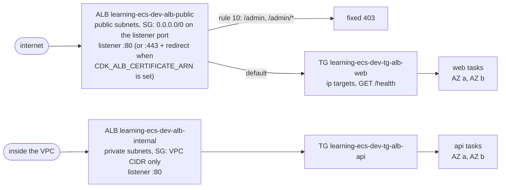

<!-- TOC -->

- [Module 04 - ALB (internet-facing and internal Application Load Balancers)](#module-04---alb-internet-facing-and-internal-application-load-balancers)
  - [Overview](#overview)
  - [What you will learn](#what-you-will-learn)
  - [Architecture](#architecture)
  - [AWS services and CDK constructs used](#aws-services-and-cdk-constructs-used)
  - [Configuration](#configuration)
  - [Prerequisites](#prerequisites)
  - [Tests](#tests)
  - [Deploy with floci (local, free)](#deploy-with-floci-local-free)
  - [Deploy to real AWS (optional)](#deploy-to-real-aws-optional)
  - [Verify](#verify)
    - [List every resource with the AWS CLI](#list-every-resource-with-the-aws-cli)
  - [Manage it with the AWS CLI](#manage-it-with-the-aws-cli)
    - [Listener rules](#listener-rules)
    - [Target groups and health checks](#target-groups-and-health-checks)
    - [An ALB for an ECS service, from scratch](#an-alb-for-an-ecs-service-from-scratch)
  - [Metrics to watch](#metrics-to-watch)
  - [Troubleshooting](#troubleshooting)
  - [floci vs real AWS](#floci-vs-real-aws)
  - [Clean up](#clean-up)
  - [Notes and cautions](#notes-and-cautions)
  - [References](#references)

<!-- TOC -->

# Module 04 - ALB (internet-facing and internal Application Load Balancers)

## Overview

An **Application Load Balancer** (ALB) is the usual front door of an HTTP
service on ECS. It spreads requests across the service's tasks, sends
traffic only to targets that pass its health check, and routes by path,
host, header or query string. ECS keeps the ALB's **target group** in sync
for you: every task it starts is registered (with its own IP - the
`awsvpc` network mode gives each task one), every task it stops is drained
and deregistered first.

This module runs two services from the Docker Hub image
[`traefik/whoami`](https://hub.docker.com/r/traefik/whoami) - a tiny web
server that answers with its own hostname and the request it received - so
you can *see* the load balancing:

- **`web`**, behind an **internet-facing** ALB in the public subnets;
- **`api`**, behind an **internal** ALB in the private subnets, reachable
  only from inside the VPC - the classic way to expose a backend to other
  services.

## What you will learn

- Internet-facing vs internal ALBs: scheme, subnets, security groups.
- Listeners, default actions and **listener rules** (here: a fixed `403`
  for `/admin*` that never reaches a task).
- Target groups for ECS (`ip` target type), **health checks** and
  **deregistration delay** (connection draining).
- The service's `healthCheckGracePeriodSeconds`.
- Optional HTTPS with an ACM certificate and an HTTP-to-HTTPS redirect, and
  access logs to S3.
- How a failing health check takes a task out of rotation - and, on AWS,
  makes ECS replace it.

## Architecture



<details>
<summary>Plain-text version (names and details)</summary>

```
 internet ──> ALB learning-ecs-dev-alb-public  (public subnets, SG: 0.0.0.0/0 on the listener port)
                 listener :80  (or :443 + redirect when CDK_ALB_CERTIFICATE_ARN is set)
                   rule 10: /admin, /admin/*  -> fixed 403
                   default                    -> TG learning-ecs-dev-tg-alb-web (ip targets, GET /health)
                                                  -> web tasks (AZ a, AZ b)

 inside the VPC ──> ALB learning-ecs-dev-alb-internal  (private subnets, SG: VPC CIDR only)
                      listener :80 -> TG learning-ecs-dev-tg-alb-api -> api tasks (AZ a, AZ b)
```

</details>

## AWS services and CDK constructs used

| AWS service | CDK construct (Python) | Level |
|---|---|---|
| Elastic Load Balancing | `aws_cdk.aws_elasticloadbalancingv2.ApplicationLoadBalancer` | L2 |
| Elastic Load Balancing | `ApplicationListener.add_targets`, `add_action`, `ListenerAction`, `ListenerCondition` | L2 |
| Elastic Load Balancing | `aws_cdk.aws_elasticloadbalancingv2.HealthCheck` | L2 (helper) |
| AWS Certificate Manager | `aws_cdk.aws_certificatemanager.Certificate.from_certificate_arn` (optional) | L2 |
| Amazon S3 | `aws_cdk.aws_s3.Bucket` (optional access logs) | L2 |
| Amazon ECS | `aws_cdk.aws_ecs.FargateService` (via `shared/ecs.py` `fargate_service()`) | L2 |

## Configuration

| Variable | Default | Effect |
|---|---|---|
| `CDK_ALB_IMAGE` | `traefik/whoami:v1.12.0` | image of both services |
| `CDK_ALB_DESIRED_COUNT` | `CDK_DESIRED_COUNT` (`2`) | tasks per service |
| `CDK_PORT_ALB_PUBLIC` | `80` (`.env.example`: `8081`) | public listener port |
| `CDK_PORT_ALB_INTERNAL` | `80` (`.env.example`: `8082`) | internal listener port |
| `CDK_ALB_CERTIFICATE_ARN` | unset | ACM certificate ARN: HTTPS on 443 + redirect (real AWS) |
| `CDK_ALB_ACCESS_LOGS` | `false` | access logs of both ALBs to a new S3 bucket (needs a concrete region at synth time) |

## Prerequisites

- [Module 02](../02_fargate_service/README.md) (services, task definitions).
- floci running and `.env` loaded. `docker-compose.yml` publishes ports
  `8080-8099`, so the listeners are reachable from your machine.

## Tests

[`../../tests/unit/test_04_alb.py`](../../tests/unit/test_04_alb.py) checks
both schemes, the listener ports (default and configured), `ip` targets
with the `/health` check and a 30 s deregistration delay, the `/admin`
fixed-response rule, that the internal ALB only accepts the VPC's CIDR,
HTTPS + redirect when a certificate is given, optional access logs, the
ECS service <-> target group wiring, and the mandatory tags:

```bash
uv run pytest tests/unit/test_04_alb.py -v
```

## Deploy with floci (local, free)

```bash
uv run cdk bootstrap
uv run cdk synth AlbStack
uv run cdk diff AlbStack
uv run cdk deploy AlbStack --require-approval never --method=direct
```

## Deploy to real AWS (optional)

**Each ALB bills per hour plus per LCU, and four Fargate tasks and a NAT
Gateway run** - see [Elastic Load Balancing pricing](https://aws.amazon.com/elasticloadbalancing/pricing/).

```bash
unset AWS_ENDPOINT_URL
unset CDK_PORT_ALB_PUBLIC CDK_PORT_ALB_INTERNAL   # back to port 80 (REQUIREMENTS.md section 9.2)
uv run cdk bootstrap --profile <your-aws-cli-profile>
uv run cdk diff AlbStack --profile <your-aws-cli-profile>
uv run cdk deploy AlbStack --profile <your-aws-cli-profile>
# With HTTPS: CDK_ALB_CERTIFICATE_ARN=arn:aws:acm:<region>:<account>:certificate/<id> uv run cdk deploy AlbStack ...
```

## Verify

```bash
URL=$(aws cloudformation describe-stacks --stack-name AlbStack \
  --query "Stacks[0].Outputs[?OutputKey=='PublicUrl'].OutputValue" --output text)
# floci: the listener is published on localhost
[ -n "${AWS_ENDPOINT_URL:-}" ] && URL=http://localhost:${CDK_PORT_ALB_PUBLIC:-8081}/

for i in 1 2 3 4; do curl -s "$URL" | grep -E '^(Name|Hostname)'; done   # alternates between the two web tasks
curl -s -o /dev/null -w '%{http_code}\n' "${URL}admin"                    # 403, from the rule
curl -s "${URL}api" | head -c 300; echo                                    # whoami's JSON endpoint
```

The internal ALB answers only from inside the VPC. On floci, any container
on the `learning-ecs-floci-net` network that uses floci as its DNS server
resolves the ALB's name (this is what ECS tasks get automatically):

```bash
INTERNAL=$(aws cloudformation describe-stacks --stack-name AlbStack \
  --query "Stacks[0].Outputs[?OutputKey=='InternalUrl'].OutputValue" --output text)
FLOCI_IP=$(docker inspect learning-ecs-floci --format '{{(index .NetworkSettings.Networks "learning-ecs-floci-net").IPAddress}}')
docker run --rm --network learning-ecs-floci-net --dns "$FLOCI_IP" curlimages/curl:8.22.0 -s "$INTERNAL" | grep -E '^(Name|Hostname)'
```

On real AWS, run the same `curl` from inside the VPC - for example as a
one-off task ([module 02](../02_fargate_service/README.md#one-off-tasks-and-stopping-tasks))
in the `nginx:1.30-alpine` image (it has busybox `wget`) with `--overrides`
running `wget -qO- $INTERNAL`, or with ECS Exec into any task that has a shell.

Target health, the ALB's own view of the tasks:

```bash
TG=$(aws elbv2 describe-target-groups --names learning-ecs-dev-tg-alb-web --query 'TargetGroups[0].TargetGroupArn' --output text)
aws elbv2 describe-target-health --target-group-arn "$TG" \
  --query 'TargetHealthDescriptions[].[Target.Id,Target.Port,TargetHealth.State,TargetHealth.Reason]' --output table
```

<!-- BEGIN resource-commands (generated by scripts/resource_commands.py) -->
### List every resource with the AWS CLI

Every resource this stack creates, one `aws` command each, parametrized
by environment (`ENV`), region (`REGION`) and - where a command builds an
ARN - account (`ACCOUNT`): set them to match your deployment, with your
`.env` loaded (floci) or your AWS profile active (real AWS). A resource
without a name of its own is looked up through the stack by its *logical
id* (`pid <LogicalId>`), which is the same in every environment. This block
is generated from the stack's template by
[`scripts/resource_commands.py`](../../scripts/resource_commands.py) - see
[`../../REQUIREMENTS.md`, section 5.8](../../REQUIREMENTS.md#58---listing-every-resource-a-stack-created);
`make cdk-resources STACK=AlbStack` runs the same commands for you.

```bash
# Match these to your deployment: CDK_PRODUCT and CDK_ENVIRONMENT in .env, and
# the region you deployed to (floci: the one in .env).
PRODUCT=learning-ecs ENV=dev REGION=us-east-1
STACK=AlbStack
# Physical id of one of the stack's resources, by its logical id - the same in
# every environment. A second argument names another (e.g. nested) stack.
pid() { aws cloudformation describe-stack-resource --stack-name "${2:-$STACK}" \
  --logical-resource-id "$1" --region "$REGION" \
  --query StackResourceDetail.PhysicalResourceId --output text; }

# Every resource the stack created - type, logical id, physical id, status:
aws cloudformation describe-stack-resources --stack-name "$STACK" --region "$REGION" \
  --query "StackResources[].[ResourceType,LogicalResourceId,PhysicalResourceId,ResourceStatus]" \
  --output table

# AWS::EC2::VPC (Vpc8378EB38)
aws ec2 describe-vpcs --vpc-ids "$(pid Vpc8378EB38)" --query "Vpcs[].[VpcId,CidrBlock,State]" --output table --region "$REGION"
# AWS::ECS::Cluster (ClusterEB0386A7)
aws ecs describe-clusters --clusters "${PRODUCT}-${ENV}-ecs-alb" --query "clusters[].[clusterName,status]" --output table --region "$REGION"
# AWS::IAM::Role (WebTaskDefinitionTaskRole2EE1C0E7)
aws iam get-role --role-name "$(pid WebTaskDefinitionTaskRole2EE1C0E7)" --query "Role.[RoleName,Arn]" --output table --region "$REGION"
# AWS::ECS::TaskDefinition (WebTaskDefinition8DF7C630)
aws ecs describe-task-definition --task-definition "$(pid WebTaskDefinition8DF7C630)" --query "taskDefinition.[family,revision,status]" --output table --region "$REGION"
# AWS::IAM::Role (WebTaskDefinitionExecutionRole225B46C9)
aws iam get-role --role-name "$(pid WebTaskDefinitionExecutionRole225B46C9)" --query "Role.[RoleName,Arn]" --output table --region "$REGION"
# AWS::Logs::LogGroup (WebLogGroup68B8CF3C)
aws logs describe-log-groups --log-group-name-prefix "/ecs/${PRODUCT}/${ENV}/alb-web" --query "logGroups[].[logGroupName,retentionInDays]" --output table --region "$REGION"
# AWS::ECS::Service (WebService7F8A1763)
aws ecs describe-services --cluster "${PRODUCT}-${ENV}-ecs-alb" --services "${PRODUCT}-${ENV}-alb-web" --query "services[].[serviceName,status,desiredCount]" --output table --region "$REGION"
# AWS::EC2::SecurityGroup (WebServiceSecurityGroupE736A6BB)
aws ec2 describe-security-groups --group-ids "$(pid WebServiceSecurityGroupE736A6BB)" --query "SecurityGroups[].[GroupId,GroupName,VpcId]" --output table --region "$REGION"
# AWS::IAM::Role (ApiTaskDefinitionTaskRole7EE87BD7)
aws iam get-role --role-name "$(pid ApiTaskDefinitionTaskRole7EE87BD7)" --query "Role.[RoleName,Arn]" --output table --region "$REGION"
# AWS::ECS::TaskDefinition (ApiTaskDefinition51EA709E)
aws ecs describe-task-definition --task-definition "$(pid ApiTaskDefinition51EA709E)" --query "taskDefinition.[family,revision,status]" --output table --region "$REGION"
# AWS::IAM::Role (ApiTaskDefinitionExecutionRoleA3303016)
aws iam get-role --role-name "$(pid ApiTaskDefinitionExecutionRoleA3303016)" --query "Role.[RoleName,Arn]" --output table --region "$REGION"
# AWS::Logs::LogGroup (ApiLogGroup1DEDFC07)
aws logs describe-log-groups --log-group-name-prefix "/ecs/${PRODUCT}/${ENV}/alb-api" --query "logGroups[].[logGroupName,retentionInDays]" --output table --region "$REGION"
# AWS::ECS::Service (ApiServiceC9037CF0)
aws ecs describe-services --cluster "${PRODUCT}-${ENV}-ecs-alb" --services "${PRODUCT}-${ENV}-alb-api" --query "services[].[serviceName,status,desiredCount]" --output table --region "$REGION"
# AWS::EC2::SecurityGroup (ApiServiceSecurityGroupA2426F91)
aws ec2 describe-security-groups --group-ids "$(pid ApiServiceSecurityGroupA2426F91)" --query "SecurityGroups[].[GroupId,GroupName,VpcId]" --output table --region "$REGION"
# AWS::ElasticLoadBalancingV2::LoadBalancer (PublicAlb84330974)
aws elbv2 describe-load-balancers --load-balancer-arns "$(pid PublicAlb84330974)" --query "LoadBalancers[].[LoadBalancerName,Type,State.Code]" --output table --region "$REGION"
# AWS::EC2::SecurityGroup (PublicAlbSecurityGroup66576C5F)
aws ec2 describe-security-groups --group-ids "$(pid PublicAlbSecurityGroup66576C5F)" --query "SecurityGroups[].[GroupId,GroupName,VpcId]" --output table --region "$REGION"
# AWS::ElasticLoadBalancingV2::Listener (PublicAlbHttpA2F180B8)
aws elbv2 describe-listeners --listener-arns "$(pid PublicAlbHttpA2F180B8)" --query "Listeners[].[Port,Protocol]" --output table --region "$REGION"
# AWS::ElasticLoadBalancingV2::TargetGroup (PublicAlbHttpWebGroup244C4830)
aws elbv2 describe-target-groups --target-group-arns "$(pid PublicAlbHttpWebGroup244C4830)" --query "TargetGroups[].[TargetGroupName,Port,TargetType]" --output table --region "$REGION"
# AWS::ElasticLoadBalancingV2::LoadBalancer (InternalAlb58CEEAE8)
aws elbv2 describe-load-balancers --load-balancer-arns "$(pid InternalAlb58CEEAE8)" --query "LoadBalancers[].[LoadBalancerName,Type,State.Code]" --output table --region "$REGION"
# AWS::EC2::SecurityGroup (InternalAlbSecurityGroupE48A078F)
aws ec2 describe-security-groups --group-ids "$(pid InternalAlbSecurityGroupE48A078F)" --query "SecurityGroups[].[GroupId,GroupName,VpcId]" --output table --region "$REGION"
# AWS::ElasticLoadBalancingV2::Listener (InternalAlbHttpF310D5DF)
aws elbv2 describe-listeners --listener-arns "$(pid InternalAlbHttpF310D5DF)" --query "Listeners[].[Port,Protocol]" --output table --region "$REGION"
# AWS::ElasticLoadBalancingV2::TargetGroup (InternalAlbHttpApiGroupFADB4F66)
aws elbv2 describe-target-groups --target-group-arns "$(pid InternalAlbHttpApiGroupFADB4F66)" --query "TargetGroups[].[TargetGroupName,Port,TargetType]" --output table --region "$REGION"
# Also created - listed in the table above:
#   11 VPC sub-resources (subnets, route tables, gateways, endpoints) - built by shared/network.py, listed one by one in modules/01_network/README.md
#   AWS::ECS::ClusterCapacityProviderAssociations Cluster3DA9CCBA - shown by its ECS cluster (describe-clusters --include ATTACHMENTS)
#   AWS::IAM::Policy WebTaskDefinitionTaskRoleDefaultPolicyD1A8300E - shown by its IAM role
#   AWS::IAM::Policy WebTaskDefinitionExecutionRoleDefaultPolicy5D8A2D6F - shown by its IAM role
#   AWS::EC2::SecurityGroupIngress WebServiceSecurityGroupfromAlbStackPublicAlbSecurityGroup513446788082E32087 - shown by its security group
#   AWS::IAM::Policy ApiTaskDefinitionTaskRoleDefaultPolicyA678CF9F - shown by its IAM role
#   AWS::IAM::Policy ApiTaskDefinitionExecutionRoleDefaultPolicy5B03B3DE - shown by its IAM role
#   AWS::EC2::SecurityGroupIngress ApiServiceSecurityGroupfromAlbStackInternalAlbSecurityGroup7FDDB7088056D17806 - shown by its security group
#   AWS::EC2::SecurityGroupEgress PublicAlbSecurityGrouptoAlbStackWebServiceSecurityGroupF1D5D7FE8021838C63 - shown by its security group
#   AWS::ElasticLoadBalancingV2::ListenerRule PublicAlbHttpBlockAdminRule07FABD79 - shown by its listener (elbv2 describe-rules)
#   AWS::EC2::SecurityGroupEgress InternalAlbSecurityGrouptoAlbStackApiServiceSecurityGroup4C0C00F080CDBFB875 - shown by its security group
```
<!-- END resource-commands -->

## Manage it with the AWS CLI

All commands below were run against floci while writing this module.

### Listener rules

```bash
LB=$(aws elbv2 describe-load-balancers --names learning-ecs-dev-alb-public --query 'LoadBalancers[0].LoadBalancerArn' --output text)
LISTENER=$(aws elbv2 describe-listeners --load-balancer-arn "$LB" --query 'Listeners[0].ListenerArn' --output text)
aws elbv2 describe-rules --listener-arn "$LISTENER" \
  --query 'Rules[].[Priority,Conditions[0].Field,Actions[0].Type]' --output table

# create: a header-based rule
RULE=$(aws elbv2 create-rule --listener-arn "$LISTENER" --priority 20 \
  --conditions Field=http-header,HttpHeaderConfig='{HttpHeaderName=X-Debug,Values=[true]}' \
  --actions Type=fixed-response,FixedResponseConfig='{StatusCode=200,ContentType=text/plain,MessageBody=debug-ok}' \
  --query 'Rules[0].RuleArn' --output text)
curl -s -H 'X-Debug: true' "$URL"; echo

# update: change its condition, then its priority (lower number = evaluated first)
aws elbv2 modify-rule --rule-arn "$RULE" --conditions Field=path-pattern,Values='/debug'
aws elbv2 set-rule-priorities --rule-priorities RuleArn="$RULE",Priority=5

# delete
aws elbv2 delete-rule --rule-arn "$RULE"
```

### Target groups and health checks

```bash
TG=$(aws elbv2 describe-target-groups --names learning-ecs-dev-tg-alb-web --query 'TargetGroups[0].TargetGroupArn' --output text)
aws elbv2 modify-target-group --target-group-arn "$TG" \
  --health-check-path /health --health-check-interval-seconds 10 --healthy-threshold-count 2
aws elbv2 modify-target-group-attributes --target-group-arn "$TG" \
  --attributes Key=deregistration_delay.timeout_seconds,Value=15
aws elbv2 describe-target-group-attributes --target-group-arn "$TG" --output table

# Load balancer attributes (idle timeout, access logs, ...)
aws elbv2 modify-load-balancer-attributes --load-balancer-arn "$LB" \
  --attributes Key=idle_timeout.timeout_seconds,Value=120
```

See a health check fail - `whoami` lets you flip its `/health` answer with
a `POST` (it reaches one task, picked by the ALB):

```bash
curl -s -X POST -d '500' "${URL}health"
aws elbv2 describe-target-health --target-group-arn "$TG" \
  --query 'TargetHealthDescriptions[].[Target.Id,TargetHealth.State,TargetHealth.Reason]' --output table
# -> one target "unhealthy  Target.ResponseCodeMismatch"; requests now go only to the other task.
```

On real AWS, ECS then starts a replacement and stops the unhealthy task
(it replaces tasks that fail a load balancer health check - see the
service scheduler notes in [Update Amazon ECS service parameters](https://docs.aws.amazon.com/AmazonECS/latest/developerguide/update-service-parameters.html)); on floci the task
just stays out of rotation (see [floci vs real AWS](#floci-vs-real-aws)).

### An ALB for an ECS service, from scratch

The same wiring the CDK does, by hand - a security group, an ALB, a target
group, a listener, and a service that registers into the target group.
Reuses this module's VPC, subnets and task definition:

```bash
NET=$(aws ecs describe-services --cluster learning-ecs-dev-ecs-alb --services learning-ecs-dev-alb-web \
  --query 'services[0].networkConfiguration.awsvpcConfiguration' --output json)
SUBNETS=$(echo "$NET" | jq -r '.subnets|join(",")'); TASK_SG=$(echo "$NET" | jq -r '.securityGroups[0]')
VPC_ID=$(aws ec2 describe-security-groups --group-ids "$TASK_SG" --query 'SecurityGroups[0].VpcId' --output text)
PUB_SUBNETS=$(aws elbv2 describe-load-balancers --names learning-ecs-dev-alb-public \
  --query 'LoadBalancers[0].AvailabilityZones[].SubnetId' --output text)
PORT=8099   # floci: a free port in 8080-8099; real AWS: 80

# create
LB_SG=$(aws ec2 create-security-group --group-name learning-ecs-dev-alb-manual --description "manual ALB" \
  --vpc-id "$VPC_ID" --query GroupId --output text)
aws ec2 authorize-security-group-ingress --group-id "$LB_SG" --protocol tcp --port "$PORT" --cidr 0.0.0.0/0
aws ec2 authorize-security-group-ingress --group-id "$TASK_SG" --protocol tcp --port 80 --source-group "$LB_SG"
LB2=$(aws elbv2 create-load-balancer --name learning-ecs-dev-alb-manual --type application --scheme internet-facing \
  --subnets $PUB_SUBNETS --security-groups "$LB_SG" --query 'LoadBalancers[0].LoadBalancerArn' --output text)
TG2=$(aws elbv2 create-target-group --name learning-ecs-dev-tg-manual --protocol HTTP --port 80 --vpc-id "$VPC_ID" \
  --target-type ip --health-check-path /health --health-check-interval-seconds 15 \
  --healthy-threshold-count 2 --unhealthy-threshold-count 3 --query 'TargetGroups[0].TargetGroupArn' --output text)
L2=$(aws elbv2 create-listener --load-balancer-arn "$LB2" --protocol HTTP --port "$PORT" \
  --default-actions Type=forward,TargetGroupArn="$TG2" --query 'Listeners[0].ListenerArn' --output text)
TD=$(aws ecs describe-services --cluster learning-ecs-dev-ecs-alb --services learning-ecs-dev-alb-web \
  --query 'services[0].taskDefinition' --output text)
aws ecs create-service --cluster learning-ecs-dev-ecs-alb --service-name web-manual --task-definition "$TD" \
  --desired-count 2 --capacity-provider-strategy capacityProvider=FARGATE,weight=1 \
  --network-configuration "awsvpcConfiguration={subnets=[${SUBNETS}],securityGroups=[${TASK_SG}],assignPublicIp=DISABLED}" \
  --load-balancers "targetGroupArn=${TG2},containerName=app,containerPort=80" \
  --health-check-grace-period-seconds 30
aws elbv2 describe-target-health --target-group-arn "$TG2"

# delete (service first: it deregisters its targets)
aws ecs delete-service --cluster learning-ecs-dev-ecs-alb --service web-manual --force
aws ecs wait services-inactive --cluster learning-ecs-dev-ecs-alb --services web-manual
aws elbv2 delete-listener --listener-arn "$L2"
aws elbv2 delete-target-group --target-group-arn "$TG2"
aws elbv2 delete-load-balancer --load-balancer-arn "$LB2"
aws ec2 revoke-security-group-ingress --group-id "$TASK_SG" --protocol tcp --port 80 --source-group "$LB_SG"
aws ec2 delete-security-group --group-id "$LB_SG"
```

For a service that uses rolling updates, `update-service --load-balancers`
can also add, change or remove target groups later (ECS starts new tasks
with the new configuration, then stops the old ones; an empty list removes
them) - see [Update Amazon ECS service parameters](https://docs.aws.amazon.com/AmazonECS/latest/developerguide/update-service-parameters.html).

## Metrics to watch

`AWS/ApplicationELB`, reported every 60 s while requests flow (health
checks are excluded). The dimension values are the last part of the ARNs:
`LoadBalancer=app/<name>/<id>`, `TargetGroup=targetgroup/<name>/<id>`.

| Metric | Statistic | What it tells you |
|---|---|---|
| `RequestCount` | Sum | traffic |
| `TargetResponseTime` | Average, p95/p99 | latency of your tasks (seconds) |
| `HTTPCode_Target_5XX_Count` | Sum | errors from your tasks |
| `HTTPCode_ELB_5XX_Count` (`502`, `503`, `504`) | Sum | errors from the ALB itself - no registered targets (503), connection reset/closed or malformed response (502), connect or idle timeout (504) |
| `UnHealthyHostCount` / `HealthyHostCount` | Minimum / Average | AWS recommends alarming on `UnHealthyHostCount` `Minimum` > 0 for more than one datapoint |
| `RequestCountPerTarget` | Sum (it is already an average) | the input of request-based autoscaling ([module 16](../16_autoscaling/README.md)) |
| `TargetConnectionErrorCount` | Sum | ALB couldn't connect to a task (security group, task stopping) |

```bash
LB_DIM=$(aws elbv2 describe-load-balancers --names learning-ecs-dev-alb-public \
  --query 'LoadBalancers[0].LoadBalancerArn' --output text | cut -d/ -f2-)
TG_DIM=$(echo "$TG" | cut -d: -f6)
aws cloudwatch get-metric-statistics --namespace AWS/ApplicationELB --metric-name TargetResponseTime \
  --dimensions Name=LoadBalancer,Value="$LB_DIM" Name=TargetGroup,Value="$TG_DIM" \
  --start-time "$(date -u -d '-1 hour' +%Y-%m-%dT%H:%M:%SZ)" --end-time "$(date -u +%Y-%m-%dT%H:%M:%SZ)" \
  --period 60 --extended-statistics p95 p99 --output table
```

Full catalog and dashboards: [`../../docs/METRICS.md`](../../docs/METRICS.md),
[module 19](../19_cloudwatch/README.md).

## Troubleshooting

| Symptom | Where to look | Typical cause / fix |
|---|---|---|
| `503` from the ALB | `describe-target-health` | the target group has no registered targets (no running tasks). If *all* targets are unhealthy the ALB still routes to them (fail open), so you see the app's errors instead |
| Targets `unhealthy`, reason `Target.ResponseCodeMismatch` | health check path/codes | the app answers the health path with another status - fix the path or `healthy_http_codes` |
| Targets `unhealthy`, reason `Target.Timeout` | security groups | the task's security group doesn't allow the ALB's security group on the container port (the CDK adds that rule for you) or the app listens on another port |
| `502 Bad Gateway` | access logs (`elb_status_code`/`target_status_code`), app logs | the task closed the connection or sent an invalid response; app keep-alive shorter than the ALB idle timeout |
| `504 Gateway Timeout` | `TargetResponseTime`, security groups | the ALB couldn't connect within 10 s, or the task didn't answer within the idle timeout |
| Tasks killed right after start, service events mention ELB health checks | `healthCheckGracePeriodSeconds` | the app needs longer to start than the grace period |
| Deployments slow to finish | `deregistration_delay.timeout_seconds` | ECS waits for the drain; the AWS default is 300 s - this module uses 30 s |
| Internal ALB unreachable | its security group | only the VPC CIDR is allowed here; add peered/on-prem ranges explicitly |

More: [`../../docs/TROUBLESHOOTING.md`](../../docs/TROUBLESHOOTING.md) and
[Troubleshoot your Application Load Balancers](https://docs.aws.amazon.com/elasticloadbalancing/latest/application/load-balancer-troubleshooting.html).

## floci vs real AWS

| Behavior | floci 2.1.0 | Real AWS |
|---|---|---|
| ALB, listeners, rules, target groups, target registration by ECS | created and working; requests are load balanced across tasks | same |
| Listener address | floci's container (`localhost:<port>` from your machine; `*.elb.floci` resolves to floci from tasks) - one unique port per listener (`CDK_PORT_*`) | each ALB has its own DNS name and IPs; many ALBs can use port 80 |
| `internal` scheme | **not enforced** - the listener is reachable from your machine too | no public IPs, VPC only |
| Health checks | run; failing targets leave rotation with AWS's reason codes | same |
| ECS replacing tasks that fail ELB health checks | **no** | yes |
| `LoadBalancerAttributes` / `TargetGroupAttributes` from CloudFormation (access logs, idle timeout, drop invalid headers, deregistration delay) | **ignored** - the values stay at floci's defaults; `modify-*-attributes` from the CLI works | applied |
| HTTPS listener | not exercised here (needs a real ACM certificate) | works with `CDK_ALB_CERTIFICATE_ARN` |
| `AWS/ApplicationELB` metrics, access logs | not produced | produced |

## Clean up

```bash
uv run cdk destroy AlbStack
uv run python scripts/floci_prune.py --apply   # floci only (REQUIREMENTS.md section 5.7)
```

## Notes and cautions

- **Cost**: see [Deploy to real AWS](#deploy-to-real-aws-optional).
- **`open=True`** on the public listener adds a `0.0.0.0/0` ingress rule -
  that's what "internet-facing" means. Put AWS WAF in front of public ALBs
  in production (not covered by this path).
- **One ALB per service doesn't scale.** At scale you share an ALB between
  services with host/path rules (up to the quotas in
  [Quotas for your Application Load Balancers](https://docs.aws.amazon.com/elasticloadbalancing/latest/application/load-balancer-limits.html))
  and use Service Connect ([module 08](../08_service_connect/README.md))
  for service-to-service traffic.
- **HTTPS**: the certificate must be in ACM in the same region as the ALB
  (CloudFront certificates live in `us-east-1` - [module 07](../07_cloudfront/README.md)).

## References

- [Use an Application Load Balancer for Amazon ECS](https://docs.aws.amazon.com/AmazonECS/latest/developerguide/alb.html)
- [What is an Application Load Balancer?](https://docs.aws.amazon.com/elasticloadbalancing/latest/application/introduction.html)
- [Listener rules for your Application Load Balancer](https://docs.aws.amazon.com/elasticloadbalancing/latest/application/listener-rules.html)
- [Health checks for Application Load Balancer target groups](https://docs.aws.amazon.com/elasticloadbalancing/latest/application/target-group-health-checks.html)
- [CloudWatch metrics for your Application Load Balancer](https://docs.aws.amazon.com/elasticloadbalancing/latest/application/load-balancer-cloudwatch-metrics.html)
- [Access logs for your Application Load Balancer](https://docs.aws.amazon.com/elasticloadbalancing/latest/application/enable-access-logging.html)
- [Troubleshoot your Application Load Balancers](https://docs.aws.amazon.com/elasticloadbalancing/latest/application/load-balancer-troubleshooting.html)
- [Elastic Load Balancing pricing](https://aws.amazon.com/elasticloadbalancing/pricing/)
- [AWS CDK API Reference (Python) - `aws_cdk.aws_elasticloadbalancingv2`](https://docs.aws.amazon.com/cdk/api/v2/python/aws_cdk.aws_elasticloadbalancingv2/README.html)
- [AWS CLI Command Reference - `elbv2`](https://docs.aws.amazon.com/cli/latest/reference/elbv2/)
- [traefik/whoami on GitHub](https://github.com/traefik/whoami) · [Docker Hub - traefik/whoami](https://hub.docker.com/r/traefik/whoami)
