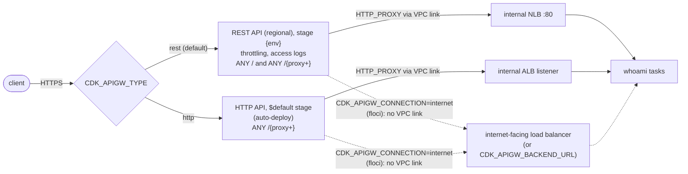

<!-- TOC -->

- [Module 06 - API Gateway (REST API or HTTP API in front of ECS)](#module-06---api-gateway-rest-api-or-http-api-in-front-of-ecs)
  - [Overview](#overview)
  - [What you will learn](#what-you-will-learn)
  - [Architecture](#architecture)
  - [REST API or HTTP API?](#rest-api-or-http-api)
  - [AWS services and CDK constructs used](#aws-services-and-cdk-constructs-used)
  - [Configuration](#configuration)
  - [Prerequisites](#prerequisites)
  - [Tests](#tests)
  - [Deploy with floci (local, free)](#deploy-with-floci-local-free)
  - [Deploy to real AWS (optional)](#deploy-to-real-aws-optional)
  - [Verify](#verify)
    - [List every resource with the AWS CLI](#list-every-resource-with-the-aws-cli)
  - [Manage it with the AWS CLI](#manage-it-with-the-aws-cli)
    - [A REST API with an HTTP proxy integration](#a-rest-api-with-an-http-proxy-integration)
    - [Private integrations (VPC links) - real AWS](#private-integrations-vpc-links---real-aws)
  - [Metrics to watch](#metrics-to-watch)
  - [Troubleshooting](#troubleshooting)
  - [floci vs real AWS](#floci-vs-real-aws)
  - [Clean up](#clean-up)
  - [Notes and cautions](#notes-and-cautions)
  - [References](#references)

<!-- TOC -->

# Module 06 - API Gateway (REST API or HTTP API in front of ECS)

## Overview

**Amazon API Gateway** is a managed API front door: authentication,
throttling, API keys and usage plans, request validation, custom domains,
access logs - in front of whatever runs your code. For ECS, the backend is
a load balancer, and the clean way to wire them is a **private
integration**: the load balancer stays *internal* (no internet exposure)
and API Gateway reaches it through a **VPC link**.

This module builds that, two ways, chosen with `CDK_APIGW_TYPE`:

- **`rest`** (default) - a **REST API** with a `{proxy+}` resource whose
  integration goes through a **VPC link** (the CDK's `apigateway.VpcLink`,
  a "VPC link V1") to an internal **NLB**;
- **`http`** - an **HTTP API** whose integration goes through a VPC link to
  an internal **ALB** listener.

Behind both: a Fargate service running `traefik/whoami`, which echoes the
request it received - handy to see exactly what API Gateway forwards.

## What you will learn

- Private integrations and VPC links (V1 for REST APIs to NLBs, V2 for HTTP
  APIs - and, newer, for REST APIs too).
- A REST API `{proxy+}` resource with an `HTTP_PROXY` integration and the
  `integration.request.path.proxy` mapping.
- Stage throttling (rate/burst), access logs to CloudWatch Logs, detailed
  metrics.
- REST API vs HTTP API: what each one offers.
- How to invoke, inspect and change an API from the CLI.

## Architecture



<details>
<summary>Plain-text version (names and details)</summary>

```
 CDK_APIGW_TYPE=rest, CDK_APIGW_CONNECTION=vpc_link (default)
   client --HTTPS--> REST API (regional) stage <env>  [throttling, access logs]
                       ANY /  and  ANY /{proxy+}  --HTTP_PROXY via VPC link-->  internal NLB :80
                                                                                   -> whoami tasks

 CDK_APIGW_TYPE=http
   client --HTTPS--> HTTP API  $default stage (auto-deploy)
                       ANY /{proxy+} --HTTP_PROXY via VPC link--> internal ALB listener -> whoami tasks

 CDK_APIGW_CONNECTION=internet (floci): same, but the load balancer is internet-facing and
 API Gateway calls its URL (or CDK_APIGW_BACKEND_URL) - no VPC link.
```

</details>

## REST API or HTTP API?

From AWS's comparison ([Choose between REST APIs and HTTP APIs](https://docs.aws.amazon.com/apigateway/latest/developerguide/http-api-vs-rest.html)) -
"REST APIs support more features than HTTP APIs, while HTTP APIs are
designed with minimal features so that they can be offered at a lower price":

| Feature | REST API | HTTP API |
|---|---|---|
| Endpoint types | edge-optimized, regional, private | regional |
| API keys, per-client rate limiting and usage throttling | yes | no |
| AWS WAF, resource policies | yes | no |
| Caching, request validation, body transformation, canary release deployments | yes | no |
| JWT authorizer | no (use a Lambda authorizer) | yes |
| Automatic deployments | no | yes |
| Execution logs, X-Ray tracing | yes | no |
| Private integrations with NLB / ALB / Cloud Map | yes / yes / no | yes / yes / yes |

## AWS services and CDK constructs used

| AWS service | CDK construct (Python) | Level |
|---|---|---|
| Amazon API Gateway (REST) | `aws_cdk.aws_apigateway.RestApi`, `Integration`, `VpcLink`, `StageOptions`, `LogGroupLogDestination` | L2 |
| Amazon API Gateway (HTTP) | `aws_cdk.aws_apigatewayv2.HttpApi`, `aws_cdk.aws_apigatewayv2_integrations.HttpAlbIntegration` / `HttpUrlIntegration` | L2 |
| Elastic Load Balancing | `NetworkLoadBalancer` (REST) / `ApplicationLoadBalancer` (HTTP) | L2 |
| Amazon CloudWatch Logs | `aws_cdk.aws_logs.LogGroup` (access logs) | L2 |
| Amazon ECS | `FargateService` (via `shared/ecs.py`) | L2 |

## Configuration

| Variable | Default | Effect |
|---|---|---|
| `CDK_APIGW_TYPE` | `rest` | `rest` (REST API + NLB) or `http` (HTTP API + ALB) |
| `CDK_APIGW_CONNECTION` | `vpc_link` (`.env.example`: `internet`) | `vpc_link`: internal load balancer behind a VPC link; `internet`: internet-facing load balancer, no VPC link |
| `CDK_APIGW_BACKEND_URL` | the load balancer's URL (`.env.example`: `http://localhost:8085`) | base URL API Gateway calls; on floci it must be floci's own `localhost` (see [floci vs real AWS](#floci-vs-real-aws)) |
| `CDK_APIGW_RATE_LIMIT` / `CDK_APIGW_BURST_LIMIT` | `100` / `200` | REST stage throttling (requests per second / burst) |
| `CDK_APIGW_ACCESS_LOGS` | `true` | REST stage access logs (creates the account-level CloudWatch role) |
| `CDK_APIGW_DETAILED_METRICS` | `false` | per-method CloudWatch metrics (extra charges) |
| `CDK_APIGW_IMAGE` / `CDK_APIGW_DESIRED_COUNT` | `traefik/whoami:v1.12.0` / `2` | the backend service |
| `CDK_PORT_API_GATEWAY` | `80` (`.env.example`: `8085`) | the load balancer's listener port |

## Prerequisites

Modules [04](../04_alb/README.md) and [05](../05_nlb/README.md). floci
running and `.env` loaded.

## Tests

[`../../tests/unit/test_06_api_gateway.py`](../../tests/unit/test_06_api_gateway.py)
checks the default REST API + VPC link + internal NLB with the `{proxy+}`
method and its path mapping, the stage's throttling/detailed metrics/access
logs (and turning access logs off), the `internet` connection (public NLB,
no VPC link), the backend URL override, the HTTP API + VPC link + internal
ALB variant, the rejection of invalid choices, and the mandatory tags:

```bash
uv run pytest tests/unit/test_06_api_gateway.py -v
```

## Deploy with floci (local, free)

```bash
uv run cdk bootstrap
uv run cdk synth ApiGatewayStack
uv run cdk diff ApiGatewayStack
uv run cdk deploy ApiGatewayStack --require-approval never --method=direct
# The HTTP API variant (destroy first when switching - REQUIREMENTS.md section 5.6):
#   uv run cdk destroy ApiGatewayStack -f && CDK_APIGW_TYPE=http uv run cdk deploy ApiGatewayStack --require-approval never --method=direct
```

## Deploy to real AWS (optional)

API Gateway bills per request; the load balancer, NAT Gateway and tasks
bill hourly - see [Amazon API Gateway pricing](https://aws.amazon.com/api-gateway/pricing/).

```bash
unset AWS_ENDPOINT_URL CDK_APIGW_CONNECTION CDK_APIGW_BACKEND_URL CDK_PORT_API_GATEWAY   # REQUIREMENTS.md section 9.2
uv run cdk bootstrap --profile <your-aws-cli-profile>
uv run cdk diff ApiGatewayStack --profile <your-aws-cli-profile>
uv run cdk deploy ApiGatewayStack --profile <your-aws-cli-profile>
```

## Verify

```bash
# Real AWS: the stack output is the invoke URL
URL=$(aws cloudformation describe-stacks --stack-name ApiGatewayStack \
  --query "Stacks[0].Outputs[?OutputKey=='ApiUrl'].OutputValue" --output text)

# floci, REST API: http://localhost:4566/restapis/<api-id>/<stage>/_user_request_/
API_ID=$(aws cloudformation describe-stack-resources --stack-name ApiGatewayStack \
  --query "StackResources[?ResourceType=='AWS::ApiGateway::RestApi'].PhysicalResourceId" --output text)
URL=http://localhost:4566/restapis/$API_ID/dev/_user_request_/
# floci, HTTP API (CDK_APIGW_TYPE=http): http://<api-id>.execute-api.localhost.floci.io:4566/
#   API_ID=$(aws cloudformation describe-stack-resources --stack-name ApiGatewayStack \
#     --query "StackResources[?ResourceType=='AWS::ApiGatewayV2::Api'].PhysicalResourceId" --output text)
#   URL=http://$API_ID.execute-api.localhost.floci.io:4566/

curl -s "${URL}orders/42?expand=items" | grep -E '^(Name|GET|Host|X-)'
# -> "GET /orders/42?expand=items" reached the task: path and query string are proxied.
```

The REST stage's configuration:

```bash
aws apigateway get-stage --rest-api-id "$API_ID" --stage-name dev \
  --query '{deployment:deploymentId,throttling:methodSettings,accessLogs:accessLogSettings}'
aws apigateway get-resources --rest-api-id "$API_ID" --query 'items[].[path,id]' --output table
```

<!-- BEGIN resource-commands (generated by scripts/resource_commands.py) -->
### List every resource with the AWS CLI

Every resource this stack creates, one `aws` command each, parametrized
by environment (`ENV`), region (`REGION`) and - where a command builds an
ARN - account (`ACCOUNT`): set them to match your deployment, with your
`.env` loaded (floci) or your AWS profile active (real AWS). A resource
without a name of its own is looked up through the stack by its *logical
id* (`pid <LogicalId>`), which is the same in every environment. This block
is generated from the stack's template by
[`scripts/resource_commands.py`](../../scripts/resource_commands.py) - see
[`../../REQUIREMENTS.md`, section 5.8](../../REQUIREMENTS.md#58---listing-every-resource-a-stack-created);
`make cdk-resources STACK=ApiGatewayStack` runs the same commands for you.

```bash
# Match these to your deployment: CDK_PRODUCT and CDK_ENVIRONMENT in .env, and
# the region you deployed to (floci: the one in .env).
PRODUCT=learning-ecs ENV=dev REGION=us-east-1
STACK=ApiGatewayStack
# Physical id of one of the stack's resources, by its logical id - the same in
# every environment. A second argument names another (e.g. nested) stack.
pid() { aws cloudformation describe-stack-resource --stack-name "${2:-$STACK}" \
  --logical-resource-id "$1" --region "$REGION" \
  --query StackResourceDetail.PhysicalResourceId --output text; }

# Every resource the stack created - type, logical id, physical id, status:
aws cloudformation describe-stack-resources --stack-name "$STACK" --region "$REGION" \
  --query "StackResources[].[ResourceType,LogicalResourceId,PhysicalResourceId,ResourceStatus]" \
  --output table

# AWS::EC2::VPC (Vpc8378EB38)
aws ec2 describe-vpcs --vpc-ids "$(pid Vpc8378EB38)" --query "Vpcs[].[VpcId,CidrBlock,State]" --output table --region "$REGION"
# AWS::ECS::Cluster (ClusterEB0386A7)
aws ecs describe-clusters --clusters "${PRODUCT}-${ENV}-ecs-apigw" --query "clusters[].[clusterName,status]" --output table --region "$REGION"
# AWS::IAM::Role (ApiTaskDefinitionTaskRole7EE87BD7)
aws iam get-role --role-name "$(pid ApiTaskDefinitionTaskRole7EE87BD7)" --query "Role.[RoleName,Arn]" --output table --region "$REGION"
# AWS::ECS::TaskDefinition (ApiTaskDefinition51EA709E)
aws ecs describe-task-definition --task-definition "$(pid ApiTaskDefinition51EA709E)" --query "taskDefinition.[family,revision,status]" --output table --region "$REGION"
# AWS::IAM::Role (ApiTaskDefinitionExecutionRoleA3303016)
aws iam get-role --role-name "$(pid ApiTaskDefinitionExecutionRoleA3303016)" --query "Role.[RoleName,Arn]" --output table --region "$REGION"
# AWS::Logs::LogGroup (ApiLogGroup1DEDFC07)
aws logs describe-log-groups --log-group-name-prefix "/ecs/${PRODUCT}/${ENV}/apigw-api" --query "logGroups[].[logGroupName,retentionInDays]" --output table --region "$REGION"
# AWS::ECS::Service (ApiServiceC9037CF0)
aws ecs describe-services --cluster "${PRODUCT}-${ENV}-ecs-apigw" --services "${PRODUCT}-${ENV}-apigw-api" --query "services[].[serviceName,status,desiredCount]" --output table --region "$REGION"
# AWS::EC2::SecurityGroup (ApiServiceSecurityGroupA2426F91)
aws ec2 describe-security-groups --group-ids "$(pid ApiServiceSecurityGroupA2426F91)" --query "SecurityGroups[].[GroupId,GroupName,VpcId]" --output table --region "$REGION"
# AWS::EC2::SecurityGroup (NlbSecurityGroup08F7DC4B)
aws ec2 describe-security-groups --group-ids "$(pid NlbSecurityGroup08F7DC4B)" --query "SecurityGroups[].[GroupId,GroupName,VpcId]" --output table --region "$REGION"
# AWS::ElasticLoadBalancingV2::LoadBalancer (NlbBCDB97FE)
aws elbv2 describe-load-balancers --load-balancer-arns "$(pid NlbBCDB97FE)" --query "LoadBalancers[].[LoadBalancerName,Type,State.Code]" --output table --region "$REGION"
# AWS::ElasticLoadBalancingV2::Listener (NlbTcp5D5F6865)
aws elbv2 describe-listeners --listener-arns "$(pid NlbTcp5D5F6865)" --query "Listeners[].[Port,Protocol]" --output table --region "$REGION"
# AWS::ElasticLoadBalancingV2::TargetGroup (NlbTcpTasksGroup6E2C42D7)
aws elbv2 describe-target-groups --target-group-arns "$(pid NlbTcpTasksGroup6E2C42D7)" --query "TargetGroups[].[TargetGroupName,Port,TargetType]" --output table --region "$REGION"
# AWS::Logs::LogGroup (AccessLogs8B620ECA)
aws logs describe-log-groups --log-group-name-prefix "/apigateway/${PRODUCT}/${ENV}/${PRODUCT}-${ENV}-apigw-rest" --query "logGroups[].[logGroupName,retentionInDays]" --output table --region "$REGION"
# AWS::ApiGateway::RestApi (RestApi0C43BF4B)
aws apigateway get-rest-api --rest-api-id "$(pid RestApi0C43BF4B)" --query "[id,name]" --output table --region "$REGION"
# AWS::IAM::Role (RestApiCloudWatchRoleE3ED6605)
aws iam get-role --role-name "$(pid RestApiCloudWatchRoleE3ED6605)" --query "Role.[RoleName,Arn]" --output table --region "$REGION"
# AWS::ApiGateway::Account (RestApiAccount7C83CF5A)
aws apigateway get-account --query "cloudwatchRoleArn" --output table --region "$REGION"
# AWS::ApiGateway::Deployment (RestApiDeployment180EC50334f1066c96a9d36f781a2d06d2c7fef8)
aws apigateway get-deployment --rest-api-id "$(pid RestApi0C43BF4B)" --deployment-id "$(pid RestApiDeployment180EC50334f1066c96a9d36f781a2d06d2c7fef8)" --query "[id,createdDate]" --output table --region "$REGION"
# AWS::ApiGateway::Stage (RestApiDeploymentStagedevDA121244)
aws apigateway get-stage --rest-api-id "$(pid RestApi0C43BF4B)" --stage-name "dev" --query "[stageName,deploymentId]" --output table --region "$REGION"
# AWS::ApiGateway::Resource (RestApiproxyC95856DD)
aws apigateway get-resource --rest-api-id "$(pid RestApi0C43BF4B)" --resource-id "$(pid RestApiproxyC95856DD)" --query "[path,id]" --output table --region "$REGION"
# Also created - listed in the table above:
#   11 VPC sub-resources (subnets, route tables, gateways, endpoints) - built by shared/network.py, listed one by one in modules/01_network/README.md
#   AWS::ECS::ClusterCapacityProviderAssociations Cluster3DA9CCBA - shown by its ECS cluster (describe-clusters --include ATTACHMENTS)
#   AWS::IAM::Policy ApiTaskDefinitionTaskRoleDefaultPolicyA678CF9F - shown by its IAM role
#   AWS::IAM::Policy ApiTaskDefinitionExecutionRoleDefaultPolicy5B03B3DE - shown by its IAM role
#   AWS::EC2::SecurityGroupIngress ApiServiceSecurityGroupfromApiGatewayStackNlbSecurityGroupAF7DB21080C9FBFE56 - shown by its security group
#   AWS::EC2::SecurityGroupEgress NlbSecurityGrouptoApiGatewayStackApiServiceSecurityGroupF7264AE980A8D0D445 - shown by its security group
#   AWS::ApiGateway::Method RestApiANYA7C1DC94 - shown by its REST API resource
#   AWS::ApiGateway::Method RestApiproxyANY1786B242 - shown by its REST API resource
```
<!-- END resource-commands -->

## Manage it with the AWS CLI

### A REST API with an HTTP proxy integration

Run against floci while writing this module (`localhost:8085` is floci's
own listener for the load balancer; on real AWS use the load balancer's
DNS name, or a VPC link - next section):

```bash
# create
API=$(aws apigateway create-rest-api --name learning-ecs-dev-apigw-manual \
  --endpoint-configuration types=REGIONAL --query id --output text)
ROOT=$(aws apigateway get-resources --rest-api-id "$API" --query "items[?path=='/'].id" --output text)
PROXY=$(aws apigateway create-resource --rest-api-id "$API" --parent-id "$ROOT" --path-part '{proxy+}' \
  --query id --output text)
aws apigateway put-method --rest-api-id "$API" --resource-id "$PROXY" --http-method ANY \
  --authorization-type NONE --request-parameters method.request.path.proxy=true
aws apigateway put-integration --rest-api-id "$API" --resource-id "$PROXY" --http-method ANY \
  --type HTTP_PROXY --integration-http-method ANY --uri 'http://localhost:8085/{proxy}' \
  --request-parameters 'integration.request.path.proxy=method.request.path.proxy' \
  --connection-type INTERNET --timeout-in-millis 29000

# deploy: a deployment is a snapshot of the API; a stage points at one
aws apigateway create-deployment --rest-api-id "$API" --stage-name dev

# configure the stage: throttling and detailed metrics for every method
aws apigateway update-stage --rest-api-id "$API" --stage-name dev --patch-operations \
  'op=replace,path=/*/*/throttling/rateLimit,value=50' \
  'op=replace,path=/*/*/throttling/burstLimit,value=100' \
  'op=replace,path=/*/*/metrics/enabled,value=true'

# delete
aws apigateway delete-rest-api --rest-api-id "$API"
```

Any change to resources, methods or integrations only reaches clients after
a new `create-deployment` to the stage.

### Private integrations (VPC links) - real AWS

floci 2.1.0 doesn't implement REST API VPC links (V1 - `create-vpc-link`
answers `406`); it does implement the `apigatewayv2` VPC link and
integration calls below (control plane only - no traffic flows through
them), and those were run against it. The V1 commands follow the AWS CLI
reference and the API Gateway Developer Guide.

**REST API, VPC link V1 -> NLB** (what this module's CDK code builds):

```bash
NLB_ARN=<internal-nlb-arn>
LINK=$(aws apigateway create-vpc-link --name learning-ecs-dev-vpc-link-v1 --target-arns "$NLB_ARN" \
  --query id --output text)
aws apigateway get-vpc-link --vpc-link-id "$LINK" --query '[status,statusMessage]'   # wait for AVAILABLE
aws apigateway put-integration --rest-api-id "$API" --resource-id "$PROXY" --http-method ANY \
  --type HTTP_PROXY --integration-http-method ANY --uri "http://<nlb-dns-name>/{proxy}" \
  --request-parameters 'integration.request.path.proxy=method.request.path.proxy' \
  --connection-type VPC_LINK --connection-id "$LINK"
aws apigateway delete-vpc-link --vpc-link-id "$LINK"
```

**REST API, VPC link V2 -> ALB or NLB** - newer: the integration names the
load balancer with `--integration-target` (example from
[Set up a private integration](https://docs.aws.amazon.com/apigateway/latest/developerguide/set-up-private-integration.html)).
The CDK L2 `apigateway.Integration` doesn't expose this property in
`aws-cdk-lib` 2.272.0; the L1 `CfnMethod.IntegrationProperty` does
(`integration_target`):

```bash
LINK2=$(aws apigatewayv2 create-vpc-link --name learning-ecs-dev-vpc-link-v2 \
  --subnet-ids <private-subnet-a> <private-subnet-b> --security-group-ids <sg> --query VpcLinkId --output text)
aws apigateway put-integration --rest-api-id "$API" --resource-id "$PROXY" --http-method ANY \
  --type HTTP_PROXY --integration-http-method ANY --uri 'http://example.internal/{proxy}' \
  --integration-target "<internal-alb-arn>" \
  --connection-type VPC_LINK --connection-id "$LINK2"
aws apigatewayv2 delete-vpc-link --vpc-link-id "$LINK2"
```

**HTTP API** (what `CDK_APIGW_TYPE=http` builds) - the VPC link V2 is
created by `HttpAlbIntegration`; by hand:

```bash
HTTP_API=$(aws apigatewayv2 create-api --name learning-ecs-dev-http-manual --protocol-type HTTP \
  --query ApiId --output text)
INTEGRATION=$(aws apigatewayv2 create-integration --api-id "$HTTP_API" --integration-type HTTP_PROXY \
  --integration-method ANY --integration-uri "<alb-listener-arn>" --payload-format-version 1.0 \
  --connection-type VPC_LINK --connection-id "$LINK2" --query IntegrationId --output text)
aws apigatewayv2 create-route --api-id "$HTTP_API" --route-key 'ANY /{proxy+}' --target "integrations/$INTEGRATION"
aws apigatewayv2 create-stage --api-id "$HTTP_API" --stage-name '$default' --auto-deploy
aws apigatewayv2 delete-api --api-id "$HTTP_API"
```

## Metrics to watch

| API | Namespace | Metrics | Dimensions |
|---|---|---|---|
| REST | `AWS/ApiGateway` | `Count`, `4XXError`, `5XXError` (`Average` = error rate), `Latency`, `IntegrationLatency` (ms), `CacheHitCount`/`CacheMissCount` | `ApiName`; `ApiName,Stage`; `ApiName,Method,Resource,Stage` (detailed metrics only) |
| HTTP | `AWS/ApiGateway` | `Count`, `4xx`, `5xx`, `Latency`, `IntegrationLatency`, `DataProcessed` | `ApiId`; `ApiId,Stage`; per route with detailed metrics |

`Latency - IntegrationLatency` is API Gateway's own overhead;
`IntegrationLatency` close to `Latency` means the time is spent in the
load balancer and your tasks (compare with the ALB's `TargetResponseTime`,
[module 04](../04_alb/README.md#metrics-to-watch)).

```bash
aws cloudwatch get-metric-statistics --namespace AWS/ApiGateway --metric-name 5XXError \
  --dimensions Name=ApiName,Value=learning-ecs-dev-apigw-rest Name=Stage,Value=dev \
  --start-time "$(date -u -d '-1 hour' +%Y-%m-%dT%H:%M:%SZ)" --end-time "$(date -u +%Y-%m-%dT%H:%M:%SZ)" \
  --period 60 --statistics Sum Average --output table

# Access logs (JSON, one line per request):
aws logs tail /apigateway/learning-ecs/dev/learning-ecs-dev-apigw-rest --since 15m
```

## Troubleshooting

| Symptom | Where to look | Typical cause / fix |
|---|---|---|
| `{"message":"Internal server error"}` / `5XXError` with `IntegrationLatency` ~ 0 | access logs (`status`), VPC link status | VPC link not `AVAILABLE`, or the NLB's security group doesn't allow the VPC link's traffic |
| `504` after ~29 s | `IntegrationLatency` | the backend is slower than the integration timeout (29 s by default for REST APIs) |
| `{"message":"Missing Authentication Token"}` / `403` | the path and method | no resource/method matches the request (REST APIs answer unmatched routes with 403), or the change wasn't deployed to the stage |
| `429 Too Many Requests` | stage throttling, account quota | rate/burst limit reached - raise `CDK_APIGW_RATE_LIMIT`/`CDK_APIGW_BURST_LIMIT` or request a quota increase |
| Path arrives at the task without the `{proxy}` part | integration request parameters | the `integration.request.path.proxy` mapping is missing |
| Access logs don't appear | account settings | the account-level CloudWatch role (`apigateway get-account`) isn't set - `CDK_APIGW_ACCESS_LOGS=true` creates it |

More: [`../../docs/TROUBLESHOOTING.md`](../../docs/TROUBLESHOOTING.md).

## floci vs real AWS

| Behavior | floci 2.1.0 | Real AWS |
|---|---|---|
| REST API, resources, methods, `HTTP_PROXY` integrations, deployments, stages | created and working (path and query proxied) | same |
| HTTP API, routes, integrations, `$default` stage | created and working | same |
| VPC links | V1 not implemented; V2 API calls stored but no traffic flows; CloudFormation creates neither `AWS::ApiGateway::VpcLink` nor `AWS::ApiGatewayV2::VpcLink` - use `CDK_APIGW_CONNECTION=internet` | private integrations work |
| Integration to `*.elb.floci` names | floci's own API Gateway can't resolve them - point `CDK_APIGW_BACKEND_URL` at `http://localhost:<listener port>` | the load balancer DNS name resolves |
| Invoke URL | REST: `http://localhost:4566/restapis/<id>/<stage>/_user_request_/`; HTTP: `http://<id>.execute-api.localhost.floci.io:4566/` | `https://<id>.execute-api.<region>.amazonaws.com/<stage>/` |
| Re-deploying a *changed* stack | creates a second REST API and orphans the first - `cdk destroy` before deploying a change (REQUIREMENTS.md section 5.6) | updated in place |
| Throttling, access logs, CloudWatch metrics | stage settings stored; no logs/metrics produced | enforced and produced |

## Clean up

```bash
uv run cdk destroy ApiGatewayStack
uv run python scripts/floci_prune.py --apply   # floci only
```

## Notes and cautions

- **Cost**: see [Deploy to real AWS](#deploy-to-real-aws-optional).
- **`internet` mode exposes the load balancer** to anyone, not only to API
  Gateway - fine for floci, not for production. Use `vpc_link`.
- **Throttling has account-level limits too** - see
  [Amazon API Gateway quotas](https://docs.aws.amazon.com/apigateway/latest/developerguide/limits.html).

## References

- [Choose between REST APIs and HTTP APIs](https://docs.aws.amazon.com/apigateway/latest/developerguide/http-api-vs-rest.html)
- [Set up a private integration (REST APIs)](https://docs.aws.amazon.com/apigateway/latest/developerguide/set-up-private-integration.html) · [VPC links V2](https://docs.aws.amazon.com/apigateway/latest/developerguide/apigateway-vpc-links-v2.html)
- [Create private integrations for HTTP APIs](https://docs.aws.amazon.com/apigateway/latest/developerguide/http-api-develop-integrations-private.html)
- [Throttle requests to your REST APIs](https://docs.aws.amazon.com/apigateway/latest/developerguide/api-gateway-request-throttling.html)
- [Set up CloudWatch logging for REST APIs](https://docs.aws.amazon.com/apigateway/latest/developerguide/set-up-logging.html)
- [Amazon API Gateway dimensions and metrics](https://docs.aws.amazon.com/apigateway/latest/developerguide/api-gateway-metrics-and-dimensions.html) · [HTTP API metrics](https://docs.aws.amazon.com/apigateway/latest/developerguide/http-api-metrics.html)
- [AWS CDK API Reference (Python) - `aws_cdk.aws_apigateway`](https://docs.aws.amazon.com/cdk/api/v2/python/aws_cdk.aws_apigateway/README.html) · [`aws_cdk.aws_apigatewayv2_integrations`](https://docs.aws.amazon.com/cdk/api/v2/python/aws_cdk.aws_apigatewayv2_integrations/README.html)
- [AWS CLI Command Reference - `apigateway`](https://docs.aws.amazon.com/cli/latest/reference/apigateway/) · [`apigatewayv2`](https://docs.aws.amazon.com/cli/latest/reference/apigatewayv2/)
