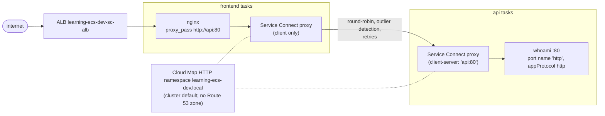

<!-- TOC -->

- [Module 08 - Service Connect (service-to-service by short name)](#module-08---service-connect-service-to-service-by-short-name)
  - [Overview](#overview)
  - [What you will learn](#what-you-will-learn)
  - [Architecture](#architecture)
  - [Internal ALB, Service Connect or Cloud Map DNS?](#internal-alb-service-connect-or-cloud-map-dns)
  - [AWS services and CDK constructs used](#aws-services-and-cdk-constructs-used)
  - [Configuration](#configuration)
  - [Prerequisites](#prerequisites)
  - [Tests](#tests)
  - [Deploy with floci (local, free)](#deploy-with-floci-local-free)
  - [Deploy to real AWS (optional)](#deploy-to-real-aws-optional)
  - [Verify](#verify)
    - [List every resource with the AWS CLI](#list-every-resource-with-the-aws-cli)
  - [Manage it with the AWS CLI](#manage-it-with-the-aws-cli)
  - [Metrics to watch](#metrics-to-watch)
  - [Troubleshooting](#troubleshooting)
  - [floci vs real AWS](#floci-vs-real-aws)
  - [Clean up](#clean-up)
  - [Notes and cautions](#notes-and-cautions)
  - [References](#references)

<!-- TOC -->

# Module 08 - Service Connect (service-to-service by short name)

## Overview

At scale, most traffic is **east-west**: service A calling service B
inside the VPC. Putting an internal load balancer in front of every
backend works ([module 04](../04_alb/README.md)) but costs a load balancer
per service and an extra network hop. **Amazon ECS Service Connect** is
ECS's built-in alternative: every task of a participating service gets a
managed proxy container; a client calls a short name such as
`http://api:80`, and its proxy picks a healthy task of the target service
directly - round-robin, with retries and outlier detection - and reports
per-request metrics.

This module wires: public ALB -> **`frontend`** (the official nginx image,
as a reverse proxy) --`http://api:80` over Service Connect--> **`api`**
(`traefik/whoami`). The `api` service has **no load balancer at all**.

## What you will learn

- Cloud Map namespaces and how Service Connect uses them.
- **Client** vs **client-server** Service Connect services; port names,
  discovery names and client aliases.
- Why only services *in the namespace* can resolve the short names.
- Service Connect proxy logs, access logs (JSON) and the `AWS/ECS` traffic
  metrics it adds.
- What an unresolvable upstream looks like (you'll see it on floci).

## Architecture



<details>
<summary>Plain-text version (names and details)</summary>

```
 internet -> ALB learning-ecs-dev-sc-alb -> frontend tasks (nginx, proxy_pass http://api:80)
                                              |  Service Connect proxy (client only)
                                              |  round-robin + outlier detection + retries
                                              v
                                            api tasks (whoami :80, port name "http", appProtocol http)
                                              Service Connect proxy (client-server: "api:80")

 Cloud Map HTTP namespace learning-ecs-dev.local  (cluster default; no Route 53 zone)
```

</details>

## Internal ALB, Service Connect or Cloud Map DNS?

| | Internal ALB ([module 04](../04_alb/README.md)) | Service Connect (this module) | Cloud Map DNS service discovery |
|---|---|---|---|
| Clients | anything in the VPC | ECS services in the same namespace | anything that uses the VPC's DNS |
| Load balancing | ALB | client-side proxy, round-robin + outlier detection + retries | DNS answers (client picks) |
| Extra cost | ALB hours + LCUs | none for the feature (the proxy uses task CPU/memory) | Cloud Map queries |
| Per-request metrics | ALB metrics | `AWS/ECS` Service Connect metrics | none |
| L7 routing (paths, headers) | yes | no | no |

## AWS services and CDK constructs used

| AWS service | CDK construct (Python) | Level |
|---|---|---|
| AWS Cloud Map | `Cluster.add_default_cloud_map_namespace(type=NamespaceType.HTTP, use_for_service_connect=True)` | L2 |
| Amazon ECS | `FargateService(service_connect_configuration=ServiceConnectProps(...))`, `ServiceConnectService`, `ServiceConnectAccessLogConfiguration` | L2 |
| Amazon ECS | `PortMapping(name="http", app_protocol=AppProtocol.http)` | L2 |
| Elastic Load Balancing | `ApplicationLoadBalancer` (frontend only) | L2 |

## Configuration

| Variable | Default | Effect |
|---|---|---|
| `CDK_SC_NAMESPACE` | `<product>-<env>.local` | the Cloud Map HTTP namespace |
| `CDK_SC_UPSTREAM_URL` | `http://api:80` | where the frontend proxies to |
| `CDK_SC_DESIRED_COUNT` | `CDK_DESIRED_COUNT` (`2`) | tasks per service |
| `CDK_SC_API_IMAGE` / `CDK_SC_FRONTEND_IMAGE` | `traefik/whoami:v1.12.0` / `nginx:1.30-alpine` | images |
| `CDK_PORT_SERVICE_CONNECT` | `80` (`.env.example`: `8087`) | public ALB listener port |

## Prerequisites

[Module 04](../04_alb/README.md). For the full experience, a real AWS
account - see [floci vs real AWS](#floci-vs-real-aws).

## Tests

[`../../tests/unit/test_08_service_connect.py`](../../tests/unit/test_08_service_connect.py)
checks the HTTP namespace (not a private DNS one), the `api` client-server
configuration (`http` port name, `api:80` alias, JSON access logs, proxy
log driver), the named `http` port mapping with `appProtocol`, the
client-only `frontend` and its upstream, that namespace and upstream are
configurable, that only the frontend sits behind the load balancer, and the
mandatory tags:

```bash
uv run pytest tests/unit/test_08_service_connect.py -v
```

## Deploy with floci (local, free)

```bash
uv run cdk bootstrap
uv run cdk synth ServiceConnectStack
uv run cdk diff ServiceConnectStack
uv run cdk deploy ServiceConnectStack --require-approval never --method=direct
```

On floci the stack deploys, but no traffic flows from `frontend` to `api`
- see [floci vs real AWS](#floci-vs-real-aws). It's a useful failure to
look at:

```bash
docker logs learning-ecs-floci 2>&1 | grep '\[ecs:learning-ecs-dev-sc-frontend' | tail -3
# ... nginx: [emerg] host not found in upstream "api" in /etc/nginx/conf.d/default.conf:4
```

That's exactly what a client outside the namespace (or a task started
without Service Connect) sees on AWS too: the short name doesn't resolve.

## Deploy to real AWS (optional)

```bash
unset AWS_ENDPOINT_URL CDK_PORT_SERVICE_CONNECT
uv run cdk bootstrap --profile <your-aws-cli-profile>
uv run cdk diff ServiceConnectStack --profile <your-aws-cli-profile>
uv run cdk deploy ServiceConnectStack --profile <your-aws-cli-profile>
```

Cost: an ALB, a NAT Gateway and four small Fargate tasks; Service Connect
and its Cloud Map usage have no additional charge (the proxy shares the
task's CPU and memory) - see [Amazon ECS pricing](https://aws.amazon.com/ecs/pricing/).

## Verify

Real AWS:

```bash
URL=$(aws cloudformation describe-stacks --stack-name ServiceConnectStack \
  --query "Stacks[0].Outputs[?OutputKey=='Url'].OutputValue" --output text)
for i in 1 2 3 4; do curl -s "$URL" | grep -E '^(Name|Hostname)'; done
# "Name: api" with alternating hostnames: the frontend's proxy balances across the api tasks.

CLUSTER=learning-ecs-dev-ecs-svc-connect
aws ecs describe-clusters --clusters "$CLUSTER" --include ATTACHMENTS \
  --query 'clusters[0].[serviceConnectDefaults,attachments[].type]'
aws ecs describe-services --cluster "$CLUSTER" --services learning-ecs-dev-sc-api \
  --query 'services[0].deployments[0].serviceConnectConfiguration'
aws ecs list-services-by-namespace \
  --namespace "$(aws servicediscovery list-namespaces --query "Namespaces[?Name=='learning-ecs-dev.local'].Arn" --output text)"
# Each task now has an extra, managed container: the Service Connect proxy
aws ecs describe-tasks --cluster "$CLUSTER" \
  --tasks "$(aws ecs list-tasks --cluster "$CLUSTER" --service-name learning-ecs-dev-sc-api --query 'taskArns[0]' --output text)" \
  --query 'tasks[0].containers[].name'
# The api proxy's JSON access logs:
aws logs tail /ecs/learning-ecs/dev/sc-api-proxy --since 10m
```

<!-- BEGIN resource-commands (generated by scripts/resource_commands.py) -->
### List every resource with the AWS CLI

Every resource this stack creates, one `aws` command each, parametrized
by environment (`ENV`), region (`REGION`) and - where a command builds an
ARN - account (`ACCOUNT`): set them to match your deployment, with your
`.env` loaded (floci) or your AWS profile active (real AWS). A resource
without a name of its own is looked up through the stack by its *logical
id* (`pid <LogicalId>`), which is the same in every environment. This block
is generated from the stack's template by
[`scripts/resource_commands.py`](../../scripts/resource_commands.py) - see
[`../../REQUIREMENTS.md`, section 5.8](../../REQUIREMENTS.md#58---listing-every-resource-a-stack-created);
`make cdk-resources STACK=ServiceConnectStack` runs the same commands for you.

```bash
# Match these to your deployment: CDK_PRODUCT and CDK_ENVIRONMENT in .env, and
# the region you deployed to (floci: the one in .env).
PRODUCT=learning-ecs ENV=dev REGION=us-east-1
STACK=ServiceConnectStack
# Physical id of one of the stack's resources, by its logical id - the same in
# every environment. A second argument names another (e.g. nested) stack.
pid() { aws cloudformation describe-stack-resource --stack-name "${2:-$STACK}" \
  --logical-resource-id "$1" --region "$REGION" \
  --query StackResourceDetail.PhysicalResourceId --output text; }

# Every resource the stack created - type, logical id, physical id, status:
aws cloudformation describe-stack-resources --stack-name "$STACK" --region "$REGION" \
  --query "StackResources[].[ResourceType,LogicalResourceId,PhysicalResourceId,ResourceStatus]" \
  --output table

# AWS::EC2::VPC (Vpc8378EB38)
aws ec2 describe-vpcs --vpc-ids "$(pid Vpc8378EB38)" --query "Vpcs[].[VpcId,CidrBlock,State]" --output table --region "$REGION"
# AWS::ECS::Cluster (ClusterEB0386A7)
aws ecs describe-clusters --clusters "${PRODUCT}-${ENV}-ecs-svc-connect" --query "clusters[].[clusterName,status]" --output table --region "$REGION"
# AWS::ServiceDiscovery::HttpNamespace (ClusterDefaultServiceDiscoveryNamespaceC336F9B4)
aws servicediscovery list-namespaces --filters Name=TYPE,Values=HTTP --query "Namespaces[?Name=='${PRODUCT}-${ENV}.local'].[Name,Id,Type]" --output table --region "$REGION"
# AWS::Logs::LogGroup (ApiProxyLogGroup3ACD67FE)
aws logs describe-log-groups --log-group-name-prefix "/ecs/${PRODUCT}/${ENV}/sc-api-proxy" --query "logGroups[].[logGroupName,retentionInDays]" --output table --region "$REGION"
# AWS::IAM::Role (ApiTaskDefinitionTaskRole7EE87BD7)
aws iam get-role --role-name "$(pid ApiTaskDefinitionTaskRole7EE87BD7)" --query "Role.[RoleName,Arn]" --output table --region "$REGION"
# AWS::ECS::TaskDefinition (ApiTaskDefinition51EA709E)
aws ecs describe-task-definition --task-definition "$(pid ApiTaskDefinition51EA709E)" --query "taskDefinition.[family,revision,status]" --output table --region "$REGION"
# AWS::IAM::Role (ApiTaskDefinitionExecutionRoleA3303016)
aws iam get-role --role-name "$(pid ApiTaskDefinitionExecutionRoleA3303016)" --query "Role.[RoleName,Arn]" --output table --region "$REGION"
# AWS::Logs::LogGroup (ApiLogGroup1DEDFC07)
aws logs describe-log-groups --log-group-name-prefix "/ecs/${PRODUCT}/${ENV}/sc-api" --query "logGroups[].[logGroupName,retentionInDays]" --output table --region "$REGION"
# AWS::ECS::Service (ApiServiceC9037CF0)
aws ecs describe-services --cluster "${PRODUCT}-${ENV}-ecs-svc-connect" --services "${PRODUCT}-${ENV}-sc-api" --query "services[].[serviceName,status,desiredCount]" --output table --region "$REGION"
# AWS::EC2::SecurityGroup (ApiServiceSecurityGroupA2426F91)
aws ec2 describe-security-groups --group-ids "$(pid ApiServiceSecurityGroupA2426F91)" --query "SecurityGroups[].[GroupId,GroupName,VpcId]" --output table --region "$REGION"
# AWS::IAM::Role (FrontendTaskDefinitionTaskRole0DD17CB3)
aws iam get-role --role-name "$(pid FrontendTaskDefinitionTaskRole0DD17CB3)" --query "Role.[RoleName,Arn]" --output table --region "$REGION"
# AWS::ECS::TaskDefinition (FrontendTaskDefinition6CBC2B00)
aws ecs describe-task-definition --task-definition "$(pid FrontendTaskDefinition6CBC2B00)" --query "taskDefinition.[family,revision,status]" --output table --region "$REGION"
# AWS::IAM::Role (FrontendTaskDefinitionExecutionRole81F7E63C)
aws iam get-role --role-name "$(pid FrontendTaskDefinitionExecutionRole81F7E63C)" --query "Role.[RoleName,Arn]" --output table --region "$REGION"
# AWS::Logs::LogGroup (FrontendLogGroupCE4F14E0)
aws logs describe-log-groups --log-group-name-prefix "/ecs/${PRODUCT}/${ENV}/sc-frontend" --query "logGroups[].[logGroupName,retentionInDays]" --output table --region "$REGION"
# AWS::ECS::Service (FrontendServiceBC94BA93)
aws ecs describe-services --cluster "${PRODUCT}-${ENV}-ecs-svc-connect" --services "${PRODUCT}-${ENV}-sc-frontend" --query "services[].[serviceName,status,desiredCount]" --output table --region "$REGION"
# AWS::EC2::SecurityGroup (FrontendServiceSecurityGroup85470DEC)
aws ec2 describe-security-groups --group-ids "$(pid FrontendServiceSecurityGroup85470DEC)" --query "SecurityGroups[].[GroupId,GroupName,VpcId]" --output table --region "$REGION"
# AWS::ElasticLoadBalancingV2::LoadBalancer (Alb16C2F182)
aws elbv2 describe-load-balancers --load-balancer-arns "$(pid Alb16C2F182)" --query "LoadBalancers[].[LoadBalancerName,Type,State.Code]" --output table --region "$REGION"
# AWS::EC2::SecurityGroup (AlbSecurityGroup580F65A6)
aws ec2 describe-security-groups --group-ids "$(pid AlbSecurityGroup580F65A6)" --query "SecurityGroups[].[GroupId,GroupName,VpcId]" --output table --region "$REGION"
# AWS::ElasticLoadBalancingV2::Listener (AlbHttp7966E42E)
aws elbv2 describe-listeners --listener-arns "$(pid AlbHttp7966E42E)" --query "Listeners[].[Port,Protocol]" --output table --region "$REGION"
# AWS::ElasticLoadBalancingV2::TargetGroup (AlbHttpFrontendGroup6A132A44)
aws elbv2 describe-target-groups --target-group-arns "$(pid AlbHttpFrontendGroup6A132A44)" --query "TargetGroups[].[TargetGroupName,Port,TargetType]" --output table --region "$REGION"
# Also created - listed in the table above:
#   11 VPC sub-resources (subnets, route tables, gateways, endpoints) - built by shared/network.py, listed one by one in modules/01_network/README.md
#   AWS::ECS::ClusterCapacityProviderAssociations Cluster3DA9CCBA - shown by its ECS cluster (describe-clusters --include ATTACHMENTS)
#   AWS::IAM::Policy ApiTaskDefinitionTaskRoleDefaultPolicyA678CF9F - shown by its IAM role
#   AWS::IAM::Policy ApiTaskDefinitionExecutionRoleDefaultPolicy5B03B3DE - shown by its IAM role
#   AWS::EC2::SecurityGroupIngress ApiServiceSecurityGroupfromServiceConnectStackFrontendServiceSecurityGroup0D5E0D158071A4FDC9 - shown by its security group
#   AWS::IAM::Policy FrontendTaskDefinitionTaskRoleDefaultPolicy0B3776AB - shown by its IAM role
#   AWS::IAM::Policy FrontendTaskDefinitionExecutionRoleDefaultPolicyD4B6E7E4 - shown by its IAM role
#   AWS::EC2::SecurityGroupIngress FrontendServiceSecurityGroupfromServiceConnectStackAlbSecurityGroup80D9785C806A009768 - shown by its security group
#   AWS::EC2::SecurityGroupEgress AlbSecurityGrouptoServiceConnectStackFrontendServiceSecurityGroup0D5E0D158092E4AC25 - shown by its security group
```

**On floci** (2.1.0), CloudFormation records `AWS::ServiceDiscovery::HttpNamespace` without creating it, so those commands find nothing there - they work on real AWS. See [`REQUIREMENTS.md`, section 10](../../REQUIREMENTS.md#10-floci-vs-real-aws).
<!-- END resource-commands -->

## Manage it with the AWS CLI

Following [Configuring Amazon ECS Service Connect with the AWS CLI](https://docs.aws.amazon.com/AmazonECS/latest/developerguide/create-service-connect.html).
The namespace commands were run against floci; the ECS ones are accepted by
floci but not applied there:

```bash
# A namespace (HTTP: no Route 53 hosted zone)
OP=$(aws servicediscovery create-http-namespace --name shop.local --query OperationId --output text)
aws servicediscovery get-operation --operation-id "$OP" --query 'Operation.Status'
NS=$(aws servicediscovery list-namespaces --query "Namespaces[?Name=='shop.local'].Arn" --output text)

# Make it the cluster's default for Service Connect
aws ecs update-cluster --cluster learning-ecs-dev-ecs-svc-connect --service-connect-defaults namespace="$NS"

# client-server: publish the port named "http" as api:80
aws ecs update-service --cluster learning-ecs-dev-ecs-svc-connect --service learning-ecs-dev-sc-api \
  --service-connect-configuration "{\"enabled\":true,\"namespace\":\"$NS\",\"services\":[{\"portName\":\"http\",\"discoveryName\":\"api\",\"clientAliases\":[{\"port\":80,\"dnsName\":\"api\"}]}]}"
# client only
aws ecs update-service --cluster learning-ecs-dev-ecs-svc-connect --service learning-ecs-dev-sc-frontend \
  --service-connect-configuration "{\"enabled\":true,\"namespace\":\"$NS\"}"

# turn it off for a service
aws ecs update-service --cluster learning-ecs-dev-ecs-svc-connect --service learning-ecs-dev-sc-frontend \
  --service-connect-configuration '{"enabled":false}'

# delete the namespace (only once no service uses it)
aws servicediscovery delete-namespace --id "$(aws servicediscovery list-namespaces \
  --query "Namespaces[?Name=='shop.local'].Id" --output text)"
```

A service-connect change is a new deployment: the service's tasks are
replaced so they get (or lose) the proxy and the new endpoints. Deploy the
server services before the clients that call them.

## Metrics to watch

Service Connect adds traffic metrics to `AWS/ECS` (all from the proxies):

| Metric | Dimensions | Notes |
|---|---|---|
| `RequestCount` | `DiscoveryName`; `DiscoveryName,ServiceName,ClusterName` | needs `appProtocol` on the port mapping (set here) |
| `HTTPCode_Target_2XX_Count` ... `HTTPCode_Target_5XX_Count` | `TargetDiscoveryName`; `TargetDiscoveryName,ServiceName,ClusterName` | responses of the api as seen by its callers |
| `TargetResponseTime` | same as above | milliseconds |
| `ActiveConnectionCount`, `NewConnectionCount`, `ProcessedBytes` | `DiscoveryName`... | |
| `ClientTLSNegotiationErrorCount`, `TargetTLSNegotiationErrorCount` | | only with Service Connect TLS |

```bash
aws cloudwatch get-metric-statistics --namespace AWS/ECS --metric-name TargetResponseTime \
  --dimensions Name=TargetDiscoveryName,Value=api \
  --start-time "$(date -u -d '-1 hour' +%Y-%m-%dT%H:%M:%SZ)" --end-time "$(date -u +%Y-%m-%dT%H:%M:%SZ)" \
  --period 60 --statistics Average Maximum --output table
```

## Troubleshooting

| Symptom | Where to look | Typical cause / fix |
|---|---|---|
| Client can't resolve `api` (`host not found`, `Name or service not known`) | the client service's `serviceConnectConfiguration` | the client isn't in the namespace (or isn't Service Connect enabled); a standalone task or something outside ECS can't resolve the names |
| Client tasks started before `api` existed don't see it | deployment order | "existing tasks can't resolve and connect to the new endpoint" - redeploy the client (`update-service --force-new-deployment`) after adding a server |
| `503`/connection resets between services | `TargetResponseTime`, `HTTPCode_Target_5XX_Count`, proxy access logs | the api tasks fail or are slow; outlier detection ejects bad tasks |
| Connection refused between services | security groups | the api task security group must allow the client tasks on the container port (this module adds that rule) |
| floci: `cdk destroy` fails with "The cluster cannot be deleted because it contains running tasks" | `aws ecs list-tasks --cluster ...` | the crash-looping frontend left tasks that were still stopping - run `uv run cdk destroy ServiceConnectStack` again |
| Proxy container not in the task | `describe-tasks` -> `containers[].name` | Service Connect not enabled on the service, or the task was started before it was |

More: [`../../docs/TROUBLESHOOTING.md`](../../docs/TROUBLESHOOTING.md).

## floci vs real AWS

| Behavior | floci 2.1.0 | Real AWS |
|---|---|---|
| `AWS::ServiceDiscovery::HttpNamespace` from CloudFormation | **not created** (stubbed) | created |
| Cloud Map namespaces through the CLI (`servicediscovery create-http-namespace` ...) | work | work |
| `serviceConnectConfiguration` on services/clusters | accepted, **not stored or applied**; no proxy container | proxy added to every task |
| Frontend -> `http://api` | fails: `host not found in upstream "api"` | works |
| Service Connect metrics and access logs | none | as above |

Use floci here to check that the stack synthesizes and deploys, and to see
the failure mode; check the traffic on a real account.

## Clean up

```bash
uv run cdk destroy ServiceConnectStack
uv run python scripts/floci_prune.py --apply   # floci only
```

## Notes and cautions

- **Cost**: see [Deploy to real AWS](#deploy-to-real-aws-optional).
- **Size tasks for the proxy**: AWS recommends adding 256 CPU units and at
  least 64 MiB of memory per task for the Service Connect proxy (more above
  500 requests per second per task) - both services here use 512 CPU /
  1024 MiB instead of module 02's 256/512.
- **What the proxy does for you**, per the ECS docs: round-robin load
  balancing; outlier detection (a task with 5 or more failed connections in
  the last 30 seconds is avoided for 30 to 300 seconds); 2 retries on a
  different task; a 15-second per-request timeout (`per_request_timeout`,
  set explicitly here) and a 5-minute idle timeout for HTTP.
- **Existing tasks don't learn new endpoints**: AWS states you must
  redeploy existing services before their applications can resolve
  endpoints added to the namespace after their last deployment.
- **Container health checks matter**: Service Connect uses the task's
  container health check to decide when a new task can receive traffic
  (waiting up to 8 minutes for an `UNKNOWN` health status). The `whoami`
  image has no shell to run a check in; real services should define one.
- **Don't edit the Cloud Map services Service Connect creates** - AWS warns
  that registering/deregistering instances by hand can break traffic.
- Service Connect can encrypt traffic with TLS (AWS Private CA, which has
  its own cost) - see [Encrypt Amazon ECS Service Connect traffic](https://docs.aws.amazon.com/AmazonECS/latest/developerguide/service-connect-tls.html).

## References

- [Use Service Connect to connect Amazon ECS services with short names](https://docs.aws.amazon.com/AmazonECS/latest/developerguide/service-connect.html)
- [Amazon ECS Service Connect configuration overview](https://docs.aws.amazon.com/AmazonECS/latest/developerguide/service-connect-concepts.html)
- [Configuring Amazon ECS Service Connect with the AWS CLI](https://docs.aws.amazon.com/AmazonECS/latest/developerguide/create-service-connect.html)
- [Amazon ECS Service Connect access logs](https://docs.aws.amazon.com/AmazonECS/latest/developerguide/service-connect-envoy-access-logs.html)
- [Amazon ECS CloudWatch metrics (Service Connect)](https://docs.aws.amazon.com/AmazonECS/latest/developerguide/available-metrics.html)
- [AWS CDK API Reference (Python) - `aws_cdk.aws_ecs.ServiceConnectProps`](https://docs.aws.amazon.com/cdk/api/v2/python/aws_cdk.aws_ecs/ServiceConnectProps.html)
- [Docker Hub - nginx](https://hub.docker.com/_/nginx)
