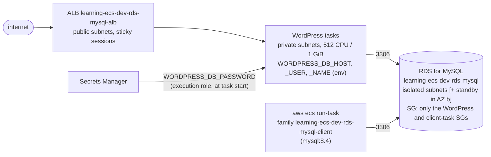

<!-- TOC -->

- [Module 09 - RDS for MySQL (WordPress on Fargate)](#module-09---rds-for-mysql-wordpress-on-fargate)
  - [Overview](#overview)
  - [What you will learn](#what-you-will-learn)
  - [Architecture](#architecture)
  - [AWS services and CDK constructs used](#aws-services-and-cdk-constructs-used)
  - [Configuration](#configuration)
  - [Prerequisites](#prerequisites)
  - [Tests](#tests)
  - [Deploy with floci (local, free)](#deploy-with-floci-local-free)
  - [Deploy to real AWS (optional)](#deploy-to-real-aws-optional)
  - [Verify](#verify)
    - [1. WordPress reads and writes the database](#1-wordpress-reads-and-writes-the-database)
    - [2. A one-off ECS task writes and reads a table](#2-a-one-off-ecs-task-writes-and-reads-a-table)
    - [List every resource with the AWS CLI](#list-every-resource-with-the-aws-cli)
  - [Manage it with the AWS CLI](#manage-it-with-the-aws-cli)
  - [Metrics to watch](#metrics-to-watch)
  - [Troubleshooting](#troubleshooting)
  - [floci vs real AWS](#floci-vs-real-aws)
  - [Clean up](#clean-up)
  - [Notes and cautions](#notes-and-cautions)
  - [References](#references)

<!-- TOC -->

# Module 09 - RDS for MySQL (WordPress on Fargate)

## Overview

Most services on ECS are stateless - their state lives in a managed
database. This module runs the official [WordPress image from Docker
Hub](https://hub.docker.com/_/wordpress) on Fargate, behind a public ALB,
storing everything in an **Amazon RDS for MySQL** instance in the VPC's
isolated subnets. It shows the full chain an ECS application needs to use a
database safely:

- credentials **generated** by Secrets Manager (never in code or in the
  template), injected into the container at start-up as an ECS `secrets`
  entry;
- network access limited to the security groups that need it;
- an optional **Multi-AZ** standby for automatic failover;
- a **one-off ECS task** (the official `mysql` image) you run on demand to
  write and read a table - the pattern for migrations and data fixes.

## What you will learn

- `rds.DatabaseInstance`: engine version, instance class, storage
  autoscaling, encryption, backups, Multi-AZ - all from `.env`.
- Passing the endpoint as environment variables and the password as a
  secret (`ecs.Secret.from_secrets_manager(secret, "password")`).
- Security group to security group rules for the database port.
- Running and reading the output of one-off tasks (`run-task` +
  `--overrides`).
- RDS day-2 operations with the CLI, and the RDS metrics that matter.

## Architecture



<details>
<summary>Plain-text version (names and details)</summary>

```
 internet -> ALB learning-ecs-dev-rds-mysql-alb (public subnets, sticky sessions)
               -> WordPress tasks (private subnets; 512 CPU / 1 GiB)
                    WORDPRESS_DB_HOST=<endpoint>:<port>  WORDPRESS_DB_USER/NAME (env)
                    WORDPRESS_DB_PASSWORD  <- Secrets Manager (execution role, at task start)
                        |
                        | 3306, only from the WordPress SG and the client-task SG
                        v
               RDS for MySQL learning-ecs-dev-rds-mysql  (isolated subnets; [+ standby in AZ b])

 aws ecs run-task (family learning-ecs-dev-rds-mysql-client, image mysql:8.4) -> same database
```

</details>

## AWS services and CDK constructs used

| AWS service | CDK construct (Python) | Level |
|---|---|---|
| Amazon RDS | `aws_cdk.aws_rds.DatabaseInstance`, `DatabaseInstanceEngine.mysql`, `MysqlEngineVersion.of`, `Credentials.from_password` | L2 |
| AWS Secrets Manager | `aws_cdk.aws_secretsmanager.Secret` (via `shared/database.py`) | L2 |
| Amazon ECS | `FargateService` (WordPress), `FargateTaskDefinition` (client), `ecs.Secret.from_secrets_manager` | L2 |
| Elastic Load Balancing | `ApplicationLoadBalancer` (sticky sessions) | L2 |

## Configuration

| Variable | Default | Effect |
|---|---|---|
| `CDK_RDS_MYSQL_VERSION` | `8.4.10` | engine version (major version derived from it) |
| `CDK_RDS_INSTANCE_TYPE` | `t3.micro` | instance class, without the `db.` prefix |
| `CDK_RDS_MULTI_AZ` | `false` | synchronous standby in another AZ |
| `CDK_RDS_STORAGE_GB` / `CDK_RDS_MAX_STORAGE_GB` | `20` / `100` | initial storage / storage autoscaling ceiling |
| `CDK_RDS_BACKUP_DAYS` | `1` | automated backup retention (0 disables backups) |
| `CDK_RDS_PERFORMANCE_INSIGHTS` | `false` | Performance Insights |
| `CDK_RDS_MYSQL_DESIRED_COUNT` | `CDK_DESIRED_COUNT` (`2`) | WordPress tasks |
| `CDK_RDS_MYSQL_WORDPRESS_IMAGE` / `CDK_RDS_MYSQL_CLIENT_IMAGE` | `wordpress:6.9-apache` / `mysql:8.4` | images |
| `CDK_PORT_RDS_MYSQL` | `80` (`.env.example`: `8088`) | ALB listener port |

Check the engine versions RDS offers in your region before changing
`CDK_RDS_MYSQL_VERSION`:
`aws rds describe-db-engine-versions --engine mysql --query 'DBEngineVersions[].EngineVersion'`.

## Prerequisites

Modules [02](../02_fargate_service/README.md) and [04](../04_alb/README.md).
floci running and `.env` loaded. floci runs the database as a real
`mysql:8.0`-family container (it pulls the image the first time).

## Tests

[`../../tests/unit/test_09_rds_mysql.py`](../../tests/unit/test_09_rds_mysql.py)
checks the instance (engine, version, class, database, encryption, backups,
storage autoscaling), that the password is a by-name Secrets Manager
reference, that version/size/Multi-AZ follow their variables, WordPress's
environment and secret, that only two security groups may reach the
database, the client task definition (and that it is not a service), the
ALB health check, and the mandatory tags:

```bash
uv run pytest tests/unit/test_09_rds_mysql.py -v
```

## Deploy with floci (local, free)

```bash
uv run cdk bootstrap
uv run cdk synth RdsMysqlStack
uv run cdk diff RdsMysqlStack
uv run cdk deploy RdsMysqlStack --require-approval never --method=direct
```

## Deploy to real AWS (optional)

**The RDS instance bills per hour (twice with Multi-AZ) plus storage and
backups**, on top of the ALB, NAT Gateway and tasks - see
[Amazon RDS for MySQL pricing](https://aws.amazon.com/rds/mysql/pricing/).
Creating the instance takes several minutes.

```bash
unset AWS_ENDPOINT_URL CDK_PORT_RDS_MYSQL
uv run cdk bootstrap --profile <your-aws-cli-profile>
uv run cdk diff RdsMysqlStack --profile <your-aws-cli-profile>
uv run cdk deploy RdsMysqlStack --profile <your-aws-cli-profile>
```

## Verify

```bash
out() { aws cloudformation describe-stacks --stack-name RdsMysqlStack \
  --query "Stacks[0].Outputs[?OutputKey=='$1'].OutputValue" --output text; }
aws rds describe-db-instances --db-instance-identifier learning-ecs-dev-rds-mysql \
  --query 'DBInstances[0].[DBInstanceStatus,Engine,EngineVersion,MultiAZ,Endpoint.Address,Endpoint.Port]'
```

### 1. WordPress reads and writes the database

```bash
URL=$(out Url); [ -n "${AWS_ENDPOINT_URL:-}" ] && URL=http://localhost:${CDK_PORT_RDS_MYSQL:-8088}/
curl -s -o /dev/null -w '%{http_code} -> %{redirect_url}\n' "$URL"   # 302 -> .../wp-admin/install.php
```

The installer page only renders when WordPress could connect to MySQL
(otherwise it shows "Error establishing a database connection"). Install it
- in a browser, or with `curl` - which writes WordPress's tables and your
site title to the database:

```bash
curl -s -o /dev/null -w 'install: %{http_code}\n' -X POST "${URL}wp-admin/install.php?step=2" \
  --data-urlencode 'weblog_title=learning-ecs on ECS' --data-urlencode 'user_name=admin' \
  --data-urlencode 'admin_password=Ch4nge-me-now!' --data-urlencode 'admin_password2=Ch4nge-me-now!' \
  --data-urlencode 'pw_weak=1' --data-urlencode 'admin_email=admin@example.com' \
  --data-urlencode 'Submit=Install WordPress' --data-urlencode 'language='
curl -s "$URL" | grep -o '<title>[^<]*</title>'        # <title>learning-ecs on ECS</title>
```

On floci, first let the ALB keep the `Host` header (floci's default
replaces it with the target's address, and WordPress would save that
address as its site URL; on AWS the ALB forwards the client's `Host`):

```bash
LB=$(aws elbv2 describe-load-balancers --names learning-ecs-dev-rds-mysql-alb --query 'LoadBalancers[0].LoadBalancerArn' --output text)
aws elbv2 modify-load-balancer-attributes --load-balancer-arn "$LB" \
  --attributes Key=routing.http.preserve_host_header.enabled,Value=true
```

### 2. A one-off ECS task writes and reads a table

The client task definition runs `mysql ... -e "$SQL"`; by default `$SQL`
creates a `visits` table, inserts a row and counts the rows. It runs in
the same subnets as WordPress, with the client security group the database
trusts:

```bash
CLUSTER=$(out ClusterName); FAMILY=$(out ClientTaskFamily); SG=$(out ClientSecurityGroupId)
SUBNETS=$(aws ecs describe-services --cluster "$CLUSTER" --services learning-ecs-dev-rds-mysql-wordpress \
  --query 'services[0].networkConfiguration.awsvpcConfiguration.subnets' --output text | tr '\t' ',')
TD=$(out ClientTaskDefinitionArn)   # the exact revision this stack registered
NET="awsvpcConfiguration={subnets=[$SUBNETS],securityGroups=[$SG],assignPublicIp=DISABLED}"

# write + read (the default SQL)
TASK=$(aws ecs run-task --cluster "$CLUSTER" --task-definition "$TD" \
  --capacity-provider-strategy capacityProvider=FARGATE,weight=1 --network-configuration "$NET" \
  --query 'tasks[0].taskArn' --output text)
aws ecs wait tasks-stopped --cluster "$CLUSTER" --tasks "$TASK"
aws ecs describe-tasks --cluster "$CLUSTER" --tasks "$TASK" --query 'tasks[0].containers[0].exitCode'   # 0

# read what WordPress wrote - any SQL, through --overrides
TASK=$(aws ecs run-task --cluster "$CLUSTER" --task-definition "$TD" \
  --capacity-provider-strategy capacityProvider=FARGATE,weight=1 --network-configuration "$NET" \
  --overrides '{"containerOverrides":[{"name":"client","environment":[{"name":"SQL","value":"SELECT option_name, option_value FROM wp_options WHERE option_name IN (\"blogname\",\"siteurl\"); SELECT COUNT(*) AS users FROM wp_users;"}]}]}' \
  --query 'tasks[0].taskArn' --output text)
aws ecs wait tasks-stopped --cluster "$CLUSTER" --tasks "$TASK"
```

The output, on real AWS, is in the task's log group:

```bash
aws logs tail /ecs/learning-ecs/dev/rds-mysql-client --since 10m
```

On floci (2.1.0 doesn't ship container output to CloudWatch Logs), floci
prints every task's output in its own log:

```bash
docker logs learning-ecs-floci 2>&1 | grep '\[ecs:learning-ecs-dev-rds-mysql-client' | tail -8
# ... visits  last_visit / 1  2026-...
# ... blogname  learning-ecs on ECS / siteurl  http://localhost:8088 / users / 1
```

<!-- BEGIN resource-commands (generated by scripts/resource_commands.py) -->
### List every resource with the AWS CLI

Every resource this stack creates, one `aws` command each, parametrized
by environment (`ENV`), region (`REGION`) and - where a command builds an
ARN - account (`ACCOUNT`): set them to match your deployment, with your
`.env` loaded (floci) or your AWS profile active (real AWS). A resource
without a name of its own is looked up through the stack by its *logical
id* (`pid <LogicalId>`), which is the same in every environment. This block
is generated from the stack's template by
[`scripts/resource_commands.py`](../../scripts/resource_commands.py) - see
[`../../REQUIREMENTS.md`, section 5.8](../../REQUIREMENTS.md#58---listing-every-resource-a-stack-created);
`make cdk-resources STACK=RdsMysqlStack` runs the same commands for you.

```bash
# Match these to your deployment: CDK_PRODUCT and CDK_ENVIRONMENT in .env, and
# the region you deployed to (floci: the one in .env).
PRODUCT=learning-ecs ENV=dev REGION=us-east-1
STACK=RdsMysqlStack
# Physical id of one of the stack's resources, by its logical id - the same in
# every environment. A second argument names another (e.g. nested) stack.
pid() { aws cloudformation describe-stack-resource --stack-name "${2:-$STACK}" \
  --logical-resource-id "$1" --region "$REGION" \
  --query StackResourceDetail.PhysicalResourceId --output text; }

# Every resource the stack created - type, logical id, physical id, status:
aws cloudformation describe-stack-resources --stack-name "$STACK" --region "$REGION" \
  --query "StackResources[].[ResourceType,LogicalResourceId,PhysicalResourceId,ResourceStatus]" \
  --output table

# AWS::EC2::VPC (Vpc8378EB38)
aws ec2 describe-vpcs --vpc-ids "$(pid Vpc8378EB38)" --query "Vpcs[].[VpcId,CidrBlock,State]" --output table --region "$REGION"
# AWS::ECS::Cluster (ClusterEB0386A7)
aws ecs describe-clusters --clusters "${PRODUCT}-${ENV}-ecs-rds-mysql" --query "clusters[].[clusterName,status]" --output table --region "$REGION"
# AWS::SecretsManager::Secret (MasterSecretA11BF785)
aws secretsmanager describe-secret --secret-id "${PRODUCT}-${ENV}-secret-rds-mysql" --query "[Name,ARN]" --output table --region "$REGION"
# AWS::RDS::DBSubnetGroup (DatabaseSubnetGroup7D60F180)
aws rds describe-db-subnet-groups --db-subnet-group-name "$(pid DatabaseSubnetGroup7D60F180)" --query "DBSubnetGroups[].DBSubnetGroupName" --output table --region "$REGION"
# AWS::EC2::SecurityGroup (DatabaseSecurityGroup5C91FDCB)
aws ec2 describe-security-groups --group-ids "$(pid DatabaseSecurityGroup5C91FDCB)" --query "SecurityGroups[].[GroupId,GroupName,VpcId]" --output table --region "$REGION"
# AWS::RDS::DBInstance (DatabaseB269D8BB)
aws rds describe-db-instances --db-instance-identifier "${PRODUCT}-${ENV}-rds-mysql" --query "DBInstances[].[DBInstanceIdentifier,Engine,DBInstanceStatus]" --output table --region "$REGION"
# AWS::IAM::Role (WordPressTaskDefinitionTaskRole62988C5E)
aws iam get-role --role-name "$(pid WordPressTaskDefinitionTaskRole62988C5E)" --query "Role.[RoleName,Arn]" --output table --region "$REGION"
# AWS::ECS::TaskDefinition (WordPressTaskDefinition027F3A99)
aws ecs describe-task-definition --task-definition "$(pid WordPressTaskDefinition027F3A99)" --query "taskDefinition.[family,revision,status]" --output table --region "$REGION"
# AWS::IAM::Role (WordPressTaskDefinitionExecutionRoleD7728961)
aws iam get-role --role-name "$(pid WordPressTaskDefinitionExecutionRoleD7728961)" --query "Role.[RoleName,Arn]" --output table --region "$REGION"
# AWS::Logs::LogGroup (WordPressLogGroup51ABCA84)
aws logs describe-log-groups --log-group-name-prefix "/ecs/${PRODUCT}/${ENV}/rds-mysql-wordpress" --query "logGroups[].[logGroupName,retentionInDays]" --output table --region "$REGION"
# AWS::ECS::Service (WordPressServiceB1106DB3)
aws ecs describe-services --cluster "${PRODUCT}-${ENV}-ecs-rds-mysql" --services "${PRODUCT}-${ENV}-rds-mysql-wordpress" --query "services[].[serviceName,status,desiredCount]" --output table --region "$REGION"
# AWS::EC2::SecurityGroup (WordPressServiceSecurityGroupB9C4559A)
aws ec2 describe-security-groups --group-ids "$(pid WordPressServiceSecurityGroupB9C4559A)" --query "SecurityGroups[].[GroupId,GroupName,VpcId]" --output table --region "$REGION"
# AWS::ElasticLoadBalancingV2::LoadBalancer (Alb16C2F182)
aws elbv2 describe-load-balancers --load-balancer-arns "$(pid Alb16C2F182)" --query "LoadBalancers[].[LoadBalancerName,Type,State.Code]" --output table --region "$REGION"
# AWS::EC2::SecurityGroup (AlbSecurityGroup580F65A6)
aws ec2 describe-security-groups --group-ids "$(pid AlbSecurityGroup580F65A6)" --query "SecurityGroups[].[GroupId,GroupName,VpcId]" --output table --region "$REGION"
# AWS::ElasticLoadBalancingV2::Listener (AlbHttp7966E42E)
aws elbv2 describe-listeners --listener-arns "$(pid AlbHttp7966E42E)" --query "Listeners[].[Port,Protocol]" --output table --region "$REGION"
# AWS::ElasticLoadBalancingV2::TargetGroup (AlbHttpWordPressGroupBA3DBBF1)
aws elbv2 describe-target-groups --target-group-arns "$(pid AlbHttpWordPressGroupBA3DBBF1)" --query "TargetGroups[].[TargetGroupName,Port,TargetType]" --output table --region "$REGION"
# AWS::IAM::Role (ClientTaskDefinitionTaskRole3D4CF998)
aws iam get-role --role-name "$(pid ClientTaskDefinitionTaskRole3D4CF998)" --query "Role.[RoleName,Arn]" --output table --region "$REGION"
# AWS::ECS::TaskDefinition (ClientTaskDefinition0504FE38)
aws ecs describe-task-definition --task-definition "$(pid ClientTaskDefinition0504FE38)" --query "taskDefinition.[family,revision,status]" --output table --region "$REGION"
# AWS::IAM::Role (ClientTaskDefinitionExecutionRole6FEF8DC3)
aws iam get-role --role-name "$(pid ClientTaskDefinitionExecutionRole6FEF8DC3)" --query "Role.[RoleName,Arn]" --output table --region "$REGION"
# AWS::Logs::LogGroup (ClientLogGroup94520E53)
aws logs describe-log-groups --log-group-name-prefix "/ecs/${PRODUCT}/${ENV}/rds-mysql-client" --query "logGroups[].[logGroupName,retentionInDays]" --output table --region "$REGION"
# AWS::EC2::SecurityGroup (ClientSecurityGroupE3B38CB0)
aws ec2 describe-security-groups --group-ids "$(pid ClientSecurityGroupE3B38CB0)" --query "SecurityGroups[].[GroupId,GroupName,VpcId]" --output table --region "$REGION"
# Also created - listed in the table above:
#   15 VPC sub-resources (subnets, route tables, gateways, endpoints) - built by shared/network.py, listed one by one in modules/01_network/README.md
#   AWS::ECS::ClusterCapacityProviderAssociations Cluster3DA9CCBA - shown by its ECS cluster (describe-clusters --include ATTACHMENTS)
#   AWS::EC2::SecurityGroupIngress DatabaseSecurityGroupfromRdsMysqlStackWordPressServiceSecurityGroup532DD26DIndirectPort4F0BEAC0 - shown by its security group
#   AWS::EC2::SecurityGroupIngress DatabaseSecurityGroupfromRdsMysqlStackClientSecurityGroup4972F30CIndirectPort8CCBD92A - shown by its security group
#   AWS::IAM::Policy WordPressTaskDefinitionTaskRoleDefaultPolicyA91E4B89 - shown by its IAM role
#   AWS::IAM::Policy WordPressTaskDefinitionExecutionRoleDefaultPolicy5B2CFF3D - shown by its IAM role
#   AWS::EC2::SecurityGroupIngress WordPressServiceSecurityGroupfromRdsMysqlStackAlbSecurityGroup87935C0480C2BED0B1 - shown by its security group
#   AWS::EC2::SecurityGroupEgress AlbSecurityGrouptoRdsMysqlStackWordPressServiceSecurityGroup532DD26D80CBB66E29 - shown by its security group
#   AWS::IAM::Policy ClientTaskDefinitionExecutionRoleDefaultPolicy7766FC0C - shown by its IAM role
```
<!-- END resource-commands -->

## Manage it with the AWS CLI

```bash
DB=learning-ecs-dev-rds-mysql

# inspect
aws rds describe-db-instances --db-instance-identifier "$DB" \
  --query 'DBInstances[0].[DBInstanceStatus,EngineVersion,DBInstanceClass,MultiAZ,AllocatedStorage,BackupRetentionPeriod]'
aws rds describe-events --source-identifier "$DB" --source-type db-instance --duration 1440

# configure (here applied immediately; without --apply-immediately, in the next maintenance window)
aws rds modify-db-instance --db-instance-identifier "$DB" \
  --backup-retention-period 7 --preferred-backup-window 03:00-04:00 --apply-immediately
aws rds modify-db-instance --db-instance-identifier "$DB" --multi-az --apply-immediately             # add a standby
aws rds modify-db-instance --db-instance-identifier "$DB" --db-instance-class db.t3.small --apply-immediately   # resize
aws rds modify-db-instance --db-instance-identifier "$DB" --max-allocated-storage 200 --apply-immediately       # storage autoscaling

# operate
aws rds reboot-db-instance --db-instance-identifier "$DB"
aws rds reboot-db-instance --db-instance-identifier "$DB" --force-failover   # Multi-AZ only: test the failover
aws rds create-db-snapshot --db-instance-identifier "$DB" --db-snapshot-identifier "$DB-manual-1"
aws rds describe-db-snapshots --db-instance-identifier "$DB" --query 'DBSnapshots[].[DBSnapshotIdentifier,Status]'
aws rds delete-db-snapshot --db-snapshot-identifier "$DB-manual-1"

# the generated credentials (e.g. for a local client on floci: localhost:<port from describe-db-instances>)
aws secretsmanager get-secret-value --secret-id learning-ecs-dev-secret-rds-mysql --query SecretString --output text
```

Changing the password in Secrets Manager does **not** change it in the
database, nor in running tasks: ECS reads `secrets` only when a task
starts. A rotation needs the database updated (Secrets Manager rotation for
RDS does that) *and* the service redeployed
(`aws ecs update-service ... --force-new-deployment`). And the database's
`MasterUserPassword` dynamic reference is only re-resolved by CloudFormation
when that resource is updated - see the [CloudFormation dynamic references
docs](https://docs.aws.amazon.com/AWSCloudFormation/latest/UserGuide/dynamic-references-secretsmanager.html).

## Metrics to watch

`AWS/RDS`, dimension `DBInstanceIdentifier=learning-ecs-dev-rds-mysql`:

| Metric | Unit | Watch for |
|---|---|---|
| `CPUUtilization` | Percent | sustained high CPU |
| `DatabaseConnections` | Count | approaching `max_connections` - every task opens its own connections; scaling the service out multiplies them |
| `FreeStorageSpace` | Bytes | running out (storage autoscaling helps up to `CDK_RDS_MAX_STORAGE_GB`) |
| `FreeableMemory` / `SwapUsage` | Bytes | memory pressure |
| `ReadLatency` / `WriteLatency`, `ReadIOPS` / `WriteIOPS`, `DiskQueueDepth` | Seconds / Count | slow storage |
| `CPUCreditBalance` | Credits | `db.t*` classes only - near 0 means throttled CPU |
| `ReplicaLag` | Seconds | read replicas |

```bash
aws cloudwatch get-metric-statistics --namespace AWS/RDS --metric-name DatabaseConnections \
  --dimensions Name=DBInstanceIdentifier,Value=learning-ecs-dev-rds-mysql \
  --start-time "$(date -u -d '-1 hour' +%Y-%m-%dT%H:%M:%SZ)" --end-time "$(date -u +%Y-%m-%dT%H:%M:%SZ)" \
  --period 60 --statistics Maximum --output table
```

Correlate with the service side: when WordPress tasks scale out
([module 16](../16_autoscaling/README.md)), `DatabaseConnections` grows with
them. Full catalog: [`../../docs/METRICS.md`](../../docs/METRICS.md).

## Troubleshooting

| Symptom | Where to look | Typical cause / fix |
|---|---|---|
| WordPress: "Error establishing a database connection" | WordPress logs; security groups; secret | wrong host/port, the DB security group doesn't allow the task's, or a wrong password (secret changed but tasks not redeployed) |
| Task stops with `ResourceInitializationError: unable to pull secrets` | stopped task reason | the execution role can't read the secret, or no route to Secrets Manager (NAT/VPC endpoint) |
| Client task: `ERROR 2003 (HY000): Can't connect to MySQL server` | security groups, subnets | the task ran without the client security group, or in subnets that can't reach the isolated tier |
| `Too many connections` | `DatabaseConnections` | more tasks x connections per task than `max_connections` - pool connections, or use RDS Proxy |
| Redirect loops / wrong URLs after install | `wp_options.siteurl` | WordPress saved the host it saw at install time - see the floci note above, or set `siteurl`/`home` with the client task |
| Login doesn't stick across tasks | target group stickiness | WordPress needs sticky sessions with more than one task (enabled here: 1 hour) |

More: [`../../docs/TROUBLESHOOTING.md`](../../docs/TROUBLESHOOTING.md).

## floci vs real AWS

| Behavior | floci 2.1.0 | Real AWS |
|---|---|---|
| DB instance | a real MySQL container (`mysql:8.0` family image); endpoint = floci's IP + a proxy port from `7001-7099` (published to your machine) | managed instance on port 3306 |
| Generated secret + dynamic reference + ECS `secrets` | work | work |
| Security groups around the database | stored, not enforced | enforced |
| `MultiAZ` | not applied (stays `false`) | standby in another AZ, automatic failover |
| Snapshots (`create-db-snapshot`) | `not supported for engine MYSQL` | supported |
| `modify-db-instance` (backups, windows), `reboot-db-instance` | work | work |
| ALB `Host` header | replaced by the target's address unless `preserve_host_header` is enabled (attributes from CloudFormation are ignored - module 04) | the client's `Host` is forwarded |
| RDS metrics, events | not produced | produced |

## Clean up

```bash
uv run cdk destroy RdsMysqlStack
uv run python scripts/floci_prune.py --apply   # floci only
```

On floci, the database's Docker volume may outlive the stack (persistent
storage mode keeps it for recovery) - `make floci-destroy` removes
everything.

## Notes and cautions

- **Cost**: see [Deploy to real AWS](#deploy-to-real-aws-optional).
- **`removal_policy=DESTROY` and no final snapshot**: fine for learning,
  not for production data - use `SNAPSHOT` or `RETAIN` and
  `deletion_protection=True`.
- **`-p"$DB_PASSWORD"` on the command line** makes the `mysql` client warn
  that it's insecure (other processes in the task could read it). It's a
  one-off task with nothing else in it; for anything long-lived, use an
  option file or IAM database authentication.
- **T instance classes** are burstable and AWS recommends them only for
  development/test - watch `CPUCreditBalance`.

## References

- [Amazon RDS for MySQL](https://docs.aws.amazon.com/AmazonRDS/latest/UserGuide/CHAP_MySQL.html)
- [Multi-AZ DB instance deployments](https://docs.aws.amazon.com/AmazonRDS/latest/UserGuide/Concepts.MultiAZSingleStandby.html)
- [Amazon CloudWatch metrics for Amazon RDS](https://docs.aws.amazon.com/AmazonRDS/latest/UserGuide/rds-metrics.html)
- [Pass Secrets Manager secrets through Amazon ECS environment variables](https://docs.aws.amazon.com/AmazonECS/latest/developerguide/secrets-envvar-secrets-manager.html)
- [Get a secret or secret value from Secrets Manager (CloudFormation dynamic references)](https://docs.aws.amazon.com/AWSCloudFormation/latest/UserGuide/dynamic-references-secretsmanager.html)
- [Amazon RDS for MySQL pricing](https://aws.amazon.com/rds/mysql/pricing/)
- [AWS CDK API Reference (Python) - `aws_cdk.aws_rds.DatabaseInstance`](https://docs.aws.amazon.com/cdk/api/v2/python/aws_cdk.aws_rds/DatabaseInstance.html)
- [AWS CLI Command Reference - `rds`](https://docs.aws.amazon.com/cli/latest/reference/rds/)
- [Docker Hub - wordpress](https://hub.docker.com/_/wordpress) · [Docker Hub - mysql](https://hub.docker.com/_/mysql)
