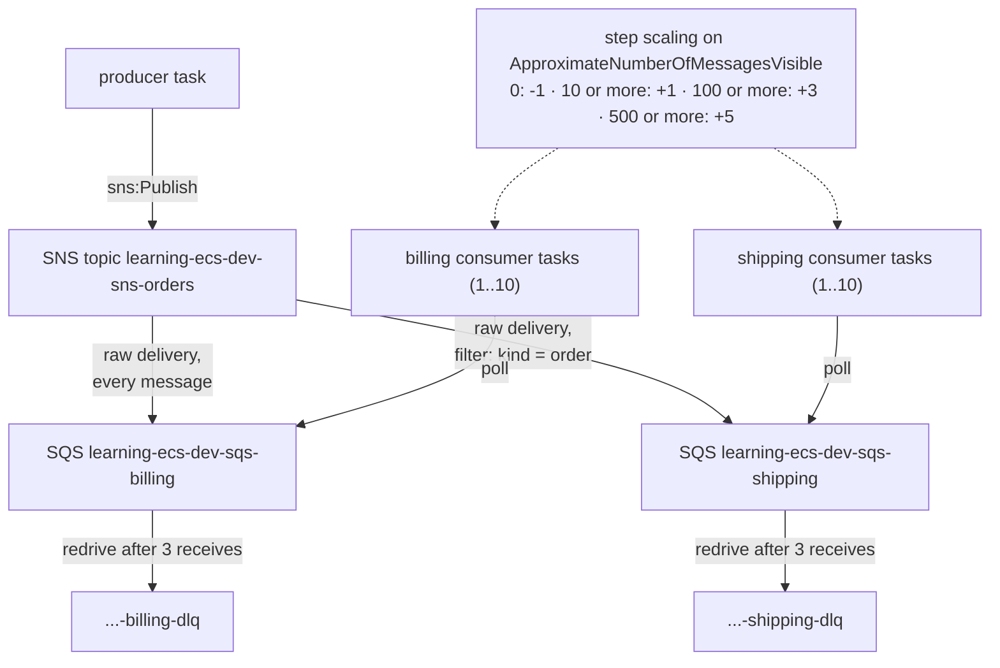

<!-- TOC -->

- [Module 14 - SQS + SNS (event-driven ECS services, fan-out, DLQs, queue-based scaling)](#module-14---sqs--sns-event-driven-ecs-services-fan-out-dlqs-queue-based-scaling)
  - [Overview](#overview)
  - [What you will learn](#what-you-will-learn)
  - [Architecture](#architecture)
  - [AWS services and CDK constructs used](#aws-services-and-cdk-constructs-used)
  - [Configuration](#configuration)
  - [Prerequisites](#prerequisites)
  - [Tests](#tests)
  - [Deploy with floci (local, free)](#deploy-with-floci-local-free)
  - [Deploy to real AWS (optional)](#deploy-to-real-aws-optional)
  - [Verify](#verify)
    - [List every resource with the AWS CLI](#list-every-resource-with-the-aws-cli)
  - [Manage it with the AWS CLI](#manage-it-with-the-aws-cli)
    - [Dead-letter queue and redrive](#dead-letter-queue-and-redrive)
    - [A topic, a queue and a filtered subscription, from scratch](#a-topic-a-queue-and-a-filtered-subscription-from-scratch)
  - [Metrics to watch](#metrics-to-watch)
  - [Troubleshooting](#troubleshooting)
  - [floci vs real AWS](#floci-vs-real-aws)
  - [Clean up](#clean-up)
  - [Notes and cautions](#notes-and-cautions)
  - [References](#references)

<!-- TOC -->

# Module 14 - SQS + SNS (event-driven ECS services, fan-out, DLQs, queue-based scaling)

## Overview

At scale, services talk through **queues and topics** more than through
synchronous calls: the producer doesn't wait, consumers work at their own
pace, a spike becomes a backlog instead of an outage, and each consumer
scales on its own backlog. This module builds the classic pattern with
three ECS services running the official [`amazon/aws-cli`](https://hub.docker.com/r/amazon/aws-cli)
image (no custom code - just shell loops around `aws sns publish` and
`aws sqs receive-message`):

- **producer** publishes an event to the **SNS topic** `orders` every few
  seconds, alternating `kind=order` and `kind=refund` (a message attribute);
- the topic **fans out** to two **SQS queues**: `billing` gets everything,
  `shipping` only `kind=order` (a **subscription filter policy**);
- **billing** and **shipping** consumers long-poll their queue, process
  and delete each message. A message that fails 3 times goes to the
  queue's **dead-letter queue**;
- each consumer **scales on its queue's backlog** (step scaling on
  `ApproximateNumberOfMessagesVisible`).

## What you will learn

- SNS -> SQS fan-out, raw message delivery and filter policies.
- Dead-letter queues, `maxReceiveCount`, visibility timeout - and redrive.
- Least-privilege task roles (`grant_publish`, `grant_consume_messages`).
- Worker services without load balancers and with `min_healthy_percent=0`.
- Queue-depth step scaling for ECS services (Application Auto Scaling).

## Architecture



<details>
<summary>Plain-text version (names and details)</summary>

```
 producer task --sns:Publish--> SNS topic learning-ecs-dev-sns-orders
                                   |  (raw delivery)              |  filter: kind = order
                                   v                              v
              SQS learning-ecs-dev-sqs-billing        SQS learning-ecs-dev-sqs-shipping
                 | redrive after 3 receives              | redrive after 3 receives
                 v                                        v
              ...-billing-dlq                           ...-shipping-dlq
                 ^                                        ^
       billing consumer tasks (1..10)            shipping consumer tasks (1..10)
       step scaling on ApproximateNumberOfMessagesVisible: 0 -> -1, >=10 -> +1, >=100 -> +3, >=500 -> +5
```

</details>

## AWS services and CDK constructs used

| AWS service | CDK construct (Python) | Level |
|---|---|---|
| Amazon SNS | `aws_cdk.aws_sns.Topic`, `SubscriptionFilter` | L2 |
| Amazon SNS | `aws_cdk.aws_sns_subscriptions.SqsSubscription` | L2 |
| Amazon SQS | `aws_cdk.aws_sqs.Queue`, `DeadLetterQueue` | L2 |
| Application Auto Scaling | `FargateService.auto_scale_task_count`, `ScalableTaskCount.scale_on_metric` | L2 |
| Amazon ECS | three `FargateService`s (via `shared/ecs.py`) | L2 |

## Configuration

| Variable | Default | Effect |
|---|---|---|
| `CDK_SQS_PUBLISH_INTERVAL_SECONDS` | `5` | seconds between published events |
| `CDK_SQS_PRODUCERS` | `1` | producer tasks |
| `CDK_SQS_WORK_SECONDS` | `2` | simulated processing time per message (visibility timeout = max(30, 6 x this)) |
| `CDK_SQS_MIN_CONSUMERS` / `CDK_SQS_MAX_CONSUMERS` | `1` / `10` | scaling range of each consumer service |
| `CDK_SQS_MAX_RECEIVES` | `3` | receives before a message goes to the DLQ |
| `CDK_SQS_IMAGE` | `amazon/aws-cli:2.37.8` | image of the three services |

## Prerequisites

[Module 02](../02_fargate_service/README.md). floci running and `.env` loaded.

## Tests

[`../../tests/unit/test_14_sqs_sns.py`](../../tests/unit/test_14_sqs_sns.py)
checks the topic, the four queues (encryption, redrive policy), the two
raw subscriptions and the `kind=order` filter policy, the publish/consume
permissions of the task roles, the backlog step scaling (scalable targets
and the `ApproximateNumberOfMessagesVisible` alarm), the three services, and
the mandatory tags:

```bash
uv run pytest tests/unit/test_14_sqs_sns.py -v
```

## Deploy with floci (local, free)

```bash
uv run cdk bootstrap
uv run cdk synth SqsSnsStack
uv run cdk diff SqsSnsStack
uv run cdk deploy SqsSnsStack --require-approval never --method=direct
```

## Deploy to real AWS (optional)

SNS and SQS bill per request (with a free tier), the three tasks and the
NAT Gateway hourly - see [Amazon SQS pricing](https://aws.amazon.com/sqs/pricing/)
and [Amazon SNS pricing](https://aws.amazon.com/sns/pricing/). The
consumers long-poll (20 s), which keeps empty receives low.

```bash
unset AWS_ENDPOINT_URL
uv run cdk bootstrap --profile <your-aws-cli-profile>
uv run cdk diff SqsSnsStack --profile <your-aws-cli-profile>
uv run cdk deploy SqsSnsStack --profile <your-aws-cli-profile>
```

## Verify

```bash
# real AWS: one log group per service
aws logs tail /ecs/learning-ecs/dev/events-producer --since 5m
aws logs tail /ecs/learning-ecs/dev/events-shipping --since 5m
# floci:
docker logs learning-ecs-floci 2>&1 | grep -E 'ecs:learning-ecs-dev-events-(producer|billing|shipping):app' | tail -10
# producer published order 1 / shipping processed {"id":1,"kind":"order"} / billing processed {"id":1,...}
# producer published refund 2 / billing processed {"id":2,"kind":"refund"}   <- shipping never sees refunds

# queue depth and in-flight messages
for q in billing shipping billing-dlq shipping-dlq; do
  url=$(aws sqs get-queue-url --queue-name "learning-ecs-dev-sqs-$q" --query QueueUrl --output text)
  echo "$q $(aws sqs get-queue-attributes --queue-url "$url" \
    --attribute-names ApproximateNumberOfMessages ApproximateNumberOfMessagesNotVisible --query Attributes --output text)"
done

# the scaling policies (real AWS)
aws application-autoscaling describe-scaling-policies --service-namespace ecs \
  --query "ScalingPolicies[?contains(ResourceId,'learning-ecs-dev-ecs-events')].[ResourceId,PolicyName,PolicyType]" --output table
```

See scaling in action (real AWS): stop the consumers' work from keeping up
by publishing a burst, then watch the desired count:

```bash
TOPIC=$(aws cloudformation describe-stacks --stack-name SqsSnsStack \
  --query "Stacks[0].Outputs[?OutputKey=='TopicArn'].OutputValue" --output text)
for i in $(seq 1 300); do aws sns publish --topic-arn "$TOPIC" --message "{\"id\":\"burst-$i\"}" >/dev/null; done
watch -n 30 "aws ecs describe-services --cluster learning-ecs-dev-ecs-events --services learning-ecs-dev-events-billing --query 'services[0].[desiredCount,runningCount]' --output text"
```

<!-- BEGIN resource-commands (generated by scripts/resource_commands.py) -->
### List every resource with the AWS CLI

Every resource this stack creates, one `aws` command each, parametrized
by environment (`ENV`), region (`REGION`) and - where a command builds an
ARN - account (`ACCOUNT`): set them to match your deployment, with your
`.env` loaded (floci) or your AWS profile active (real AWS). A resource
without a name of its own is looked up through the stack by its *logical
id* (`pid <LogicalId>`), which is the same in every environment. This block
is generated from the stack's template by
[`scripts/resource_commands.py`](../../scripts/resource_commands.py) - see
[`../../REQUIREMENTS.md`, section 5.8](../../REQUIREMENTS.md#58---listing-every-resource-a-stack-created);
`make cdk-resources STACK=SqsSnsStack` runs the same commands for you.

```bash
# Match these to your deployment: CDK_PRODUCT and CDK_ENVIRONMENT in .env, and
# the region you deployed to (floci: the one in .env).
PRODUCT=learning-ecs ENV=dev REGION=us-east-1
STACK=SqsSnsStack
ACCOUNT=$(aws sts get-caller-identity --query Account --output text)
# Physical id of one of the stack's resources, by its logical id - the same in
# every environment. A second argument names another (e.g. nested) stack.
pid() { aws cloudformation describe-stack-resource --stack-name "${2:-$STACK}" \
  --logical-resource-id "$1" --region "$REGION" \
  --query StackResourceDetail.PhysicalResourceId --output text; }

# Every resource the stack created - type, logical id, physical id, status:
aws cloudformation describe-stack-resources --stack-name "$STACK" --region "$REGION" \
  --query "StackResources[].[ResourceType,LogicalResourceId,PhysicalResourceId,ResourceStatus]" \
  --output table

# AWS::EC2::VPC (Vpc8378EB38)
aws ec2 describe-vpcs --vpc-ids "$(pid Vpc8378EB38)" --query "Vpcs[].[VpcId,CidrBlock,State]" --output table --region "$REGION"
# AWS::ECS::Cluster (ClusterEB0386A7)
aws ecs describe-clusters --clusters "${PRODUCT}-${ENV}-ecs-events" --query "clusters[].[clusterName,status]" --output table --region "$REGION"
# AWS::SNS::Topic (OrdersTopic47790A41)
aws sns get-topic-attributes --topic-arn "arn:aws:sns:${REGION}:${ACCOUNT}:${PRODUCT}-${ENV}-sns-orders" --query "Attributes.TopicArn" --output table --region "$REGION"
# AWS::SQS::Queue (BillingDeadLetterQueueB1B234AF)
aws sqs get-queue-url --queue-name "${PRODUCT}-${ENV}-sqs-billing-dlq" --query "QueueUrl" --output table --region "$REGION"
# AWS::SQS::Queue (BillingQueue49E1530E)
aws sqs get-queue-url --queue-name "${PRODUCT}-${ENV}-sqs-billing" --query "QueueUrl" --output table --region "$REGION"
# AWS::SNS::Subscription (BillingQueueSqsSnsStackOrdersTopic0718FD88412B58D2)
aws sns list-subscriptions-by-topic --topic-arn "$(pid OrdersTopic47790A41)" --query "Subscriptions[].[Protocol,Endpoint]" --output table --region "$REGION"
# AWS::IAM::Role (BillingConsumerTaskDefinitionTaskRole97B3B397)
aws iam get-role --role-name "$(pid BillingConsumerTaskDefinitionTaskRole97B3B397)" --query "Role.[RoleName,Arn]" --output table --region "$REGION"
# AWS::ECS::TaskDefinition (BillingConsumerTaskDefinition6E4D6511)
aws ecs describe-task-definition --task-definition "$(pid BillingConsumerTaskDefinition6E4D6511)" --query "taskDefinition.[family,revision,status]" --output table --region "$REGION"
# AWS::IAM::Role (BillingConsumerTaskDefinitionExecutionRole45449D65)
aws iam get-role --role-name "$(pid BillingConsumerTaskDefinitionExecutionRole45449D65)" --query "Role.[RoleName,Arn]" --output table --region "$REGION"
# AWS::Logs::LogGroup (BillingConsumerLogGroupE5271912)
aws logs describe-log-groups --log-group-name-prefix "/ecs/${PRODUCT}/${ENV}/events-billing" --query "logGroups[].[logGroupName,retentionInDays]" --output table --region "$REGION"
# AWS::ECS::Service (BillingConsumerServiceC072387B)
aws ecs describe-services --cluster "${PRODUCT}-${ENV}-ecs-events" --services "${PRODUCT}-${ENV}-events-billing" --query "services[].[serviceName,status,desiredCount]" --output table --region "$REGION"
# AWS::EC2::SecurityGroup (BillingConsumerServiceSecurityGroup254C49F4)
aws ec2 describe-security-groups --group-ids "$(pid BillingConsumerServiceSecurityGroup254C49F4)" --query "SecurityGroups[].[GroupId,GroupName,VpcId]" --output table --region "$REGION"
# AWS::ApplicationAutoScaling::ScalableTarget (BillingConsumerServiceTaskCountTarget473BD12E)
aws application-autoscaling describe-scalable-targets --service-namespace ecs --query "ScalableTargets[?contains(ResourceId, '${PRODUCT}-${ENV}-ecs-events')].[ResourceId,MinCapacity,MaxCapacity]" --output table --region "$REGION"
# AWS::ApplicationAutoScaling::ScalingPolicy (BillingConsumerServiceTaskCountTargetBacklogLowerPolicy878D1428)
aws application-autoscaling describe-scaling-policies --service-namespace ecs --query "ScalingPolicies[?contains(ResourceId, '${PRODUCT}-${ENV}-ecs-events')].[PolicyName,PolicyType]" --output table --region "$REGION"
# AWS::CloudWatch::Alarm (BillingConsumerServiceTaskCountTargetBacklogLowerAlarm7DA64E6E)
aws cloudwatch describe-alarms --alarm-names "$(pid BillingConsumerServiceTaskCountTargetBacklogLowerAlarm7DA64E6E)" --query "MetricAlarms[].[AlarmName,StateValue]" --output table --region "$REGION"
# AWS::ApplicationAutoScaling::ScalingPolicy (BillingConsumerServiceTaskCountTargetBacklogUpperPolicy639687BD)
aws application-autoscaling describe-scaling-policies --service-namespace ecs --query "ScalingPolicies[?contains(ResourceId, '${PRODUCT}-${ENV}-ecs-events')].[PolicyName,PolicyType]" --output table --region "$REGION"
# AWS::CloudWatch::Alarm (BillingConsumerServiceTaskCountTargetBacklogUpperAlarm601D4856)
aws cloudwatch describe-alarms --alarm-names "$(pid BillingConsumerServiceTaskCountTargetBacklogUpperAlarm601D4856)" --query "MetricAlarms[].[AlarmName,StateValue]" --output table --region "$REGION"
# AWS::SQS::Queue (ShippingDeadLetterQueue987D0B99)
aws sqs get-queue-url --queue-name "${PRODUCT}-${ENV}-sqs-shipping-dlq" --query "QueueUrl" --output table --region "$REGION"
# AWS::SQS::Queue (ShippingQueue710A7713)
aws sqs get-queue-url --queue-name "${PRODUCT}-${ENV}-sqs-shipping" --query "QueueUrl" --output table --region "$REGION"
# AWS::SNS::Subscription (ShippingQueueSqsSnsStackOrdersTopic0718FD884C5850EB)
aws sns list-subscriptions-by-topic --topic-arn "$(pid OrdersTopic47790A41)" --query "Subscriptions[].[Protocol,Endpoint]" --output table --region "$REGION"
# AWS::IAM::Role (ShippingConsumerTaskDefinitionTaskRole197B5B82)
aws iam get-role --role-name "$(pid ShippingConsumerTaskDefinitionTaskRole197B5B82)" --query "Role.[RoleName,Arn]" --output table --region "$REGION"
# AWS::ECS::TaskDefinition (ShippingConsumerTaskDefinition887EBCC8)
aws ecs describe-task-definition --task-definition "$(pid ShippingConsumerTaskDefinition887EBCC8)" --query "taskDefinition.[family,revision,status]" --output table --region "$REGION"
# AWS::IAM::Role (ShippingConsumerTaskDefinitionExecutionRoleEFA33584)
aws iam get-role --role-name "$(pid ShippingConsumerTaskDefinitionExecutionRoleEFA33584)" --query "Role.[RoleName,Arn]" --output table --region "$REGION"
# AWS::Logs::LogGroup (ShippingConsumerLogGroup0238A5C6)
aws logs describe-log-groups --log-group-name-prefix "/ecs/${PRODUCT}/${ENV}/events-shipping" --query "logGroups[].[logGroupName,retentionInDays]" --output table --region "$REGION"
# AWS::ECS::Service (ShippingConsumerService062CD76D)
aws ecs describe-services --cluster "${PRODUCT}-${ENV}-ecs-events" --services "${PRODUCT}-${ENV}-events-shipping" --query "services[].[serviceName,status,desiredCount]" --output table --region "$REGION"
# AWS::EC2::SecurityGroup (ShippingConsumerServiceSecurityGroup0EEE516E)
aws ec2 describe-security-groups --group-ids "$(pid ShippingConsumerServiceSecurityGroup0EEE516E)" --query "SecurityGroups[].[GroupId,GroupName,VpcId]" --output table --region "$REGION"
# AWS::ApplicationAutoScaling::ScalableTarget (ShippingConsumerServiceTaskCountTargetA8471F64)
aws application-autoscaling describe-scalable-targets --service-namespace ecs --query "ScalableTargets[?contains(ResourceId, '${PRODUCT}-${ENV}-ecs-events')].[ResourceId,MinCapacity,MaxCapacity]" --output table --region "$REGION"
# AWS::ApplicationAutoScaling::ScalingPolicy (ShippingConsumerServiceTaskCountTargetBacklogLowerPolicyF6487237)
aws application-autoscaling describe-scaling-policies --service-namespace ecs --query "ScalingPolicies[?contains(ResourceId, '${PRODUCT}-${ENV}-ecs-events')].[PolicyName,PolicyType]" --output table --region "$REGION"
# AWS::CloudWatch::Alarm (ShippingConsumerServiceTaskCountTargetBacklogLowerAlarm00B65137)
aws cloudwatch describe-alarms --alarm-names "$(pid ShippingConsumerServiceTaskCountTargetBacklogLowerAlarm00B65137)" --query "MetricAlarms[].[AlarmName,StateValue]" --output table --region "$REGION"
# AWS::ApplicationAutoScaling::ScalingPolicy (ShippingConsumerServiceTaskCountTargetBacklogUpperPolicy692FCAEF)
aws application-autoscaling describe-scaling-policies --service-namespace ecs --query "ScalingPolicies[?contains(ResourceId, '${PRODUCT}-${ENV}-ecs-events')].[PolicyName,PolicyType]" --output table --region "$REGION"
# AWS::CloudWatch::Alarm (ShippingConsumerServiceTaskCountTargetBacklogUpperAlarm4445E7F6)
aws cloudwatch describe-alarms --alarm-names "$(pid ShippingConsumerServiceTaskCountTargetBacklogUpperAlarm4445E7F6)" --query "MetricAlarms[].[AlarmName,StateValue]" --output table --region "$REGION"
# AWS::IAM::Role (ProducerTaskDefinitionTaskRole18392769)
aws iam get-role --role-name "$(pid ProducerTaskDefinitionTaskRole18392769)" --query "Role.[RoleName,Arn]" --output table --region "$REGION"
# AWS::ECS::TaskDefinition (ProducerTaskDefinition897BE53F)
aws ecs describe-task-definition --task-definition "$(pid ProducerTaskDefinition897BE53F)" --query "taskDefinition.[family,revision,status]" --output table --region "$REGION"
# AWS::IAM::Role (ProducerTaskDefinitionExecutionRoleA9E8B960)
aws iam get-role --role-name "$(pid ProducerTaskDefinitionExecutionRoleA9E8B960)" --query "Role.[RoleName,Arn]" --output table --region "$REGION"
# AWS::Logs::LogGroup (ProducerLogGroupE447C981)
aws logs describe-log-groups --log-group-name-prefix "/ecs/${PRODUCT}/${ENV}/events-producer" --query "logGroups[].[logGroupName,retentionInDays]" --output table --region "$REGION"
# AWS::ECS::Service (ProducerService29336DA5)
aws ecs describe-services --cluster "${PRODUCT}-${ENV}-ecs-events" --services "${PRODUCT}-${ENV}-events-producer" --query "services[].[serviceName,status,desiredCount]" --output table --region "$REGION"
# AWS::EC2::SecurityGroup (ProducerServiceSecurityGroupAA9942A1)
aws ec2 describe-security-groups --group-ids "$(pid ProducerServiceSecurityGroupAA9942A1)" --query "SecurityGroups[].[GroupId,GroupName,VpcId]" --output table --region "$REGION"
# Also created - listed in the table above:
#   11 VPC sub-resources (subnets, route tables, gateways, endpoints) - built by shared/network.py, listed one by one in modules/01_network/README.md
#   AWS::ECS::ClusterCapacityProviderAssociations Cluster3DA9CCBA - shown by its ECS cluster (describe-clusters --include ATTACHMENTS)
#   AWS::SQS::QueuePolicy BillingQueuePolicy277E06C9 - shown by its queue
#   AWS::IAM::Policy BillingConsumerTaskDefinitionTaskRoleDefaultPolicyB5F0CF36 - shown by its IAM role
#   AWS::IAM::Policy BillingConsumerTaskDefinitionExecutionRoleDefaultPolicy19DEBCCC - shown by its IAM role
#   AWS::SQS::QueuePolicy ShippingQueuePolicyD065A787 - shown by its queue
#   AWS::IAM::Policy ShippingConsumerTaskDefinitionTaskRoleDefaultPolicyF37ED3FE - shown by its IAM role
#   AWS::IAM::Policy ShippingConsumerTaskDefinitionExecutionRoleDefaultPolicy7F145C3F - shown by its IAM role
#   AWS::IAM::Policy ProducerTaskDefinitionTaskRoleDefaultPolicy8DDD0211 - shown by its IAM role
#   AWS::IAM::Policy ProducerTaskDefinitionExecutionRoleDefaultPolicyDFCD56D7 - shown by its IAM role
```

**On floci** (2.1.0), CloudFormation records `AWS::ApplicationAutoScaling::ScalableTarget`, `AWS::ApplicationAutoScaling::ScalingPolicy` without creating them, so those commands find nothing there - they work on real AWS. See [`REQUIREMENTS.md`, section 10](../../REQUIREMENTS.md#10-floci-vs-real-aws).
<!-- END resource-commands -->

## Manage it with the AWS CLI

Run against floci while writing this module.

### Dead-letter queue and redrive

```bash
Q=$(aws sqs get-queue-url --queue-name learning-ecs-dev-sqs-billing --query QueueUrl --output text)
DLQ=$(aws sqs get-queue-url --queue-name learning-ecs-dev-sqs-billing-dlq --query QueueUrl --output text)

# Pause the consumer so nothing else receives the message
aws ecs update-service --cluster learning-ecs-dev-ecs-events --service learning-ecs-dev-events-billing --desired-count 0

# A "poison" message: received 3 times without being deleted -> moved to the DLQ on the next receive
aws sqs send-message --queue-url "$Q" --message-body '{"id":"poison"}'
for i in 1 2 3 4; do
  aws sqs receive-message --queue-url "$Q" --visibility-timeout 0 --wait-time-seconds 2 \
    --attribute-names ApproximateReceiveCount --query 'Messages[0].[Body,Attributes.ApproximateReceiveCount]' --output text
done
aws sqs get-queue-attributes --queue-url "$DLQ" --attribute-names ApproximateNumberOfMessages   # 1

# Redrive: move the DLQ's messages back to their source queue (after fixing the consumer)
DLQ_ARN=$(aws sqs get-queue-attributes --queue-url "$DLQ" --attribute-names QueueArn --query Attributes.QueueArn --output text)
aws sqs start-message-move-task --source-arn "$DLQ_ARN"
aws sqs list-message-move-tasks --source-arn "$DLQ_ARN" --query 'Results[0].Status'

aws ecs update-service --cluster learning-ecs-dev-ecs-events --service learning-ecs-dev-events-billing --desired-count 1

# Other day-2 operations
aws sqs set-queue-attributes --queue-url "$Q" --attributes VisibilityTimeout=60
aws sqs purge-queue --queue-url "$Q"                         # deletes every message - careful
```

### A topic, a queue and a filtered subscription, from scratch

```bash
TOPIC=$(aws sns create-topic --name manual-orders --query TopicArn --output text)
DLQ_URL=$(aws sqs create-queue --queue-name manual-shipping-dlq --query QueueUrl --output text)
DLQ_ARN=$(aws sqs get-queue-attributes --queue-url "$DLQ_URL" --attribute-names QueueArn --query Attributes.QueueArn --output text)
Q_URL=$(aws sqs create-queue --queue-name manual-shipping --attributes \
  "{\"VisibilityTimeout\":\"30\",\"RedrivePolicy\":\"{\\\"deadLetterTargetArn\\\":\\\"$DLQ_ARN\\\",\\\"maxReceiveCount\\\":\\\"3\\\"}\"}" \
  --query QueueUrl --output text)
Q_ARN=$(aws sqs get-queue-attributes --queue-url "$Q_URL" --attribute-names QueueArn --query Attributes.QueueArn --output text)

# The queue must allow the topic to send to it (the CDK writes this policy for you)
aws sqs set-queue-attributes --queue-url "$Q_URL" --attributes \
  "{\"Policy\":\"{\\\"Version\\\":\\\"2012-10-17\\\",\\\"Statement\\\":[{\\\"Effect\\\":\\\"Allow\\\",\\\"Principal\\\":{\\\"Service\\\":\\\"sns.amazonaws.com\\\"},\\\"Action\\\":\\\"sqs:SendMessage\\\",\\\"Resource\\\":\\\"$Q_ARN\\\",\\\"Condition\\\":{\\\"ArnEquals\\\":{\\\"aws:SourceArn\\\":\\\"$TOPIC\\\"}}}]}\"}"

SUB=$(aws sns subscribe --topic-arn "$TOPIC" --protocol sqs --notification-endpoint "$Q_ARN" \
  --attributes '{"RawMessageDelivery":"true","FilterPolicy":"{\"kind\":[\"order\"]}"}' \
  --return-subscription-arn --query SubscriptionArn --output text)

aws sns publish --topic-arn "$TOPIC" --message '{"id":1}' --message-attributes '{"kind":{"DataType":"String","StringValue":"order"}}'
aws sns publish --topic-arn "$TOPIC" --message '{"id":2}' --message-attributes '{"kind":{"DataType":"String","StringValue":"refund"}}'
aws sqs receive-message --queue-url "$Q_URL" --wait-time-seconds 2 --max-number-of-messages 10 --query 'Messages[].Body'   # only {"id":1}

# change the filter
aws sns set-subscription-attributes --subscription-arn "$SUB" --attribute-name FilterPolicy \
  --attribute-value '{"kind":["order","refund"]}'

# delete
aws sns unsubscribe --subscription-arn "$SUB"
aws sns delete-topic --topic-arn "$TOPIC"
aws sqs delete-queue --queue-url "$Q_URL"; aws sqs delete-queue --queue-url "$DLQ_URL"
```

## Metrics to watch

| Namespace | Metric | Dimension | Watch for |
|---|---|---|---|
| `AWS/SQS` | `ApproximateNumberOfMessagesVisible` | `QueueName` | backlog - the scaling input here |
| `AWS/SQS` | `ApproximateAgeOfOldestMessage` | `QueueName` | how late processing is (often the better SLO metric) |
| `AWS/SQS` | `NumberOfMessagesSent` / `NumberOfMessagesReceived` / `NumberOfMessagesDeleted` | `QueueName` | throughput; received >> deleted means failures/retries |
| `AWS/SQS` | `NumberOfEmptyReceives` | `QueueName` | polling cost (long polling keeps it low) |
| `AWS/SQS` | `ApproximateNumberOfMessagesVisible` on a **DLQ** | `QueueName` | any value > 0 deserves an alarm |
| `AWS/SNS` | `NumberOfMessagesPublished`, `NumberOfNotificationsDelivered`, `NumberOfNotificationsFailed` | `TopicName` | delivery problems (e.g. a queue policy that denies SNS) |
| `AWS/SNS` | `NumberOfNotificationsFilteredOut` | `TopicName` | how much the filter policy drops |

```bash
aws cloudwatch get-metric-statistics --namespace AWS/SQS --metric-name ApproximateAgeOfOldestMessage \
  --dimensions Name=QueueName,Value=learning-ecs-dev-sqs-billing \
  --start-time "$(date -u -d '-1 hour' +%Y-%m-%dT%H:%M:%SZ)" --end-time "$(date -u +%Y-%m-%dT%H:%M:%SZ)" \
  --period 60 --statistics Maximum --output table
```

## Troubleshooting

| Symptom | Where to look | Typical cause / fix |
|---|---|---|
| Messages published but never arrive in a queue | `NumberOfNotificationsFailed`, the queue's access policy | the queue policy doesn't allow the topic (`sqs:SendMessage` with `aws:SourceArn`), or KMS permissions on an encrypted queue |
| Messages arrive in one queue but not another | `NumberOfNotificationsFilteredOut`, the filter policy | the message lacks the attribute the filter matches (attributes, not the body, unless filtering on the body) |
| The same message is processed twice | visibility timeout | processing took longer than the visibility timeout - raise it, or make processing idempotent (SQS standard queues deliver at least once) |
| DLQ fills up | consumer logs | the consumer fails (or never deletes); fix it, then redrive |
| `AccessDenied` in consumer logs | task role | missing `sqs:ReceiveMessage`/`DeleteMessage` (or `kms:Decrypt`) |
| Backlog grows but no new tasks | scaling activities | `aws application-autoscaling describe-scaling-activities --service-namespace ecs` - max capacity reached, or cooldown |

More: [`../../docs/TROUBLESHOOTING.md`](../../docs/TROUBLESHOOTING.md).

## floci vs real AWS

| Behavior | floci 2.1.0 | Real AWS |
|---|---|---|
| Topic, queues, DLQs, subscriptions, filter policies, raw delivery | created and working | same |
| Redrive (`maxReceiveCount`), `start-message-move-task` | work | work |
| AWS credentials in the tasks | floci injects `AWS_ENDPOINT_URL` + test keys | the task role |
| Queue URLs | `https://floci:4566/<account>/<name>` | `https://sqs.<region>.amazonaws.com/<account>/<name>` |
| `ApplicationAutoScaling::ScalableTarget`/`ScalingPolicy` from CloudFormation | **not created** (stubbed) - no scaling | scales |
| SQS/SNS metrics | not produced | produced |

## Clean up

```bash
uv run cdk destroy SqsSnsStack
uv run python scripts/floci_prune.py --apply   # floci only
```

## Notes and cautions

- **Cost**: see [Deploy to real AWS](#deploy-to-real-aws-optional).
- **At-least-once delivery**: standard queues can deliver a message more
  than once and out of order - make consumers idempotent, or use FIFO
  queues/topics where ordering and deduplication matter.
- **Scaling on backlog per task** (`backlog / running tasks` against a
  target) is the more precise variant of this policy - see
  [module 16](../16_autoscaling/README.md).
- The CDK pattern `aws_ecs_patterns.QueueProcessingFargateService` builds a
  queue + worker service + backlog scaling in one construct.

## References

- [Amazon SNS message filtering](https://docs.aws.amazon.com/sns/latest/dg/sns-message-filtering.html) · [Fanout to Amazon SQS queues](https://docs.aws.amazon.com/sns/latest/dg/sns-sqs-as-subscriber.html)
- [Amazon SQS dead-letter queues](https://docs.aws.amazon.com/AWSSimpleQueueService/latest/SQSDeveloperGuide/sqs-dead-letter-queues.html) · [Visibility timeout](https://docs.aws.amazon.com/AWSSimpleQueueService/latest/SQSDeveloperGuide/sqs-visibility-timeout.html)
- [Step scaling policies for Application Auto Scaling](https://docs.aws.amazon.com/autoscaling/application/userguide/application-auto-scaling-step-scaling-policies.html)
- [Available CloudWatch metrics for Amazon SQS](https://docs.aws.amazon.com/AWSSimpleQueueService/latest/SQSDeveloperGuide/sqs-available-cloudwatch-metrics.html) · [Amazon SNS metrics](https://docs.aws.amazon.com/sns/latest/dg/sns-monitoring-using-cloudwatch.html)
- [AWS CDK API Reference (Python) - `aws_cdk.aws_sns_subscriptions.SqsSubscription`](https://docs.aws.amazon.com/cdk/api/v2/python/aws_cdk.aws_sns_subscriptions/SqsSubscription.html) · [`aws_cdk.aws_sqs.Queue`](https://docs.aws.amazon.com/cdk/api/v2/python/aws_cdk.aws_sqs/Queue.html)
- [Docker Hub - amazon/aws-cli](https://hub.docker.com/r/amazon/aws-cli)
