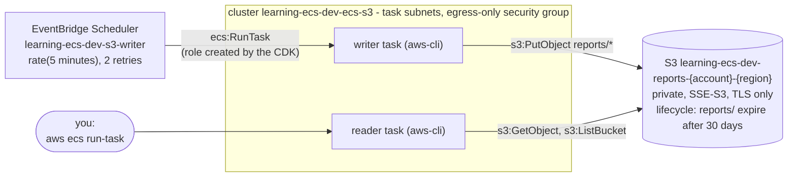

<!-- TOC -->

- [Module 15 - S3 (scheduled ECS tasks writing and reading a bucket with task roles)](#module-15---s3-scheduled-ecs-tasks-writing-and-reading-a-bucket-with-task-roles)
  - [Overview](#overview)
  - [What you will learn](#what-you-will-learn)
  - [Architecture](#architecture)
  - [AWS services and CDK constructs used](#aws-services-and-cdk-constructs-used)
  - [Configuration](#configuration)
  - [Prerequisites](#prerequisites)
  - [Tests](#tests)
  - [Deploy with floci (local, free)](#deploy-with-floci-local-free)
  - [Deploy to real AWS (optional)](#deploy-to-real-aws-optional)
  - [Verify](#verify)
    - [List every resource with the AWS CLI](#list-every-resource-with-the-aws-cli)
  - [Manage it with the AWS CLI](#manage-it-with-the-aws-cli)
    - [Run the tasks on demand](#run-the-tasks-on-demand)
    - [The schedule](#the-schedule)
    - [A bucket, from scratch](#a-bucket-from-scratch)
  - [Metrics to watch](#metrics-to-watch)
  - [Troubleshooting](#troubleshooting)
  - [floci vs real AWS](#floci-vs-real-aws)
  - [Clean up](#clean-up)
  - [Notes and cautions](#notes-and-cautions)
  - [References](#references)

<!-- TOC -->

# Module 15 - S3 (scheduled ECS tasks writing and reading a bucket with task roles)

## Overview

Not every ECS workload is a long-running service. Batch jobs, reports and
exports run as **standalone tasks**: on demand (`aws ecs run-task`) or on
a **schedule** (EventBridge Scheduler calling `RunTask`). This module
builds one such job with the official
[`amazon/aws-cli`](https://hub.docker.com/r/amazon/aws-cli) image:

- a **private S3 bucket**: public access blocked, S3-managed encryption,
  TLS enforced by the bucket policy, optional versioning, and a lifecycle
  rule that expires reports after `CDK_S3_EXPIRE_DAYS` days;
- a **writer task**, run every 5 minutes by an **EventBridge Scheduler
  schedule**, that writes a small JSON report to `reports/`. Its task role
  may only put objects under `reports/*` (plus read, to count them);
- a **reader task**, run on demand, that lists the newest reports and
  prints the latest one. Its task role may only read.

Neither container has credentials of its own: the AWS CLI inside the
container gets the **task role**'s temporary credentials from the
credentials endpoint ECS provides to the task.

## What you will learn

- Standalone tasks vs services; `run-task` with `awsvpc` networking.
- Scheduled tasks with EventBridge Scheduler (rate/cron expressions,
  retries, enable/disable).
- Least-privilege task roles for S3 (`grant_put` on a prefix, `grant_read`).
- Bucket security defaults: block public access, encryption, `enforce_ssl`,
  versioning and lifecycle rules.

## Architecture



<details>
<summary>Plain-text version (names and details)</summary>

```
 EventBridge Scheduler  learning-ecs-dev-s3-writer  rate(5 minutes), 2 retries
        |  ecs:RunTask (role created by the CDK)
        v
 writer task (aws-cli) --s3:PutObject reports/*--> S3 learning-ecs-dev-reports-<account>-<region>
                                                     |  private, SSE-S3, TLS only
 reader task (aws-cli) <--s3:GetObject/ListBucket----+  lifecycle: reports/ expire after 30 days
   (aws ecs run-task, on demand)
 both tasks: cluster learning-ecs-dev-ecs-s3, task subnets of the module's VPC, egress-only security group
```

</details>

## AWS services and CDK constructs used

| AWS service | CDK construct (Python) | Level |
|---|---|---|
| Amazon S3 | `aws_cdk.aws_s3.Bucket`, `LifecycleRule` | L2 |
| Amazon EventBridge Scheduler | `aws_cdk.aws_scheduler.Schedule`, `ScheduleExpression` | L2 |
| Amazon EventBridge Scheduler | `aws_cdk.aws_scheduler_targets.EcsRunFargateTask` | L2 |
| Amazon ECS | two `FargateTaskDefinition`s, cluster (via `shared/ecs.py`) | L2 |
| AWS IAM | task roles via `Bucket.grant_put` / `grant_read` | L2 |

## Configuration

| Variable | Default | Effect |
|---|---|---|
| `CDK_S3_SCHEDULE` | `rate(5 minutes)` | schedule expression: `rate(...)`, `cron(...)` or `at(...)` |
| `CDK_S3_SCHEDULE_ENABLED` | `true` | `false` creates the schedule disabled |
| `CDK_S3_VERSIONED` | `false` | keep previous versions of overwritten/deleted objects |
| `CDK_S3_EXPIRE_DAYS` | `30` | days after which objects under `reports/` expire (noncurrent versions: 7 days) |
| `CDK_S3_IMAGE` | `amazon/aws-cli:2.37.8` | image of both tasks |

The bucket is named `<product>-<env>-reports-<account>-<region>`: bucket
names are global across all AWS accounts, and the account and region keep
it unique.

## Prerequisites

[Module 02](../02_fargate_service/README.md). floci running and `.env` loaded.

## Tests

[`../../tests/unit/test_15_s3.py`](../../tests/unit/test_15_s3.py) checks
the bucket (public access block, encryption, lifecycle rule, the TLS-only
bucket policy), versioning and expiration overrides, the writer's
`s3:PutObject` limited to `reports/*` and the read-only reader, the
schedule (name, expression, state, retries), the two task definitions and
the mandatory tags:

```bash
uv run pytest tests/unit/test_15_s3.py -v
```

## Deploy with floci (local, free)

```bash
uv run cdk bootstrap
uv run cdk synth S3Stack
uv run cdk diff S3Stack
uv run cdk deploy S3Stack --require-approval never --method=direct
```

floci does not create the schedule (see [floci vs real AWS](#floci-vs-real-aws)):
run the writer by hand as shown in [Run the tasks on demand](#run-the-tasks-on-demand).

## Deploy to real AWS (optional)

S3 bills storage and requests (tiny here), the scheduled Fargate task
bills per second while it runs, plus the NAT Gateway hourly - see
[Amazon S3 pricing](https://aws.amazon.com/s3/pricing/) and
[Amazon EventBridge pricing](https://aws.amazon.com/eventbridge/pricing/).

```bash
unset AWS_ENDPOINT_URL
uv run cdk bootstrap --profile <your-aws-cli-profile>
uv run cdk diff S3Stack --profile <your-aws-cli-profile>
uv run cdk deploy S3Stack --profile <your-aws-cli-profile>
```

## Verify

```bash
out() { aws cloudformation describe-stacks --stack-name S3Stack \
  --query "Stacks[0].Outputs[?OutputKey=='$1'].OutputValue" --output text; }
BUCKET=$(out BucketName)

# real AWS: wait for the first scheduled run (up to 5 minutes), then
aws s3 ls "s3://$BUCKET/reports/"
aws logs tail /ecs/learning-ecs/dev/s3-writer --since 15m
# wrote reports/2026-10-02T12-05-00Z.json

# the bucket's protections
aws s3api get-public-access-block --bucket "$BUCKET"
aws s3api get-bucket-encryption --bucket "$BUCKET"
aws s3api get-bucket-policy --bucket "$BUCKET" --query Policy --output text   # Deny when aws:SecureTransport is false
aws s3api get-bucket-lifecycle-configuration --bucket "$BUCKET"
aws s3api get-bucket-versioning --bucket "$BUCKET"                             # empty unless CDK_S3_VERSIONED=true
```

<!-- BEGIN resource-commands (generated by scripts/resource_commands.py) -->
### List every resource with the AWS CLI

Every resource this stack creates, one `aws` command each, parametrized
by environment (`ENV`), region (`REGION`) and - where a command builds an
ARN - account (`ACCOUNT`): set them to match your deployment, with your
`.env` loaded (floci) or your AWS profile active (real AWS). A resource
without a name of its own is looked up through the stack by its *logical
id* (`pid <LogicalId>`), which is the same in every environment. This block
is generated from the stack's template by
[`scripts/resource_commands.py`](../../scripts/resource_commands.py) - see
[`../../REQUIREMENTS.md`, section 5.8](../../REQUIREMENTS.md#58---listing-every-resource-a-stack-created);
`make cdk-resources STACK=S3Stack` runs the same commands for you.

```bash
# Match these to your deployment: CDK_PRODUCT and CDK_ENVIRONMENT in .env, and
# the region you deployed to (floci: the one in .env).
PRODUCT=learning-ecs ENV=dev REGION=us-east-1
STACK=S3Stack
# Physical id of one of the stack's resources, by its logical id - the same in
# every environment. A second argument names another (e.g. nested) stack.
pid() { aws cloudformation describe-stack-resource --stack-name "${2:-$STACK}" \
  --logical-resource-id "$1" --region "$REGION" \
  --query StackResourceDetail.PhysicalResourceId --output text; }

# Every resource the stack created - type, logical id, physical id, status:
aws cloudformation describe-stack-resources --stack-name "$STACK" --region "$REGION" \
  --query "StackResources[].[ResourceType,LogicalResourceId,PhysicalResourceId,ResourceStatus]" \
  --output table

# AWS::EC2::VPC (Vpc8378EB38)
aws ec2 describe-vpcs --vpc-ids "$(pid Vpc8378EB38)" --query "Vpcs[].[VpcId,CidrBlock,State]" --output table --region "$REGION"
# AWS::ECS::Cluster (ClusterEB0386A7)
aws ecs describe-clusters --clusters "${PRODUCT}-${ENV}-ecs-s3" --query "clusters[].[clusterName,status]" --output table --region "$REGION"
# AWS::S3::Bucket (ReportsBucket4E7C5994)
aws s3api list-buckets --query "Buckets[?Name=='${PRODUCT}-${ENV}-reports-000000000000-us-east-1'].[Name,CreationDate]" --output table --region "$REGION"
# AWS::IAM::Role (CustomS3AutoDeleteObjectsCustomResourceProviderRole3B1BD092)
aws iam get-role --role-name "$(pid CustomS3AutoDeleteObjectsCustomResourceProviderRole3B1BD092)" --query "Role.[RoleName,Arn]" --output table --region "$REGION"
# AWS::Lambda::Function (CustomS3AutoDeleteObjectsCustomResourceProviderHandler9D90184F)
aws lambda get-function --function-name "$(pid CustomS3AutoDeleteObjectsCustomResourceProviderHandler9D90184F)" --query "Configuration.[FunctionName,Runtime,State]" --output table --region "$REGION"
# AWS::IAM::Role (WriterTaskDefinitionTaskRoleC281970E)
aws iam get-role --role-name "$(pid WriterTaskDefinitionTaskRoleC281970E)" --query "Role.[RoleName,Arn]" --output table --region "$REGION"
# AWS::ECS::TaskDefinition (WriterTaskDefinition9A7CC2DC)
aws ecs describe-task-definition --task-definition "$(pid WriterTaskDefinition9A7CC2DC)" --query "taskDefinition.[family,revision,status]" --output table --region "$REGION"
# AWS::IAM::Role (WriterTaskDefinitionExecutionRole699B656C)
aws iam get-role --role-name "$(pid WriterTaskDefinitionExecutionRole699B656C)" --query "Role.[RoleName,Arn]" --output table --region "$REGION"
# AWS::Logs::LogGroup (WriterTaskDefinitionLogGroup2081587F)
aws logs describe-log-groups --log-group-name-prefix "/ecs/${PRODUCT}/${ENV}/s3-writer" --query "logGroups[].[logGroupName,retentionInDays]" --output table --region "$REGION"
# AWS::IAM::Role (ReaderTaskDefinitionTaskRole7A6E1496)
aws iam get-role --role-name "$(pid ReaderTaskDefinitionTaskRole7A6E1496)" --query "Role.[RoleName,Arn]" --output table --region "$REGION"
# AWS::ECS::TaskDefinition (ReaderTaskDefinition5C0D28F9)
aws ecs describe-task-definition --task-definition "$(pid ReaderTaskDefinition5C0D28F9)" --query "taskDefinition.[family,revision,status]" --output table --region "$REGION"
# AWS::IAM::Role (ReaderTaskDefinitionExecutionRoleE74CC684)
aws iam get-role --role-name "$(pid ReaderTaskDefinitionExecutionRoleE74CC684)" --query "Role.[RoleName,Arn]" --output table --region "$REGION"
# AWS::Logs::LogGroup (ReaderTaskDefinitionLogGroupE5E667B8)
aws logs describe-log-groups --log-group-name-prefix "/ecs/${PRODUCT}/${ENV}/s3-reader" --query "logGroups[].[logGroupName,retentionInDays]" --output table --region "$REGION"
# AWS::EC2::SecurityGroup (TaskSecurityGroup2D2EA438)
aws ec2 describe-security-groups --group-ids "$(pid TaskSecurityGroup2D2EA438)" --query "SecurityGroups[].[GroupId,GroupName,VpcId]" --output table --region "$REGION"
# AWS::Scheduler::Schedule (WriterScheduleC8ACCF03)
aws scheduler get-schedule --name "${PRODUCT}-${ENV}-s3-writer" --query "[Name,State,ScheduleExpression]" --output table --region "$REGION"
# AWS::IAM::Role (SchedulerRoleForTarget0173fd6BD2182B)
aws iam get-role --role-name "$(pid SchedulerRoleForTarget0173fd6BD2182B)" --query "Role.[RoleName,Arn]" --output table --region "$REGION"
# Also created - listed in the table above:
#   11 VPC sub-resources (subnets, route tables, gateways, endpoints) - built by shared/network.py, listed one by one in modules/01_network/README.md
#   AWS::ECS::ClusterCapacityProviderAssociations Cluster3DA9CCBA - shown by its ECS cluster (describe-clusters --include ATTACHMENTS)
#   AWS::S3::BucketPolicy ReportsBucketPolicy11C4A507 - shown by its bucket
#   Custom::S3AutoDeleteObjects ReportsBucketAutoDeleteObjectsCustomResource98FB8A10 - shown by the provider Lambda function and role listed here
#   AWS::IAM::Policy WriterTaskDefinitionTaskRoleDefaultPolicy82E33F4F - shown by its IAM role
#   AWS::IAM::Policy WriterTaskDefinitionExecutionRoleDefaultPolicyCE5E3A43 - shown by its IAM role
#   AWS::IAM::Policy ReaderTaskDefinitionTaskRoleDefaultPolicy3BB13E35 - shown by its IAM role
#   AWS::IAM::Policy ReaderTaskDefinitionExecutionRoleDefaultPolicy6EBFD426 - shown by its IAM role
#   AWS::IAM::Policy SchedulerRoleForTarget0173fdDefaultPolicy84DEE8B2 - shown by its IAM role
```

**On floci** (2.1.0), CloudFormation records `AWS::Scheduler::Schedule` without creating it, so those commands find nothing there - they work on real AWS. See [`REQUIREMENTS.md`, section 10](../../REQUIREMENTS.md#10-floci-vs-real-aws).
<!-- END resource-commands -->

## Manage it with the AWS CLI

Run against floci while writing this module (except where noted).

### Run the tasks on demand

`run-task` needs the network configuration a service would otherwise
carry for you: subnets, security group and, in public subnets, a public IP
(see `CDK_TASK_SUBNETS` in [`../../REQUIREMENTS.md`, section 9](../../REQUIREMENTS.md#9-flexible-configuration)).

```bash
CLUSTER=$(out ClusterName)
NET="awsvpcConfiguration={subnets=[$(out TaskSubnetIds)],securityGroups=[$(out TaskSecurityGroupId)],assignPublicIp=DISABLED}"
# assignPublicIp=ENABLED when CDK_TASK_SUBNETS=public

# Use the task definition ARNs from the outputs (a bare family may pick a stale revision on floci)
TASK=$(aws ecs run-task --cluster "$CLUSTER" --task-definition "$(out WriterTaskDefinitionArn)" \
  --launch-type FARGATE --network-configuration "$NET" --query 'tasks[0].taskArn' --output text)
aws ecs wait tasks-stopped --cluster "$CLUSTER" --tasks "$TASK"
aws ecs describe-tasks --cluster "$CLUSTER" --tasks "$TASK" \
  --query 'tasks[0].[lastStatus,stopCode,containers[0].exitCode]' --output text   # STOPPED EssentialContainerExited 0

aws ecs run-task --cluster "$CLUSTER" --task-definition "$(out ReaderTaskDefinitionArn)" \
  --launch-type FARGATE --network-configuration "$NET" --query 'tasks[0].taskArn' --output text

# Output - real AWS:
aws logs tail /ecs/learning-ecs/dev/s3-reader --since 5m
# floci:
docker logs learning-ecs-floci 2>&1 | grep -E 'ecs:learning-ecs-dev-s3-(writer|reader):app' | tail -10
# latest: reports/2026-10-02T12-10-00Z.json
# {"generated_at":"2026-10-02T12-10-00Z","task":"...","previous_reports":3}

# Override the command for one run (same image, same task role)
aws ecs run-task --cluster "$CLUSTER" --task-definition "$(out ReaderTaskDefinitionArn)" \
  --launch-type FARGATE --network-configuration "$NET" \
  --overrides '{"containerOverrides":[{"name":"app","command":["aws s3 ls s3://$BUCKET --recursive --summarize"]}]}'

# The task role in action: the reader may not write (AccessDenied on real AWS; floci does not enforce IAM)
aws ecs run-task --cluster "$CLUSTER" --task-definition "$(out ReaderTaskDefinitionArn)" \
  --launch-type FARGATE --network-configuration "$NET" \
  --overrides '{"containerOverrides":[{"name":"app","command":["echo x | aws s3 cp - s3://$BUCKET/reports/forbidden.txt"]}]}'
```

### The schedule

These commands manage an EventBridge Scheduler schedule. They work on
floci, but floci does not create the stack's own schedule from
CloudFormation, so run the `get`/`update` lines against real AWS (or
against the `manual-test` schedule below).

```bash
SCHEDULE=learning-ecs-dev-s3-writer
aws scheduler get-schedule --name "$SCHEDULE" \
  --query '[State,ScheduleExpression,Target.RetryPolicy.MaximumRetryAttempts]' --output text
aws scheduler list-schedules --name-prefix learning-ecs-dev --query 'Schedules[].[Name,State]' --output table

# Pause/resume: update-schedule replaces the WHOLE definition, so send the current target back
aws scheduler get-schedule --name "$SCHEDULE" --query Target > /tmp/target.json
aws scheduler update-schedule --name "$SCHEDULE" --schedule-expression 'rate(5 minutes)' \
  --flexible-time-window Mode=OFF --target file:///tmp/target.json --state DISABLED
# Prefer CDK_S3_SCHEDULE_ENABLED=false + cdk deploy, so the stack does not drift.

# A schedule from scratch (cron: 02:00 UTC every day)
aws scheduler create-schedule --name manual-test \
  --schedule-expression 'cron(0 2 * * ? *)' --schedule-expression-timezone UTC \
  --flexible-time-window Mode=OFF \
  --target "{\"Arn\":\"<cluster-arn>\",\"RoleArn\":\"<role-that-may-ecs:RunTask-and-iam:PassRole>\",
             \"EcsParameters\":{\"TaskDefinitionArn\":\"$(out WriterTaskDefinitionArn)\",\"LaunchType\":\"FARGATE\",
             \"NetworkConfiguration\":{\"awsvpcConfiguration\":{\"Subnets\":[\"<subnet-id>\"],\"SecurityGroups\":[\"<sg-id>\"]}}},
             \"RetryPolicy\":{\"MaximumRetryAttempts\":2}}"
aws scheduler delete-schedule --name manual-test
```

The schedule's role (`SchedulerRoleForTarget...`, created by the CDK) must
be allowed `ecs:RunTask` on the task definition and `iam:PassRole` on the
task and execution roles - otherwise every invocation fails with a target
error.

### A bucket, from scratch

```bash
B=learning-ecs-dev-manual-$(aws sts get-caller-identity --query Account --output text)
aws s3api create-bucket --bucket "$B"
# outside us-east-1: add --create-bucket-configuration LocationConstraint=<region>
aws s3api put-public-access-block --bucket "$B" --public-access-block-configuration \
  BlockPublicAcls=true,IgnorePublicAcls=true,BlockPublicPolicy=true,RestrictPublicBuckets=true
aws s3api put-bucket-encryption --bucket "$B" --server-side-encryption-configuration \
  '{"Rules":[{"ApplyServerSideEncryptionByDefault":{"SSEAlgorithm":"AES256"}}]}'
aws s3api put-bucket-versioning --bucket "$B" --versioning-configuration Status=Enabled
aws s3api put-bucket-lifecycle-configuration --bucket "$B" --lifecycle-configuration \
  '{"Rules":[{"ID":"expire-reports","Filter":{"Prefix":"reports/"},"Status":"Enabled",
     "Expiration":{"Days":30},"NoncurrentVersionExpiration":{"NoncurrentDays":7}}]}'
# request metrics (CloudWatch, billed) for the reports/ prefix
aws s3api put-bucket-metrics-configuration --bucket "$B" --id reports \
  --metrics-configuration '{"Id":"reports","Filter":{"Prefix":"reports/"}}'

echo hello | aws s3 cp - "s3://$B/reports/a.json"
aws s3 presign "s3://$B/reports/a.json" --expires-in 300   # temporary URL for one object

# Delete: a versioned bucket keeps every version and delete marker - remove them all first
aws s3 rm "s3://$B" --recursive
aws s3api delete-objects --bucket "$B" --delete "$(aws s3api list-object-versions --bucket "$B" \
  --query '{Objects: Versions[].{Key:Key,VersionId:VersionId}}' --output json)"
aws s3api delete-objects --bucket "$B" --delete "$(aws s3api list-object-versions --bucket "$B" \
  --query '{Objects: DeleteMarkers[].{Key:Key,VersionId:VersionId}}' --output json)"
aws s3api delete-bucket --bucket "$B"
```

## Metrics to watch

| Namespace | Metric | Dimension | Watch for |
|---|---|---|---|
| `AWS/S3` | `BucketSizeBytes` | `BucketName`, `StorageType=StandardStorage` | growth; daily, statistic `Average` |
| `AWS/S3` | `NumberOfObjects` | `BucketName`, `StorageType=AllStorageTypes` | lifecycle actually expiring objects; daily |
| `AWS/S3` | `AllRequests`, `PutRequests`, `GetRequests`, `4xxErrors`, `5xxErrors` | `BucketName`, `FilterId` | only with a request metrics configuration; `4xxErrors` > 0 often means `AccessDenied` |
| `AWS/S3` | `FirstByteLatency`, `TotalRequestLatency` | `BucketName`, `FilterId` | latency (request metrics) |
| `AWS/Scheduler` | `InvocationAttemptCount` | `ScheduleGroup` | the schedule fires |
| `AWS/Scheduler` | `TargetErrorCount`, `TargetErrorThrottledCount` | `ScheduleGroup` | `RunTask` failed (permissions, network config, capacity) |
| `AWS/Scheduler` | `InvocationDroppedCount` | `ScheduleGroup` | retries exhausted - the run was lost |
| `AWS/ECS` / `ECS/ContainerInsights` | task counts, `TaskCount` | `ClusterName` | standalone tasks have no service metrics - watch their exit codes and logs |

```bash
aws cloudwatch get-metric-statistics --namespace AWS/S3 --metric-name NumberOfObjects \
  --dimensions Name=BucketName,Value="$BUCKET" Name=StorageType,Value=AllStorageTypes \
  --start-time "$(date -u -d '-3 days' +%Y-%m-%dT%H:%M:%SZ)" --end-time "$(date -u +%Y-%m-%dT%H:%M:%SZ)" \
  --period 86400 --statistics Average --output table
aws cloudwatch get-metric-statistics --namespace AWS/Scheduler --metric-name TargetErrorCount \
  --dimensions Name=ScheduleGroup,Value=default \
  --start-time "$(date -u -d '-1 hour' +%Y-%m-%dT%H:%M:%SZ)" --end-time "$(date -u +%Y-%m-%dT%H:%M:%SZ)" \
  --period 300 --statistics Sum --output table
```

## Troubleshooting

| Symptom | Where to look | Typical cause / fix |
|---|---|---|
| No reports appear; no tasks start | `AWS/Scheduler` `TargetErrorCount`, CloudTrail `RunTask` events | the schedule is `DISABLED`, or its role lacks `ecs:RunTask`/`iam:PassRole`, or the network configuration is invalid |
| Task stops with `CannotPullContainerError` | `describe-tasks` `stoppedReason` | no route to Docker Hub (private subnets without NAT) or rate limit - see [`../../docs/TROUBLESHOOTING.md`](../../docs/TROUBLESHOOTING.md#cannotpullcontainererror) |
| `AccessDenied` in the task log | the task role's policies | the writer writes outside `reports/`, or the reader tries to write - by design |
| `Unable to locate credentials` in the task log | task definition | no task role on the task definition (the execution role is not used by the application) |
| Requests over plain HTTP fail with `AccessDenied` | bucket policy | `enforce_ssl` denies `aws:SecureTransport=false` - use HTTPS endpoints |
| Objects never expire | `get-bucket-lifecycle-configuration` | wrong prefix in the rule, or versioning keeps noncurrent versions (separate rule); lifecycle actions are asynchronous, so expect a delay |
| `cdk destroy` fails: bucket not empty | stack events | see [Clean up](#clean-up) |

More: [`../../docs/TROUBLESHOOTING.md`](../../docs/TROUBLESHOOTING.md).

## floci vs real AWS

| Behavior | floci 2.1.0 | Real AWS |
|---|---|---|
| Bucket, public access block, encryption, versioning, lifecycle configuration, metrics configuration | stored and returned | same, and enforced |
| Lifecycle expiration actually deleting objects | not observed | asynchronous (with a delay) |
| IAM (task role limits, TLS-only bucket policy) | not enforced; floci injects `AWS_ENDPOINT_URL` + test keys into tasks | enforced |
| `AWS::Scheduler::Schedule` from CloudFormation | **not created** (`get-schedule` returns `ResourceNotFoundException`) - run the writer by hand | runs on the schedule |
| `aws scheduler create-schedule` / `update` / `delete` from the CLI | work (control plane) | work, and invoke the target |
| Bucket tags from CloudFormation | not kept, so the CDK auto-delete handler skips the bucket and `cdk destroy` fails with "bucket not empty" | kept; auto-delete empties the bucket |
| `list-objects-v2` `KeyCount` | omitted | present |
| S3 and Scheduler metrics | not produced | produced |

## Clean up

```bash
uv run cdk destroy S3Stack
# floci: if it fails with "The bucket you tried to delete is not empty", empty it and destroy again
aws s3 rm "s3://learning-ecs-dev-reports-000000000000-us-east-1" --recursive
uv run cdk destroy S3Stack
uv run python scripts/floci_prune.py --apply   # floci only
```

On real AWS the bucket's `auto_delete_objects=True` empties it before
deletion. That is convenient for a lab and dangerous in production -
there, use `RemovalPolicy.RETAIN` and no auto-delete.

## Notes and cautions

- **Cost**: see [Deploy to real AWS](#deploy-to-real-aws-optional).
- **Overlapping runs**: a schedule does not wait for the previous task to
  finish. Keep the job shorter than the interval, or make it safe to run
  twice.
- **Large objects**: `aws s3 cp` uses multipart uploads automatically;
  add an `AbortIncompleteMultipartUpload` lifecycle rule so failed uploads
  don't accumulate (they count in `BucketSizeBytes`).
- **Private subnets**: with `CDK_VPC_S3_ENDPOINT=true` (module 01), S3
  traffic goes through a gateway endpoint instead of the NAT Gateway.
- The CDK pattern `aws_ecs_patterns.ScheduledFargateTask` builds the same
  scheduled task with EventBridge rules (the older mechanism).

## References

- [Amazon ECS scheduled tasks with EventBridge Scheduler](https://docs.aws.amazon.com/AmazonECS/latest/developerguide/tasks-scheduled-eventbridge-scheduler.html) · [Task IAM role](https://docs.aws.amazon.com/AmazonECS/latest/developerguide/task-iam-roles.html)
- [EventBridge Scheduler schedule types](https://docs.aws.amazon.com/scheduler/latest/UserGuide/schedule-types.html) · [Monitoring EventBridge Scheduler with CloudWatch](https://docs.aws.amazon.com/scheduler/latest/UserGuide/monitoring-cloudwatch.html)
- [Blocking public access to your Amazon S3 storage](https://docs.aws.amazon.com/AmazonS3/latest/userguide/access-control-block-public-access.html) · [Managing the lifecycle of objects](https://docs.aws.amazon.com/AmazonS3/latest/userguide/object-lifecycle-mgmt.html) · [Retaining multiple versions of objects](https://docs.aws.amazon.com/AmazonS3/latest/userguide/Versioning.html)
- [Amazon S3 metrics and dimensions](https://docs.aws.amazon.com/AmazonS3/latest/userguide/metrics-dimensions.html)
- [AWS CDK API Reference (Python) - `aws_cdk.aws_s3.Bucket`](https://docs.aws.amazon.com/cdk/api/v2/python/aws_cdk.aws_s3/Bucket.html) · [`aws_cdk.aws_scheduler_targets.EcsRunFargateTask`](https://docs.aws.amazon.com/cdk/api/v2/python/aws_cdk.aws_scheduler_targets/EcsRunFargateTask.html)
- [Docker Hub - amazon/aws-cli](https://hub.docker.com/r/amazon/aws-cli)
