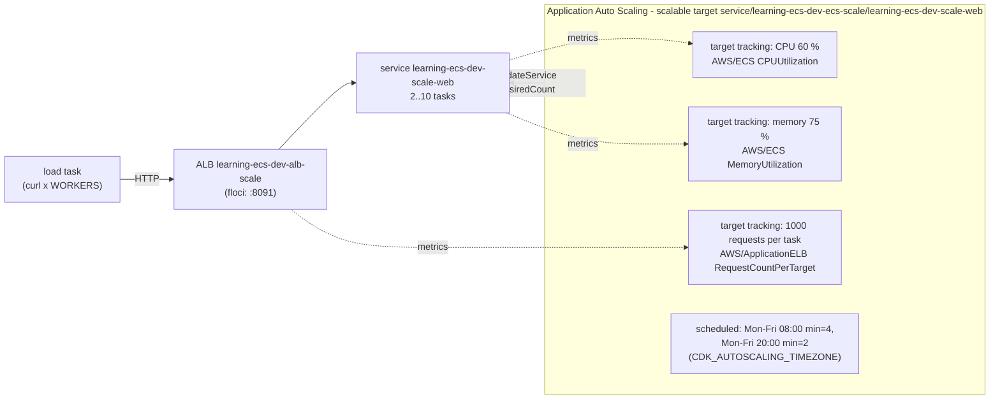

<!-- TOC -->

- [Module 16 - Service Auto Scaling (target tracking, scheduled scaling, load testing)](#module-16---service-auto-scaling-target-tracking-scheduled-scaling-load-testing)
  - [Overview](#overview)
  - [What you will learn](#what-you-will-learn)
  - [Architecture](#architecture)
  - [AWS services and CDK constructs used](#aws-services-and-cdk-constructs-used)
  - [Configuration](#configuration)
  - [How the policies interact](#how-the-policies-interact)
  - [Prerequisites](#prerequisites)
  - [Tests](#tests)
  - [Deploy with floci (local, free)](#deploy-with-floci-local-free)
  - [Deploy to real AWS (optional)](#deploy-to-real-aws-optional)
  - [Verify](#verify)
    - [List every resource with the AWS CLI](#list-every-resource-with-the-aws-cli)
  - [Manage it with the AWS CLI](#manage-it-with-the-aws-cli)
    - [Generate load](#generate-load)
    - [Scaling from scratch with the CLI (and the floci control loop)](#scaling-from-scratch-with-the-cli-and-the-floci-control-loop)
    - [Scheduled actions](#scheduled-actions)
    - [Day-2 operations](#day-2-operations)
  - [Metrics to watch](#metrics-to-watch)
  - [Troubleshooting](#troubleshooting)
  - [floci vs real AWS](#floci-vs-real-aws)
  - [Clean up](#clean-up)
  - [Notes and cautions](#notes-and-cautions)
  - [References](#references)

<!-- TOC -->

# Module 16 - Service Auto Scaling (target tracking, scheduled scaling, load testing)

## Overview

Running "at scale" means the number of tasks follows demand without anyone
touching `desired-count`. ECS hands that job to **Application Auto
Scaling**: the service is registered as a **scalable target** (a minimum
and a maximum number of tasks), and **policies** move the desired count
inside that range. This module puts an ALB-fronted
[`traefik/whoami`](https://hub.docker.com/r/traefik/whoami) service under
three **target tracking** policies and two **scheduled actions**, and gives
you a **load generator** task
([`curlimages/curl`](https://hub.docker.com/r/curlimages/curl) loops) to
watch it react:

| Policy | Keeps... | at (default) |
|---|---|---|
| target tracking `ECSServiceAverageCPUUtilization` | the service's average CPU | 60 % |
| target tracking `ECSServiceAverageMemoryUtilization` | the service's average memory | 75 % |
| target tracking `ALBRequestCountPerTarget` | requests per task per minute | 1000 |
| scheduled action `PeakStart` | minimum raised for a known peak | 4 tasks, Mon-Fri 08:00 |
| scheduled action `PeakEnd` | minimum back to normal | 2 tasks, Mon-Fri 20:00 |

Step scaling (alarm thresholds -> fixed adjustments) is shown in
[module 14](../14_sqs_sns/README.md), scaling on queue backlog.

## What you will learn

- Scalable targets, target tracking and scheduled scaling for ECS services.
- How several policies combine, cooldowns, and why scale-in is slower than
  scale-out.
- The `ResourceLabel` that ties `ALBRequestCountPerTarget` to a target group.
- Suspending/resuming scaling, reading scaling activities, and load testing.

## Architecture



<details>
<summary>Plain-text version (names and details)</summary>

```
 load task (curl x WORKERS) --HTTP--> ALB learning-ecs-dev-alb-scale :8091 --> service learning-ecs-dev-scale-web (2..10 tasks)
                                                                                      ^
 Application Auto Scaling: scalable target service/learning-ecs-dev-ecs-scale/learning-ecs-dev-scale-web
   - target tracking CPU 60 %     --- alarms on AWS/ECS CPUUtilization (ClusterName, ServiceName)
   - target tracking memory 75 %  --- alarms on AWS/ECS MemoryUtilization
   - target tracking 1000 req/task --- alarms on AWS/ApplicationELB RequestCountPerTarget (TargetGroup)
   - scheduled: Mon-Fri 08:00 min=4, Mon-Fri 20:00 min=2 (CDK_AUTOSCALING_TIMEZONE)
                     |  UpdateService desiredCount
                     +-------------------------------------------------------------------------^
```

</details>

## AWS services and CDK constructs used

| AWS service | CDK construct (Python) | Level |
|---|---|---|
| Application Auto Scaling | `FargateService.auto_scale_task_count` -> `ScalableTaskCount` | L2 |
| Application Auto Scaling | `scale_on_cpu_utilization`, `scale_on_memory_utilization`, `scale_on_request_count`, `scale_on_schedule` | L2 |
| Application Auto Scaling | `aws_cdk.aws_applicationautoscaling.Schedule.cron`, `aws_cdk.TimeZone` | L2 |
| Elastic Load Balancing | `ApplicationLoadBalancer`, listener, target group | L2 |
| Amazon ECS | `FargateService` (via `shared/ecs.py`), load `FargateTaskDefinition` | L2 |

## Configuration

| Variable | Default | Effect |
|---|---|---|
| `CDK_AUTOSCALING_MIN` / `CDK_AUTOSCALING_MAX` | `2` / `10` | scaling range (also the initial desired count = min) |
| `CDK_AUTOSCALING_CPU_TARGET` | `60` | average CPU % to keep; `0` = no CPU policy |
| `CDK_AUTOSCALING_MEMORY_TARGET` | `75` | average memory % to keep; `0` = no memory policy |
| `CDK_AUTOSCALING_REQUESTS_PER_TARGET` | `1000` | requests per task per minute; `0` = no request policy |
| `CDK_AUTOSCALING_SCALE_IN_COOLDOWN` / `..._SCALE_OUT_COOLDOWN` | `300` / `60` | seconds, applied to the three policies |
| `CDK_AUTOSCALING_SCHEDULE_ENABLED` | `true` | create the two scheduled actions |
| `CDK_AUTOSCALING_PEAK_MIN` | `4` (bounded by min/max) | minimum during the peak |
| `CDK_AUTOSCALING_PEAK_START_HOUR` / `..._PEAK_END_HOUR` | `8` / `20` | hours (Mon-Fri) of the two actions |
| `CDK_AUTOSCALING_TIMEZONE` | `UTC` | IANA time zone of the schedule, e.g. `America/Sao_Paulo` |
| `CDK_AUTOSCALING_LOAD_WORKERS` / `..._LOAD_SECONDS` | `20` / `600` | load generator: parallel curl loops, duration |
| `CDK_AUTOSCALING_IMAGE` | `traefik/whoami:v1.12.0` | the scaled service's image |
| `CDK_PORT_AUTOSCALING` | `8091` (`.env.example`) | ALB listener port (80 if unset) |

Synth fails if `MAX < MIN` or `PEAK_MIN > MAX`.

## How the policies interact

From the [Application Auto Scaling documentation](https://docs.aws.amazon.com/autoscaling/application/userguide/target-tracking-scaling-policy-overview.html)
and the [ECS documentation](https://docs.aws.amazon.com/AmazonECS/latest/developerguide/service-autoscaling-targettracking.html):

- **Several target tracking policies**: the service scales **out if any**
  policy is ready to scale out, and **in only if all** of them (with
  scale-in enabled) are ready to scale in. When several want to act at the
  same time, the one giving the **largest capacity** wins.
- **Scale-out is proportional and fast; scale-in is gradual.** A policy
  won't scale in if removing one task would likely push the metric back
  above the target.
- **Cooldowns**: the ECS default is 300 seconds. During the scale-out
  cooldown a larger scale-out can still happen; scale-in is blocked for
  the whole scale-in cooldown (and a scale-out interrupts it).
- **Insufficient data** never scales in - a metric with no datapoints
  leaves capacity where it is.
- **Deployments**: Application Auto Scaling turns off scale-in while an
  ECS deployment is in progress; scale-out continues.
- **Scheduled actions** change only `MinCapacity`/`MaxCapacity`: if the
  current count is below the new minimum it scales out to it, above the
  new maximum it scales in to it. The policies keep working inside the
  new range.
- **Don't edit the alarms** target tracking creates (`TargetTracking-...`):
  Application Auto Scaling owns and deletes them.
- `ALBRequestCountPerTarget` is not supported for the ECS **blue/green**
  deployment type ([module 17](../17_deployments/README.md)).

## Prerequisites

[Module 04](../04_alb/README.md). floci running and `.env` loaded.

## Tests

[`../../tests/unit/test_16_autoscaling.py`](../../tests/unit/test_16_autoscaling.py)
checks the scalable target (range, `ecs:service:DesiredCount`, the two
scheduled actions with cron and time zone), the three target tracking
policies with their targets and cooldowns, turning policies and the
schedule off, the configurable range/peak/time zone, the rejected
inconsistent ranges, the load generator, and the mandatory tags:

```bash
uv run pytest tests/unit/test_16_autoscaling.py -v
```

## Deploy with floci (local, free)

```bash
uv run cdk bootstrap
uv run cdk synth AutoscalingStack
uv run cdk diff AutoscalingStack
uv run cdk deploy AutoscalingStack --require-approval never --method=direct
curl -s localhost:8091/ | grep -E 'Name|Hostname'      # Name: scale-web
```

floci accepts the scaling resources from CloudFormation without creating
them. To see scaling work locally, create the same target and policies
with the CLI - [Scaling from scratch with the CLI](#scaling-from-scratch-with-the-cli-and-the-floci-control-loop).

## Deploy to real AWS (optional)

Cost: the ALB and the NAT Gateway hourly, plus every task the policies
add - keep `CDK_AUTOSCALING_MAX` small while you experiment. See
[AWS Fargate pricing](https://aws.amazon.com/fargate/pricing/) and
[Elastic Load Balancing pricing](https://aws.amazon.com/elasticloadbalancing/pricing/).

```bash
unset AWS_ENDPOINT_URL
CDK_PORT_AUTOSCALING=80 uv run cdk deploy AutoscalingStack --profile <your-aws-cli-profile>
```

## Verify

```bash
out() { aws cloudformation describe-stacks --stack-name AutoscalingStack \
  --query "Stacks[0].Outputs[?OutputKey=='$1'].OutputValue" --output text; }
RID="service/$(out ClusterName)/$(out ServiceName)"

aws application-autoscaling describe-scalable-targets --service-namespace ecs --resource-ids "$RID" \
  --query 'ScalableTargets[].[MinCapacity,MaxCapacity,SuspendedState]'
aws application-autoscaling describe-scaling-policies --service-namespace ecs --resource-id "$RID" \
  --query 'ScalingPolicies[].[PolicyName,TargetTrackingScalingPolicyConfiguration.PredefinedMetricSpecification.PredefinedMetricType,TargetTrackingScalingPolicyConfiguration.TargetValue]' --output table
aws application-autoscaling describe-scheduled-actions --service-namespace ecs --resource-id "$RID" \
  --query 'ScheduledActions[].[ScheduledActionName,Schedule,Timezone,ScalableTargetAction]'
# the alarms target tracking created - two per policy (AlarmHigh scales out, AlarmLow scales in)
aws cloudwatch describe-alarms --alarm-name-prefix "TargetTracking-$RID" \
  --query 'MetricAlarms[].[MetricName,ComparisonOperator,Threshold,EvaluationPeriods,StateValue]' --output table
```

<!-- BEGIN resource-commands (generated by scripts/resource_commands.py) -->
### List every resource with the AWS CLI

Every resource this stack creates, one `aws` command each, parametrized
by environment (`ENV`), region (`REGION`) and - where a command builds an
ARN - account (`ACCOUNT`): set them to match your deployment, with your
`.env` loaded (floci) or your AWS profile active (real AWS). A resource
without a name of its own is looked up through the stack by its *logical
id* (`pid <LogicalId>`), which is the same in every environment. This block
is generated from the stack's template by
[`scripts/resource_commands.py`](../../scripts/resource_commands.py) - see
[`../../REQUIREMENTS.md`, section 5.8](../../REQUIREMENTS.md#58---listing-every-resource-a-stack-created);
`make cdk-resources STACK=AutoscalingStack` runs the same commands for you.

```bash
# Match these to your deployment: CDK_PRODUCT and CDK_ENVIRONMENT in .env, and
# the region you deployed to (floci: the one in .env).
PRODUCT=learning-ecs ENV=dev REGION=us-east-1
STACK=AutoscalingStack
# Physical id of one of the stack's resources, by its logical id - the same in
# every environment. A second argument names another (e.g. nested) stack.
pid() { aws cloudformation describe-stack-resource --stack-name "${2:-$STACK}" \
  --logical-resource-id "$1" --region "$REGION" \
  --query StackResourceDetail.PhysicalResourceId --output text; }

# Every resource the stack created - type, logical id, physical id, status:
aws cloudformation describe-stack-resources --stack-name "$STACK" --region "$REGION" \
  --query "StackResources[].[ResourceType,LogicalResourceId,PhysicalResourceId,ResourceStatus]" \
  --output table

# AWS::EC2::VPC (Vpc8378EB38)
aws ec2 describe-vpcs --vpc-ids "$(pid Vpc8378EB38)" --query "Vpcs[].[VpcId,CidrBlock,State]" --output table --region "$REGION"
# AWS::ECS::Cluster (ClusterEB0386A7)
aws ecs describe-clusters --clusters "${PRODUCT}-${ENV}-ecs-scale" --query "clusters[].[clusterName,status]" --output table --region "$REGION"
# AWS::IAM::Role (WebTaskDefinitionTaskRole2EE1C0E7)
aws iam get-role --role-name "$(pid WebTaskDefinitionTaskRole2EE1C0E7)" --query "Role.[RoleName,Arn]" --output table --region "$REGION"
# AWS::ECS::TaskDefinition (WebTaskDefinition8DF7C630)
aws ecs describe-task-definition --task-definition "$(pid WebTaskDefinition8DF7C630)" --query "taskDefinition.[family,revision,status]" --output table --region "$REGION"
# AWS::IAM::Role (WebTaskDefinitionExecutionRole225B46C9)
aws iam get-role --role-name "$(pid WebTaskDefinitionExecutionRole225B46C9)" --query "Role.[RoleName,Arn]" --output table --region "$REGION"
# AWS::Logs::LogGroup (WebLogGroup68B8CF3C)
aws logs describe-log-groups --log-group-name-prefix "/ecs/${PRODUCT}/${ENV}/scale-web" --query "logGroups[].[logGroupName,retentionInDays]" --output table --region "$REGION"
# AWS::ECS::Service (WebService7F8A1763)
aws ecs describe-services --cluster "${PRODUCT}-${ENV}-ecs-scale" --services "${PRODUCT}-${ENV}-scale-web" --query "services[].[serviceName,status,desiredCount]" --output table --region "$REGION"
# AWS::EC2::SecurityGroup (WebServiceSecurityGroupE736A6BB)
aws ec2 describe-security-groups --group-ids "$(pid WebServiceSecurityGroupE736A6BB)" --query "SecurityGroups[].[GroupId,GroupName,VpcId]" --output table --region "$REGION"
# AWS::ApplicationAutoScaling::ScalableTarget (WebServiceTaskCountTarget578D9A62)
aws application-autoscaling describe-scalable-targets --service-namespace ecs --query "ScalableTargets[?contains(ResourceId, '${PRODUCT}-${ENV}-ecs-scale')].[ResourceId,MinCapacity,MaxCapacity]" --output table --region "$REGION"
# AWS::ApplicationAutoScaling::ScalingPolicy (WebServiceTaskCountTargetCpuTargetAB5641C1)
aws application-autoscaling describe-scaling-policies --service-namespace ecs --query "ScalingPolicies[?contains(ResourceId, '${PRODUCT}-${ENV}-ecs-scale')].[PolicyName,PolicyType]" --output table --region "$REGION"
# AWS::ApplicationAutoScaling::ScalingPolicy (WebServiceTaskCountTargetMemoryTargetCBEED5F3)
aws application-autoscaling describe-scaling-policies --service-namespace ecs --query "ScalingPolicies[?contains(ResourceId, '${PRODUCT}-${ENV}-ecs-scale')].[PolicyName,PolicyType]" --output table --region "$REGION"
# AWS::ApplicationAutoScaling::ScalingPolicy (WebServiceTaskCountTargetRequestsTarget0BA50F42)
aws application-autoscaling describe-scaling-policies --service-namespace ecs --query "ScalingPolicies[?contains(ResourceId, '${PRODUCT}-${ENV}-ecs-scale')].[PolicyName,PolicyType]" --output table --region "$REGION"
# AWS::ElasticLoadBalancingV2::LoadBalancer (Alb16C2F182)
aws elbv2 describe-load-balancers --load-balancer-arns "$(pid Alb16C2F182)" --query "LoadBalancers[].[LoadBalancerName,Type,State.Code]" --output table --region "$REGION"
# AWS::EC2::SecurityGroup (AlbSecurityGroup580F65A6)
aws ec2 describe-security-groups --group-ids "$(pid AlbSecurityGroup580F65A6)" --query "SecurityGroups[].[GroupId,GroupName,VpcId]" --output table --region "$REGION"
# AWS::ElasticLoadBalancingV2::Listener (AlbHttp7966E42E)
aws elbv2 describe-listeners --listener-arns "$(pid AlbHttp7966E42E)" --query "Listeners[].[Port,Protocol]" --output table --region "$REGION"
# AWS::ElasticLoadBalancingV2::TargetGroup (AlbHttpWebGroupFB8A8200)
aws elbv2 describe-target-groups --target-group-arns "$(pid AlbHttpWebGroupFB8A8200)" --query "TargetGroups[].[TargetGroupName,Port,TargetType]" --output table --region "$REGION"
# AWS::IAM::Role (LoadTaskDefinitionTaskRole0B565716)
aws iam get-role --role-name "$(pid LoadTaskDefinitionTaskRole0B565716)" --query "Role.[RoleName,Arn]" --output table --region "$REGION"
# AWS::ECS::TaskDefinition (LoadTaskDefinition4E7F9FC0)
aws ecs describe-task-definition --task-definition "$(pid LoadTaskDefinition4E7F9FC0)" --query "taskDefinition.[family,revision,status]" --output table --region "$REGION"
# AWS::IAM::Role (LoadTaskDefinitionExecutionRole23E146C1)
aws iam get-role --role-name "$(pid LoadTaskDefinitionExecutionRole23E146C1)" --query "Role.[RoleName,Arn]" --output table --region "$REGION"
# AWS::Logs::LogGroup (LoadLogGroup49CDBF63)
aws logs describe-log-groups --log-group-name-prefix "/ecs/${PRODUCT}/${ENV}/scale-load" --query "logGroups[].[logGroupName,retentionInDays]" --output table --region "$REGION"
# AWS::EC2::SecurityGroup (LoadSecurityGroup7D3309A0)
aws ec2 describe-security-groups --group-ids "$(pid LoadSecurityGroup7D3309A0)" --query "SecurityGroups[].[GroupId,GroupName,VpcId]" --output table --region "$REGION"
# Also created - listed in the table above:
#   11 VPC sub-resources (subnets, route tables, gateways, endpoints) - built by shared/network.py, listed one by one in modules/01_network/README.md
#   AWS::ECS::ClusterCapacityProviderAssociations Cluster3DA9CCBA - shown by its ECS cluster (describe-clusters --include ATTACHMENTS)
#   AWS::IAM::Policy WebTaskDefinitionTaskRoleDefaultPolicyD1A8300E - shown by its IAM role
#   AWS::IAM::Policy WebTaskDefinitionExecutionRoleDefaultPolicy5D8A2D6F - shown by its IAM role
#   AWS::EC2::SecurityGroupIngress WebServiceSecurityGroupfromAutoscalingStackAlbSecurityGroupFD1E022A807FB0FF76 - shown by its security group
#   AWS::EC2::SecurityGroupEgress AlbSecurityGrouptoAutoscalingStackWebServiceSecurityGroup6E947A58808165CA0C - shown by its security group
#   AWS::IAM::Policy LoadTaskDefinitionExecutionRoleDefaultPolicy7F5AA8E1 - shown by its IAM role
```

**On floci** (2.1.0), CloudFormation records `AWS::ApplicationAutoScaling::ScalableTarget`, `AWS::ApplicationAutoScaling::ScalingPolicy` without creating them, so those commands find nothing there - they work on real AWS. See [`REQUIREMENTS.md`, section 10](../../REQUIREMENTS.md#10-floci-vs-real-aws).
<!-- END resource-commands -->

## Manage it with the AWS CLI

Run against floci while writing this module (except where noted).

### Generate load

```bash
NET="awsvpcConfiguration={subnets=[$(out TaskSubnetIds)],securityGroups=[$(out LoadSecurityGroupId)],assignPublicIp=DISABLED}"
aws ecs run-task --cluster "$(out ClusterName)" --task-definition "$(out LoadTaskDefinitionArn)" \
  --launch-type FARGATE --network-configuration "$NET" \
  --overrides '{"containerOverrides":[{"name":"app","environment":[{"name":"WORKERS","value":"40"},{"name":"DURATION","value":"900"}]}]}'

# real AWS: the load task's summary and the scaling it caused
aws logs tail /ecs/learning-ecs/dev/scale-load --follow
watch -n 30 "aws ecs describe-services --cluster $(out ClusterName) --services $(out ServiceName) \
  --query 'services[0].[desiredCount,runningCount]' --output text"
aws application-autoscaling describe-scaling-activities --service-namespace ecs --resource-id "$RID" \
  --query 'ScalingActivities[].[StartTime,StatusCode,Description]' --output table
# floci: the summary (one line per worker)
docker logs learning-ecs-floci 2>&1 | grep 'ecs:learning-ecs-dev-scale-load:app' | tail -5
# worker 1: 420 requests ... load: done
```

A request-count scale-out needs a sustained rate above
`CDK_AUTOSCALING_REQUESTS_PER_TARGET x running tasks` per minute for a few
minutes. `whoami` uses very little CPU, so the CPU policy rarely moves
here; for CPU-bound scaling, put a CPU-heavy image behind the ALB.

### Scaling from scratch with the CLI (and the floci control loop)

The same objects the CDK creates, by hand. On floci these commands work,
and floci **runs the scaling loop for ECS**: it evaluates the alarms
against data you push with `put-metric-data` and calls `UpdateService`.
floci emits no ECS or ALB metrics itself, so you play CloudWatch.

```bash
RID=service/learning-ecs-dev-ecs-scale/learning-ecs-dev-scale-web
S="--service-namespace ecs --scalable-dimension ecs:service:DesiredCount --resource-id $RID"

# 1. the scalable target (an upsert: run it again to change min/max)
aws application-autoscaling register-scalable-target $S --min-capacity 2 --max-capacity 6

# 2. a target tracking policy on CPU
aws application-autoscaling put-scaling-policy $S --policy-name cpu60 --policy-type TargetTrackingScaling \
  --target-tracking-scaling-policy-configuration \
  '{"TargetValue":60.0,"PredefinedMetricSpecification":{"PredefinedMetricType":"ECSServiceAverageCPUUtilization"},
    "ScaleOutCooldown":60,"ScaleInCooldown":60}' \
  --query 'Alarms[].AlarmName'

# 3. a target tracking policy on ALB requests per task - ResourceLabel = app/<lb>/<id>/targetgroup/<tg>/<id>
aws application-autoscaling put-scaling-policy $S --policy-name requests1000 --policy-type TargetTrackingScaling \
  --target-tracking-scaling-policy-configuration \
  "{\"TargetValue\":1000.0,\"PredefinedMetricSpecification\":{\"PredefinedMetricType\":\"ALBRequestCountPerTarget\",\"ResourceLabel\":\"$(out RequestCountResourceLabel)\"}}"

# floci only: play CloudWatch - 5 minutes of 90 % CPU. floci's alarm watches a metric
# named after the predefined type; real AWS alarms watch AWS/ECS CPUUtilization.
for m in 5 4 3 2 1; do
  aws cloudwatch put-metric-data --namespace AWS/ECS --metric-name ECSServiceAverageCPUUtilization \
    --dimensions ClusterName=learning-ecs-dev-ecs-scale,ServiceName=learning-ecs-dev-scale-web \
    --value 90 --unit Percent --timestamp "$(date -u -d "-$m minutes" +%Y-%m-%dT%H:%M:%SZ)"
done
sleep 30
aws ecs describe-services --cluster learning-ecs-dev-ecs-scale --services learning-ecs-dev-scale-web \
  --query 'services[0].[desiredCount,runningCount]' --output text          # 6 (the max), after 3 -> 5 -> 6
aws application-autoscaling describe-scaling-activities $S --query 'ScalingActivities[].[Description,Cause]' --output text
# Setting desired capacity to 3   monitor alarm TargetTracking-...-AlarmHigh-... in state ALARM triggered policy cpu60
```

Push low values for the last 15+ minutes the same way (e.g. `--value 5`)
and the `AlarmLow` alarm scales the service back to the minimum.

### Scheduled actions

Not implemented by floci 2.1.0 (`UnsupportedOperation`) - real AWS only.

```bash
# raise the minimum on weekday mornings (Sao Paulo time), lower it at night
aws application-autoscaling put-scheduled-action $S --scheduled-action-name peak-start \
  --schedule "cron(0 8 ? * MON-FRI *)" --timezone "America/Sao_Paulo" \
  --scalable-target-action MinCapacity=4,MaxCapacity=10
aws application-autoscaling put-scheduled-action $S --scheduled-action-name peak-end \
  --schedule "cron(0 20 ? * MON-FRI *)" --timezone "America/Sao_Paulo" \
  --scalable-target-action MinCapacity=2,MaxCapacity=10
# a one-time action (e.g. a launch at 2026-11-27 09:00 UTC)
aws application-autoscaling put-scheduled-action $S --scheduled-action-name black-friday \
  --schedule "at(2026-11-27T09:00:00)" --scalable-target-action MinCapacity=8,MaxCapacity=20

aws application-autoscaling describe-scheduled-actions --service-namespace ecs --resource-id "$RID"
aws application-autoscaling delete-scheduled-action $S --scheduled-action-name black-friday
```

Cron expressions here have six fields: `minutes hours day-of-month month
day-of-week year`, and either day-of-month or day-of-week must be `?`.

### Day-2 operations

```bash
# Freeze scaling (e.g. during an incident or a manual load test) - and unfreeze
aws application-autoscaling register-scalable-target $S \
  --suspended-state DynamicScalingInSuspended=true,DynamicScalingOutSuspended=true,ScheduledScalingSuspended=true
aws application-autoscaling register-scalable-target $S \
  --suspended-state DynamicScalingInSuspended=false,DynamicScalingOutSuspended=false,ScheduledScalingSuspended=false

# Change the range (prefer CDK_AUTOSCALING_MIN/MAX + cdk deploy, so the stack does not drift)
aws application-autoscaling register-scalable-target $S --min-capacity 3 --max-capacity 12

# A manual desired count is allowed, but the next policy evaluation can move it again
aws ecs update-service --cluster learning-ecs-dev-ecs-scale --service learning-ecs-dev-scale-web --desired-count 5

# Remove a policy (its alarms go with it), then the whole target
aws application-autoscaling delete-scaling-policy $S --policy-name requests1000
aws application-autoscaling deregister-scalable-target $S
```

## Metrics to watch

| Namespace | Metric | Dimensions | Watch for |
|---|---|---|---|
| `AWS/ECS` | `CPUUtilization`, `MemoryUtilization` | `ClusterName`, `ServiceName` | the inputs of the CPU/memory policies |
| `AWS/ApplicationELB` | `RequestCountPerTarget` | `TargetGroup` | the input of the request policy (Sum per minute) |
| `AWS/ApplicationELB` | `TargetResponseTime`, `HTTPCode_Target_5XX_Count` | `LoadBalancer` | did scaling keep latency/errors down? |
| `ECS/ContainerInsights` | `DesiredTaskCount`, `RunningTaskCount`, `PendingTaskCount` | `ClusterName`, `ServiceName` | desired vs running: tasks that can't start |
| CloudWatch alarms | `TargetTracking-...-AlarmHigh/Low` state | - | `ALARM` = a scaling decision is pending/acting |

```bash
aws cloudwatch get-metric-statistics --namespace AWS/ECS --metric-name CPUUtilization \
  --dimensions Name=ClusterName,Value=learning-ecs-dev-ecs-scale Name=ServiceName,Value=learning-ecs-dev-scale-web \
  --start-time "$(date -u -d '-1 hour' +%Y-%m-%dT%H:%M:%SZ)" --end-time "$(date -u +%Y-%m-%dT%H:%M:%SZ)" \
  --period 60 --statistics Average Maximum --output table
```

## Troubleshooting

| Symptom | Where to look | Typical cause / fix |
|---|---|---|
| Load is high but no scale-out | `describe-scaling-activities`, alarm states | max reached; scaling suspended; alarm `INSUFFICIENT_DATA` (metric missing - e.g. a typo in `ResourceLabel`); policy disabled |
| Desired count rises, running count doesn't | `describe-services` events, stopped tasks | tasks can't start: image pull, subnet IPs exhausted, Fargate capacity, failing health checks |
| Scale-in never happens | the `AlarmLow` alarms of every policy | another policy (e.g. memory) is not ready to scale in; scale-in cooldown; a deployment in progress |
| Tasks flap up and down | activities timeline | cooldowns too short, target too close to the natural level, or a step policy fighting target tracking |
| `ValidationException` on `put-scaling-policy` with `ALBRequestCountPerTarget` | the command | missing/invalid `ResourceLabel`, or the service has no target group |
| Capacity jumps at a fixed time | `describe-scheduled-actions` | a scheduled action changed min/max - check its time zone |

More: [`../../docs/TROUBLESHOOTING.md`](../../docs/TROUBLESHOOTING.md).

## floci vs real AWS

| Behavior | floci 2.1.0 | Real AWS |
|---|---|---|
| `ScalableTarget` / `ScalingPolicy` from CloudFormation | **not created** (stubbed) | created |
| Same objects from the CLI | created; the target tracking alarms are created too | same |
| Scaling loop | runs for ECS, on metrics you push | runs on real metrics |
| Metric watched by target tracking alarms | named after the predefined type (e.g. `ECSServiceAverageCPUUtilization`) | `CPUUtilization`, `MemoryUtilization`, `RequestCountPerTarget` |
| ECS / ALB metrics | not emitted | emitted every minute |
| Scheduled actions (`put-scheduled-action`) | `UnsupportedOperation` | work |
| Load generator against the ALB | works (`*.elb.floci` resolves inside tasks) | works |

## Clean up

```bash
uv run cdk destroy AutoscalingStack
uv run python scripts/floci_prune.py --apply   # floci only
# floci: also remove what you created by hand, if anything is left
aws application-autoscaling deregister-scalable-target --service-namespace ecs \
  --scalable-dimension ecs:service:DesiredCount --resource-id service/learning-ecs-dev-ecs-scale/learning-ecs-dev-scale-web
```

## Notes and cautions

- **Cost**: scaling out adds billed tasks - the maximum is your cost ceiling.
- **Minimum of 2 across AZs**: with `CDK_AUTOSCALING_MIN` below 2 an AZ
  failure can leave you with zero tasks.
- **Scale to zero**: possible with `ALBRequestCountPerTarget` and
  `MinCapacity=0`, but the first request after an idle period gets 503s
  until a task starts.
- **High-resolution metrics**: `ECSServiceAverageCPUUtilizationHighResolution`
  (20-second metrics) reacts faster; it must be enabled in ECS first.
- **Predictive scaling** for ECS forecasts load from history - see the
  references.
- Scaling the **EC2 instances** under an EC2-backed service is the
  capacity provider's job ([module 03](../03_ec2_capacity/README.md)), not
  Application Auto Scaling's.

## References

- [Automatically scale your Amazon ECS service](https://docs.aws.amazon.com/AmazonECS/latest/developerguide/service-auto-scaling.html) · [Use a target metric to scale Amazon ECS services](https://docs.aws.amazon.com/AmazonECS/latest/developerguide/service-autoscaling-targettracking.html)
- [How target tracking scaling works](https://docs.aws.amazon.com/autoscaling/application/userguide/target-tracking-scaling-policy-overview.html) · [How scheduled scaling works](https://docs.aws.amazon.com/autoscaling/application/userguide/scheduled-scaling-policy-overview.html) · [Create scheduled actions with the AWS CLI](https://docs.aws.amazon.com/autoscaling/application/userguide/create-scheduled-actions.html)
- [Predefined metrics for target tracking](https://docs.aws.amazon.com/autoscaling/application/userguide/monitoring-cloudwatch.html#predefined-metrics) · [`PredefinedMetricSpecification` (ResourceLabel)](https://docs.aws.amazon.com/autoscaling/application/APIReference/API_PredefinedMetricSpecification.html)
- [AWS CDK API Reference (Python) - `aws_cdk.aws_ecs.ScalableTaskCount`](https://docs.aws.amazon.com/cdk/api/v2/python/aws_cdk.aws_ecs/ScalableTaskCount.html)
- [floci - Application Auto Scaling](https://floci.io/floci/services/applicationautoscaling/)
- [Docker Hub - traefik/whoami](https://hub.docker.com/r/traefik/whoami) · [curlimages/curl](https://hub.docker.com/r/curlimages/curl)
