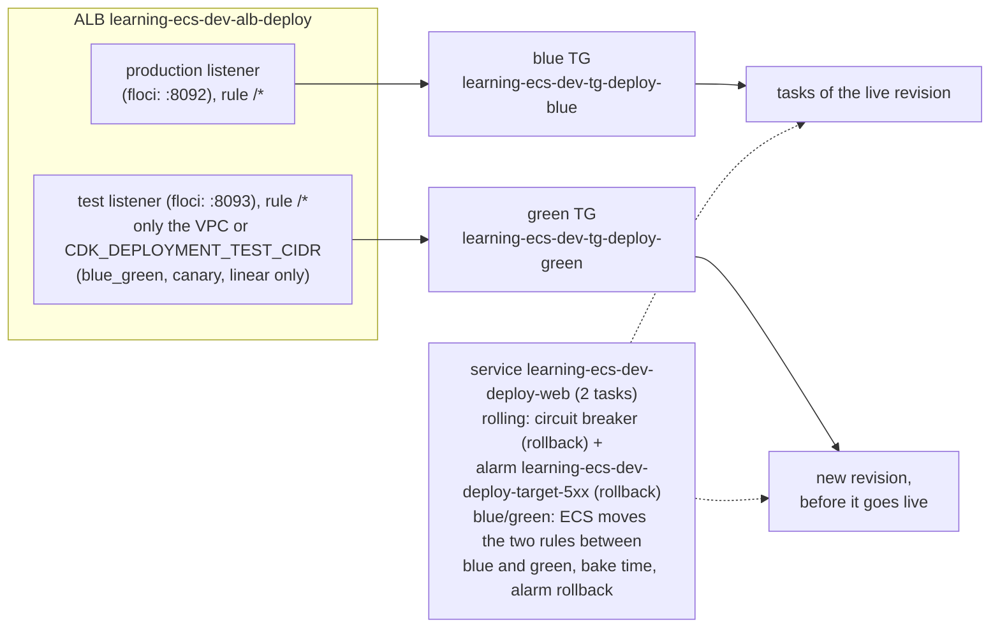

<!-- TOC -->

- [Module 17 - Deployments (rolling, circuit breaker, alarms, blue/green, canary, linear)](#module-17---deployments-rolling-circuit-breaker-alarms-bluegreen-canary-linear)
  - [Overview](#overview)
  - [What you will learn](#what-you-will-learn)
  - [Architecture](#architecture)
  - [AWS services and CDK constructs used](#aws-services-and-cdk-constructs-used)
  - [Configuration](#configuration)
  - [How each strategy works](#how-each-strategy-works)
    - [Rolling update](#rolling-update)
    - [Deployment circuit breaker](#deployment-circuit-breaker)
    - [Deployment alarms](#deployment-alarms)
    - [Blue/green, canary and linear](#bluegreen-canary-and-linear)
  - [Prerequisites](#prerequisites)
  - [Tests](#tests)
  - [Deploy with floci (local, free)](#deploy-with-floci-local-free)
  - [Deploy to real AWS (optional)](#deploy-to-real-aws-optional)
  - [Verify](#verify)
    - [List every resource with the AWS CLI](#list-every-resource-with-the-aws-cli)
  - [Manage it with the AWS CLI](#manage-it-with-the-aws-cli)
    - [Ship a new version](#ship-a-new-version)
    - [Watch a deployment](#watch-a-deployment)
    - [A bad version, and rolling back](#a-bad-version-and-rolling-back)
    - [Change the deployment settings](#change-the-deployment-settings)
  - [Metrics to watch](#metrics-to-watch)
  - [Troubleshooting](#troubleshooting)
  - [floci vs real AWS](#floci-vs-real-aws)
  - [Clean up](#clean-up)
  - [Notes and cautions](#notes-and-cautions)
  - [References](#references)

<!-- TOC -->

# Module 17 - Deployments (rolling, circuit breaker, alarms, blue/green, canary, linear)

## Overview

Every image tag, environment variable or CPU change creates a new task
definition revision, and the service has to move from the old tasks to the
new ones **without dropping requests** - and back again, quickly, when the
new version is broken. ECS offers four **deployment strategies**, all built
into the default `ECS` deployment controller:

| Strategy | Old and new tasks... | Traffic moves | Rollback |
|---|---|---|---|
| **rolling** (default) | replaced a few at a time | as new tasks pass health checks | circuit breaker and/or alarms |
| **blue/green** | both fully running | all at once (after optional test traffic) | alarms, lifecycle hooks, or by hand during bake time |
| **canary** | both fully running | a small % first, the rest after a bake time | same as blue/green |
| **linear** | both fully running | in equal % steps with a bake time each | same as blue/green |

This module deploys one ALB-fronted
[`traefik/whoami`](https://hub.docker.com/r/traefik/whoami) service whose
strategy is a variable (`CDK_DEPLOYMENT_STRATEGY`). Each response says
which version answered (`Name: v1`), so you can watch the switch from
outside with `curl`.

## What you will learn

- Rolling updates: `minimumHealthyPercent` / `maximumPercent`.
- The deployment circuit breaker (how it counts failures) and
  CloudWatch-alarm-based rollback.
- ECS-native blue/green, canary and linear deployments: two target groups,
  production and test listener rules, bake time, the ECS infrastructure role.
- Shipping, watching, stopping and rolling back deployments with the CLI.

## Architecture



<details>
<summary>Plain-text version (names and details)</summary>

```
                          ALB learning-ecs-dev-alb-deploy
 production :8092 --rule /*--> blue TG  (learning-ecs-dev-tg-deploy-blue)   <-- tasks of the live revision
 test       :8093 --rule /*--> green TG (learning-ecs-dev-tg-deploy-green)  <-- new revision, before it goes live
            (test listener + green TG only for blue_green / canary / linear; only the VPC or CDK_DEPLOYMENT_TEST_CIDR may connect)

 service learning-ecs-dev-deploy-web (2 tasks)
   rolling:     circuit breaker (rollback) + alarm learning-ecs-dev-deploy-target-5xx (rollback)
   blue/green:  ECS moves the two rules between blue and green (role with AmazonECSInfrastructureRolePolicyForLoadBalancers),
                bake time, alarm rollback
```

</details>

## AWS services and CDK constructs used

| AWS service | CDK construct (Python) | Level |
|---|---|---|
| Amazon ECS | `FargateService` (`deployment_strategy`, `bake_time`, `canary_configuration`, `linear_configuration`, `circuit_breaker`, `deployment_alarms`) | L2 |
| Amazon ECS | `FargateService.load_balancer_target`, `AlternateTarget`, `ListenerRuleConfiguration` | L2 |
| Elastic Load Balancing | `ApplicationLoadBalancer`, `ApplicationTargetGroup` (IP), `ApplicationListenerRule` | L2 |
| Amazon CloudWatch | `Alarm` on a `MathExpression` of target-group 5XX counts | L2 |
| AWS IAM | infrastructure role (created by `AlternateTarget`) | L2 |

## Configuration

| Variable | Default | Effect |
|---|---|---|
| `CDK_DEPLOYMENT_STRATEGY` | `rolling` | `rolling`, `blue_green`, `canary` or `linear` |
| `CDK_DEPLOYMENT_VERSION` | `v1` | shown in every response; change it and deploy to ship a "new version" |
| `CDK_DEPLOYMENT_IMAGE` | `traefik/whoami:v1.12.0` | the service's image (set a missing tag to try a failed deployment) |
| `CDK_DEPLOYMENT_DESIRED_COUNT` | `2` (or `CDK_DESIRED_COUNT`) | tasks |
| `CDK_DEPLOYMENT_MIN_HEALTHY_PERCENT` | `100` | rolling: tasks that must stay running during a deployment |
| `CDK_DEPLOYMENT_MAX_PERCENT` | `200` | rolling: upper limit of running tasks during a deployment |
| `CDK_DEPLOYMENT_ALARMS` | `true` | roll back when the 5XX alarm fires |
| `CDK_DEPLOYMENT_5XX_THRESHOLD` | `5` | 5XX responses per minute (2 consecutive minutes) that fire the alarm |
| `CDK_DEPLOYMENT_BAKE_MINUTES` | `5` | blue/green/canary/linear: both revisions keep running this long after the shift |
| `CDK_DEPLOYMENT_STEP_PERCENT` | `10` (canary) / `25` (linear) | traffic % of the canary step / of each linear step |
| `CDK_DEPLOYMENT_STEP_BAKE_MINUTES` | `2` | wait after each canary/linear step |
| `CDK_DEPLOYMENT_TEST_CIDR` | the VPC CIDR | who may reach the test listener (e.g. your IP `/32`) |
| `CDK_PORT_DEPLOYMENTS` / `CDK_PORT_DEPLOYMENTS_TEST` | `8092` / `8093` (`.env.example`) | production and test listener ports (80 and 8080 if unset) |

## How each strategy works

### Rolling update

ECS starts new tasks and stops old ones within two bounds, both a
percentage of the desired count: **`minimumHealthyPercent`** (tasks that
must stay `RUNNING` - and healthy behind a load balancer) and
**`maximumPercent`** (tasks allowed to run at once). With 2 tasks, `100`
and `200` mean: start 2 new tasks, wait until they are healthy in the
target group, then stop the 2 old ones - no capacity dip, double the tasks
for a moment. `50`/`100` would instead stop one old task first (less
capacity, no extra tasks).

### Deployment circuit breaker

From [How the deployment circuit breaker detects failures](https://docs.aws.amazon.com/AmazonECS/latest/developerguide/deployment-circuit-breaker.html):

- It watches the new tasks in two stages: (1) do they reach `RUNNING`?
  (2) once one is running, do they pass the **ELB, Cloud Map and container
  health checks**? Each failure adds one to a counter.
- When the counter reaches the **failure threshold**, the deployment
  becomes `FAILED`; with `rollback=true` ECS redeploys the last `COMPLETED`
  deployment.
- The default threshold is `BOUNDED_PERCENT` 50: half the desired count,
  rounded up, but at least **3** and at most **200** - so with 2 tasks, 3
  failed tasks. You can switch to `UNBOUNDED_PERCENT` or a fixed `COUNT`,
  and set `resetOnHealthyTask=false` to count all failures, not just
  consecutive ones.
- It is only supported with the rolling update (`ECS`) deployment
  controller - that's why this module turns it on only for `rolling`.
- A failed deployment sends a `SERVICE_DEPLOYMENT_FAILED` event to
  EventBridge.

### Deployment alarms

The circuit breaker sees tasks that don't start or fail health checks. It
does not see a version that is healthy but **wrong** - returning 500s,
or slower. **Deployment alarms** cover that: ECS watches the CloudWatch
alarms you list while the deployment runs and for a bake period after it,
and rolls back if one goes to `ALARM`. Here the alarm is "5 or more 5XX
responses from the tasks per minute, two minutes in a row", summed over
both target groups. Its metric comes from the target groups, not from the
service, so naming it in the service doesn't create a circular dependency
(see the CDK README section *Deployment alarms*).

### Blue/green, canary and linear

From [Amazon ECS blue/green deployments](https://docs.aws.amazon.com/AmazonECS/latest/developerguide/deployment-type-blue-green.html)
and [Application Load Balancer resources for blue/green, linear, and canary deployments](https://docs.aws.amazon.com/AmazonECS/latest/developerguide/alb-resources-for-blue-green.html):

- The service has a **primary target group** (blue), an **alternate
  target group** (green), a **production listener rule** and optionally
  a **test listener rule**. ECS **rewrites the rules** to move traffic, so
  it needs a role: trust `ecs.amazonaws.com`, managed policy
  `AmazonECSInfrastructureRolePolicyForLoadBalancers` (the CDK creates it).
- A deployment goes through **lifecycle stages**: `RECONCILE_SERVICE` ->
  `PRE_SCALE_UP` -> `SCALE_UP` -> `POST_SCALE_UP` -> `TEST_TRAFFIC_SHIFT` ->
  `POST_TEST_TRAFFIC_SHIFT` -> `PRE_PRODUCTION_TRAFFIC_SHIFT` ->
  `PRODUCTION_TRAFFIC_SHIFT` -> `POST_PRODUCTION_TRAFFIC_SHIFT` ->
  `BAKE_TIME` -> `CLEAN_UP`. Lambda functions (or pause points) can be
  attached to most of them as **lifecycle hooks** - e.g. run smoke tests
  against the test listener in `POST_TEST_TRAFFIC_SHIFT` and fail the
  deployment if they fail.
- **Bake time**: after the shift, blue keeps running; rolling back during
  bake time just moves the rules back - no new tasks to start.
- **Canary** shifts `CDK_DEPLOYMENT_STEP_PERCENT` of production traffic,
  waits `CDK_DEPLOYMENT_STEP_BAKE_MINUTES`, then the rest. **Linear** shifts
  in equal steps of that percentage with that wait between steps. Valid
  ranges (CDK README): canary 0.1-100 %, linear 3-100 %, step bake 0-1440
  minutes.
- Both revisions run in full at once: **double the tasks** during the
  deployment. With a Network Load Balancer, ECS adds 10 minutes to the
  traffic-shift stages.
- `ALBRequestCountPerTarget` target tracking ([module 16](../16_autoscaling/README.md))
  is not supported with the blue/green deployment type.

## Prerequisites

[Module 04](../04_alb/README.md). floci running and `.env` loaded.

## Tests

[`../../tests/unit/test_17_deployments.py`](../../tests/unit/test_17_deployments.py)
checks rolling as the default (circuit breaker, alarm rollback, percents,
one target group and listener), the 5XX alarm, each traffic-shifting
strategy (strategy, bake time, canary/linear steps, alternate target group,
production and test listener rules, the infrastructure role, no circuit
breaker), the test listener's CIDR, the rejected unknown strategy, the
version variable, turning alarms off, and the mandatory tags:

```bash
uv run pytest tests/unit/test_17_deployments.py -v
```

## Deploy with floci (local, free)

```bash
uv run cdk bootstrap
uv run cdk synth DeploymentsStack
uv run cdk diff DeploymentsStack
uv run cdk deploy DeploymentsStack --require-approval never --method=direct
for i in 1 2 3; do curl -s localhost:8092/ | grep Name; done     # Name: v1
```

floci runs every deployment as a plain replacement: it stores none of the
deployment settings (see [floci vs real AWS](#floci-vs-real-aws)). The
blue/green variants deploy, but behave like rolling.

## Deploy to real AWS (optional)

Cost: the ALB and the NAT Gateway hourly, plus the tasks - blue/green,
canary and linear briefly **double** them.

```bash
unset AWS_ENDPOINT_URL
# rolling
CDK_PORT_DEPLOYMENTS=80 uv run cdk deploy DeploymentsStack --profile <your-aws-cli-profile>
# blue/green, test listener reachable only from your IP
CDK_DEPLOYMENT_STRATEGY=blue_green CDK_PORT_DEPLOYMENTS=80 CDK_PORT_DEPLOYMENTS_TEST=8080 \
CDK_DEPLOYMENT_TEST_CIDR="$(curl -s https://checkip.amazonaws.com)/32" \
  uv run cdk deploy DeploymentsStack --profile <your-aws-cli-profile>
```

Changing the strategy of a deployed service is an in-place update on real
AWS. On floci, destroy and deploy again
([`REQUIREMENTS.md`, section 5.6](../../REQUIREMENTS.md)).

## Verify

```bash
out() { aws cloudformation describe-stacks --stack-name DeploymentsStack \
  --query "Stacks[0].Outputs[?OutputKey=='$1'].OutputValue" --output text; }
C=$(out ClusterName); SVC=$(out ServiceName)

aws ecs describe-services --cluster "$C" --services "$SVC" \
  --query 'services[0].[deploymentConfiguration,loadBalancers]'
aws cloudwatch describe-alarms --alarm-names "$(out AlarmName)" --query 'MetricAlarms[].[AlarmName,StateValue]'
```

The listing below was generated with `CDK_DEPLOYMENT_STRATEGY=blue_green`.
With `rolling`, the `Test` listener, the green target group and the
`AlternateTarget` role don't exist.

<!-- BEGIN resource-commands (generated by scripts/resource_commands.py) -->
### List every resource with the AWS CLI

Every resource this stack creates, one `aws` command each, parametrized
by environment (`ENV`), region (`REGION`) and - where a command builds an
ARN - account (`ACCOUNT`): set them to match your deployment, with your
`.env` loaded (floci) or your AWS profile active (real AWS). A resource
without a name of its own is looked up through the stack by its *logical
id* (`pid <LogicalId>`), which is the same in every environment. This block
is generated from the stack's template by
[`scripts/resource_commands.py`](../../scripts/resource_commands.py) - see
[`../../REQUIREMENTS.md`, section 5.8](../../REQUIREMENTS.md#58---listing-every-resource-a-stack-created);
`make cdk-resources STACK=DeploymentsStack` runs the same commands for you.

```bash
# Match these to your deployment: CDK_PRODUCT and CDK_ENVIRONMENT in .env, and
# the region you deployed to (floci: the one in .env).
PRODUCT=learning-ecs ENV=dev REGION=us-east-1
STACK=DeploymentsStack
# Physical id of one of the stack's resources, by its logical id - the same in
# every environment. A second argument names another (e.g. nested) stack.
pid() { aws cloudformation describe-stack-resource --stack-name "${2:-$STACK}" \
  --logical-resource-id "$1" --region "$REGION" \
  --query StackResourceDetail.PhysicalResourceId --output text; }

# Every resource the stack created - type, logical id, physical id, status:
aws cloudformation describe-stack-resources --stack-name "$STACK" --region "$REGION" \
  --query "StackResources[].[ResourceType,LogicalResourceId,PhysicalResourceId,ResourceStatus]" \
  --output table

# AWS::EC2::VPC (Vpc8378EB38)
aws ec2 describe-vpcs --vpc-ids "$(pid Vpc8378EB38)" --query "Vpcs[].[VpcId,CidrBlock,State]" --output table --region "$REGION"
# AWS::ECS::Cluster (ClusterEB0386A7)
aws ecs describe-clusters --clusters "${PRODUCT}-${ENV}-ecs-deploy" --query "clusters[].[clusterName,status]" --output table --region "$REGION"
# AWS::ElasticLoadBalancingV2::LoadBalancer (Alb16C2F182)
aws elbv2 describe-load-balancers --load-balancer-arns "$(pid Alb16C2F182)" --query "LoadBalancers[].[LoadBalancerName,Type,State.Code]" --output table --region "$REGION"
# AWS::EC2::SecurityGroup (AlbSecurityGroup580F65A6)
aws ec2 describe-security-groups --group-ids "$(pid AlbSecurityGroup580F65A6)" --query "SecurityGroups[].[GroupId,GroupName,VpcId]" --output table --region "$REGION"
# AWS::ElasticLoadBalancingV2::Listener (AlbProductionD44FEA4D)
aws elbv2 describe-listeners --listener-arns "$(pid AlbProductionD44FEA4D)" --query "Listeners[].[Port,Protocol]" --output table --region "$REGION"
# AWS::ElasticLoadBalancingV2::Listener (AlbTestE7EAB1C4)
aws elbv2 describe-listeners --listener-arns "$(pid AlbTestE7EAB1C4)" --query "Listeners[].[Port,Protocol]" --output table --region "$REGION"
# AWS::ElasticLoadBalancingV2::TargetGroup (BlueTargetGroupF108EB01)
aws elbv2 describe-target-groups --target-group-arns "$(pid BlueTargetGroupF108EB01)" --query "TargetGroups[].[TargetGroupName,Port,TargetType]" --output table --region "$REGION"
# AWS::ElasticLoadBalancingV2::TargetGroup (GreenTargetGroupEEB2DF3E)
aws elbv2 describe-target-groups --target-group-arns "$(pid GreenTargetGroupEEB2DF3E)" --query "TargetGroups[].[TargetGroupName,Port,TargetType]" --output table --region "$REGION"
# AWS::CloudWatch::Alarm (Target5xxAlarmB9F2DA7F)
aws cloudwatch describe-alarms --alarm-names "${PRODUCT}-${ENV}-deploy-target-5xx" --query "MetricAlarms[].[AlarmName,StateValue]" --output table --region "$REGION"
# AWS::IAM::Role (WebTaskDefinitionTaskRole2EE1C0E7)
aws iam get-role --role-name "$(pid WebTaskDefinitionTaskRole2EE1C0E7)" --query "Role.[RoleName,Arn]" --output table --region "$REGION"
# AWS::ECS::TaskDefinition (WebTaskDefinition8DF7C630)
aws ecs describe-task-definition --task-definition "$(pid WebTaskDefinition8DF7C630)" --query "taskDefinition.[family,revision,status]" --output table --region "$REGION"
# AWS::IAM::Role (WebTaskDefinitionExecutionRole225B46C9)
aws iam get-role --role-name "$(pid WebTaskDefinitionExecutionRole225B46C9)" --query "Role.[RoleName,Arn]" --output table --region "$REGION"
# AWS::Logs::LogGroup (WebLogGroup68B8CF3C)
aws logs describe-log-groups --log-group-name-prefix "/ecs/${PRODUCT}/${ENV}/deploy-web" --query "logGroups[].[logGroupName,retentionInDays]" --output table --region "$REGION"
# AWS::ECS::Service (WebService7F8A1763)
aws ecs describe-services --cluster "${PRODUCT}-${ENV}-ecs-deploy" --services "${PRODUCT}-${ENV}-deploy-web" --query "services[].[serviceName,status,desiredCount]" --output table --region "$REGION"
# AWS::EC2::SecurityGroup (WebServiceSecurityGroupE736A6BB)
aws ec2 describe-security-groups --group-ids "$(pid WebServiceSecurityGroupE736A6BB)" --query "SecurityGroups[].[GroupId,GroupName,VpcId]" --output table --region "$REGION"
# AWS::IAM::Role (WebServiceAlternateTargetRole74A7CED6)
aws iam get-role --role-name "$(pid WebServiceAlternateTargetRole74A7CED6)" --query "Role.[RoleName,Arn]" --output table --region "$REGION"
# Also created - listed in the table above:
#   11 VPC sub-resources (subnets, route tables, gateways, endpoints) - built by shared/network.py, listed one by one in modules/01_network/README.md
#   AWS::ECS::ClusterCapacityProviderAssociations Cluster3DA9CCBA - shown by its ECS cluster (describe-clusters --include ATTACHMENTS)
#   AWS::EC2::SecurityGroupEgress AlbSecurityGrouptoDeploymentsStackWebServiceSecurityGroup092DD15580AE79DBBB - shown by its security group
#   AWS::ElasticLoadBalancingV2::ListenerRule ProductionRuleD96592E2 - shown by its listener (elbv2 describe-rules)
#   AWS::ElasticLoadBalancingV2::ListenerRule TestRule98A50909 - shown by its listener (elbv2 describe-rules)
#   AWS::IAM::Policy WebTaskDefinitionTaskRoleDefaultPolicyD1A8300E - shown by its IAM role
#   AWS::IAM::Policy WebTaskDefinitionExecutionRoleDefaultPolicy5D8A2D6F - shown by its IAM role
#   AWS::EC2::SecurityGroupIngress WebServiceSecurityGroupfromDeploymentsStackAlbSecurityGroup0BEA5BEB800EA4852D - shown by its security group
```
<!-- END resource-commands -->

## Manage it with the AWS CLI

Run against floci while writing this module (except where noted).

### Ship a new version

The CDK way: `CDK_DEPLOYMENT_VERSION=v2 uv run cdk deploy DeploymentsStack`.
The CLI way - what a CI/CD pipeline does - is a new task definition
revision and an `update-service`:

```bash
TD=$(aws ecs describe-services --cluster "$C" --services "$SVC" --query 'services[0].taskDefinition' --output text)
# copy the current revision, change what you ship, drop the read-only fields
aws ecs describe-task-definition --task-definition "$TD" --query taskDefinition \
  | jq '(.containerDefinitions[0].environment[] | select(.name=="WHOAMI_NAME") | .value) = "v2"
        | {family, taskRoleArn, executionRoleArn, networkMode, containerDefinitions,
           requiresCompatibilities, cpu, memory, runtimePlatform} | with_entries(select(.value != null))' > td-v2.json
NEW=$(aws ecs register-task-definition --cli-input-json file://td-v2.json \
  --query taskDefinition.taskDefinitionArn --output text)
aws ecs update-service --cluster "$C" --service "$SVC" --task-definition "$NEW"

for i in 1 2 3; do curl -s localhost:8092/ | grep Name; done     # Name: v2 (floci: port 8092; real AWS: ProductionUrl)
```

Same image, new tasks (e.g. to pick up a rotated secret or a re-pushed tag):
`aws ecs update-service --cluster "$C" --service "$SVC" --force-new-deployment`.

### Watch a deployment

```bash
aws ecs describe-services --cluster "$C" --services "$SVC" \
  --query 'services[0].deployments[].[status,taskDefinition,rolloutState,rolloutStateReason,runningCount,failedTasks]' --output table
aws ecs describe-services --cluster "$C" --services "$SVC" --query 'services[0].events[:10].[createdAt,message]' --output table
aws ecs wait services-stable --cluster "$C" --services "$SVC"      # returns when the deployment settles

# the service deployment history (works for every strategy)
aws ecs list-service-deployments --cluster "$C" --service "$SVC" \
  --query 'serviceDeployments[].[serviceDeploymentArn,status,createdAt]' --output table
D=$(aws ecs list-service-deployments --cluster "$C" --service "$SVC" --query 'serviceDeployments[0].serviceDeploymentArn' --output text)
aws ecs describe-service-deployments --service-deployment-arns "$D"
# real AWS, blue/green: lifecycleStage shows where it is (e.g. BAKE_TIME)
aws ecs describe-service-deployments --service-deployment-arns "$D" \
  --query 'serviceDeployments[0].[status,lifecycleStage,rollback]'

# blue/green: green before it gets production traffic, through the test listener
curl -s "$(out TestUrl)" | grep Name
```

### A bad version, and rolling back

```bash
# a tag that does not exist - the new tasks can't start
jq '.containerDefinitions[0].image = "traefik/whoami:does-not-exist"' td-v2.json > td-bad.json
BAD=$(aws ecs register-task-definition --cli-input-json file://td-bad.json --query taskDefinition.taskDefinitionArn --output text)
aws ecs update-service --cluster "$C" --service "$SVC" --task-definition "$BAD"

# why the new tasks stopped
S=$(aws ecs list-tasks --cluster "$C" --desired-status STOPPED --query 'taskArns[0]' --output text)
aws ecs describe-tasks --cluster "$C" --tasks "$S" --query 'tasks[0].[stopCode,stoppedReason]' --output text
# real AWS: CannotPullContainerError ...; floci: Failed to start: Status 404: {"message":"manifest for traefik/whoami:does-not-exist not found ...

# real AWS: after 3 failed tasks the circuit breaker marks it FAILED and redeploys the last COMPLETED revision
aws ecs describe-services --cluster "$C" --services "$SVC" \
  --query 'services[0].deployments[].[status,rolloutState,rolloutStateReason]' --output table

# Roll back by hand - any strategy (real AWS):
aws ecs stop-service-deployment --service-deployment-arn "$D" --stop-type ROLLBACK
# ... or simply deploy the previous revision again (works everywhere, floci included):
aws ecs update-service --cluster "$C" --service "$SVC" --task-definition learning-ecs-dev-deploy-web:2
```

`ROLLBACK` works even when the deployment wasn't configured for automatic
rollback.

### Change the deployment settings

```bash
# rolling: bounds, circuit breaker with a fixed threshold, alarms
aws ecs update-service --cluster "$C" --service "$SVC" --deployment-configuration \
  'maximumPercent=200,minimumHealthyPercent=100,deploymentCircuitBreaker={enable=true,rollback=true,resetOnHealthyTask=false,thresholdConfiguration={type=COUNT,value=3}},alarms={alarmNames=[learning-ecs-dev-deploy-target-5xx],enable=true,rollback=true}'

# switch to blue/green (real AWS: the service also needs the advanced load balancer configuration)
aws ecs update-service --cluster "$C" --service "$SVC" \
  --deployment-configuration 'strategy=BLUE_GREEN,bakeTimeInMinutes=5,maximumPercent=200,minimumHealthyPercent=100' \
  --load-balancers "[{\"targetGroupArn\":\"<blue-tg-arn>\",\"containerName\":\"app\",\"containerPort\":80,
    \"advancedConfiguration\":{\"alternateTargetGroupArn\":\"<green-tg-arn>\",
      \"productionListenerRule\":\"<production-rule-arn>\",\"testListenerRule\":\"<test-rule-arn>\",
      \"roleArn\":\"<infrastructure-role-arn>\"}}]"

# the infrastructure role, by hand
cat > ecs-infrastructure-trust-policy.json <<'EOF'
{"Version":"2012-10-17","Statement":[{"Effect":"Allow","Principal":{"Service":"ecs.amazonaws.com"},"Action":"sts:AssumeRole"}]}
EOF
aws iam create-role --role-name ecsInfrastructureRoleForLoadBalancers \
  --assume-role-policy-document file://ecs-infrastructure-trust-policy.json
aws iam attach-role-policy --role-name ecsInfrastructureRoleForLoadBalancers \
  --policy-arn arn:aws:iam::aws:policy/AmazonECSInfrastructureRolePolicyForLoadBalancers
```

Prefer the `CDK_DEPLOYMENT_*` variables + `cdk deploy` for lasting changes,
so the stack does not drift.

## Metrics to watch

| Namespace | Metric | Dimensions | Watch for |
|---|---|---|---|
| `AWS/ApplicationELB` | `HTTPCode_Target_5XX_Count` | `TargetGroup`, `LoadBalancer` | the rollback alarm's input - per target group, so blue vs green |
| `AWS/ApplicationELB` | `TargetResponseTime` | `TargetGroup`, `LoadBalancer` | the new version is slower (a good second deployment alarm) |
| `AWS/ApplicationELB` | `HealthyHostCount`, `UnHealthyHostCount` | `TargetGroup`, `LoadBalancer` | new tasks failing health checks |
| `ECS/ContainerInsights` | `DeploymentCount`, `DesiredTaskCount`, `RunningTaskCount`, `PendingTaskCount` | `ClusterName`, `ServiceName` | a deployment in progress / stuck |
| EventBridge | `ECS Deployment State Change` events (`SERVICE_DEPLOYMENT_FAILED`, ...) | - | alert on failed deployments |

```bash
aws cloudwatch get-metric-statistics --namespace AWS/ApplicationELB --metric-name HTTPCode_Target_5XX_Count \
  --dimensions Name=TargetGroup,Value="$(aws elbv2 describe-target-groups --names learning-ecs-dev-tg-deploy-blue \
    --query 'TargetGroups[0].TargetGroupArn' --output text | sed 's/.*:\(targetgroup\/.*\)/\1/')" \
               Name=LoadBalancer,Value="$(aws elbv2 describe-load-balancers --names learning-ecs-dev-alb-deploy \
    --query 'LoadBalancers[0].LoadBalancerArn' --output text | sed 's/.*:loadbalancer\///')" \
  --start-time "$(date -u -d '-1 hour' +%Y-%m-%dT%H:%M:%SZ)" --end-time "$(date -u +%Y-%m-%dT%H:%M:%SZ)" \
  --period 60 --statistics Sum --output table
```

## Troubleshooting

| Symptom | Where to look | Typical cause / fix |
|---|---|---|
| Deployment stuck `IN_PROGRESS` | `deployments[]`, service events, stopped tasks | new tasks don't start or don't get healthy and there's no circuit breaker; or `minimumHealthyPercent=100` with no room (e.g. EC2 capacity) |
| `rolloutState: FAILED` | `rolloutStateReason`, stopped tasks' `stoppedReason` | the circuit breaker tripped: image pull (see [`../../docs/TROUBLESHOOTING.md`](../../docs/TROUBLESHOOTING.md#cannotpullcontainererror)), crash on start, failed health checks |
| Rolled back although the tasks were healthy | alarm history | a deployment alarm fired (here: 5XX from the new version) |
| A failed deployment did not roll back | `deploymentConfiguration` | `rollback=false`, or no previous `COMPLETED` deployment to return to |
| Blue/green fails in a traffic-shift stage | `describe-service-deployments`, CloudTrail (`roleSessionName` `ECSNetworkingWithELB`) | the infrastructure role is missing permissions or trust, or a rule/target group ARN is wrong |
| Test listener unreachable | the ALB's security group | `CDK_DEPLOYMENT_TEST_CIDR` doesn't include your IP |
| Errors during the switch | `deregistration_delay`, client keep-alives | old tasks stopped before in-flight requests finished - keep a deregistration delay (30 s here) |

## floci vs real AWS

| Behavior | floci 2.1.0 | Real AWS |
|---|---|---|
| Registering revisions, `update-service`, `--force-new-deployment` | work; old tasks replaced right away | rolling within the min/max bounds |
| `deploymentConfiguration` (bounds, circuit breaker, alarms, strategy, bake time) | **not stored** (`describe-services` returns `null`), from CloudFormation or the CLI | stored and applied |
| Blue/green, canary, linear; `advancedConfiguration` | **not emulated** (dropped); the test listener answers "No targets available" | as described above |
| A revision whose image doesn't exist | tasks stop with `Failed to start: Status 404 ...`, floci keeps retrying, old tasks keep serving, deployment reported `COMPLETED` | circuit breaker -> `FAILED` -> rollback |
| `list-service-deployments`, `describe-service-deployments` | work | work |
| `stop-service-deployment` | `UnsupportedOperation` | works |
| ALB metrics / alarm-based rollback | no metrics | works |

## Clean up

```bash
uv run cdk destroy DeploymentsStack
uv run python scripts/floci_prune.py --apply   # floci only
rm -f td-v2.json td-bad.json ecs-infrastructure-trust-policy.json
```

Revisions you registered by hand stay `ACTIVE` - deregister them with
`aws ecs deregister-task-definition --task-definition learning-ecs-dev-deploy-web:<n>`.

## Notes and cautions

- **Cost**: blue/green, canary and linear run both revisions in full
  during the deployment; rolling with `maximumPercent=200` does too, for
  a shorter time.
- **Immutable tags**: deploy by digest or unique tag. Re-pushing `latest`
  makes "which version is running" unanswerable and rollbacks unreliable.
- **Backwards-compatible changes**: during any strategy, old and new
  versions serve at the same time - database migrations must work for
  both.
- **CodeDeploy** (`deployment_controller=CODE_DEPLOY`) is the older way to
  do blue/green on ECS; the native strategies in this module don't need it.

## References

- [Amazon ECS rolling update deployments](https://docs.aws.amazon.com/AmazonECS/latest/developerguide/deployment-type-ecs.html) · [How the deployment circuit breaker detects failures](https://docs.aws.amazon.com/AmazonECS/latest/developerguide/deployment-circuit-breaker.html)
- [Amazon ECS blue/green deployments](https://docs.aws.amazon.com/AmazonECS/latest/developerguide/deployment-type-blue-green.html) · [Blue/green deployment workflow and lifecycle stages](https://docs.aws.amazon.com/AmazonECS/latest/developerguide/blue-green-deployment-how-it-works.html)
- [ALB resources for blue/green, linear, and canary deployments](https://docs.aws.amazon.com/AmazonECS/latest/developerguide/alb-resources-for-blue-green.html) · [Amazon ECS infrastructure IAM role for load balancers](https://docs.aws.amazon.com/AmazonECS/latest/developerguide/AmazonECSInfrastructureRolePolicyForLoadBalancers.html)
- [AWS CDK `aws_ecs` README - Deployment circuit breaker, Deployment alarms, Native Blue/Green, Linear and Canary](https://docs.aws.amazon.com/cdk/api/v2/python/aws_cdk.aws_ecs/README.html)
- [Docker Hub - traefik/whoami](https://hub.docker.com/r/traefik/whoami)
