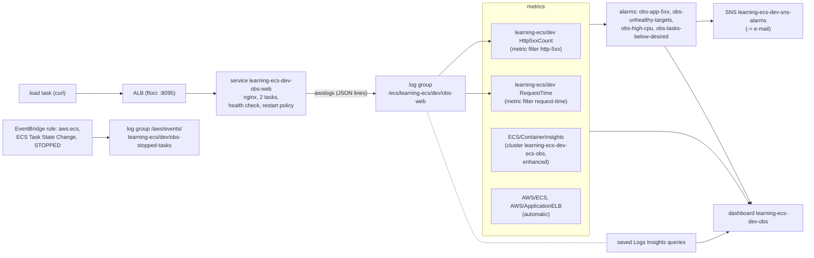

<!-- TOC -->

- [Module 19 - CloudWatch (Container Insights, logs, metric filters, alarms, dashboards, Logs Insights)](#module-19---cloudwatch-container-insights-logs-metric-filters-alarms-dashboards-logs-insights)
  - [Overview](#overview)
  - [What you will learn](#what-you-will-learn)
  - [Architecture](#architecture)
  - [AWS services and CDK constructs used](#aws-services-and-cdk-constructs-used)
  - [Configuration](#configuration)
  - [The building blocks](#the-building-blocks)
    - [Metrics: AWS/ECS and Container Insights](#metrics-awsecs-and-container-insights)
    - [Logs: awslogs, structured logs, metric filters](#logs-awslogs-structured-logs-metric-filters)
    - [Alarms](#alarms)
    - [Events: why did that task stop?](#events-why-did-that-task-stop)
  - [Prerequisites](#prerequisites)
  - [Tests](#tests)
  - [Deploy with floci (local, free)](#deploy-with-floci-local-free)
  - [Deploy to real AWS (optional)](#deploy-to-real-aws-optional)
  - [Verify](#verify)
    - [List every resource with the AWS CLI](#list-every-resource-with-the-aws-cli)
  - [Manage it with the AWS CLI](#manage-it-with-the-aws-cli)
    - [Generate traffic and errors](#generate-traffic-and-errors)
    - [Container Insights](#container-insights)
    - [Logs and Logs Insights](#logs-and-logs-insights)
    - [Metric filters](#metric-filters)
    - [Alarms](#alarms-1)
    - [Dashboards](#dashboards)
    - [Stopped-task events](#stopped-task-events)
  - [A troubleshooting walk-through](#a-troubleshooting-walk-through)
  - [Troubleshooting](#troubleshooting)
  - [floci vs real AWS](#floci-vs-real-aws)
  - [Clean up](#clean-up)
  - [Notes and cautions](#notes-and-cautions)
  - [References](#references)

<!-- TOC -->

# Module 19 - CloudWatch (Container Insights, logs, metric filters, alarms, dashboards, Logs Insights)

## Overview

Every module so far listed the metrics to watch. This one wires them into
an **observability setup you'd run in production** with Amazon CloudWatch
alone - no extra agents:

- **Metrics**: `AWS/ECS` service metrics (free, always on) and **Container
  Insights with enhanced observability** (task- and container-level).
- **Logs**: an [`nginx`](https://hub.docker.com/_/nginx) service that writes
  **one JSON object per request**, shipped by the `awslogs` driver; **metric
  filters** turn those logs into an application 5XX count and a request-time
  metric; **saved Logs Insights queries** answer the usual questions.
- **Alarms** on the four things that matter most here (application errors,
  unhealthy targets, CPU, fewer tasks than desired), all sending to one
  **SNS topic** - which can e-mail you.
- A **dashboard** with all of it on one screen.
- An **EventBridge rule** that keeps every **stopped task's** stop code,
  reason and exit codes in a log group - the evidence ECS otherwise forgets
  after about an hour.

[Module 20](../20_prometheus_grafana/README.md) does the same with
Prometheus/Grafana, [module 21](../21_datadog/README.md) with Datadog. The
reference for every metric is [`../../docs/METRICS.md`](../../docs/METRICS.md).

## What you will learn

- Which ECS metrics exist where (`AWS/ECS` vs `ECS/ContainerInsights`) and
  how to turn Container Insights on.
- Structured logging, metric filters and Logs Insights queries.
- Alarm design: thresholds, evaluation periods, missing data, notifications.
- Dashboards as code, and capturing ECS events for post-mortems.

## Architecture



<details>
<summary>Plain-text version (names and details)</summary>

```
 load task (curl) --> ALB :8095 --> service learning-ecs-dev-obs-web (nginx, 2 tasks, health check, restart policy)
                                        | awslogs (JSON lines)
                                        v
                         log group /ecs/learning-ecs/dev/obs-web
                           |-- metric filter http-5xx      -> learning-ecs/dev Http5xxCount
                           |-- metric filter request-time  -> learning-ecs/dev RequestTime
                           '-- saved queries (Logs Insights)
 cluster learning-ecs-dev-ecs-obs, Container Insights enhanced --> ECS/ContainerInsights
 AWS/ECS, AWS/ApplicationELB (automatic)

 alarms: obs-app-5xx, obs-unhealthy-targets, obs-high-cpu, obs-tasks-below-desired --> SNS learning-ecs-dev-sns-alarms (--> e-mail)
 dashboard learning-ecs-dev-obs: alarms, ALB, logs metrics, tasks, CPU/memory, Logs Insights widgets
 EventBridge rule (aws.ecs, ECS Task State Change, STOPPED) --> log group /aws/events/learning-ecs/dev/obs-stopped-tasks
```

</details>

## AWS services and CDK constructs used

| AWS service | CDK construct (Python) | Level |
|---|---|---|
| Amazon ECS | `Cluster(container_insights_v2=...)`, `FargateService`, container `health_check`, `enable_restart_policy` | L2 |
| CloudWatch Logs | `LogGroup`, `MetricFilter`, `FilterPattern`, `CfnQueryDefinition` | L2 / L1 |
| CloudWatch | `Alarm`, `Metric`, `Dashboard`, `GraphWidget`, `AlarmStatusWidget`, `LogQueryWidget` | L2 |
| CloudWatch | `aws_cloudwatch_actions.SnsAction` | L2 |
| Amazon SNS | `Topic`, `EmailSubscription` | L2 |
| Amazon EventBridge | `Rule`, `aws_events_targets.CloudWatchLogGroup` | L2 |

## Configuration

| Variable | Default | Effect |
|---|---|---|
| `CDK_CONTAINER_INSIGHTS` | `enhanced` | `disabled`, `enabled` or `enhanced` - for every cluster in this repository (`shared/ecs.py`) |
| `CDK_CLOUDWATCH_ALARM_EMAIL` | unset | subscribe this address to the alarm topic (AWS sends a confirmation e-mail) |
| `CDK_CLOUDWATCH_NAMESPACE` | `<product>/<env>` | namespace of the log-based metrics |
| `CDK_CLOUDWATCH_5XX_THRESHOLD` | `5` | application 5XX per minute (2 minutes in a row) that fire `obs-app-5xx` |
| `CDK_CLOUDWATCH_CPU_THRESHOLD` | `80` | average CPU % (3 minutes) that fires `obs-high-cpu` |
| `CDK_CLOUDWATCH_DESIRED_COUNT` | `2` (or `CDK_DESIRED_COUNT`) | tasks; also the `obs-tasks-below-desired` threshold |
| `CDK_CLOUDWATCH_LOAD_WORKERS` / `..._LOAD_SECONDS` / `..._LOAD_ERROR_EVERY` | `5` / `300` / `20` | load generator: loops, duration, one `/error` every N requests |
| `CDK_CLOUDWATCH_IMAGE` | `nginx:1.30-alpine` | the service's image |
| `CDK_LOG_RETENTION_DAYS` | `7` | retention of every log group (`.env.example`) |
| `CDK_PORT_CLOUDWATCH` | `8095` (`.env.example`) | ALB listener port (80 if unset) |

## The building blocks

### Metrics: AWS/ECS and Container Insights

| | `AWS/ECS` | `ECS/ContainerInsights` |
|---|---|---|
| Cost | included | billed as custom metrics + log ingestion (see [CloudWatch pricing](https://aws.amazon.com/cloudwatch/pricing/)) |
| Granularity | cluster, service | cluster, service, task family, **task** and **container** (enhanced) |
| Examples | `CPUUtilization`, `MemoryUtilization` (service: `ClusterName`, `ServiceName`) | `RunningTaskCount`, `DesiredTaskCount`, `PendingTaskCount`, `DeploymentCount`, `TaskCpuUtilization`, `TaskMemoryUtilization`, `ContainerCpuUtilization`, `ContainerMemoryUtilization`, `RestartCount`, `UnHealthyContainerHealthStatus` |
| Turned on by | nothing - published every minute while tasks run | the cluster setting `containerInsights` = `enabled` (standard) or `enhanced` |

Two Container Insights metrics need something from the task definition:
**`RestartCount`** only exists for containers with a **restart policy**,
and **`UnHealthyContainerHealthStatus`** only for containers with a
**health check** - so this module's nginx container has both.

### Logs: awslogs, structured logs, metric filters

- The `awslogs` log driver sends each container's stdout/stderr to a log
  group (`/ecs/<product>/<env>/<purpose>` in this repository), one log
  stream per task.
- Since **June 25, 2025** the default delivery mode is **non-blocking**
  (a full buffer drops log lines rather than blocking the application);
  set `mode` in the log configuration, or the `defaultLogDriverMode`
  account setting, to choose.
- **Structured (JSON) logs** make every field queryable: Logs Insights
  discovers JSON fields automatically (`status`, `path`, nested
  `detail.containers.0.exitCode`...), and metric filters can match on them.
- A **metric filter** turns matching log events into a metric, from the
  moment it is created (not retroactively). Here:
  `{ $.status >= 500 }` -> `Http5xxCount` (value 1, default 0), and every
  event with `request_time` -> `RequestTime` (value `$.request_time`).

### Alarms

| Alarm | Metric | Fires when | Missing data |
|---|---|---|---|
| `learning-ecs-dev-obs-app-5xx` | `Http5xxCount` (logs) Sum/1 min | >= 5, 2 minutes in a row | not breaching (no logs = no errors) |
| `learning-ecs-dev-obs-unhealthy-targets` | `UnHealthyHostCount` Minimum/1 min | >= 1, 2 minutes in a row | not breaching |
| `learning-ecs-dev-obs-high-cpu` | `AWS/ECS CPUUtilization` Average/1 min | >= 80, 3 minutes in a row | missing (stays as it was) |
| `learning-ecs-dev-obs-tasks-below-desired` | `RunningTaskCount` Minimum/1 min | < desired, 3 minutes in a row | **breaching** (no tasks may mean no data) |

All four send to the SNS topic on `ALARM` **and** on `OK`, so you also
hear when it's over. The `Minimum` statistic on `UnHealthyHostCount`
follows the ALB documentation's advice: one bad health check is noise, a
target unhealthy for a whole minute is not.

### Events: why did that task stop?

ECS keeps a stopped task (with `stopCode`, `stoppedReason`, container exit
codes) visible for a short time only - the console shows stopped tasks
for about an hour. Every state change is also an EventBridge event
(`source: aws.ecs`, `detail-type: ECS Task State Change`); this module's
rule keeps the `STOPPED` ones for the cluster in a log group, so the
question "why did tasks restart last night?" has an answer the next
morning (saved query `stopped-tasks`).

## Prerequisites

[Module 04](../04_alb/README.md). floci running and `.env` loaded.

## Tests

[`../../tests/unit/test_19_cloudwatch.py`](../../tests/unit/test_19_cloudwatch.py)
checks enhanced Container Insights on the cluster, the container's health
check, restart policy and JSON log format, both metric filters, the four
alarms and their SNS actions (and the `RunningTaskCount` alarm's details),
the optional e-mail subscription, the stopped-tasks rule and log group,
the dashboard and the saved queries, and the mandatory tags:

```bash
uv run pytest tests/unit/test_19_cloudwatch.py -v
```

## Deploy with floci (local, free)

```bash
uv run cdk bootstrap
uv run cdk synth CloudWatchStack
uv run cdk deploy CloudWatchStack --require-approval never --method=direct
curl -s localhost:8095/; curl -s -w ' [%{http_code}]\n' localhost:8095/error
# hello from 607a6d23800a
# simulated error [500]
```

On floci the stack deploys, but several pieces are recorded without
working - task logs aren't shipped, metric filters and saved queries
can't be listed or used, alarm actions don't run. See
[floci vs real AWS](#floci-vs-real-aws) for each, and the floci
alternatives in the CLI sections.

## Deploy to real AWS (optional)

Container Insights and the log-based metrics are billed (custom metrics,
log ingestion and storage, alarms, dashboards beyond the free tier) - see
[Amazon CloudWatch pricing](https://aws.amazon.com/cloudwatch/pricing/).
Plus the ALB, the NAT Gateway and the tasks.

```bash
unset AWS_ENDPOINT_URL
CDK_PORT_CLOUDWATCH=80 CDK_CLOUDWATCH_ALARM_EMAIL=you@example.com \
  uv run cdk deploy CloudWatchStack --profile <your-aws-cli-profile>
# confirm the subscription from the e-mail AWS sends you
```

## Verify

```bash
out() { aws cloudformation describe-stacks --stack-name CloudWatchStack \
  --query "Stacks[0].Outputs[?OutputKey=='$1'].OutputValue" --output text; }
C=$(out ClusterName); SVC=$(out ServiceName); LG=$(out LogGroupName)

aws ecs describe-clusters --clusters "$C" --include SETTINGS --query 'clusters[0].settings'
aws cloudwatch describe-alarms --alarm-name-prefix learning-ecs-dev-obs \
  --query 'MetricAlarms[].[AlarmName,StateValue,StateReason]' --output table
aws cloudwatch list-dashboards --dashboard-name-prefix learning-ecs-dev-obs
aws logs describe-metric-filters --log-group-name "$LG" --query 'metricFilters[].[filterName,filterPattern]'   # real AWS
aws logs describe-query-definitions --query-definition-name-prefix learning-ecs/dev --query 'queryDefinitions[].name'   # real AWS
```

<!-- BEGIN resource-commands (generated by scripts/resource_commands.py) -->
### List every resource with the AWS CLI

Every resource this stack creates, one `aws` command each, parametrized
by environment (`ENV`), region (`REGION`) and - where a command builds an
ARN - account (`ACCOUNT`): set them to match your deployment, with your
`.env` loaded (floci) or your AWS profile active (real AWS). A resource
without a name of its own is looked up through the stack by its *logical
id* (`pid <LogicalId>`), which is the same in every environment. This block
is generated from the stack's template by
[`scripts/resource_commands.py`](../../scripts/resource_commands.py) - see
[`../../REQUIREMENTS.md`, section 5.8](../../REQUIREMENTS.md#58---listing-every-resource-a-stack-created);
`make cdk-resources STACK=CloudWatchStack` runs the same commands for you.

```bash
# Match these to your deployment: CDK_PRODUCT and CDK_ENVIRONMENT in .env, and
# the region you deployed to (floci: the one in .env).
PRODUCT=learning-ecs ENV=dev REGION=us-east-1
STACK=CloudWatchStack
ACCOUNT=$(aws sts get-caller-identity --query Account --output text)
# Physical id of one of the stack's resources, by its logical id - the same in
# every environment. A second argument names another (e.g. nested) stack.
pid() { aws cloudformation describe-stack-resource --stack-name "${2:-$STACK}" \
  --logical-resource-id "$1" --region "$REGION" \
  --query StackResourceDetail.PhysicalResourceId --output text; }

# Every resource the stack created - type, logical id, physical id, status:
aws cloudformation describe-stack-resources --stack-name "$STACK" --region "$REGION" \
  --query "StackResources[].[ResourceType,LogicalResourceId,PhysicalResourceId,ResourceStatus]" \
  --output table

# AWS::EC2::VPC (Vpc8378EB38)
aws ec2 describe-vpcs --vpc-ids "$(pid Vpc8378EB38)" --query "Vpcs[].[VpcId,CidrBlock,State]" --output table --region "$REGION"
# AWS::ECS::Cluster (ClusterEB0386A7)
aws ecs describe-clusters --clusters "${PRODUCT}-${ENV}-ecs-obs" --query "clusters[].[clusterName,status]" --output table --region "$REGION"
# AWS::IAM::Role (WebTaskDefinitionTaskRole2EE1C0E7)
aws iam get-role --role-name "$(pid WebTaskDefinitionTaskRole2EE1C0E7)" --query "Role.[RoleName,Arn]" --output table --region "$REGION"
# AWS::ECS::TaskDefinition (WebTaskDefinition8DF7C630)
aws ecs describe-task-definition --task-definition "$(pid WebTaskDefinition8DF7C630)" --query "taskDefinition.[family,revision,status]" --output table --region "$REGION"
# AWS::IAM::Role (WebTaskDefinitionExecutionRole225B46C9)
aws iam get-role --role-name "$(pid WebTaskDefinitionExecutionRole225B46C9)" --query "Role.[RoleName,Arn]" --output table --region "$REGION"
# AWS::Logs::LogGroup (WebLogGroup68B8CF3C)
aws logs describe-log-groups --log-group-name-prefix "/ecs/${PRODUCT}/${ENV}/obs-web" --query "logGroups[].[logGroupName,retentionInDays]" --output table --region "$REGION"
# AWS::ECS::Service (WebService7F8A1763)
aws ecs describe-services --cluster "${PRODUCT}-${ENV}-ecs-obs" --services "${PRODUCT}-${ENV}-obs-web" --query "services[].[serviceName,status,desiredCount]" --output table --region "$REGION"
# AWS::EC2::SecurityGroup (WebServiceSecurityGroupE736A6BB)
aws ec2 describe-security-groups --group-ids "$(pid WebServiceSecurityGroupE736A6BB)" --query "SecurityGroups[].[GroupId,GroupName,VpcId]" --output table --region "$REGION"
# AWS::ElasticLoadBalancingV2::LoadBalancer (Alb16C2F182)
aws elbv2 describe-load-balancers --load-balancer-arns "$(pid Alb16C2F182)" --query "LoadBalancers[].[LoadBalancerName,Type,State.Code]" --output table --region "$REGION"
# AWS::EC2::SecurityGroup (AlbSecurityGroup580F65A6)
aws ec2 describe-security-groups --group-ids "$(pid AlbSecurityGroup580F65A6)" --query "SecurityGroups[].[GroupId,GroupName,VpcId]" --output table --region "$REGION"
# AWS::ElasticLoadBalancingV2::Listener (AlbHttp7966E42E)
aws elbv2 describe-listeners --listener-arns "$(pid AlbHttp7966E42E)" --query "Listeners[].[Port,Protocol]" --output table --region "$REGION"
# AWS::ElasticLoadBalancingV2::TargetGroup (AlbHttpWebGroupFB8A8200)
aws elbv2 describe-target-groups --target-group-arns "$(pid AlbHttpWebGroupFB8A8200)" --query "TargetGroups[].[TargetGroupName,Port,TargetType]" --output table --region "$REGION"
# AWS::Logs::MetricFilter (Http5xxFilter824261D7)
aws logs describe-metric-filters --log-group-name "/ecs/${PRODUCT}/${ENV}/obs-web" --query "metricFilters[].[filterName,filterPattern]" --output table --region "$REGION"
# AWS::Logs::MetricFilter (RequestTimeFilterFB07B72A)
aws logs describe-metric-filters --log-group-name "/ecs/${PRODUCT}/${ENV}/obs-web" --query "metricFilters[].[filterName,filterPattern]" --output table --region "$REGION"
# AWS::SNS::Topic (AlarmTopicD01E77F9)
aws sns get-topic-attributes --topic-arn "arn:aws:sns:${REGION}:${ACCOUNT}:${PRODUCT}-${ENV}-sns-alarms" --query "Attributes.TopicArn" --output table --region "$REGION"
# AWS::CloudWatch::Alarm (App5xxAlarmF5C54B45)
aws cloudwatch describe-alarms --alarm-names "${PRODUCT}-${ENV}-obs-app-5xx" --query "MetricAlarms[].[AlarmName,StateValue]" --output table --region "$REGION"
# AWS::CloudWatch::Alarm (UnhealthyTargetsAlarm3F77BCD9)
aws cloudwatch describe-alarms --alarm-names "${PRODUCT}-${ENV}-obs-unhealthy-targets" --query "MetricAlarms[].[AlarmName,StateValue]" --output table --region "$REGION"
# AWS::CloudWatch::Alarm (HighCpuAlarm40723000)
aws cloudwatch describe-alarms --alarm-names "${PRODUCT}-${ENV}-obs-high-cpu" --query "MetricAlarms[].[AlarmName,StateValue]" --output table --region "$REGION"
# AWS::CloudWatch::Alarm (TasksBelowDesiredAlarm686FF39F)
aws cloudwatch describe-alarms --alarm-names "${PRODUCT}-${ENV}-obs-tasks-below-desired" --query "MetricAlarms[].[AlarmName,StateValue]" --output table --region "$REGION"
# AWS::Logs::LogGroup (StoppedTasksLogGroupE5157715)
aws logs describe-log-groups --log-group-name-prefix "/aws/events/${PRODUCT}/${ENV}/obs-stopped-tasks" --query "logGroups[].[logGroupName,retentionInDays]" --output table --region "$REGION"
# AWS::Events::Rule (StoppedTasksRule31EFED59)
aws events describe-rule --name "${PRODUCT}-${ENV}-rule-obs-stopped-tasks" --query "[Name,State]" --output table --region "$REGION"
# AWS::IAM::Role (AWS679f53fac002430cb0da5b7982bd2287ServiceRoleC1EA0FF2)
aws iam get-role --role-name "$(pid AWS679f53fac002430cb0da5b7982bd2287ServiceRoleC1EA0FF2)" --query "Role.[RoleName,Arn]" --output table --region "$REGION"
# AWS::Lambda::Function (AWS679f53fac002430cb0da5b7982bd22872D164C4C)
aws lambda get-function --function-name "$(pid AWS679f53fac002430cb0da5b7982bd22872D164C4C)" --query "Configuration.[FunctionName,Runtime,State]" --output table --region "$REGION"
# AWS::Logs::QueryDefinition (QueryErrorsByPath)
aws logs describe-query-definitions --query-definition-name-prefix "${PRODUCT}/dev/errors-by-path" --query "queryDefinitions[].[name,queryDefinitionId]" --output table --region "$REGION"
# AWS::Logs::QueryDefinition (QuerySlowestRequests)
aws logs describe-query-definitions --query-definition-name-prefix "${PRODUCT}/dev/slowest-requests" --query "queryDefinitions[].[name,queryDefinitionId]" --output table --region "$REGION"
# AWS::Logs::QueryDefinition (QueryRequestsPerMinute)
aws logs describe-query-definitions --query-definition-name-prefix "${PRODUCT}/dev/requests-per-minute" --query "queryDefinitions[].[name,queryDefinitionId]" --output table --region "$REGION"
# AWS::Logs::QueryDefinition (QueryStoppedTasks)
aws logs describe-query-definitions --query-definition-name-prefix "${PRODUCT}/dev/stopped-tasks" --query "queryDefinitions[].[name,queryDefinitionId]" --output table --region "$REGION"
# AWS::CloudWatch::Dashboard (Dashboard9E4231ED)
aws cloudwatch get-dashboard --dashboard-name "${PRODUCT}-${ENV}-obs" --query "DashboardName" --output table --region "$REGION"
# AWS::IAM::Role (LoadTaskDefinitionTaskRole0B565716)
aws iam get-role --role-name "$(pid LoadTaskDefinitionTaskRole0B565716)" --query "Role.[RoleName,Arn]" --output table --region "$REGION"
# AWS::ECS::TaskDefinition (LoadTaskDefinition4E7F9FC0)
aws ecs describe-task-definition --task-definition "$(pid LoadTaskDefinition4E7F9FC0)" --query "taskDefinition.[family,revision,status]" --output table --region "$REGION"
# AWS::IAM::Role (LoadTaskDefinitionExecutionRole23E146C1)
aws iam get-role --role-name "$(pid LoadTaskDefinitionExecutionRole23E146C1)" --query "Role.[RoleName,Arn]" --output table --region "$REGION"
# AWS::Logs::LogGroup (LoadLogGroup49CDBF63)
aws logs describe-log-groups --log-group-name-prefix "/ecs/${PRODUCT}/${ENV}/obs-load" --query "logGroups[].[logGroupName,retentionInDays]" --output table --region "$REGION"
# AWS::EC2::SecurityGroup (LoadSecurityGroup7D3309A0)
aws ec2 describe-security-groups --group-ids "$(pid LoadSecurityGroup7D3309A0)" --query "SecurityGroups[].[GroupId,GroupName,VpcId]" --output table --region "$REGION"
# Also created - listed in the table above:
#   11 VPC sub-resources (subnets, route tables, gateways, endpoints) - built by shared/network.py, listed one by one in modules/01_network/README.md
#   AWS::ECS::ClusterCapacityProviderAssociations Cluster3DA9CCBA - shown by its ECS cluster (describe-clusters --include ATTACHMENTS)
#   AWS::IAM::Policy WebTaskDefinitionTaskRoleDefaultPolicyD1A8300E - shown by its IAM role
#   AWS::IAM::Policy WebTaskDefinitionExecutionRoleDefaultPolicy5D8A2D6F - shown by its IAM role
#   AWS::EC2::SecurityGroupIngress WebServiceSecurityGroupfromCloudWatchStackAlbSecurityGroupCEA2637A8097046378 - shown by its security group
#   AWS::EC2::SecurityGroupEgress AlbSecurityGrouptoCloudWatchStackWebServiceSecurityGroup5BFEA7BA8064C95378 - shown by its security group
#   Custom::CloudwatchLogResourcePolicy EventsLogGroupPolicyCloudWatchStackStoppedTasksRule186F14A26CACF1A4 - shown by the provider Lambda function and role listed here
#   AWS::IAM::Policy EventsLogGroupPolicyCloudWatchStackStoppedTasksRule186F14A2CustomResourcePolicyAB74A83B - shown by its IAM role
#   AWS::IAM::Policy LoadTaskDefinitionExecutionRoleDefaultPolicy7F5AA8E1 - shown by its IAM role
```

**On floci** (2.1.0), CloudFormation reports `AWS::Logs::MetricFilter`, `AWS::Logs::QueryDefinition` as created, but floci doesn't implement the API calls that list them, so those commands fail there.
<!-- END resource-commands -->

## Manage it with the AWS CLI

Run against floci while writing this module (except where noted).

### Generate traffic and errors

```bash
NET="awsvpcConfiguration={subnets=[$(out TaskSubnetIds)],securityGroups=[$(out LoadSecurityGroupId)],assignPublicIp=DISABLED}"
aws ecs run-task --cluster "$C" --task-definition "$(out LoadTaskDefinitionArn)" --launch-type FARGATE \
  --network-configuration "$NET" \
  --overrides '{"containerOverrides":[{"name":"app","environment":[{"name":"ERROR_EVERY","value":"5"}]}]}'
# one request in 5 hits /error: on real AWS, obs-app-5xx goes to ALARM within ~3 minutes
```

### Container Insights

```bash
# per cluster (this is what CDK_CONTAINER_INSIGHTS sets)
aws ecs update-cluster-settings --cluster "$C" --settings name=containerInsights,value=enhanced
# default for new clusters of the account/region
aws ecs put-account-setting --name containerInsights --value enhanced

# the metrics (real AWS) - service level, then one task
aws cloudwatch list-metrics --namespace ECS/ContainerInsights \
  --dimensions Name=ClusterName,Value="$C" Name=ServiceName,Value="$SVC" --query 'Metrics[].MetricName' --output text
aws cloudwatch get-metric-statistics --namespace ECS/ContainerInsights --metric-name TaskMemoryUtilization \
  --dimensions Name=ClusterName,Value="$C" Name=ServiceName,Value="$SVC" \
  --start-time "$(date -u -d '-30 min' +%Y-%m-%dT%H:%M:%SZ)" --end-time "$(date -u +%Y-%m-%dT%H:%M:%SZ)" \
  --period 60 --statistics Average Maximum --output table
```

Container Insights also writes **performance log events** (the raw data
behind its metrics) to `/aws/ecs/containerinsights/<cluster>/performance`,
which Logs Insights can query too.

### Logs and Logs Insights

```bash
# follow the service's logs (real AWS) - or live tail them
aws logs tail "$LG" --follow --format short
aws logs start-live-tail --log-group-identifiers "arn:aws:logs:$REGION:$ACCOUNT:log-group:$LG" \
  --log-event-filter-pattern '{ $.status >= 500 }'
# floci doesn't ship task logs to CloudWatch Logs; read them from floci's own output:
docker logs learning-ecs-floci 2>&1 | grep 'ecs:learning-ecs-dev-obs-web:app' | tail -5

# search
aws logs filter-log-events --log-group-name "$LG" --filter-pattern '{ $.status >= 500 }' \
  --start-time $(( ($(date +%s) - 900) * 1000 )) --query 'events[].message' --output text

# Logs Insights: start a query, then fetch its results
QID=$(aws logs start-query --log-group-name "$LG" \
  --start-time $(( $(date +%s) - 3600 )) --end-time "$(date +%s)" \
  --query-string 'fields @timestamp, path, status | filter status >= 500 | stats count(*) as errors by path | sort errors desc' \
  --query queryId --output text)
aws logs get-query-results --query-id "$QID" --output json \
  | jq -c '.status, [.results[] | map({(.field): .value}) | add]'
```

The saved queries (`describe-query-definitions`), also in the console's
Logs Insights page:

| Name | Answers |
|---|---|
| `learning-ecs/dev/errors-by-path` | which paths return 5XX, most first |
| `learning-ecs/dev/slowest-requests` | the 20 slowest requests |
| `learning-ecs/dev/requests-per-minute` | traffic and errors per minute |
| `learning-ecs/dev/stopped-tasks` | the last 50 stopped tasks: family/service, stop code, reason, exit code |

On floci, try Logs Insights with log events you write yourself (floci
runs a subset of the language: `fields`, `filter` with `=`/`!=`, `sort`,
`dedup`, `limit`):

```bash
S=manual; aws logs create-log-stream --log-group-name "$LG" --log-stream-name "$S"
now=$(date +%s%3N)
aws logs put-log-events --log-group-name "$LG" --log-stream-name "$S" --log-events \
  "[{\"timestamp\":$now,\"message\":\"{\\\"path\\\":\\\"/\\\",\\\"status\\\":200}\"},
    {\"timestamp\":$((now+1)),\"message\":\"{\\\"path\\\":\\\"/error\\\",\\\"status\\\":500}\"}]"
QID=$(aws logs start-query --log-group-name "$LG" --start-time $(( $(date +%s) - 600 )) --end-time $(( $(date +%s) + 60 )) \
  --query-string 'fields @timestamp, path, status | filter status = 500 | sort @timestamp desc | limit 10' \
  --query queryId --output text)
aws logs get-query-results --query-id "$QID" --output json | jq -c '[.results[] | map({(.field): .value}) | add | {path, status}]'
# [{"path":"/error","status":"500"}]
```

### Metric filters

Real AWS only (floci 2.1.0 doesn't implement them).

```bash
# test a pattern against sample lines before using it
aws logs test-metric-filter --filter-pattern '{ $.status >= 500 }' \
  --log-event-messages '{"status":500,"path":"/error"}' '{"status":200,"path":"/"}' --query 'matches[].eventMessage'

# create / replace one: requests slower than 1 second
aws logs put-metric-filter --log-group-name "$LG" --filter-name slow-requests \
  --filter-pattern '{ $.request_time > 1 }' \
  --metric-transformations metricName=SlowRequestCount,metricNamespace=learning-ecs/dev,metricValue=1,defaultValue=0
aws logs describe-metric-filters --log-group-name "$LG"
aws logs delete-metric-filter --log-group-name "$LG" --filter-name slow-requests
```

### Alarms

```bash
# state, reason and history
aws cloudwatch describe-alarms --alarm-names learning-ecs-dev-obs-app-5xx
aws cloudwatch describe-alarm-history --alarm-name learning-ecs-dev-obs-app-5xx --history-item-type StateUpdate \
  --query 'AlarmHistoryItems[].[Timestamp,HistorySummary]' --output table

# test the notification path without breaking anything (real AWS: an e-mail arrives;
# the alarm returns to its real state at the next evaluation)
aws cloudwatch set-alarm-state --alarm-name learning-ecs-dev-obs-app-5xx --state-value ALARM \
  --state-reason "drill: testing the notification path"

# silence during maintenance - and back
aws cloudwatch disable-alarm-actions --alarm-names learning-ecs-dev-obs-high-cpu
aws cloudwatch enable-alarm-actions --alarm-names learning-ecs-dev-obs-high-cpu

# a new alarm by hand: p99 response time above 500 ms
TG=$(aws elbv2 describe-target-groups --names learning-ecs-dev-tg-obs --query 'TargetGroups[0].TargetGroupArn' --output text)
LB=$(aws elbv2 describe-load-balancers --names learning-ecs-dev-alb-obs --query 'LoadBalancers[0].LoadBalancerArn' --output text)
aws cloudwatch put-metric-alarm --alarm-name learning-ecs-dev-obs-slow-p99 \
  --namespace AWS/ApplicationELB --metric-name TargetResponseTime --extended-statistic p99 \
  --dimensions Name=TargetGroup,Value="${TG##*:}" Name=LoadBalancer,Value="${LB#*:loadbalancer/}" \
  --period 60 --evaluation-periods 3 --threshold 0.5 --comparison-operator GreaterThanThreshold \
  --treat-missing-data notBreaching --alarm-actions "$(out AlarmTopicArn)"
aws cloudwatch delete-alarms --alarm-names learning-ecs-dev-obs-slow-p99

# a composite alarm: page only when errors AND unhealthy targets coincide (real AWS only)
aws cloudwatch put-composite-alarm --alarm-name learning-ecs-dev-obs-service-down \
  --alarm-rule 'ALARM("learning-ecs-dev-obs-app-5xx") AND ALARM("learning-ecs-dev-obs-unhealthy-targets")' \
  --alarm-actions "$(out AlarmTopicArn)"
```

### Dashboards

```bash
aws cloudwatch get-dashboard --dashboard-name learning-ecs-dev-obs --query DashboardBody --output text | jq '.widgets | length'
# edit the JSON body and send it back (replaces the whole dashboard - prefer changing stack.py)
aws cloudwatch get-dashboard --dashboard-name learning-ecs-dev-obs --query DashboardBody --output text > dashboard.json
aws cloudwatch put-dashboard --dashboard-name learning-ecs-dev-obs --dashboard-body file://dashboard.json
```

Real AWS: open it at
`https://console.aws.amazon.com/cloudwatch/home#dashboards/dashboard/learning-ecs-dev-obs`.

### Stopped-task events

```bash
# real AWS: the log group the rule writes to
aws logs filter-log-events --log-group-name "$(out StoppedTasksLogGroupName)" \
  --query 'events[].message' --output text | jq -c '.detail | {group, stopCode, stoppedReason, exit: [.containers[].exitCode]}'

# floci delivers ECS events to EventBridge rules, but not to log-group targets -
# add an SQS queue as a second target to see them:
Q=$(aws sqs create-queue --queue-name obs-stopped-tasks --query QueueUrl --output text)
QA=$(aws sqs get-queue-attributes --queue-url "$Q" --attribute-names QueueArn --query Attributes.QueueArn --output text)
aws events put-targets --rule learning-ecs-dev-rule-obs-stopped-tasks --targets "Id=inbox,Arn=$QA"
T=$(aws ecs list-tasks --cluster "$C" --service-name "$SVC" --query 'taskArns[0]' --output text)
aws ecs stop-task --cluster "$C" --task "$T" --reason "drill: stopped by hand"
sleep 15
aws sqs receive-message --queue-url "$Q" --wait-time-seconds 5 --query 'Messages[0].Body' --output text \
  | jq -c '{type: ."detail-type", status: .detail.lastStatus, reason: .detail.stoppedReason}'
# {"type":"ECS Task State Change","status":"STOPPED","reason":"drill: stopped by hand"}
aws events remove-targets --rule learning-ecs-dev-rule-obs-stopped-tasks --ids inbox
aws sqs delete-queue --queue-url "$Q"
```

## A troubleshooting walk-through

Use the pieces together when the `obs-app-5xx` alarm e-mails you:

1. **Dashboard** - is it errors only, or also latency, unhealthy targets,
   fewer running tasks? Did it start with a deployment
   (`DeploymentCount`)?
2. **Which requests?** - saved query `errors-by-path` for the alarm's time
   window. One path -> an application bug; every path -> the service (or
   a dependency) is down.
3. **Which tasks?** - add `@logStream` to the query: one task -> replace it
   (`aws ecs stop-task`); all tasks -> look at what changed.
4. **Are tasks dying?** - saved query `stopped-tasks`: the `stopCode`,
   `stoppedReason` and exit codes say why (an `OutOfMemoryError` reason ->
   compare `TaskMemoryUtilization`; failed ELB health checks show in the
   reason too).
5. **Resources?** - `TaskCpuUtilization`/`TaskMemoryUtilization` per task,
   `ContainerMemoryUtilization` per container, `RestartCount`.

The full guide, with every ECS stop reason and the Prometheus/Grafana and
Datadog equivalents: [`../../docs/TROUBLESHOOTING.md`](../../docs/TROUBLESHOOTING.md).

## Troubleshooting

| Symptom | Where to look | Typical cause / fix |
|---|---|---|
| No `ECS/ContainerInsights` metrics | `describe-clusters --include SETTINGS` | Container Insights not on for the cluster; metrics take a few minutes after tasks start |
| No `RestartCount` / `UnHealthyContainerHealthStatus` | the task definition | needs a restart policy / a container health check |
| Log group empty | task definition `logConfiguration`, execution role | wrong log group/region, or the execution role can't `logs:CreateLogStream`/`PutLogEvents` |
| Metric filter metric never appears | `test-metric-filter`, the logs | pattern doesn't match (JSON vs text logs); metric filters only see events ingested after creation |
| Alarm stuck in `INSUFFICIENT_DATA` | `describe-alarms` (`StateReason`), `list-metrics` | wrong dimensions or namespace; the metric only exists while tasks run / requests flow |
| No e-mail on alarm | `aws sns list-subscriptions-by-topic` | subscription still `PendingConfirmation`; alarm actions disabled |
| Stopped-task log group empty | the rule, the log group's resource policy | the rule's cluster ARN doesn't match; the resource policy for `events.amazonaws.com` is missing |

## floci vs real AWS

| Behavior | floci 2.1.0 | Real AWS |
|---|---|---|
| Task logs (`awslogs`) | **not shipped** to CloudWatch Logs - read `docker logs learning-ecs-floci` | in the log group |
| `AWS/ECS`, `ECS/ContainerInsights`, ALB metrics | not produced | produced |
| Metric filters (`PutMetricFilter`, `TestMetricFilter`, `DescribeMetricFilters`) | `UnsupportedOperation`; CloudFormation reports them created, but they can't be listed and produce no metrics | work |
| Saved queries (`DescribeQueryDefinitions`) | `UnsupportedOperation`; CloudFormation reports them created, but they can't be listed | work |
| Logs Insights (`start-query`) | a subset: `fields`, `filter` with `=`/`!=`, `sort`, `dedup`, `limit` (`stats`, `parse` ignored) | full language |
| `filter-log-events` with JSON patterns (`{ $.status >= 500 }`) | match nothing (text patterns work) | work |
| Alarms | created and **evaluated** (e.g. `tasks-below-desired` goes to `ALARM` on missing data) | evaluated |
| Alarm actions (SNS) | **not executed** (`set-alarm-state` sends nothing) | executed |
| Composite alarms | `UnsupportedOperation` | work |
| Dashboards | created, `get`/`put`/`list` work | work, plus the console |
| EventBridge `ECS Task State Change` events | emitted and matched; **log-group targets unsupported** - SQS targets work | delivered |
| Stopped-task event `detail.group` | the service name | `service:<name>` / `family:<name>` |

## Clean up

```bash
uv run cdk destroy CloudWatchStack
uv run python scripts/floci_prune.py --apply   # floci only
rm -f dashboard.json
```

Container Insights performance log groups (`/aws/ecs/containerinsights/...`)
are created by the service, not by the stack - delete them by hand if
you don't want to keep them:
`aws logs delete-log-group --log-group-name /aws/ecs/containerinsights/learning-ecs-dev-ecs-obs/performance`.

## Notes and cautions

- **Cost**: enhanced Container Insights collects more metrics per task and
  container than standard - choose per cluster with `CDK_CONTAINER_INSIGHTS`.
- **Log retention**: set it on every log group (`CDK_LOG_RETENTION_DAYS`);
  "never expire" is the CloudWatch default and grows forever.
- **Don't log secrets**: whatever reaches stdout lands in CloudWatch Logs.
- **Alarm on symptoms first** (errors, latency, availability), causes
  second (CPU, memory) - and send fewer, better alarms.

## References

- [Amazon ECS CloudWatch metrics](https://docs.aws.amazon.com/AmazonECS/latest/developerguide/available-metrics.html) · [Container Insights with enhanced observability metrics](https://docs.aws.amazon.com/AmazonCloudWatch/latest/monitoring/Container-Insights-enhanced-observability-metrics-ECS.html)
- [Creating metrics from log events using filters](https://docs.aws.amazon.com/AmazonCloudWatch/latest/logs/MonitoringLogData.html) · [Filter pattern syntax](https://docs.aws.amazon.com/AmazonCloudWatch/latest/logs/FilterAndPatternSyntax.html)
- [CloudWatch Logs Insights query syntax](https://docs.aws.amazon.com/AmazonCloudWatch/latest/logs/CWL_QuerySyntax.html) · [Fields in JSON logs](https://docs.aws.amazon.com/AmazonCloudWatch/latest/logs/CWL_AnalyzeLogData-discoverable-fields.html)
- [Using Amazon CloudWatch alarms](https://docs.aws.amazon.com/AmazonCloudWatch/latest/monitoring/CloudWatch_Alarms.html)
- [Amazon ECS task state change events](https://docs.aws.amazon.com/AmazonECS/latest/developerguide/ecs_task_events.html)
- [AWS CDK `aws_cloudwatch` README](https://docs.aws.amazon.com/cdk/api/v2/python/aws_cdk.aws_cloudwatch/README.html) · [`aws_logs` README](https://docs.aws.amazon.com/cdk/api/v2/python/aws_cdk.aws_logs/README.html)
- [Docker Hub - nginx](https://hub.docker.com/_/nginx) · [curlimages/curl](https://hub.docker.com/r/curlimages/curl)
