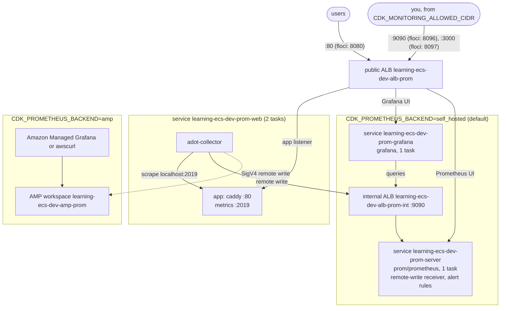

<!-- TOC -->

- [Module 20 - Prometheus and Grafana (ADOT sidecar, self-hosted or Amazon Managed Service for Prometheus)](#module-20---prometheus-and-grafana-adot-sidecar-self-hosted-or-amazon-managed-service-for-prometheus)
  - [Overview](#overview)
  - [What you will learn](#what-you-will-learn)
  - [Architecture](#architecture)
  - [AWS services and CDK constructs used](#aws-services-and-cdk-constructs-used)
  - [Configuration](#configuration)
  - [How the pieces fit](#how-the-pieces-fit)
    - [The application exposes metrics](#the-application-exposes-metrics)
    - [The ADOT collector sidecar scrapes and remote-writes](#the-adot-collector-sidecar-scrapes-and-remote-writes)
    - [Prometheus stores, evaluates alert rules; Grafana shows](#prometheus-stores-evaluates-alert-rules-grafana-shows)
    - [Alternative: Prometheus discovers the tasks itself](#alternative-prometheus-discovers-the-tasks-itself)
  - [PromQL for an ECS service](#promql-for-an-ecs-service)
  - [Prerequisites](#prerequisites)
  - [Tests](#tests)
  - [Deploy with floci (local, free)](#deploy-with-floci-local-free)
  - [Deploy to real AWS (optional)](#deploy-to-real-aws-optional)
  - [Verify](#verify)
    - [List every resource with the AWS CLI](#list-every-resource-with-the-aws-cli)
  - [Manage it with the AWS CLI](#manage-it-with-the-aws-cli)
    - [Generate traffic, fire an alert](#generate-traffic-fire-an-alert)
    - [Prometheus (self-hosted)](#prometheus-self-hosted)
    - [Grafana](#grafana)
    - [Amazon Managed Service for Prometheus](#amazon-managed-service-for-prometheus)
  - [Metrics to watch](#metrics-to-watch)
  - [Troubleshooting](#troubleshooting)
  - [floci vs real AWS](#floci-vs-real-aws)
  - [Clean up](#clean-up)
  - [Notes and cautions](#notes-and-cautions)
  - [References](#references)

<!-- TOC -->

# Module 20 - Prometheus and Grafana (ADOT sidecar, self-hosted or Amazon Managed Service for Prometheus)

## Overview

Many teams already run **Prometheus** and **Grafana** and want ECS services
in the same place as everything else. This module shows the pattern AWS
documents for ECS: each task gets an **AWS Distro for OpenTelemetry (ADOT)
collector sidecar** that scrapes the application's Prometheus endpoint
and **remote-writes** the samples to a Prometheus server. You choose the
server with `CDK_PROMETHEUS_BACKEND`:

| `CDK_PROMETHEUS_BACKEND` | Prometheus | Grafana | Alerting |
|---|---|---|---|
| `self_hosted` (default) | [`prom/prometheus`](https://hub.docker.com/r/prom/prometheus) as an ECS service | [`grafana/grafana`](https://hub.docker.com/r/grafana/grafana) as an ECS service, data source and dashboard provisioned | Prometheus alerting rules |
| `amp` | an **Amazon Managed Service for Prometheus** workspace (SigV4 remote write) | Amazon Managed Grafana (set up in the console - see [References](#references)) | AMP rule groups namespaces |

The application is [`caddy`](https://hub.docker.com/_/caddy) - a web server
with built-in Prometheus metrics - answering `/`, `/error` (500) and
`/health`. All images come from Docker Hub.

## What you will learn

- How Prometheus metrics get out of Fargate tasks (no node to run an
  agent on): sidecar + remote write.
- Configuring the ADOT collector with `AOT_CONFIG_CONTENT`: receivers,
  processors, exporters, SigV4.
- Running Prometheus and Grafana on ECS (and their limits), or using AMP.
- PromQL for request rate, error ratio, latency percentiles and per-task views.

## Architecture



<details>
<summary>Plain-text version (names and details)</summary>

```
 self_hosted:
                         public ALB learning-ecs-dev-alb-prom
 users --:80 (8080)-->  app listener ---------> service learning-ecs-dev-prom-web (caddy, 2 tasks)
                                                  task: [app: caddy :80, metrics :2019] [adot-collector]
                                                           ^ scrape localhost:2019     | remote write
 you (CDK_MONITORING_ALLOWED_CIDR):                                                    v
   :9090 (8096) --> Prometheus UI --+            internal ALB learning-ecs-dev-alb-prom-int :9090
   :3000 (8097) --> Grafana UI      |              |
                                    v              v
                         service learning-ecs-dev-prom-server (prom/prometheus, 1 task, remote-write receiver, alert rules)
                         service learning-ecs-dev-prom-grafana (grafana, 1 task) --queries--> internal ALB
 amp:
   adot-collector --SigV4 remote write--> AMP workspace learning-ecs-dev-amp-prom <-- Amazon Managed Grafana / awscurl
 (ports in parentheses: floci, from .env.example)
```

</details>

## AWS services and CDK constructs used

| AWS service | CDK construct (Python) | Level |
|---|---|---|
| Amazon ECS | `FargateService` (via `shared/ecs.py`), `TaskDefinition.add_container` (the sidecar) | L2 |
| Amazon Managed Service for Prometheus | `aws_cdk.aws_aps.CfnWorkspace` | L1 |
| AWS IAM | `ManagedPolicy.from_aws_managed_policy_name("AmazonPrometheusRemoteWriteAccess")` | L2 |
| AWS Secrets Manager | `Secret` (Grafana admin password) | L2 |
| Elastic Load Balancing | public and internal `ApplicationLoadBalancer` | L2 |

## Configuration

| Variable | Default | Effect |
|---|---|---|
| `CDK_PROMETHEUS_BACKEND` | `self_hosted` | `self_hosted` or `amp` |
| `CDK_MONITORING_ALLOWED_CIDR` | the VPC CIDR | who may open the Prometheus and Grafana UIs - set your IP `/32` on real AWS |
| `CDK_PROMETHEUS_ECS_METRICS` | `true` | also collect task CPU/memory/network with ADOT's `awsecscontainermetrics` receiver (`.env.example`: `false`, see floci) |
| `CDK_PROMETHEUS_RETENTION` | `1d` | how long the self-hosted Prometheus keeps data (`--storage.tsdb.retention.time`) |
| `CDK_PROMETHEUS_DESIRED_COUNT` | `2` (or `CDK_DESIRED_COUNT`) | app tasks (`.env.example`: `1`, see floci) |
| `CDK_PROMETHEUS_SCRAPE_VIA_ALB` | `false` | floci only: the sidecar scrapes through the ALB (`.env.example`: `true`) |
| `CDK_PROMETHEUS_IMAGE` / `CDK_GRAFANA_IMAGE` / `CDK_PROMETHEUS_ADOT_IMAGE` | `prom/prometheus:v3.13.4` / `grafana/grafana:13.0.10` / `amazon/aws-otel-collector:v0.50.0` | images |
| `CDK_PORT_PROMETHEUS_APP` / `CDK_PORT_PROMETHEUS` / `CDK_PORT_GRAFANA` | `80` / `9090` / `3000` (`.env.example`: `8080` / `8096` / `8097`) | public ALB listeners |
| `CDK_PORT_PROMETHEUS_INTERNAL` | `9090` | internal ALB listener (remote write, Grafana's queries) |

## How the pieces fit

### The application exposes metrics

Caddy's global `metrics` option turns on HTTP metrics, served by its admin
API at `:2019/metrics` (`admin 0.0.0.0:2019` makes the admin API listen
beyond the container's loopback - inside the task only, no load balancer
or security group exposes it). The ones used here:

| Metric | Type | Labels |
|---|---|---|
| `caddy_http_request_duration_seconds` (`_bucket`, `_count`, `_sum`) | histogram | `code`, `method`, `handler`, `server` |
| `caddy_http_requests_total` | counter | `handler`, `server` |
| `caddy_http_requests_in_flight` | gauge | `handler`, `server` |

### The ADOT collector sidecar scrapes and remote-writes

The collector's configuration is passed as JSON in `AOT_CONFIG_CONTENT`
(see `adot_config()` in [`stack.py`](stack.py)):

| Part | Here |
|---|---|
| `prometheus` receiver | scrapes `localhost:2019` every 15 s, job `caddy` - containers of a Fargate task share `localhost` |
| `awsecscontainermetrics` receiver (optional) | task CPU, memory, network from the ECS task metadata endpoint, filtered to the task-level metrics |
| `resource_detection` processor | `ecs` detector (task ARN, family...) and `system` detector (`host_name`): every series says which task it came from |
| `prometheus_remote_write` exporter | to the internal ALB (`/api/v1/write`), or to AMP (`/api/v1/remote_write`) authenticated by the `sigv4auth` extension (service `aps`) with the task role's credentials |

Why the processor: every sidecar scrapes `localhost:2019`, so `instance`
is identical in all tasks; without `host_name` (or the ECS attributes) the
series of different tasks would collide.

### Prometheus stores, evaluates alert rules; Grafana shows

- The self-hosted Prometheus runs with `--web.enable-remote-write-receiver`
  (accepts remote writes), scrapes only itself, and evaluates two
  **alerting rules**: `HighErrorRate` (> 5 % of requests 5XX for 2 minutes)
  and `TargetDown` (`up{job="caddy"} == 0` for 1 minute). Alerts show on
  its `/alerts` page; sending them anywhere needs an Alertmanager (not
  part of this module).
- Its data lives on the task's **ephemeral storage**: a replaced task
  starts empty. For lasting data, use AMP (or a persistent volume).
- Grafana starts with a **provisioned** data source (uid `prometheus`) and
  dashboard *ECS service (Caddy)*: requests/s by code, error ratio,
  p50/p99 latency, scraped tasks, requests per task, task CPU/memory (the
  last two need `CDK_PROMETHEUS_ECS_METRICS=true`). The admin password is
  generated in Secrets Manager and injected as a container secret.

### Alternative: Prometheus discovers the tasks itself

Instead of a sidecar per task, a central Prometheus can find the tasks
through the ECS API with **`aws_sd_configs`, `role: ecs`** (Prometheus 3),
and scrape each task's private IP. Its credentials need
`ecs:ListClusters`, `ecs:DescribeClusters`, `ecs:ListServices`,
`ecs:DescribeServices`, `ecs:ListTasks`, `ecs:DescribeTasks` (plus
`ecs:DescribeContainerInstances` and `ec2:DescribeInstances` for EC2
tasks), and relabeling turns meta labels such as `__meta_ecs_cluster`,
`__meta_ecs_service`, `__meta_ecs_task_arn` and `__meta_ecs_ip_address`
into the target and its labels - see the
[`aws_sd_config` documentation](https://prometheus.io/docs/prometheus/latest/configuration/configuration/#aws_sd_config).
This module doesn't deploy it (and floci reports no task IPs for it to
find).

## PromQL for an ECS service

```promql
# requests per second, by status code
sum by (code) (rate(caddy_http_request_duration_seconds_count[1m]))

# error ratio (0..1) over 5 minutes
sum(rate(caddy_http_request_duration_seconds_count{code=~"5.."}[5m]))
  / sum(rate(caddy_http_request_duration_seconds_count[5m]))

# p99 latency in seconds
histogram_quantile(0.99, sum by (le) (rate(caddy_http_request_duration_seconds_bucket[5m])))

# how many tasks are being scraped right now, and which ones are down
sum(up{job="caddy"})
up{job="caddy"} == 0

# the busiest task
topk(1, sum by (host_name) (rate(caddy_http_request_duration_seconds_count[5m])))
```

`rate()` handles counter resets (a task restarting starts its counters at
zero); always `rate()` before `sum()`.

## Prerequisites

[Module 04](../04_alb/README.md). floci running and `.env` loaded.

## Tests

[`../../tests/unit/test_20_prometheus_grafana.py`](../../tests/unit/test_20_prometheus_grafana.py)
checks the app task (Caddy + essential ADOT sidecar), the three
self-hosted services, the remote-write receiver flag and the Grafana
secret, the collector configuration (scrape target, remote-write URL,
SigV4 only for AMP, ECS metrics), the listener ports and that only the
app is open to the internet, the AMP backend (workspace, one service,
`AmazonPrometheusRemoteWriteAccess`), the floci switches, the rejected
unknown backend, the alert rules and dashboard, and the mandatory tags:

```bash
uv run pytest tests/unit/test_20_prometheus_grafana.py -v
```

## Deploy with floci (local, free)

```bash
uv run cdk bootstrap
uv run cdk synth PrometheusGrafanaStack
uv run cdk deploy PrometheusGrafanaStack --require-approval never --method=direct
curl -s localhost:8080/                                      # hello from 78aeafd56b0f
curl -s -o /dev/null -w '%{http_code}\n' localhost:8096/-/healthy   # Prometheus: 200
curl -s -o /dev/null -w '%{http_code}\n' localhost:8097/api/health  # Grafana: 200
```

`.env.example` sets three floci workarounds: no ECS task metrics, scraping
through the ALB, one app task - see [floci vs real AWS](#floci-vs-real-aws).

## Deploy to real AWS (optional)

Cost: three services (or one with AMP), two load balancers, the NAT
Gateway; AMP bills samples ingested, stored and queried - see
[Amazon Managed Service for Prometheus pricing](https://aws.amazon.com/prometheus/pricing/).

```bash
unset AWS_ENDPOINT_URL CDK_PROMETHEUS_ECS_METRICS CDK_PROMETHEUS_SCRAPE_VIA_ALB CDK_PROMETHEUS_DESIRED_COUNT \
      CDK_PORT_PROMETHEUS_APP CDK_PORT_PROMETHEUS CDK_PORT_GRAFANA
# self-hosted, UIs reachable from your IP only
CDK_MONITORING_ALLOWED_CIDR="$(curl -s https://checkip.amazonaws.com)/32" \
  uv run cdk deploy PrometheusGrafanaStack --profile <your-aws-cli-profile>
# or: Amazon Managed Service for Prometheus
CDK_PROMETHEUS_BACKEND=amp uv run cdk deploy PrometheusGrafanaStack --profile <your-aws-cli-profile>
```

Switching the backend replaces most of the stack; on floci, destroy first
([`REQUIREMENTS.md`, section 5.6](../../REQUIREMENTS.md)).

## Verify

```bash
out() { aws cloudformation describe-stacks --stack-name PrometheusGrafanaStack \
  --query "Stacks[0].Outputs[?OutputKey=='$1'].OutputValue" --output text; }
PROM=$(out PrometheusUiUrl)          # floci: http://localhost:8096/
GRAFANA=$(out GrafanaUiUrl)          # floci: http://localhost:8097/

# the samples arrive (the job label comes from the sidecar's scrape config)
curl -s -G "${PROM}api/v1/query" --data-urlencode 'query=up{job="caddy"}' \
  | jq -c '[.data.result[] | {host: .metric.host_name, up: .value[1]}]'
# [{"host":"319a5c7ddb4d","up":"1"}]

# the alert rules are loaded
curl -s "${PROM}api/v1/rules" | jq -c '[.data.groups[].rules[] | {name, state, health}]'
# [{"name":"HighErrorRate","state":"inactive","health":"ok"},{"name":"TargetDown","state":"inactive","health":"ok"}]

# Grafana: admin password from Secrets Manager, the provisioned dashboard
PW=$(aws secretsmanager get-secret-value --secret-id "$(out GrafanaSecretName)" --query SecretString --output text | jq -r .password)
curl -s -u "admin:$PW" "${GRAFANA}api/search" | jq -c '[.[].title]'      # ["ECS service (Caddy)"]
```

On floci the outputs show `*.elb.floci` names: use the `localhost` URLs.

<!-- BEGIN resource-commands (generated by scripts/resource_commands.py) -->
### List every resource with the AWS CLI

Every resource this stack creates, one `aws` command each, parametrized
by environment (`ENV`), region (`REGION`) and - where a command builds an
ARN - account (`ACCOUNT`): set them to match your deployment, with your
`.env` loaded (floci) or your AWS profile active (real AWS). A resource
without a name of its own is looked up through the stack by its *logical
id* (`pid <LogicalId>`), which is the same in every environment. This block
is generated from the stack's template by
[`scripts/resource_commands.py`](../../scripts/resource_commands.py) - see
[`../../REQUIREMENTS.md`, section 5.8](../../REQUIREMENTS.md#58---listing-every-resource-a-stack-created);
`make cdk-resources STACK=PrometheusGrafanaStack` runs the same commands for you.

```bash
# Match these to your deployment: CDK_PRODUCT and CDK_ENVIRONMENT in .env, and
# the region you deployed to (floci: the one in .env).
PRODUCT=learning-ecs ENV=dev REGION=us-east-1
STACK=PrometheusGrafanaStack
# Physical id of one of the stack's resources, by its logical id - the same in
# every environment. A second argument names another (e.g. nested) stack.
pid() { aws cloudformation describe-stack-resource --stack-name "${2:-$STACK}" \
  --logical-resource-id "$1" --region "$REGION" \
  --query StackResourceDetail.PhysicalResourceId --output text; }

# Every resource the stack created - type, logical id, physical id, status:
aws cloudformation describe-stack-resources --stack-name "$STACK" --region "$REGION" \
  --query "StackResources[].[ResourceType,LogicalResourceId,PhysicalResourceId,ResourceStatus]" \
  --output table

# AWS::EC2::VPC (Vpc8378EB38)
aws ec2 describe-vpcs --vpc-ids "$(pid Vpc8378EB38)" --query "Vpcs[].[VpcId,CidrBlock,State]" --output table --region "$REGION"
# AWS::ECS::Cluster (ClusterEB0386A7)
aws ecs describe-clusters --clusters "${PRODUCT}-${ENV}-ecs-prom" --query "clusters[].[clusterName,status]" --output table --region "$REGION"
# AWS::ElasticLoadBalancingV2::LoadBalancer (Alb16C2F182)
aws elbv2 describe-load-balancers --load-balancer-arns "$(pid Alb16C2F182)" --query "LoadBalancers[].[LoadBalancerName,Type,State.Code]" --output table --region "$REGION"
# AWS::EC2::SecurityGroup (AlbSecurityGroup580F65A6)
aws ec2 describe-security-groups --group-ids "$(pid AlbSecurityGroup580F65A6)" --query "SecurityGroups[].[GroupId,GroupName,VpcId]" --output table --region "$REGION"
# AWS::ElasticLoadBalancingV2::Listener (AlbPrometheusUi77D34481)
aws elbv2 describe-listeners --listener-arns "$(pid AlbPrometheusUi77D34481)" --query "Listeners[].[Port,Protocol]" --output table --region "$REGION"
# AWS::ElasticLoadBalancingV2::TargetGroup (AlbPrometheusUiPrometheusUiGroup9942B4D4)
aws elbv2 describe-target-groups --target-group-arns "$(pid AlbPrometheusUiPrometheusUiGroup9942B4D4)" --query "TargetGroups[].[TargetGroupName,Port,TargetType]" --output table --region "$REGION"
# AWS::ElasticLoadBalancingV2::Listener (AlbGrafanaUi7CE383B7)
aws elbv2 describe-listeners --listener-arns "$(pid AlbGrafanaUi7CE383B7)" --query "Listeners[].[Port,Protocol]" --output table --region "$REGION"
# AWS::ElasticLoadBalancingV2::TargetGroup (AlbGrafanaUiGrafanaUiGroupFD6A677C)
aws elbv2 describe-target-groups --target-group-arns "$(pid AlbGrafanaUiGrafanaUiGroupFD6A677C)" --query "TargetGroups[].[TargetGroupName,Port,TargetType]" --output table --region "$REGION"
# AWS::ElasticLoadBalancingV2::Listener (AlbApp426EDD80)
aws elbv2 describe-listeners --listener-arns "$(pid AlbApp426EDD80)" --query "Listeners[].[Port,Protocol]" --output table --region "$REGION"
# AWS::ElasticLoadBalancingV2::TargetGroup (AlbAppWebGroupD00B576B)
aws elbv2 describe-target-groups --target-group-arns "$(pid AlbAppWebGroupD00B576B)" --query "TargetGroups[].[TargetGroupName,Port,TargetType]" --output table --region "$REGION"
# AWS::ElasticLoadBalancingV2::LoadBalancer (InternalAlb58CEEAE8)
aws elbv2 describe-load-balancers --load-balancer-arns "$(pid InternalAlb58CEEAE8)" --query "LoadBalancers[].[LoadBalancerName,Type,State.Code]" --output table --region "$REGION"
# AWS::EC2::SecurityGroup (InternalAlbSecurityGroupE48A078F)
aws ec2 describe-security-groups --group-ids "$(pid InternalAlbSecurityGroupE48A078F)" --query "SecurityGroups[].[GroupId,GroupName,VpcId]" --output table --region "$REGION"
# AWS::ElasticLoadBalancingV2::Listener (InternalAlbPrometheusA9A6C435)
aws elbv2 describe-listeners --listener-arns "$(pid InternalAlbPrometheusA9A6C435)" --query "Listeners[].[Port,Protocol]" --output table --region "$REGION"
# AWS::ElasticLoadBalancingV2::TargetGroup (InternalAlbPrometheusPrometheusGroup54715649)
aws elbv2 describe-target-groups --target-group-arns "$(pid InternalAlbPrometheusPrometheusGroup54715649)" --query "TargetGroups[].[TargetGroupName,Port,TargetType]" --output table --region "$REGION"
# AWS::IAM::Role (PrometheusTaskDefinitionTaskRoleF4F170FD)
aws iam get-role --role-name "$(pid PrometheusTaskDefinitionTaskRoleF4F170FD)" --query "Role.[RoleName,Arn]" --output table --region "$REGION"
# AWS::ECS::TaskDefinition (PrometheusTaskDefinition64BFACDD)
aws ecs describe-task-definition --task-definition "$(pid PrometheusTaskDefinition64BFACDD)" --query "taskDefinition.[family,revision,status]" --output table --region "$REGION"
# AWS::IAM::Role (PrometheusTaskDefinitionExecutionRole741616C9)
aws iam get-role --role-name "$(pid PrometheusTaskDefinitionExecutionRole741616C9)" --query "Role.[RoleName,Arn]" --output table --region "$REGION"
# AWS::Logs::LogGroup (PrometheusLogGroup1E4E23EE)
aws logs describe-log-groups --log-group-name-prefix "/ecs/${PRODUCT}/${ENV}/prom-server" --query "logGroups[].[logGroupName,retentionInDays]" --output table --region "$REGION"
# AWS::ECS::Service (PrometheusService4019A27E)
aws ecs describe-services --cluster "${PRODUCT}-${ENV}-ecs-prom" --services "${PRODUCT}-${ENV}-prom-server" --query "services[].[serviceName,status,desiredCount]" --output table --region "$REGION"
# AWS::EC2::SecurityGroup (PrometheusServiceSecurityGroup6A46575D)
aws ec2 describe-security-groups --group-ids "$(pid PrometheusServiceSecurityGroup6A46575D)" --query "SecurityGroups[].[GroupId,GroupName,VpcId]" --output table --region "$REGION"
# AWS::SecretsManager::Secret (GrafanaAdminSecretC252ACA6)
aws secretsmanager describe-secret --secret-id "${PRODUCT}-${ENV}-secret-grafana" --query "[Name,ARN]" --output table --region "$REGION"
# AWS::IAM::Role (GrafanaTaskDefinitionTaskRole326ACB1B)
aws iam get-role --role-name "$(pid GrafanaTaskDefinitionTaskRole326ACB1B)" --query "Role.[RoleName,Arn]" --output table --region "$REGION"
# AWS::ECS::TaskDefinition (GrafanaTaskDefinitionFDC31B9A)
aws ecs describe-task-definition --task-definition "$(pid GrafanaTaskDefinitionFDC31B9A)" --query "taskDefinition.[family,revision,status]" --output table --region "$REGION"
# AWS::IAM::Role (GrafanaTaskDefinitionExecutionRoleC5A5788E)
aws iam get-role --role-name "$(pid GrafanaTaskDefinitionExecutionRoleC5A5788E)" --query "Role.[RoleName,Arn]" --output table --region "$REGION"
# AWS::Logs::LogGroup (GrafanaLogGroupE8C97403)
aws logs describe-log-groups --log-group-name-prefix "/ecs/${PRODUCT}/${ENV}/prom-grafana" --query "logGroups[].[logGroupName,retentionInDays]" --output table --region "$REGION"
# AWS::ECS::Service (GrafanaServiceB3AB259D)
aws ecs describe-services --cluster "${PRODUCT}-${ENV}-ecs-prom" --services "${PRODUCT}-${ENV}-prom-grafana" --query "services[].[serviceName,status,desiredCount]" --output table --region "$REGION"
# AWS::EC2::SecurityGroup (GrafanaServiceSecurityGroup342BB1A7)
aws ec2 describe-security-groups --group-ids "$(pid GrafanaServiceSecurityGroup342BB1A7)" --query "SecurityGroups[].[GroupId,GroupName,VpcId]" --output table --region "$REGION"
# AWS::IAM::Role (WebTaskDefinitionTaskRole2EE1C0E7)
aws iam get-role --role-name "$(pid WebTaskDefinitionTaskRole2EE1C0E7)" --query "Role.[RoleName,Arn]" --output table --region "$REGION"
# AWS::ECS::TaskDefinition (WebTaskDefinition8DF7C630)
aws ecs describe-task-definition --task-definition "$(pid WebTaskDefinition8DF7C630)" --query "taskDefinition.[family,revision,status]" --output table --region "$REGION"
# AWS::IAM::Role (WebTaskDefinitionExecutionRole225B46C9)
aws iam get-role --role-name "$(pid WebTaskDefinitionExecutionRole225B46C9)" --query "Role.[RoleName,Arn]" --output table --region "$REGION"
# AWS::Logs::LogGroup (WebLogGroup68B8CF3C)
aws logs describe-log-groups --log-group-name-prefix "/ecs/${PRODUCT}/${ENV}/prom-web" --query "logGroups[].[logGroupName,retentionInDays]" --output table --region "$REGION"
# AWS::ECS::Service (WebService7F8A1763)
aws ecs describe-services --cluster "${PRODUCT}-${ENV}-ecs-prom" --services "${PRODUCT}-${ENV}-prom-web" --query "services[].[serviceName,status,desiredCount]" --output table --region "$REGION"
# AWS::EC2::SecurityGroup (WebServiceSecurityGroupE736A6BB)
aws ec2 describe-security-groups --group-ids "$(pid WebServiceSecurityGroupE736A6BB)" --query "SecurityGroups[].[GroupId,GroupName,VpcId]" --output table --region "$REGION"
# AWS::Logs::LogGroup (AdotLogGroup2D892CD7)
aws logs describe-log-groups --log-group-name-prefix "/ecs/${PRODUCT}/${ENV}/prom-web-adot" --query "logGroups[].[logGroupName,retentionInDays]" --output table --region "$REGION"
# Also created - listed in the table above:
#   11 VPC sub-resources (subnets, route tables, gateways, endpoints) - built by shared/network.py, listed one by one in modules/01_network/README.md
#   AWS::ECS::ClusterCapacityProviderAssociations Cluster3DA9CCBA - shown by its ECS cluster (describe-clusters --include ATTACHMENTS)
#   AWS::EC2::SecurityGroupEgress AlbSecurityGrouptoPrometheusGrafanaStackPrometheusServiceSecurityGroup1AA3A11490907BF77B59 - shown by its security group
#   AWS::EC2::SecurityGroupEgress AlbSecurityGrouptoPrometheusGrafanaStackGrafanaServiceSecurityGroup1D3FA0D230007072622D - shown by its security group
#   AWS::EC2::SecurityGroupEgress AlbSecurityGrouptoPrometheusGrafanaStackWebServiceSecurityGroupF324BF878093C0C164 - shown by its security group
#   AWS::EC2::SecurityGroupEgress InternalAlbSecurityGrouptoPrometheusGrafanaStackPrometheusServiceSecurityGroup1AA3A1149090AA34CF77 - shown by its security group
#   AWS::IAM::Policy PrometheusTaskDefinitionTaskRoleDefaultPolicyC1377AFF - shown by its IAM role
#   AWS::IAM::Policy PrometheusTaskDefinitionExecutionRoleDefaultPolicy5D193262 - shown by its IAM role
#   AWS::EC2::SecurityGroupIngress PrometheusServiceSecurityGroupfromPrometheusGrafanaStackInternalAlbSecurityGroupEDC7973B9090E2A370B9 - shown by its security group
#   AWS::EC2::SecurityGroupIngress PrometheusServiceSecurityGroupfromPrometheusGrafanaStackAlbSecurityGroup28F23CCA909057C9199A - shown by its security group
#   AWS::IAM::Policy GrafanaTaskDefinitionTaskRoleDefaultPolicy01866FE3 - shown by its IAM role
#   AWS::IAM::Policy GrafanaTaskDefinitionExecutionRoleDefaultPolicyCB94A914 - shown by its IAM role
#   AWS::EC2::SecurityGroupIngress GrafanaServiceSecurityGroupfromPrometheusGrafanaStackAlbSecurityGroup28F23CCA3000668732AF - shown by its security group
#   AWS::IAM::Policy WebTaskDefinitionTaskRoleDefaultPolicyD1A8300E - shown by its IAM role
#   AWS::IAM::Policy WebTaskDefinitionExecutionRoleDefaultPolicy5D8A2D6F - shown by its IAM role
#   AWS::EC2::SecurityGroupIngress WebServiceSecurityGroupfromPrometheusGrafanaStackAlbSecurityGroup28F23CCA80D2D76968 - shown by its security group
```
<!-- END resource-commands -->

## Manage it with the AWS CLI

Run against floci while writing this module (except where noted).

### Generate traffic, fire an alert

```bash
APP=$(out AppUrl)   # floci: http://localhost:8080/
end=$(( $(date +%s) + 200 ))
while [ "$(date +%s)" -lt "$end" ]; do curl -s -o /dev/null "${APP}error"; curl -s -o /dev/null "$APP"; sleep 0.3; done

curl -s "${PROM}api/v1/alerts" | jq -c '[.data.alerts[] | {name: .labels.alertname, state}]'
# [{"name":"HighErrorRate","state":"firing"}]   (pending for the first 2 minutes)
curl -s -G "${PROM}api/v1/query" --data-urlencode \
  'query=sum(rate(caddy_http_request_duration_seconds_count{code=~"5.."}[5m])) / sum(rate(caddy_http_request_duration_seconds_count[5m]))' \
  | jq -r '.data.result[0].value[1]'                                     # 0.477...
```

### Prometheus (self-hosted)

```bash
# targets and configuration
curl -s "${PROM}api/v1/status/config" | jq -r .data.yaml | head -20
curl -s "${PROM}api/v1/status/tsdb" | jq -c '.data.headStats'            # series in memory

# every metric name it holds
curl -s "${PROM}api/v1/label/__name__/values" | jq -r '.data[]' | grep '^caddy_'

# change the rules: edit RULES in stack.py, validate, deploy
uv run python -c "import importlib, json; m = importlib.import_module('modules.20_prometheus_grafana.stack'); print(json.dumps(m.RULES))" > rules.yml
docker run --rm -v "$PWD/rules.yml:/r/rules.yml:ro" --entrypoint promtool prom/prometheus:v3.13.4 check rules /r/rules.yml
# Checking /r/rules.yml
#   SUCCESS: 2 rules found
uv run cdk deploy PrometheusGrafanaStack

# the Prometheus service: one task; a new deployment starts it empty
aws ecs describe-services --cluster "$(out ClusterName)" --services learning-ecs-dev-prom-server \
  --query 'services[0].[runningCount,taskDefinition]' --output text
```

### Grafana

```bash
# data sources and dashboards (HTTP API, admin user)
curl -s -u "admin:$PW" "${GRAFANA}api/datasources" | jq -c '[.[] | {name, uid, url}]'
# run a query through Grafana
curl -s -u "admin:$PW" -X POST "${GRAFANA}api/ds/query" -H 'Content-Type: application/json' \
  -d '{"queries":[{"refId":"A","datasource":{"uid":"prometheus"},"expr":"sum by (code) (caddy_http_request_duration_seconds_count)","instant":true}],"from":"now-5m","to":"now"}' \
  | jq -c '[.results.A.frames[] | {code: .schema.fields[1].labels.code, v: .data.values[1][0]}]'

# rotate the admin password: change the secret, then restart Grafana's task
aws secretsmanager put-secret-value --secret-id "$(out GrafanaSecretName)" \
  --secret-string "{\"username\":\"admin\",\"password\":\"$(openssl rand -hex 16)\"}"
aws ecs update-service --cluster "$(out ClusterName)" --service learning-ecs-dev-prom-grafana --force-new-deployment
```

Grafana stores what you change in its UI (dashboards, users) inside the
task - lost when the task is replaced. Keep dashboards in `stack.py`
(provisioned), or use Amazon Managed Grafana.

### Amazon Managed Service for Prometheus

The workspace and rule groups commands also work on floci (control plane
only); ingestion and queries are real AWS only.

```bash
# the stack's workspace (CDK_PROMETHEUS_BACKEND=amp)
WS=$(out WorkspaceId)
aws amp describe-workspace --workspace-id "$WS" --query 'workspace.[status.statusCode,prometheusEndpoint]' --output text

# query it - requests must be SigV4-signed; the AMP guide uses awscurl
awscurl -X POST --region "$REGION" --service aps "$(out QueryUrl)" \
  -d 'query=sum(rate(caddy_http_request_duration_seconds_count[5m]))' \
  --header 'Content-Type: application/x-www-form-urlencoded'

# alerting rules in AMP: a rule groups namespace with the same rules file
aws amp create-rule-groups-namespace --workspace-id "$WS" --name ecs-service --data fileb://rules.yml
aws amp list-rule-groups-namespaces --workspace-id "$WS" --query 'ruleGroupsNamespaces[].[name,status.statusCode]'
aws amp put-rule-groups-namespace --workspace-id "$WS" --name ecs-service --data fileb://rules.yml   # update
aws amp delete-rule-groups-namespace --workspace-id "$WS" --name ecs-service

# a workspace by hand
WS2=$(aws amp create-workspace --alias learning-ecs-dev-amp-manual --query workspaceId --output text)
aws amp delete-workspace --workspace-id "$WS2"
```

Sending AMP alerts somewhere needs an alert manager definition
(`aws amp create-alert-manager-definition`, real AWS only).

## Metrics to watch

| Where | Metric / signal | Watch for |
|---|---|---|
| Prometheus | `up{job="caddy"}` | a task whose endpoint stopped answering (or whose sidecar stopped sending) |
| Prometheus | the error ratio and p99 queries above | the service's health, as users see it |
| Prometheus | `prometheus_tsdb_head_series` | cardinality: series in memory - grows with labels like task IDs |
| Prometheus | `prometheus_rule_evaluation_failures_total` | broken alert rules |
| ADOT sidecar logs | `failed to send WriteRequest`, `Failed to scrape Prometheus endpoint` | write path broken / app endpoint down |
| CloudWatch | `AWS/ECS` `CPUUtilization`/`MemoryUtilization` of the three services | Prometheus and Grafana need resources too |
| CloudWatch (AMP) | AMP usage metrics in `AWS/Usage` (free) - see [CloudWatch usage metrics](https://docs.aws.amazon.com/prometheus/latest/userguide/AMP-CW-usage-metrics.html) | AMP quotas |

## Troubleshooting

| Symptom | Where to look | Typical cause / fix |
|---|---|---|
| No `caddy_*` metrics at all | sidecar logs (`/ecs/learning-ecs/dev/prom-web-adot`) | scrape failing (`Failed to scrape Prometheus endpoint`: app down, wrong port) or remote write failing (`failed to send WriteRequest`) |
| Remote write `401`/`403` (AMP) | sidecar logs | task role lacks `AmazonPrometheusRemoteWriteAccess`, or `sigv4auth` region differs from the workspace's |
| Remote write connection refused/timeout (self-hosted) | internal ALB target health, security groups | Prometheus task unhealthy, or the internal listener doesn't allow the VPC CIDR |
| Collector exits at start: `unable to detect task metadata endpoint` | sidecar logs | `awsecscontainermetrics` outside ECS (or on floci) - `CDK_PROMETHEUS_ECS_METRICS=false` |
| Series from different tasks overwrite each other | label sets | missing `resource_detection` (or `resource_to_telemetry_conversion`): tasks look identical |
| Graphs restart from empty | Prometheus task events | the Prometheus task was replaced - its storage is ephemeral |
| Grafana login fails | the secret | password changed after the task started - force a new deployment |
| Prometheus/Grafana UI unreachable on real AWS | ALB security group | your IP isn't in `CDK_MONITORING_ALLOWED_CIDR` |

More, including the CloudWatch and Datadog sides: [`../../docs/TROUBLESHOOTING.md`](../../docs/TROUBLESHOOTING.md).

## floci vs real AWS

| Behavior | floci 2.1.0 | Real AWS |
|---|---|---|
| Containers of one task | separate containers, **no shared `localhost`** - the sidecar can't reach `localhost:2019`; `.env.example` scrapes through the ALB (`CDK_PROMETHEUS_SCRAPE_VIA_ALB=true`, Caddy also serves `/metrics` on port 80) with one task, so the counters come from one Caddy | shared network namespace (`awsvpc`) |
| ECS task metadata endpoint (`ECS_CONTAINER_METADATA_URI_V4`) | not provided - `awsecscontainermetrics` would stop the collector; `.env.example` turns it off | provided |
| Task IPs in `describe-tasks` | not reported - Prometheus `aws_sd_configs` (`role: ecs`) would find nothing | reported |
| Prometheus, Grafana, remote write, alert rules, provisioning | work (tested: metrics arrive, `HighErrorRate` fires, Grafana queries) | work |
| Container secrets (Grafana password) | resolved | resolved |
| AMP workspace / rule groups namespaces | control plane only (no ingestion, no queries) | full service |
| `ALB` security groups (UIs restricted to a CIDR) | not enforced | enforced |

## Clean up

```bash
uv run cdk destroy PrometheusGrafanaStack
uv run python scripts/floci_prune.py --apply   # floci only
rm -f rules.yml
```

The AMP workspace is deleted with the stack, and its data with it.

## Notes and cautions

- **Cardinality** is the cost driver of any Prometheus: every distinct
  label set is a series. Per-task labels (`host_name`, task ARN) multiply
  series by the number of tasks - and tasks change on every deployment.
- **Security**: Prometheus has no authentication of its own - never expose
  it to the internet. Grafana's admin user is for setup; add real users
  (or use Amazon Managed Grafana with IAM Identity Center).
- **High availability**: one self-hosted Prometheus is a single point of
  failure for monitoring. AMP replicates the data it ingests across three
  Availability Zones of the Region.
- **OpenTelemetry**: the same sidecar can also receive traces and
  OpenTelemetry metrics from instrumented applications.

## References

- [Set up metrics ingestion from Amazon ECS using AWS Distro for OpenTelemetry (AMP)](https://docs.aws.amazon.com/prometheus/latest/userguide/AMP-onboard-ingest-metrics-OpenTelemetry-ECS.html)
- [Use awscurl to query AMP](https://docs.aws.amazon.com/prometheus/latest/userguide/AMP-compatible-APIs.html) · [Amazon Managed Grafana - creating a workspace](https://docs.aws.amazon.com/grafana/latest/userguide/AMG-create-workspace.html)
- [ADOT - configuration through `AOT_CONFIG_CONTENT`](https://aws-otel.github.io/docs/setup/ecs/config-through-ssm)
- [Prometheus configuration](https://prometheus.io/docs/prometheus/latest/configuration/configuration/) · [Alerting rules](https://prometheus.io/docs/prometheus/latest/configuration/alerting_rules/) · [Querying basics](https://prometheus.io/docs/prometheus/latest/querying/basics/)
- [Grafana provisioning](https://grafana.com/docs/grafana/latest/administration/provisioning/)
- [Caddy - metrics](https://caddyserver.com/docs/metrics)
- Docker Hub: [caddy](https://hub.docker.com/_/caddy) · [amazon/aws-otel-collector](https://hub.docker.com/r/amazon/aws-otel-collector) · [prom/prometheus](https://hub.docker.com/r/prom/prometheus) · [grafana/grafana](https://hub.docker.com/r/grafana/grafana)
